# Sentinel 底层实现原理深度分析

> 本文档基于 Sentinel 2.0.0-alpha2-SNAPSHOT 源码，深入剖析 Sentinel 的底层实现原理，包括 Node 体系与滑动窗口算法、Slot Chain 责任链机制与限流降级、动态数据源扩展机制、集群限流实现等核心模块。所有分析均基于实际源码，配以 Mermaid 流程图、架构图、时序图、类图，力求详尽。

---

## 目录

- [第一章 概述与整体架构](#第一章-概述与整体架构)
- [第二章 Node 体系与滑动窗口算法](#第二章-node-体系与滑动窗口算法)
- [第三章 Slot Chain 机制与限流降级实现](#第三章-slot-chain-机制与限流降级实现)
- [第四章 动态数据源实现](#第四章-动态数据源实现)
- [第五章 集群限流实现](#第五章-集群限流实现)
- [第六章 客户端与 Dashboard 通信机制](#第六章-客户端与-dashboard-通信机制)

---

## 第一章 概述与整体架构

### 1.1 Sentinel 简介

Sentinel 是阿里巴巴开源的面向分布式服务架构的**流量治理组件**，以流量为切入点，从**流量控制、熔断降级、系统负载保护**等多个维度来保障服务的稳定性。其核心特性包括：

- **丰富的应用场景**：覆盖秒杀、消息削峰填谷、集群流量控制、实时熔断等场景
- **完备的实时监控**：提供秒级监控数据，可对接各种 Dashboard
- **广泛的开源生态**：开箱即用，与 Spring Cloud、Dubbo、gRPC 等整合
- **完善的 SPI 扩展机制**：可以通过 SPI 自定义 Slot、数据源、Transport 等

### 1.2 模块组成

Sentinel 源码由以下核心模块组成：

| 模块 | 作用 |
| --- | --- |
| `sentinel-core` | 核心库，提供 Slot Chain、Node 体系、滑动窗口、限流降级等核心能力 |
| `sentinel-extension` | 扩展库，包括动态数据源（file/nacos/apollo/zookeeper/redis/consul/etcd）|
| `sentinel-cluster` | 集群限流模块，提供 Token Client 和 Token Server 实现 |
| `sentinel-transport` | 通信层，与 Dashboard 进行命令交互 |
| `sentinel-adapter` | 各种框架适配器（Spring Cloud、Dubbo、Web 等）|
| `sentinel-dashboard` | 控制台，可视化监控与规则管理 |
| `sentinel-logging` | 日志模块 |
| `sentinel-benchmark` | 性能基准测试 |
| `sentinel-demo` | 示例代码 |

### 1.3 整体架构

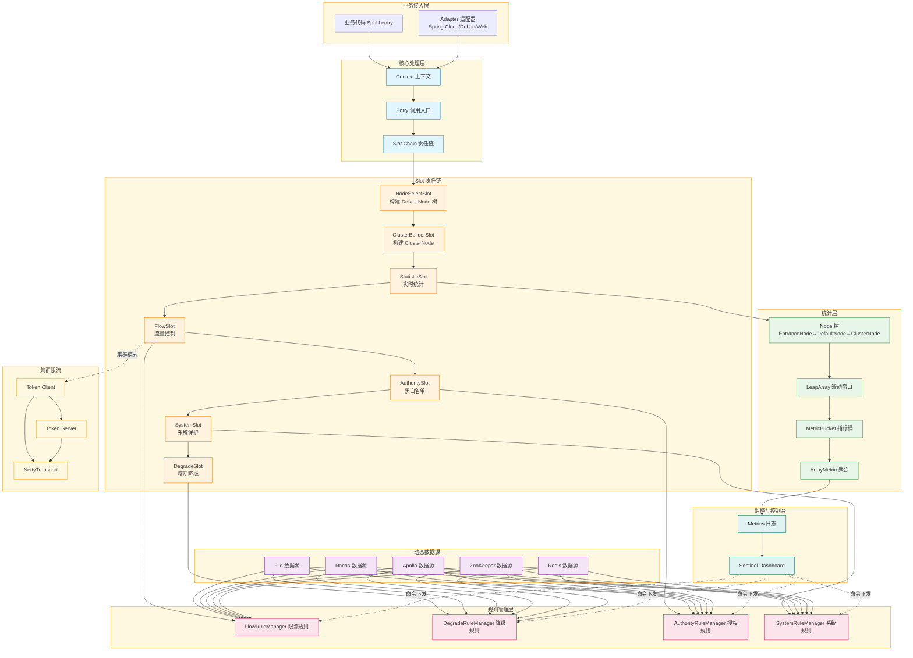
```mermaid
graph TB
    subgraph 业务接入层
        A[业务代码 SphU.entry]
        B[Adapter 适配器<br/>Spring Cloud/Dubbo/Web]
    end

    subgraph 核心处理层
        C[Context 上下文]
        D[Entry 调用入口]
        E[Slot Chain 责任链]
    end

    subgraph Slot 责任链
        S1[NodeSelectSlot<br/>构建 DefaultNode 树]
        S2[ClusterBuilderSlot<br/>构建 ClusterNode]
        S3[StatisticSlot<br/>实时统计]
        S4[FlowSlot<br/>流量控制]
        S5[AuthoritySlot<br/>黑白名单]
        S6[SystemSlot<br/>系统保护]
        S7[DegradeSlot<br/>熔断降级]
    end

    subgraph 统计层
        N1["Node 树<br/>EntranceNode→DefaultNode→ClusterNode"]
        N2[LeapArray 滑动窗口]
        N3[MetricBucket 指标桶]
        N4[ArrayMetric 聚合]
    end

    subgraph 规则管理层
        R1[FlowRuleManager 限流规则]
        R2[DegradeRuleManager 降级规则]
        R3[AuthorityRuleManager 授权规则]
        R4[SystemRuleManager 系统规则]
    end

    subgraph 动态数据源
        D1[File 数据源]
        D2[Nacos 数据源]
        D3[Apollo 数据源]
        D4[ZooKeeper 数据源]
        D5[Redis 数据源]
    end

    subgraph 集群限流
        CL1[Token Client]
        CL2[Token Server]
        CL3[NettyTransport]
    end

    subgraph 监控与控制台
        M1[Sentinel Dashboard]
        M2[Metrics 日志]
    end

    A --> C --> D --> E
    B --> C
    E --> S1 --> S2 --> S3 --> S4 --> S5 --> S6 --> S7
    S3 --> N1
    N1 --> N2 --> N3 --> N4
    S4 --> R1
    S5 --> R3
    S6 --> R4
    S7 --> R2
    D1 & D2 & D3 & D4 & D5 --> R1 & R2 & R3 & R4
    S4 -.集群模式.-> CL1
    CL1 --> CL2
    CL1 --> CL3
    CL2 --> CL3
    N4 --> M2 --> M1
    M1 -.命令下发.-> R1 & R2 & R3 & R4

    classDef coreLayer fill:#e1f5ff,stroke:#0288d1
    classDef slotLayer fill:#fff3e0,stroke:#f57c00
    classDef statLayer fill:#e8f5e9,stroke:#388e3c
    classDef ruleLayer fill:#fce4ec,stroke:#c2185b
    classDef dataSource fill:#f3e5f5,stroke:#7b1fa2
    classDef cluster fill:#fff8e1,stroke:#ffa000
    classDef monitor fill:#e0f2f1,stroke:#00695c

    class C,D,E coreLayer
    class S1,S2,S3,S4,S5,S6,S7 slotLayer
    class N1,N2,N3,N4 statLayer
    class R1,R2,R3,R4 ruleLayer
    class D1,D2,D3,D4,D5 dataSource
    class CL1,CL2,CL3 cluster
    class M1,M2 monitor
```

### 1.4 核心概念

| 概念 | 说明 |
| --- | --- |
| **Resource** | 资源，可以是一段代码、一个接口、一个方法，是被 Sentinel 保护的对象 |
| **Context** | 上下文，贯穿本次调用链路，保存当前线程的调用栈、来源等信息 |
| **Entry** | 资源访问的入口，每次 `SphU.entry()` 都会创建一个 Entry，调用结束 `exit()` |
| **Slot Chain** | 处理器槽责任链，每个 Slot 负责一种特定功能（统计、限流、降级等）|
| **Node** | 统计节点，存储资源调用的实时统计数据，分为 EntranceNode、DefaultNode、ClusterNode |
| **Rule** | 规则，包括 FlowRule、DegradeRule、AuthorityRule、SystemRule |
| **LeapArray** | 滑动窗口核心算法，基于环形数组和 CAS 实现高并发实时统计 |
| **MetricBucket** | 指标桶，存放一个时间窗口内的各种事件计数（PASS/BLOCK/RT 等）|

### 1.5 核心调用流程

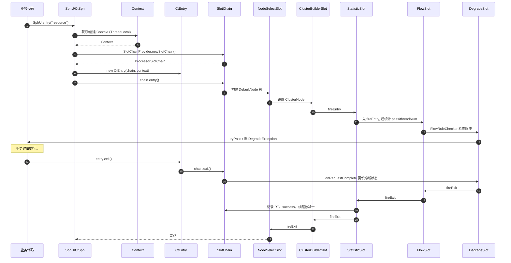
```mermaid
sequenceDiagram
    autonumber
    participant Biz as 业务代码
    participant Sph as SphU/CtSph
    participant Ctx as Context
    participant Entry as CtEntry
    participant Chain as SlotChain
    participant NSlot as NodeSelectSlot
    participant CSlot as ClusterBuilderSlot
    participant SSlot as StatisticSlot
    participant FSlot as FlowSlot
    participant DSlot as DegradeSlot

    Biz->>Sph: SphU.entry("resource")
    Sph->>Ctx: 获取/创建 Context (ThreadLocal)
    Ctx-->>Sph: Context
    Sph->>Chain: SlotChainProvider.newSlotChain()
    Chain-->>Sph: ProcessorSlotChain
    Sph->>Entry: new CtEntry(chain, context)
    Sph->>Chain: chain.entry()
    Chain->>NSlot: 构建 DefaultNode 树
    NSlot->>CSlot: 设置 ClusterNode
    CSlot->>SSlot: fireEntry
    SSlot->>FSlot: 先 fireEntry, 后统计 pass/threadNum
    FSlot->>DSlot: FlowRuleChecker 检查限流
    DSlot->>Biz: tryPass / 抛 DegradeException

    Note over Biz: 业务逻辑执行...

    Biz->>Entry: entry.exit()
    Entry->>Chain: chain.exit()
    Chain->>DSlot: onRequestComplete 更新熔断状态
    DSlot->>FSlot: fireExit
    FSlot->>SSlot: fireExit
    SSlot->>Chain: 记录 RT、success、线程数减一
    SSlot->>CSlot: fireExit
    CSlot->>NSlot: fireExit
    NSlot-->>Sph: 完成
```

### 1.6 整体执行视图

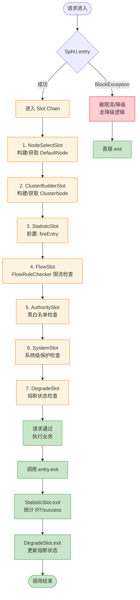
```mermaid
flowchart TD
    Start([请求进入]) --> EntryCheck{SphU.entry}
    EntryCheck -->|成功| SlotChain[进入 Slot Chain]
    EntryCheck -->|BlockException| Blocked[被限流/降级<br/>走降级逻辑]

    SlotChain --> NSlot[1. NodeSelectSlot<br/>构建/获取 DefaultNode]
    NSlot --> CSlot[2. ClusterBuilderSlot<br/>构建/获取 ClusterNode]
    CSlot --> SSlot[3. StatisticSlot<br/>前置: fireEntry]
    SSlot --> FSlot[4. FlowSlot<br/>FlowRuleChecker 限流检查]
    FSlot --> ASlot[5. AuthoritySlot<br/>黑白名单检查]
    ASlot --> SySlot[6. SystemSlot<br/>系统级保护检查]
    SySlot --> DSlot[7. DegradeSlot<br/>熔断状态检查]
    DSlot --> Pass[请求通过<br/>执行业务]
    Pass --> Exit[调用 entry.exit]
    Exit --> SSlotExit[StatisticSlot.exit<br/>统计 RT/success]
    SSlotExit --> DSlotExit[DegradeSlot.exit<br/>更新熔断状态]
    DSlotExit --> Done([调用结束])

    Blocked --> Exit2[直接 exit]

    classDef ok fill:#c8e6c9,stroke:#388e3c
    classDef blocked fill:#ffcdd2,stroke:#c62828
    classDef slot fill:#fff3e0,stroke:#f57c00

    class Pass,Exit,SSlotExit,DSlotExit,Done,Exit2 ok
    class Blocked blocked
    class NSlot,CSlot,SSlot,FSlot,ASlot,SySlot,DSlot,SlotChain slot
```

### 1.7 阅读建议

- **第二章**：理解 Node 树与滑动窗口，这是 Sentinel 实时统计的根基
- **第三章**：理解 Slot Chain 责任链与限流/降级算法，这是流量治理的核心
- **第四章**：理解动态数据源，这是规则热加载的关键
- **第五章**：理解集群限流，这是全局流量治理的实现

---

<!-- 以下章节由各专项分析报告组成 -->

## 第二章 Node 体系与滑动窗口算法

### 一、Node体系结构分析

#### 1.1 Node接口

Node接口是Sentinel中所有统计节点的顶层抽象，定义了统一的统计方法和操作规范。

**文件路径**：`sentinel-core/src/main/java/com/alibaba/csp/sentinel/node/Node.java`

```java
/*
 * Copyright 1999-2018 Alibaba Group Holding Ltd.
 *
 * Licensed under the Apache License, Version 2.0 (the "License");
 * you may not use this file except in compliance with the License.
 * You may obtain a copy of the License at
 *
 *      http://www.apache.org/licenses/LICENSE-2.0
 *
 * Unless required by applicable law or agreed to in writing, software
 * distributed under the License is distributed on an "AS IS" BASIS,
 * WITHOUT WARRANTIES OR CONDITIONS OF ANY KIND, either express or implied.
 * See the License for the specific language governing permissions and
 * limitations under the License.
 */
package com.alibaba.csp.sentinel.node;

import java.util.List;
import java.util.Map;

import com.alibaba.csp.sentinel.Entry;
import com.alibaba.csp.sentinel.node.metric.MetricNode;
import com.alibaba.csp.sentinel.slots.statistic.metric.DebugSupport;
import com.alibaba.csp.sentinel.util.function.Predicate;

/**
 * Holds real-time statistics for resources.
 *
 * @author qinan.qn
 * @author leyou
 * @author Eric Zhao
 */
public interface Node extends OccupySupport, DebugSupport {

    /**
     * Get incoming request per minute ({@code pass + block}).
     *
     * @return total request count per minute
     */
    long totalRequest();

    /**
     * Get pass count per minute.
     *
     * @return total passed request count per minute
     * @since 1.5.0
     */
    long totalPass();

    /**
     * Get {@link Entry#exit()} count per minute.
     *
     * @return total completed request count per minute
     */
    long totalSuccess();

    /**
     * Get blocked request count per minute (totalBlockRequest).
     *
     * @return total blocked request count per minute
     */
    long blockRequest();

    /**
     * Get exception count per minute.
     *
     * @return total business exception count per minute
     */
    long totalException();

    /**
     * Get pass request per second.
     *
     * @return QPS of passed requests
     */
    double passQps();

    /**
     * Get block request per second.
     *
     * @return QPS of blocked requests
     */
    double blockQps();

    /**
     * Get {@link #passQps()} + {@link #blockQps()} request per second.
     *
     * @return QPS of passed and blocked requests
     */
    double totalQps();

    /**
     * Get {@link Entry#exit()} request per second.
     *
     * @return QPS of completed requests
     */
    double successQps();

    /**
     * Get estimated max success QPS till now.
     *
     * @return max completed QPS
     */
    double maxSuccessQps();

    /**
     * Get exception count per second.
     *
     * @return QPS of exception occurs
     */
    double exceptionQps();

    /**
     * Get average rt per second.
     *
     * @return average response time per second
     */
    double avgRt();

    /**
     * Get minimal response time.
     *
     * @return recorded minimal response time
     */
    double minRt();

    /**
     * Get current active thread count.
     *
     * @return current active thread count
     */
    int curThreadNum();

    /**
     * Get last second block QPS.
     */
    double previousBlockQps();

    /**
     * Last window QPS.
     */
    double previousPassQps();

    /**
     * Fetch all valid metric nodes of resources.
     *
     * @return valid metric nodes of resources
     */
    Map<Long, MetricNode> metrics();

    /**
     * Fetch all raw metric items that satisfies the time predicate.
     *
     * @param timePredicate time predicate
     * @return raw metric items that satisfies the time predicate
     * @since 1.7.0
     */
    List<MetricNode> rawMetricsInMin(Predicate<Long> timePredicate);

    /**
     * Add pass count.
     *
     * @param count count to add pass
     */
    void addPassRequest(int count);

    /**
     * Add rt and success count.
     *
     * @param rt      response time
     * @param success success count to add
     */
    void addRtAndSuccess(long rt, int success);

    /**
     * Increase the block count.
     *
     * @param count count to add
     */
    void increaseBlockQps(int count);

    /**
     * Add the biz exception count.
     *
     * @param count count to add
     */
    void increaseExceptionQps(int count);

    /**
     * Increase current thread count.
     */
    void increaseThreadNum();

    /**
     * Decrease current thread count.
     */
    void decreaseThreadNum();

    /**
     * Reset the internal counter. Reset is needed when {@link IntervalProperty#INTERVAL} or
     * {@link SampleCountProperty#SAMPLE_COUNT} is changed.
     */
    void reset();
}
```

##### 方法含义解析：

| 方法签名 | 统计含义 |
|---------|---------|
| `long totalRequest()` | 每分钟总请求数（通过+被拒绝） |
| `long totalPass()` | 每分钟通过请求数 |
| `long totalSuccess()` | 每分钟成功完成请求数（调用了exit） |
| `long blockRequest()` | 每分钟被拒绝请求数 |
| `long totalException()` | 每分钟业务异常数 |
| `double passQps()` | 每秒通过请求数QPS |
| `double blockQps()` | 每秒被拒绝请求数QPS |
| `double totalQps()` | 每秒总请求数QPS（通过+被拒绝） |
| `double successQps()` | 每秒成功完成请求数QPS |
| `double maxSuccessQps()` | 估计的最大成功QPS |
| `double exceptionQps()` | 每秒业务异常数QPS |
| `double avgRt()` | 平均响应时间 |
| `double minRt()` | 最小响应时间 |
| `int curThreadNum()` | 当前活跃线程数 |
| `double previousBlockQps()` | 上一个时间窗口的被拒绝QPS |
| `double previousPassQps()` | 上一个时间窗口的通过QPS |
| `Map<Long, MetricNode> metrics()` | 获取所有有效的统计节点 |
| `List<MetricNode> rawMetricsInMin(Predicate<Long>)` | 根据时间谓词获取原始统计项 |
| `void addPassRequest(int count)` | 添加通过请求计数 |
| `void addRtAndSuccess(long rt, int success)` | 添加响应时间和成功请求计数 |
| `void increaseBlockQps(int count)` | 增加被拒绝请求计数 |
| `void increaseExceptionQps(int count)` | 增加业务异常计数 |
| `void increaseThreadNum()` | 增加活跃线程数 |
| `void decreaseThreadNum()` | 减少活跃线程数 |
| `void reset()` | 重置内部计数器 |

#### 1.2 StatisticNode实现

StatisticNode是Node接口的核心实现类，提供了完整的统计功能，包含秒级和分钟级两个滑动窗口，以及当前线程数统计。

**文件路径**：`sentinel-core/src/main/java/com/alibaba/csp/sentinel/node/StatisticNode.java`

```java
/*
 * Copyright 1999-2018 Alibaba Group Holding Ltd.
 *
 * Licensed under the Apache License, Version 2.0 (the "License");
 * you may not use this file except in compliance with the License.
 * You may obtain a copy of the License at
 *
 *      http://www.apache.org/licenses/LICENSE-2.0
 *
 * Unless required by applicable law or agreed to in writing, software
 * distributed under the License is distributed on an "AS IS" BASIS,
 * WITHOUT WARRANTIES OR CONDITIONS OF ANY KIND, either express or implied.
 * See the License for the specific language governing permissions and
 * limitations under the License.
 */
package com.alibaba.csp.sentinel.node;

import java.util.List;
import java.util.Map;
import java.util.concurrent.ConcurrentHashMap;
import java.util.concurrent.atomic.LongAdder;

import com.alibaba.csp.sentinel.node.metric.MetricNode;
import com.alibaba.csp.sentinel.slots.statistic.metric.ArrayMetric;
import com.alibaba.csp.sentinel.slots.statistic.metric.Metric;
import com.alibaba.csp.sentinel.util.TimeUtil;
import com.alibaba.csp.sentinel.util.function.Predicate;

/**
 * <p>The statistic node keep three kinds of real-time statistics metrics:</p>
 * <ol>
 * <li>metrics in second level ({@code rollingCounterInSecond})</li>
 * <li>metrics in minute level ({@code rollingCounterInMinute})</li>
 * <li>thread count</li>
 * </ol>
 *
 * <p>
 * Sentinel use sliding window to record and count the resource statistics in real-time.
 * The sliding window infrastructure behind the {@link ArrayMetric} is {@code LeapArray}.
 * </p>
 *
 * <p>
 * case 1: When the first request comes in, Sentinel will create a new window bucket of
 * a specified time-span to store running statics, such as total response time(rt),
 * incoming request(QPS), block request(bq), etc. And the time-span is defined by sample count.
 * </p>
 * <pre>
 * 	0      100ms
 *  +-------+--→ Sliding Windows
 * 	    ^
 * 	    |
 * 	  request
 * </pre>
 * <p>
 * Sentinel use the statics of the valid buckets to decide whether this request can be passed.
 * For example, if a rule defines that only 100 requests can be passed,
 * it will sum all qps in valid buckets, and compare it to the threshold defined in rule.
 * </p>
 *
 * <p>case 2: continuous requests</p>
 * <pre>
 *  0    100ms    200ms    300ms
 *  +-------+-------+-------+-----→ Sliding Windows
 *                      ^
 *                      |
 *                   request
 * </pre>
 *
 * <p>case 3: requests keeps coming, and previous buckets become invalid</p>
 * <pre>
 *  0    100ms    200ms	  800ms	   900ms  1000ms    1300ms
 *  +-------+-------+ ...... +-------+-------+ ...... +-------+-----→ Sliding Windows
 *                                                      ^
 *                                                      |
 *                                                    request
 * </pre>
 *
 * <p>The sliding window should become:</p>
 * <pre>
 * 300ms     800ms  900ms  1000ms  1300ms
 *  + ...... +-------+ ...... +-------+-----→ Sliding Windows
 *                                                      ^
 *                                                      |
 *                                                    request
 * </pre>
 *
 * @author qinan.qn
 * @author jialiang.linjl
 */
public class StatisticNode implements Node {

    /**
     * Holds statistics of the recent {@code INTERVAL} milliseconds. The {@code INTERVAL} is divided into time spans
     * by given {@code sampleCount}.
     */
    private transient volatile Metric rollingCounterInSecond = new ArrayMetric(SampleCountProperty.SAMPLE_COUNT,
        IntervalProperty.INTERVAL);

    /**
     * Holds statistics of the recent 60 seconds. The windowLengthInMs is deliberately set to 1000 milliseconds,
     * meaning each bucket per second, in this way we can get accurate statistics of each second.
     */
    private transient Metric rollingCounterInMinute = new ArrayMetric(60, 60 * 1000, false);

    /**
     * The counter for thread count.
     */
    private LongAdder curThreadNum = new LongAdder();

    /**
     * The last timestamp when metrics were fetched.
     */
    private long lastFetchTime = -1;

    @Override
    public Map<Long, MetricNode> metrics() {
        // The fetch operation is thread-safe under a single-thread scheduler pool.
        long currentTime = TimeUtil.currentTimeMillis();
        currentTime = currentTime - currentTime % 1000;
        Map<Long, MetricNode> metrics = new ConcurrentHashMap<>();
        List<MetricNode> nodesOfEverySecond = rollingCounterInMinute.details();
        long newLastFetchTime = lastFetchTime;
        // Iterate metrics of all resources, filter valid metrics (not-empty and up-to-date).
        for (MetricNode node : nodesOfEverySecond) {
            if (isNodeInTime(node, currentTime) && isValidMetricNode(node)) {
                metrics.put(node.getTimestamp(), node);
                newLastFetchTime = Math.max(newLastFetchTime, node.getTimestamp());
            }
        }
        lastFetchTime = newLastFetchTime;

        return metrics;
    }

    @Override
    public List<MetricNode> rawMetricsInMin(Predicate<Long> timePredicate) {
        return rollingCounterInMinute.detailsOnCondition(timePredicate);
    }

    private boolean isNodeInTime(MetricNode node, long currentTime) {
        return node.getTimestamp() > lastFetchTime && node.getTimestamp() < currentTime;
    }

    private boolean isValidMetricNode(MetricNode node) {
        return node.getPassQps() > 0 || node.getBlockQps() > 0 || node.getSuccessQps() > 0
            || node.getExceptionQps() > 0 || node.getRt() > 0 || node.getOccupiedPassQps() > 0;
    }

    @Override
    public void reset() {
        rollingCounterInSecond = new ArrayMetric(SampleCountProperty.SAMPLE_COUNT, IntervalProperty.INTERVAL);
    }

    @Override
    public long totalRequest() {
        return rollingCounterInMinute.pass() + rollingCounterInMinute.block();
    }

    @Override
    public long blockRequest() {
        return rollingCounterInMinute.block();
    }

    @Override
    public double blockQps() {
        return rollingCounterInSecond.block() / rollingCounterInSecond.getWindowIntervalInSec();
    }

    @Override
    public double previousBlockQps() {
        return this.rollingCounterInMinute.previousWindowBlock();
    }

    @Override
    public double previousPassQps() {
        return this.rollingCounterInMinute.previousWindowPass();
    }

    @Override
    public double totalQps() {
        return passQps() + blockQps();
    }

    @Override
    public long totalSuccess() {
        return rollingCounterInMinute.success();
    }

    @Override
    public double exceptionQps() {
        return rollingCounterInSecond.exception() / rollingCounterInSecond.getWindowIntervalInSec();
    }

    @Override
    public long totalException() {
        return rollingCounterInMinute.exception();
    }

    @Override
    public double passQps() {
        return rollingCounterInSecond.pass() / rollingCounterInSecond.getWindowIntervalInSec();
    }

    @Override
    public long totalPass() {
        return rollingCounterInMinute.pass();
    }

    @Override
    public double successQps() {
        return rollingCounterInSecond.success() / rollingCounterInSecond.getWindowIntervalInSec();
    }

    @Override
    public double maxSuccessQps() {
        return (double) rollingCounterInSecond.maxSuccess() * rollingCounterInSecond.getSampleCount()
                / rollingCounterInSecond.getWindowIntervalInSec();
    }

    @Override
    public double occupiedPassQps() {
        return rollingCounterInSecond.occupiedPass() / rollingCounterInSecond.getWindowIntervalInSec();
    }

    @Override
    public double avgRt() {
        long successCount = rollingCounterInSecond.success();
        if (successCount == 0) {
            return 0;
        }

        return rollingCounterInSecond.rt() * 1.0 / successCount;
    }

    @Override
    public double minRt() {
        return rollingCounterInSecond.minRt();
    }

    @Override
    public int curThreadNum() {
        return (int)curThreadNum.sum();
    }

    @Override
    public void addPassRequest(int count) {
        rollingCounterInSecond.addPass(count);
        rollingCounterInMinute.addPass(count);
    }

    @Override
    public void addRtAndSuccess(long rt, int successCount) {
        rollingCounterInSecond.addSuccess(successCount);
        rollingCounterInSecond.addRT(rt);

        rollingCounterInMinute.addSuccess(successCount);
        rollingCounterInMinute.addRT(rt);
    }

    @Override
    public void increaseBlockQps(int count) {
        rollingCounterInSecond.addBlock(count);
        rollingCounterInMinute.addBlock(count);
    }

    @Override
    public void increaseExceptionQps(int count) {
        rollingCounterInSecond.addException(count);
        rollingCounterInMinute.addException(count);
    }

    @Override
    public void increaseThreadNum() {
        curThreadNum.increment();
    }

    @Override
    public void decreaseThreadNum() {
        curThreadNum.decrement();
    }

    @Override
    public void debug() {
        rollingCounterInSecond.debug();
    }

    @Override
    public long tryOccupyNext(long currentTime, int acquireCount, double threshold) {
        double maxCount = threshold * IntervalProperty.INTERVAL / 1000;
        long currentBorrow = rollingCounterInSecond.waiting();
        if (currentBorrow >= maxCount) {
            return OccupyTimeoutProperty.getOccupyTimeout();
        }

        int windowLength = IntervalProperty.INTERVAL / SampleCountProperty.SAMPLE_COUNT;
        long earliestTime = currentTime - currentTime % windowLength + windowLength - IntervalProperty.INTERVAL;

        int idx = 0;
        /*
         * Note: here {@code currentPass} may be less than it really is NOW, because time difference
         * since call rollingCounterInSecond.pass(). So in high concurrency, the following code may
         * lead more tokens be borrowed.
         */
        long currentPass = rollingCounterInSecond.pass();
        while (earliestTime < currentTime) {
            long waitInMs = idx * windowLength + windowLength - currentTime % windowLength;
            if (waitInMs >= OccupyTimeoutProperty.getOccupyTimeout()) {
                break;
            }
            long windowPass = rollingCounterInSecond.getWindowPass(earliestTime);
            if (currentPass + currentBorrow + acquireCount - windowPass <= maxCount) {
                return waitInMs;
            }
            earliestTime += windowLength;
            currentPass -= windowPass;
            idx++;
        }

        return OccupyTimeoutProperty.getOccupyTimeout();
    }

    @Override
    public long waiting() {
        return rollingCounterInSecond.waiting();
    }

    @Override
    public void addWaitingRequest(long futureTime, int acquireCount) {
        rollingCounterInSecond.addWaiting(futureTime, acquireCount);
    }

    @Override
    public void addOccupiedPass(int acquireCount) {
        rollingCounterInMinute.addOccupiedPass(acquireCount);
        rollingCounterInMinute.addPass(acquireCount);
    }
}
```

##### 核心组件分析：

1. **滑动窗口**：
   - `rollingCounterInSecond`：秒级滑动窗口，保存最近1秒（可配置）的统计数据，默认分为2个窗口（每个窗口500ms）
   - `rollingCounterInMinute`：分钟级滑动窗口，保存最近60秒的统计数据，每个窗口1秒，共60个窗口

2. **线程数统计**：
   - `curThreadNum`：使用`LongAdder`原子计数器统计当前活跃线程数，保证高并发下的线程安全

3. **统计方法实现**：
   - 所有的QPS统计都是通过滑动窗口的总和除以时间间隔得到
   - 线程数的增减通过`LongAdder`的increment()和decrement()方法实现
   - 所有的统计操作都会同时更新秒级和分钟级窗口

#### 1.3 DefaultNode实现

DefaultNode是具体资源的统计节点，每个资源在每个Context中对应一个DefaultNode，它继承自StatisticNode并扩展了子节点和集群节点的关联。

**文件路径**：`sentinel-core/src/main/java/com/alibaba/csp/sentinel/node/DefaultNode.java`

```java
/*
 * Copyright 1999-2018 Alibaba Group Holding Ltd.
 *
 * Licensed under the Apache License, Version 2.0 (the "License");
 * you may not use this file except in compliance with the License.
 * You may obtain a copy of the License at
 *
 *      http://www.apache.org/licenses/LICENSE-2.0
 *
 * Unless required by applicable law or agreed to in writing, software
 * distributed under the License is distributed on an "AS IS" BASIS,
 * WITHOUT WARRANTIES OR CONDITIONS OF ANY KIND, either express or implied.
 * See the License for the specific language governing permissions and
 * limitations under the License.
 */
package com.alibaba.csp.sentinel.node;

import java.util.HashSet;
import java.util.Set;

import com.alibaba.csp.sentinel.log.RecordLog;
import com.alibaba.csp.sentinel.SphO;
import com.alibaba.csp.sentinel.SphU;
import com.alibaba.csp.sentinel.context.Context;
import com.alibaba.csp.sentinel.slotchain.ResourceWrapper;
import com.alibaba.csp.sentinel.slots.nodeselector.NodeSelectorSlot;

/**
 * <p>
 * A {@link Node} used to hold statistics for specific resource name in the specific context.
 * Each distinct resource in each distinct {@link Context} will corresponding to a {@link DefaultNode}.
 * </p>
 * <p>
 * This class may have a list of sub {@link DefaultNode}s. Child nodes will be created when
 * calling {@link SphU}#entry() or {@link SphO}@entry() multiple times in the same {@link Context}.
 * </p>
 *
 * @author qinan.qn
 * @see NodeSelectorSlot
 */
public class DefaultNode extends StatisticNode {

    /**
     * The resource associated with the node.
     */
    private ResourceWrapper id;

    /**
     * The list of all child nodes.
     */
    private volatile Set<Node> childList = new HashSet<>();

    /**
     * Associated cluster node.
     */
    private ClusterNode clusterNode;

    public DefaultNode(ResourceWrapper id, ClusterNode clusterNode) {
        this.id = id;
        this.clusterNode = clusterNode;
    }

    public ResourceWrapper getId() {
        return id;
    }

    public ClusterNode getClusterNode() {
        return clusterNode;
    }

    public void setClusterNode(ClusterNode clusterNode) {
        this.clusterNode = clusterNode;
    }

    /**
     * Add child node to current node.
     *
     * @param node valid child node
     */
    public void addChild(Node node) {
        if (node == null) {
            RecordLog.warn("Trying to add null child to node <{}>, ignored", id.getName());
            return;
        }
        if (!childList.contains(node)) {
            synchronized (this) {
                if (!childList.contains(node)) {
                    Set<Node> newSet = new HashSet<>(childList.size() + 1);
                    newSet.addAll(childList);
                    newSet.add(node);
                    childList = newSet;
                }
            }
            RecordLog.info("Add child <{}> to node <{}>", ((DefaultNode)node).id.getName(), id.getName());
        }
    }

    /**
     * Reset the child node list.
     */
    public void removeChildList() {
        this.childList = new HashSet<>();
    }

    public Set<Node> getChildList() {
        return childList;
    }

    @Override
    public void increaseBlockQps(int count) {
        super.increaseBlockQps(count);
        this.clusterNode.increaseBlockQps(count);
    }

    @Override
    public void increaseExceptionQps(int count) {
        super.increaseExceptionQps(count);
        this.clusterNode.increaseExceptionQps(count);
    }

    @Override
    public void addRtAndSuccess(long rt, int successCount) {
        super.addRtAndSuccess(rt, successCount);
        this.clusterNode.addRtAndSuccess(rt, successCount);
    }

    @Override
    public void increaseThreadNum() {
        super.increaseThreadNum();
        this.clusterNode.increaseThreadNum();
    }

    @Override
    public void decreaseThreadNum() {
        super.decreaseThreadNum();
        this.clusterNode.decreaseThreadNum();
    }

    @Override
    public void addPassRequest(int count) {
        super.addPassRequest(count);
        this.clusterNode.addPassRequest(count);
    }

    public void printDefaultNode() {
        visitTree(0, this);
    }

    private void visitTree(int level, DefaultNode node) {
        for (int i = 0; i < level; ++i) {
            System.out.print("-");
        }
        if (!(node instanceof EntranceNode)) {
            System.out.println(
                String.format("%s(thread:%s pq:%s bq:%s tq:%s rt:%s 1mp:%s 1mb:%s 1mt:%s)", node.id.getShowName(),
                    node.curThreadNum(), node.passQps(), node.blockQps(), node.totalQps(), node.avgRt(),
                    node.totalRequest() - node.blockRequest(), node.blockRequest(), node.totalRequest()));
        } else {
            System.out.println(
                String.format("Entry-%s(t:%s pq:%s bq:%s tq:%s rt:%s 1mp:%s 1mb:%s 1mt:%s)", node.id.getShowName(),
                    node.curThreadNum(), node.passQps(), node.blockQps(), node.totalQps(), node.avgRt(),
                    node.totalRequest() - node.blockRequest(), node.blockRequest(), node.totalRequest()));
        }
        for (Node n : node.getChildList()) {
            DefaultNode dn = (DefaultNode)n;
            visitTree(level + 1, dn);
        }
    }
}
```

##### 核心扩展：

1. **资源关联**：
   - `id`：当前节点关联的资源包装类
   - `clusterNode`：关联的集群节点，全局唯一，共享同一个资源的所有统计

2. **子节点列表**：
   - `childList`：子节点集合，用于构建调用树
   - `addChild(Node)`：添加子节点，使用双重检查锁保证线程安全
   - `removeChildList()`：重置子节点列表

3. **统计转发**：
   - 重写了所有统计方法，将统计操作同时转发到集群节点，实现全局统计和局部统计的分离

#### 1.4 ClusterNode实现

ClusterNode是集群全局统计节点，同一个资源在所有Context中共享同一个ClusterNode，保存全局的统计信息。

**文件路径**：`sentinel-core/src/main/java/com/alibaba/csp/sentinel/node/ClusterNode.java`

```java
/*
 * Copyright 1999-2018 Alibaba Group Holding Ltd.
 *
 * Licensed under the Apache License, Version 2.0 (the "License");
 * you may not use this file except in compliance with the License.
 * You may obtain a copy of the License at
 *
 *      http://www.apache.org/licenses/LICENSE-2.0
 *
 * Unless required by applicable law or agreed to in writing, software
 * distributed under the License is distributed on an "AS IS" BASIS,
 * WITHOUT WARRANTIES OR CONDITIONS OF ANY KIND, either express or implied.
 * See the License for the specific language governing permissions and
 * limitations under the License.
 */
package com.alibaba.csp.sentinel.node;

import java.util.HashMap;
import java.util.Map;
import java.util.concurrent.locks.ReentrantLock;

import com.alibaba.csp.sentinel.ResourceTypeConstants;
import com.alibaba.csp.sentinel.context.ContextUtil;
import com.alibaba.csp.sentinel.slots.block.BlockException;
import com.alibaba.csp.sentinel.util.AssertUtil;

/**
 * <p>
 * This class stores summary runtime statistics of the resource, including rt, thread count, qps
 * and so on. Same resource shares the same {@link ClusterNode} globally, no matter in which
 * {@link com.alibaba.csp.sentinel.context.Context}.
 * </p>
 * <p>
 * To distinguish invocation from different origin (declared in
 * {@link ContextUtil#enter(String name, String origin)}),
 * one {@link ClusterNode} holds an {@link #originCountMap}, this map holds {@link StatisticNode}
 * of different origin. Use {@link #getOrCreateOriginNode(String)} to get {@link Node} of the specific
 * origin.<br/>
 * Note that 'origin' usually is Service Consumer's app name.
 * </p>
 *
 * @author qinan.qn
 * @author jialiang.linjl
 */
public class ClusterNode extends StatisticNode {

    private final String name;
    private final int resourceType;

    public ClusterNode(String name) {
        this(name, ResourceTypeConstants.COMMON);
    }

    public ClusterNode(String name, int resourceType) {
        AssertUtil.notEmpty(name, "name cannot be empty");
        this.name = name;
        this.resourceType = resourceType;
    }

    /**
     * <p>The origin map holds the pair: (origin, originNode) for one specific resource.</p>
     * <p>
     * The longer the application runs, the more stable this mapping will become.
     * So we didn't use concurrent map here, but a lock, as this lock only happens
     * at the very beginning while concurrent map will hold the lock all the time.
     * </p>
     */
    private Map<String, StatisticNode> originCountMap = new HashMap<>();

    private final ReentrantLock lock = new ReentrantLock();

    /**
     * Get resource name of the resource node.
     *
     * @return resource name
     * @since 1.7.0
     */
    public String getName() {
        return name;
    }

    /**
     * Get classification (type) of the resource.
     *
     * @return resource type
     * @since 1.7.0
     */
    public int getResourceType() {
        return resourceType;
    }

    /**
     * <p>Get {@link Node} of the specific origin. Usually the origin is the Service Consumer's app name.</p>
     * <p>If the origin node for given origin is absent, then a new {@link StatisticNode}
     * for the origin will be created and returned.</p>
     *
     * @param origin The caller's name, which is designated in the {@code parameter} parameter
     *               {@link ContextUtil#enter(String name, String origin)}.
     * @return the {@link Node} of the specific origin
     */
    public Node getOrCreateOriginNode(String origin) {
        StatisticNode statisticNode = originCountMap.get(origin);
        if (statisticNode == null) {
            lock.lock();
            try {
                statisticNode = originCountMap.get(origin);
                if (statisticNode == null) {
                    // The node is absent, create a new node for the origin.
                    statisticNode = new StatisticNode();
                    HashMap<String, StatisticNode> newMap = new HashMap<>(originCountMap.size() + 1);
                    newMap.putAll(originCountMap);
                    newMap.put(origin, statisticNode);
                    originCountMap = newMap;
                }
            } finally {
                lock.unlock();
            }
        }
        return statisticNode;
    }

    public Map<String, StatisticNode> getOriginCountMap() {
        return originCountMap;
    }
}
```

##### 核心功能：

1. **来源统计**：
   - `originCountMap`：保存不同来源的统计节点，key为来源标识（通常是服务消费者的应用名）
   - 为什么不使用ConcurrentHashMap？因为随着应用运行，来源会越来越稳定，锁只会在初始化时使用，性能更好

2. **来源节点获取**：
   - `getOrCreateOriginNode(String)`：获取或创建指定来源的统计节点，使用双重检查锁和ReentrantLock保证线程安全

#### 1.5 EntranceNode实现

EntranceNode是调用树的入口节点，每个Context对应一个EntranceNode，用于聚合所有子节点的统计信息。

**文件路径**：`sentinel-core/src/main/java/com/alibaba/csp/sentinel/node/EntranceNode.java`

```java
/*
 * Copyright 1999-2018 Alibaba Group Holding Ltd.
 *
 * Licensed under the Apache License, Version 2.0 (the "License");
 * you may not use this file except in compliance with the License.
 * You may obtain a copy of the License at
 *
 *      http://www.apache.org/licenses/LICENSE-2.0
 *
 * Unless required by applicable law or agreed to in writing, software
 * distributed under the License is distributed on an "AS IS" BASIS,
 * WITHOUT WARRANTIES OR CONDITIONS OF ANY KIND, either express or implied.
 * See the License for the specific language governing permissions and
 * limitations under the License.
 */
package com.alibaba.csp.sentinel.node;

import com.alibaba.csp.sentinel.context.Context;
import com.alibaba.csp.sentinel.context.ContextUtil;
import com.alibaba.csp.sentinel.slotchain.ResourceWrapper;
import com.alibaba.csp.sentinel.slots.nodeselector.NodeSelectorSlot;

/**
 * <p>
 * A {@link Node} represents the entrance of the invocation tree.
 * </p>
 * <p>
 * One {@link Context} will related to a {@link EntranceNode},
 * which represents the entrance of the invocation tree. New {@link EntranceNode} will be created if
 * current context does't have one. Note that same context name will share same {@link EntranceNode}
 * globally.
 * </p>
 *
 * @author qinan.qn
 * @see ContextUtil
 * @see ContextUtil#enter(String, String)
 * @see NodeSelectorSlot
 */
public class EntranceNode extends DefaultNode {

    public EntranceNode(ResourceWrapper id, ClusterNode clusterNode) {
        super(id, clusterNode);
    }

    @Override
    public double avgRt() {
        double total = 0;
        double totalQps = 0;
        for (Node node : getChildList()) {
            total += node.avgRt() * node.passQps();
            totalQps += node.passQps();
        }
        return total / (totalQps == 0 ? 1 : totalQps);
    }

    @Override
    public double blockQps() {
        double blockQps = 0;
        for (Node node : getChildList()) {
            blockQps += node.blockQps();
        }
        return blockQps;
    }

    @Override
    public long blockRequest() {
        long r = 0;
        for (Node node : getChildList()) {
            r += node.blockRequest();
        }
        return r;
    }

    @Override
    public int curThreadNum() {
        int r = 0;
        for (Node node : getChildList()) {
            r += node.curThreadNum();
        }
        return r;
    }

    @Override
    public double totalQps() {
        double r = 0;
        for (Node node : getChildList()) {
            r += node.totalQps();
        }
        return r;
    }

    @Override
    public double successQps() {
        double r = 0;
        for (Node node : getChildList()) {
            r += node.successQps();
        }
        return r;
    }

    @Override
    public double passQps() {
        double r = 0;
        for (Node node : getChildList()) {
            r += node.passQps();
        }
        return r;
    }

    @Override
    public long totalRequest() {
        long r = 0;
        for (Node node : getChildList()) {
            r += node.totalRequest();
        }
        return r;
    }

    @Override
    public long totalPass() {
        long r = 0;
        for (Node node : getChildList()) {
            r += node.totalPass();
        }
        return r;
    }
}
```

##### 入口节点的作用：

1. **调用树入口**：EntranceNode是每个调用链的入口，代表一个Context的根节点
2. **统计聚合**：重写了所有统计方法，将所有子节点的统计信息进行聚合，得到整个Context的统计数据
3. **上下文关联**：每个Context对应一个EntranceNode，相同的Context名称共享同一个EntranceNode

#### 1.6 Node继承关系图

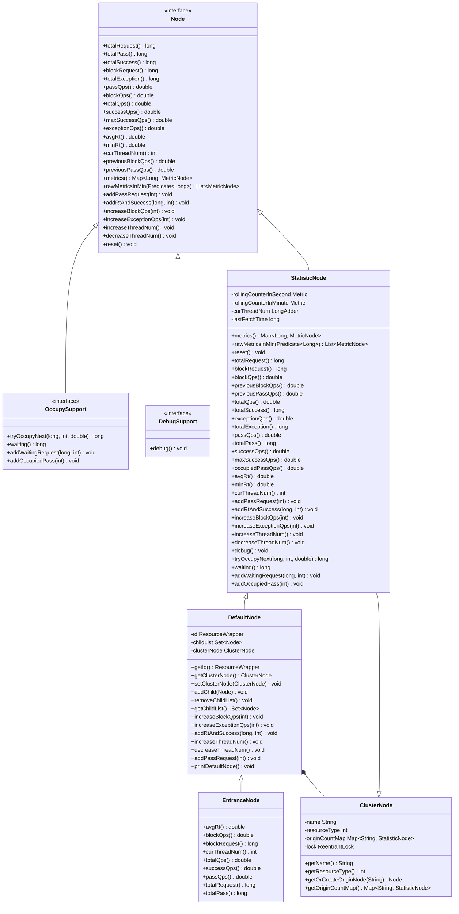
```mermaid
classDiagram
    class Node {
        <<interface>>
        +totalRequest() long
        +totalPass() long
        +totalSuccess() long
        +blockRequest() long
        +totalException() long
        +passQps() double
        +blockQps() double
        +totalQps() double
        +successQps() double
        +maxSuccessQps() double
        +exceptionQps() double
        +avgRt() double
        +minRt() double
        +curThreadNum() int
        +previousBlockQps() double
        +previousPassQps() double
        +metrics() Map~Long, MetricNode~
        +rawMetricsInMin(Predicate~Long~) List~MetricNode~
        +addPassRequest(int) void
        +addRtAndSuccess(long, int) void
        +increaseBlockQps(int) void
        +increaseExceptionQps(int) void
        +increaseThreadNum() void
        +decreaseThreadNum() void
        +reset() void
    }
    
    class OccupySupport {
        <<interface>>
        +tryOccupyNext(long, int, double) long
        +waiting() long
        +addWaitingRequest(long, int) void
        +addOccupiedPass(int) void
    }
    
    class DebugSupport {
        <<interface>>
        +debug() void
    }
    
    class StatisticNode {
        -rollingCounterInSecond Metric
        -rollingCounterInMinute Metric
        -curThreadNum LongAdder
        -lastFetchTime long
        +metrics() Map~Long, MetricNode~
        +rawMetricsInMin(Predicate~Long~) List~MetricNode~
        +reset() void
        +totalRequest() long
        +blockRequest() long
        +blockQps() double
        +previousBlockQps() double
        +previousPassQps() double
        +totalQps() double
        +totalSuccess() long
        +exceptionQps() double
        +totalException() long
        +passQps() double
        +totalPass() long
        +successQps() double
        +maxSuccessQps() double
        +occupiedPassQps() double
        +avgRt() double
        +minRt() double
        +curThreadNum() int
        +addPassRequest(int) void
        +addRtAndSuccess(long, int) void
        +increaseBlockQps(int) void
        +increaseExceptionQps(int) void
        +increaseThreadNum() void
        +decreaseThreadNum() void
        +debug() void
        +tryOccupyNext(long, int, double) long
        +waiting() long
        +addWaitingRequest(long, int) void
        +addOccupiedPass(int) void
    }
    
    class DefaultNode {
        -id ResourceWrapper
        -childList Set~Node~
        -clusterNode ClusterNode
        +getId() ResourceWrapper
        +getClusterNode() ClusterNode
        +setClusterNode(ClusterNode) void
        +addChild(Node) void
        +removeChildList() void
        +getChildList() Set~Node~
        +increaseBlockQps(int) void
        +increaseExceptionQps(int) void
        +addRtAndSuccess(long, int) void
        +increaseThreadNum() void
        +decreaseThreadNum() void
        +addPassRequest(int) void
        +printDefaultNode() void
    }
    
    class ClusterNode {
        -name String
        -resourceType int
        -originCountMap Map~String, StatisticNode~
        -lock ReentrantLock
        +getName() String
        +getResourceType() int
        +getOrCreateOriginNode(String) Node
        +getOriginCountMap() Map~String, StatisticNode~
    }
    
    class EntranceNode {
        +avgRt() double
        +blockQps() double
        +blockRequest() long
        +curThreadNum() int
        +totalQps() double
        +successQps() double
        +passQps() double
        +totalRequest() long
        +totalPass() long
    }
    
    Node <|-- StatisticNode
    Node <|-- OccupySupport
    Node <|-- DebugSupport
    StatisticNode <|-- DefaultNode
    DefaultNode <|-- EntranceNode
    DefaultNode *-- ClusterNode
    ClusterNode <|-- StatisticNode
```

### 二、滑动窗口LeapArray算法分析

#### 2.1 LeapArray核心类

LeapArray是滑动窗口的核心数据结构，实现了基于时间的滑动窗口算法，支持按时间分片统计。

**文件路径**：`sentinel-core/src/main/java/com/alibaba/csp/sentinel/slots/statistic/base/LeapArray.java`

```java
/*
 * Copyright 1999-2018 Alibaba Group Holding Ltd.
 *
 * Licensed under the Apache License, Version 2.0 (the "License");
 * you may not use this file except in compliance with the License.
 * You may obtain a copy of the License at
 *
 *      http://www.apache.org/licenses/LICENSE-2.0
 *
 * Unless required by applicable law or agreed to in writing, software
 * distributed under the License is distributed on an "AS IS" BASIS,
 * WITHOUT WARRANTIES OR CONDITIONS OF ANY KIND, either express or implied.
 * See the License for the specific language governing permissions and
 * limitations under the License.
 */
package com.alibaba.csp.sentinel.slots.statistic.base;

import java.util.ArrayList;
import java.util.List;
import java.util.concurrent.atomic.AtomicReferenceArray;
import java.util.concurrent.locks.ReentrantLock;

import com.alibaba.csp.sentinel.util.AssertUtil;
import com.alibaba.csp.sentinel.util.TimeUtil;

/**
 * <p>
 * Basic data structure for statistic metrics in Sentinel.
 * </p>
 * <p>
 * Leap array use sliding window algorithm to count data. Each bucket cover {@code windowLengthInMs} time span,
 * and the total time span is {@link #intervalInMs}, so the total bucket amount is:
 * {@code sampleCount = intervalInMs / windowLengthInMs}.
 * </p>
 *
 * @param <T> type of statistic data
 * @author jialiang.linjl
 * @author Eric Zhao
 * @author Carpenter Lee
 */
public abstract class LeapArray<T> {

    protected int windowLengthInMs;
    protected int sampleCount;
    protected int intervalInMs;
    private double intervalInSecond;

    protected final AtomicReferenceArray<WindowWrap<T>> array;

    /**
     * The conditional (predicate) update lock is used only when current bucket is deprecated.
     */
    private final ReentrantLock updateLock = new ReentrantLock();

    /**
     * The total bucket count is: {@code sampleCount = intervalInMs / windowLengthInMs}.
     *
     * @param sampleCount  bucket count of the sliding window
     * @param intervalInMs the total time interval of this {@link LeapArray} in milliseconds
     */
    public LeapArray(int sampleCount, int intervalInMs) {
        AssertUtil.isTrue(sampleCount > 0, "bucket count is invalid: " + sampleCount);
        AssertUtil.isTrue(intervalInMs > 0, "total time interval of the sliding window should be positive");
        AssertUtil.isTrue(intervalInMs % sampleCount == 0, "time span needs to be evenly divided");

        this.windowLengthInMs = intervalInMs / sampleCount;
        this.intervalInMs = intervalInMs;
        this.intervalInSecond = intervalInMs / 1000.0;
        this.sampleCount = sampleCount;

        this.array = new AtomicReferenceArray<>(sampleCount);
    }

    /**
     * Get the bucket at current timestamp.
     *
     * @return the bucket at current timestamp
     */
    public WindowWrap<T> currentWindow() {
        return currentWindow(TimeUtil.currentTimeMillis());
    }

    /**
     * Create a new statistic value for bucket.
     *
     * @param timeMillis current time in milliseconds
     * @return the new empty bucket
     */
    public abstract T newEmptyBucket(long timeMillis);

    /**
     * Reset given bucket to provided start time and reset the value.
     *
     * @param startTime  the start time of the bucket in milliseconds
     * @param windowWrap current bucket
     * @return new clean bucket at given start time
     */
    protected abstract WindowWrap<T> resetWindowTo(WindowWrap<T> windowWrap, long startTime);

    private int calculateTimeIdx(/*@Valid*/ long timeMillis) {
        long timeId = timeMillis / windowLengthInMs;
        // Calculate current index so we can map the timestamp to the leap array.
        return (int)(timeId % array.length());
    }

    protected long calculateWindowStart(/*@Valid*/ long timeMillis) {
        return timeMillis - timeMillis % windowLengthInMs;
    }

    /**
     * Get bucket item at provided timestamp.
     *
     * @param timeMillis a valid timestamp in milliseconds
     * @return current bucket item at provided timestamp if the time is valid; null if time is invalid
     */
    public WindowWrap<T> currentWindow(long timeMillis) {
        if (timeMillis < 0) {
            return null;
        }

        int idx = calculateTimeIdx(timeMillis);
        // Calculate current bucket start time.
        long windowStart = calculateWindowStart(timeMillis);

        /*
         * Get bucket item at given time from the array.
         *
         * (1) Bucket is absent, then just create a new bucket and CAS update to circular array.
         * (2) Bucket is up-to-date, then just return the bucket.
         * (3) Bucket is deprecated, then reset current bucket.
         */
        while (true) {
            WindowWrap<T> old = array.get(idx);
            if (old == null) {
                /*
                 *     B0       B1      B2    NULL      B4
                 * ||_______|_______|_______|_______|_______||___
                 * 200     400     600     800     1000    1200  timestamp
                 *                             ^
                 *                          time=888
                 *            bucket is empty, so create new and update
                 *
                 * If the old bucket is absent, then we create a new bucket at {@code windowStart},
                 * then try to update circular array via a CAS operation. Only one thread can
                 * succeed to update, while other threads yield its time slice.
                 */
                WindowWrap<T> window = new WindowWrap<T>(windowLengthInMs, windowStart, newEmptyBucket(timeMillis));
                if (array.compareAndSet(idx, null, window)) {
                    // Successfully updated, return the created bucket.
                    return window;
                } else {
                    // Contention failed, the thread will yield its time slice to wait for bucket available.
                    Thread.yield();
                }
            } else if (windowStart == old.windowStart()) {
                /*
                 *     B0       B1      B2     B3      B4
                 * ||_______|_______|_______|_______|_______||___
                 * 200     400     600     800     1000    1200  timestamp
                 *                             ^
                 *                          time=888
                 *            startTime of Bucket 3: 800, so it's up-to-date
                 *
                 * If current {@code windowStart} is equal to the start timestamp of old bucket,
                 * that means the time is within the bucket, so directly return the bucket.
                 */
                return old;
            } else if (windowStart > old.windowStart()) {
                /*
                 *   (old)
                 *             B0       B1      B2    NULL      B4
                 * |_______||_______|_______|_______|_______|_______||___
                 * ...    1200     1400    1600    1800    2000    2200  timestamp
                 *                              ^
                 *                           time=1676
                 *          startTime of Bucket 2: 400, deprecated, should be reset
                 *
                 * If the start timestamp of old bucket is behind provided time, that means
                 * the bucket is deprecated. We have to reset the bucket to current {@code windowStart}.
                 * Note that the reset and clean-up operations are hard to be atomic,
                 * so we need a update lock to guarantee the correctness of bucket update.
                 *
                 * The update lock is conditional (tiny scope) and will take effect only when
                 * bucket is deprecated, so in most cases it won't lead to performance loss.
                 */
                if (updateLock.tryLock()) {
                    try {
                        // Successfully get the update lock, now we reset the bucket.
                        return resetWindowTo(old, windowStart);
                    } finally {
                        updateLock.unlock();
                    }
                } else {
                    // Contention failed, the thread will yield its time slice to wait for bucket available.
                    Thread.yield();
                }
            } else if (windowStart < old.windowStart()) {
                // Should not go through here, as the provided time is already behind.
                return new WindowWrap<T>(windowLengthInMs, windowStart, newEmptyBucket(timeMillis));
            }
        }
    }

    /**
     * Get the previous bucket item before provided timestamp.
     *
     * @param timeMillis a valid timestamp in milliseconds
     * @return the previous bucket item before provided timestamp
     */
    public WindowWrap<T> getPreviousWindow(long timeMillis) {
        if (timeMillis < 0) {
            return null;
        }
        int idx = calculateTimeIdx(timeMillis - windowLengthInMs);
        timeMillis = timeMillis - windowLengthInMs;
        WindowWrap<T> wrap = array.get(idx);

        if (wrap == null || isWindowDeprecated(wrap)) {
            return null;
        }

        if (wrap.windowStart() + windowLengthInMs < (timeMillis)) {
            return null;
        }

        return wrap;
    }

    /**
     * Get the previous bucket item for current timestamp.
     *
     * @return the previous bucket item for current timestamp
     */
    public WindowWrap<T> getPreviousWindow() {
        return getPreviousWindow(TimeUtil.currentTimeMillis());
    }

    /**
     * Get statistic value from bucket for provided timestamp.
     *
     * @param timeMillis a valid timestamp in milliseconds
     * @return the statistic value if bucket for provided timestamp is up-to-date; otherwise null
     */
    public T getWindowValue(long timeMillis) {
        if (timeMillis < 0) {
            return null;
        }
        int idx = calculateTimeIdx(timeMillis);

        WindowWrap<T> bucket = array.get(idx);

        if (bucket == null || !bucket.isTimeInWindow(timeMillis)) {
            return null;
        }

        return bucket.value();
    }

    /**
     * Check if a bucket is deprecated, which means that the bucket
     * has been behind for at least an entire window time span.
     *
     * @param windowWrap a non-null bucket
     * @return true if the bucket is deprecated; otherwise false
     */
    public boolean isWindowDeprecated(/*@NonNull*/ WindowWrap<T> windowWrap) {
        return isWindowDeprecated(TimeUtil.currentTimeMillis(), windowWrap);
    }

    public boolean isWindowDeprecated(long time, WindowWrap<T> windowWrap) {
        return time - windowWrap.windowStart() > intervalInMs;
    }

    /**
     * Get valid bucket list for entire sliding window.
     * The list will only contain "valid" buckets.
     *
     * @return valid bucket list for entire sliding window.
     */
    public List<WindowWrap<T>> list() {
        return list(TimeUtil.currentTimeMillis());
    }

    public List<WindowWrap<T>> list(long validTime) {
        int size = array.length();
        List<WindowWrap<T>> result = new ArrayList<WindowWrap<T>>(size);

        for (int i = 0; i < size; i++) {
            WindowWrap<T> windowWrap = array.get(i);
            if (windowWrap == null || isWindowDeprecated(validTime, windowWrap)) {
                continue;
            }
            result.add(windowWrap);
        }

        return result;
    }

    /**
     * Get all buckets for entire sliding window including deprecated buckets.
     *
     * @return all buckets for entire sliding window
     */
    public List<WindowWrap<T>> listAll() {
        int size = array.length();
        List<WindowWrap<T>> result = new ArrayList<WindowWrap<T>>(size);

        for (int i = 0; i < size; i++) {
            WindowWrap<T> windowWrap = array.get(i);
            if (windowWrap == null) {
                continue;
            }
            result.add(windowWrap);
        }

        return result;
    }

    /**
     * Get aggregated value list for entire sliding window.
     * The list will only contain value from "valid" buckets.
     *
     * @return aggregated value list for entire sliding window
     */
    public List<T> values() {
        return values(TimeUtil.currentTimeMillis());
    }

    public List<T> values(long timeMillis) {
        if (timeMillis < 0) {
            return new ArrayList<T>();
        }
        int size = array.length();
        List<T> result = new ArrayList<T>(size);

        for (int i = 0; i < size; i++) {
            WindowWrap<T> windowWrap = array.get(i);
            if (windowWrap == null || isWindowDeprecated(timeMillis, windowWrap)) {
                continue;
            }
            result.add(windowWrap.value());
        }
        return result;
    }

    /**
     * Get the valid "head" bucket of the sliding window for provided timestamp.
     * Package-private for test.
     *
     * @param timeMillis a valid timestamp in milliseconds
     * @return the "head" bucket if it exists and is valid; otherwise null
     */
    WindowWrap<T> getValidHead(long timeMillis) {
        // Calculate index for expected head time.
        int idx = calculateTimeIdx(timeMillis + windowLengthInMs);

        WindowWrap<T> wrap = array.get(idx);
        if (wrap == null || isWindowDeprecated(wrap)) {
            return null;
        }

        return wrap;
    }

    /**
     * Get the valid "head" bucket of the sliding window at current timestamp.
     *
     * @return the "head" bucket if it exists and is valid; otherwise null
     */
    public WindowWrap<T> getValidHead() {
        return getValidHead(TimeUtil.currentTimeMillis());
    }

    /**
     * Get sample count (total amount of buckets).
     *
     * @return sample count
     */
    public int getSampleCount() {
        return sampleCount;
    }

    /**
     * Get total interval length of the sliding window in milliseconds.
     *
     * @return interval in second
     */
    public int getIntervalInMs() {
        return intervalInMs;
    }

    /**
     * Get total interval length of the sliding window.
     *
     * @return interval in second
     */
    public double getIntervalInSecond() {
        return intervalInSecond;
    }

    public void debug(long time) {
        StringBuilder sb = new StringBuilder();
        List<WindowWrap<T>> lists = list(time);
        sb.append("Thread_").append(Thread.currentThread().getId()).append("_");
        for (WindowWrap<T> window : lists) {
            sb.append(window.windowStart()).append(":").append(window.value().toString());
        }
        System.out.println(sb.toString());
    }

    public long currentWaiting() {
        // TODO: default method. Should remove this later.
        return 0;
    }

    public void addWaiting(long time, int acquireCount) {
        // Do nothing by default.
        throw new UnsupportedOperationException();
    }
}
```

##### 核心字段分析：

| 字段名 | 类型 | 含义 |
|-------|------|------|
| `windowLengthInMs` | int | 每个窗口的时间长度（毫秒） |
| `sampleCount` | int | 窗口数量 |
| `intervalInMs` | int | 总时间间隔（毫秒） |
| `intervalInSecond` | double | 总时间间隔（秒） |
| `array` | AtomicReferenceArray<WindowWrap<T>> | 窗口数组，使用原子引用数组保证线程安全 |
| `updateLock` | ReentrantLock | 更新锁，用于窗口过期时的并发更新 |

##### 关键方法解析：

1. **calculateTimeIdx(long timeMillis)** - 时间到数组索引的映射：
```java
private int calculateTimeIdx(/*@Valid*/ long timeMillis) {
    long timeId = timeMillis / windowLengthInMs;
    // Calculate current index so we can map the timestamp to the leap array.
    return (int)(timeId % array.length());
}
```
- 计算给定时间属于哪个窗口
- 使用取模运算实现环形数组

2. **calculateWindowStart(long timeMillis)** - 计算窗口起始时间：
```java
protected long calculateWindowStart(/*@Valid*/ long timeMillis) {
    return timeMillis - timeMillis % windowLengthInMs;
}
```
- 计算给定时间所在窗口的起始时间
- 向下取整到最近的窗口边界

3. **currentWindow(long timeMillis)** - 获取当前时间窗口：
这是滑动窗口的核心方法，包含三种情况处理：
- 桶为空：创建新桶并通过CAS更新到数组
- 桶时间匹配：直接返回当前桶
- 桶过期：获取更新锁，重置桶的时间和数据

4. **getPreviousWindow(long timeMillis)** - 获取前一个时间窗口：
```java
public WindowWrap<T> getPreviousWindow(long timeMillis) {
    if (timeMillis < 0) {
        return null;
    }
    int idx = calculateTimeIdx(timeMillis - windowLengthInMs);
    timeMillis = timeMillis - windowLengthInMs;
    WindowWrap<T> wrap = array.get(idx);

    if (wrap == null || isWindowDeprecated(wrap)) {
        return null;
    }

    if (wrap.windowStart() + windowLengthInMs < (timeMillis)) {
        return null;
    }

    return wrap;
}
```
- 获取指定时间的前一个窗口
- 检查窗口是否有效且未过期

5. **getValues()** - 获取所有有效窗口的值：
```java
public List<T> values(long timeMillis) {
    if (timeMillis < 0) {
        return new ArrayList<T>();
    }
    int size = array.length();
    List<T> result = new ArrayList<T>(size);

    for (int i = 0; i < size; i++) {
        WindowWrap<T> windowWrap = array.get(i);
        if (windowWrap == null || isWindowDeprecated(timeMillis, windowWrap)) {
            continue;
        }
        result.add(windowWrap.value());
    }
    return result;
}
```
- 遍历所有窗口，收集有效的窗口数据
- 过滤掉过期的窗口

6. **isWindowDeprecated(long time, WindowWrap<T> windowWrap)** - 窗口过期判断：
```java
public boolean isWindowDeprecated(long time, WindowWrap<T> windowWrap) {
    return time - windowWrap.windowStart() > intervalInMs;
}
```
- 判断窗口是否已经过期
- 当前时间与窗口起始时间的差超过总时间间隔，则认为窗口过期

#### 2.2 WindowWrap内部类

WindowWrap是对单个时间窗口的包装，包含窗口的时间信息和统计数据。

**文件路径**：`sentinel-core/src/main/java/com/alibaba/csp/sentinel/slots/statistic/base/WindowWrap.java`

```java
/*
 * Copyright 1999-2018 Alibaba Group Holding Ltd.
 *
 * Licensed under the Apache License, Version 2.0 (the "License");
 * you may not use this file except in compliance with the License.
 * You may obtain a copy of the License at
 *
 *      http://www.apache.org/licenses/LICENSE-2.0
 *
 * Unless required by applicable law or agreed to in writing, software
 * distributed under the License is distributed on an "AS IS" BASIS,
 * WITHOUT WARRANTIES OR CONDITIONS OF ANY KIND, either express or implied.
 * See the License for the specific language governing permissions and
 * limitations under the License.
 */
package com.alibaba.csp.sentinel.slots.statistic.base;

/**
 * Wrapper entity class for a period of time window.
 *
 * @param <T> data type
 * @author jialiang.linjl
 * @author Eric Zhao
 */
public class WindowWrap<T> {

    /**
     * Time length of a single window bucket in milliseconds.
     */
    private final long windowLengthInMs;

    /**
     * Start timestamp of the window in milliseconds.
     */
    private long windowStart;

    /**
     * Statistic data.
     */
    private T value;

    /**
     * @param windowLengthInMs a single window bucket's time length in milliseconds.
     * @param windowStart      the start timestamp of the window
     * @param value            statistic data
     */
    public WindowWrap(long windowLengthInMs, long windowStart, T value) {
        this.windowLengthInMs = windowLengthInMs;
        this.windowStart = windowStart;
        this.value = value;
    }

    public long windowLength() {
        return windowLengthInMs;
    }

    public long windowStart() {
        return windowStart;
    }

    public T value() {
        return value;
    }

    public void setValue(T value) {
        this.value = value;
    }

    /**
     * Reset start timestamp of current bucket to provided time.
     *
     * @param startTime valid start timestamp
     * @return bucket after reset
     */
    public WindowWrap<T> resetTo(long startTime) {
        this.windowStart = startTime;
        return this;
    }

    /**
     * Check whether given timestamp is in current bucket.
     *
     * @param timeMillis valid timestamp in ms
     * @return true if the given time is in current bucket, otherwise false
     * @since 1.5.0
     */
    public boolean isTimeInWindow(long timeMillis) {
        return windowStart <= timeMillis && timeMillis < windowStart + windowLengthInMs;
    }

    @Override
    public String toString() {
        return "WindowWrap{" +
            "windowLengthInMs=" + windowLengthInMs +
            ", windowStart=" + windowStart +
            ", value=" + value +
            '}';
    }
}
```

##### 核心字段：
- `windowLengthInMs`：窗口的时间长度
- `windowStart`：窗口的起始时间戳
- `value`：窗口的统计数据，泛型T

##### 核心方法：
- `resetTo(long startTime)`：重置窗口的起始时间
- `isTimeInWindow(long timeMillis)`：判断给定时间是否在当前窗口内

#### 2.3 BucketLeapArray子类

BucketLeapArray是LeapArray的具体实现，用于存储MetricBucket类型的统计数据。

**文件路径**：`sentinel-core/src/main/java/com/alibaba/csp/sentinel/slots/statistic/metric/BucketLeapArray.java`

```java
/*
 * Copyright 1999-2018 Alibaba Group Holding Ltd.
 *
 * Licensed under the Apache License, Version 2.0 (the "License");
 * you may not use this file except in compliance with the License.
 * You may obtain a copy of the License at
 *
 *      http://www.apache.org/licenses/LICENSE-2.0
 *
 * Unless required by applicable law or agreed to in writing, software
 * distributed under the License is distributed on an "AS IS" BASIS,
 * WITHOUT WARRANTIES OR CONDITIONS OF ANY KIND, either express or implied.
 * See the License for the specific language governing permissions and
 * limitations under the License.
 */
package com.alibaba.csp.sentinel.slots.statistic.metric;

import com.alibaba.csp.sentinel.slots.statistic.base.LeapArray;
import com.alibaba.csp.sentinel.slots.statistic.base.WindowWrap;
import com.alibaba.csp.sentinel.slots.statistic.data.MetricBucket;

/**
 * The fundamental data structure for metric statistics in a time span.
 *
 * @author jialiang.linjl
 * @author Eric Zhao
 * @see LeapArray
 */
public class BucketLeapArray extends LeapArray<MetricBucket> {

    public BucketLeapArray(int sampleCount, int intervalInMs) {
        super(sampleCount, intervalInMs);
    }

    @Override
    public MetricBucket newEmptyBucket(long time) {
        return new MetricBucket();
    }

    @Override
    protected WindowWrap<MetricBucket> resetWindowTo(WindowWrap<MetricBucket> w, long startTime) {
        // Update the start time and reset value.
        w.resetTo(startTime);
        w.value().reset();
        return w;
    }
}
```

##### 实现细节：
- `newEmptyBucket(long time)`：创建新的空MetricBucket
- `resetWindowTo(WindowWrap<MetricBucket>, long startTime)`：重置窗口，更新起始时间并重置统计数据

#### 2.4 OccupiableBucketLeapArray子类

OccupiableBucketLeapArray是支持未来配额占用的滑动窗口实现，用于流量控制中的提前占用。

**文件路径**：`sentinel-core/src/main/java/com/alibaba/csp/sentinel/slots/statistic/metric/occupy/OccupiableBucketLeapArray.java`

```java
/*
 * Copyright 1999-2018 Alibaba Group Holding Ltd.
 *
 * Licensed under the Apache License, Version 2.0 (the "License");
 * you may not use this file except in compliance with the License.
 * You may obtain a copy of the License at
 *
 *      http://www.apache.org/licenses/LICENSE-2.0
 *
 * Unless required by applicable law or agreed to in writing, software
 * distributed under the License is distributed on an "AS IS" BASIS,
 * WITHOUT WARRANTIES OR CONDITIONS OF ANY KIND, either express or implied.
 * See the License for the specific language governing permissions and
 * limitations under the License.
 */
package com.alibaba.csp.sentinel.slots.statistic.metric.occupy;

import java.util.List;

import com.alibaba.csp.sentinel.slots.statistic.MetricEvent;
import com.alibaba.csp.sentinel.slots.statistic.base.LeapArray;
import com.alibaba.csp.sentinel.slots.statistic.base.WindowWrap;
import com.alibaba.csp.sentinel.slots.statistic.data.MetricBucket;

/**
 * @author jialiang.linjl
 * @since 1.5.0
 */
public class OccupiableBucketLeapArray extends LeapArray<MetricBucket> {

    private final FutureBucketLeapArray borrowArray;

    public OccupiableBucketLeapArray(int sampleCount, int intervalInMs) {
        // This class is the original "CombinedBucketArray".
        super(sampleCount, intervalInMs);
        this.borrowArray = new FutureBucketLeapArray(sampleCount, intervalInMs);
    }

    @Override
    public MetricBucket newEmptyBucket(long time) {
        MetricBucket newBucket = new MetricBucket();

        MetricBucket borrowBucket = borrowArray.getWindowValue(time);
        if (borrowBucket != null) {
            newBucket.reset(borrowBucket);
        }

        return newBucket;
    }

    @Override
    protected WindowWrap<MetricBucket> resetWindowTo(WindowWrap<MetricBucket> w, long time) {
        // Update the start time and reset value.
        w.resetTo(time);
        MetricBucket borrowBucket = borrowArray.getWindowValue(time);
        if (borrowBucket != null) {
            w.value().reset();
            w.value().addPass((int)borrowBucket.pass());
        } else {
            w.value().reset();
        }

        return w;
    }

    @Override
    public long currentWaiting() {
        borrowArray.currentWindow();
        long currentWaiting = 0;
        List<MetricBucket> list = borrowArray.values();

        for (MetricBucket window : list) {
            currentWaiting += window.pass();
        }
        return currentWaiting;
    }

    @Override
    public void addWaiting(long time, int acquireCount) {
        WindowWrap<MetricBucket> window = borrowArray.currentWindow(time);
        window.value().add(MetricEvent.PASS, acquireCount);
    }

    @Override
    public void debug(long time) {
        StringBuilder sb = new StringBuilder();
        List<WindowWrap<MetricBucket>> lists = listAll();
        sb.append("a_Thread_").append(Thread.currentThread().getId()).append(" time=").append(time).append("; ");
        for (WindowWrap<MetricBucket> window : lists) {
            sb.append(window.windowStart()).append(":").append(window.value().toString()).append(";");
        }
        sb.append("\n");

        lists = borrowArray.listAll();
        sb.append("b_Thread_").append(Thread.currentThread().getId()).append(" time=").append(time).append("; ");
        for (WindowWrap<MetricBucket> window : lists) {
            sb.append(window.windowStart()).append(":").append(window.value().toString()).append(";");
        }
        System.out.println(sb.toString());
    }
}
```

##### 未来配额占用机制：
- `borrowArray`：未来窗口数组，用于记录提前占用的配额
- `addWaiting(long time, int acquireCount)`：将等待的请求添加到未来窗口
- `currentWaiting()`：计算当前等待的总配额
- 当创建新窗口或重置窗口时，会将未来窗口的配额转移到当前窗口

#### 2.5 滑动窗口时序图

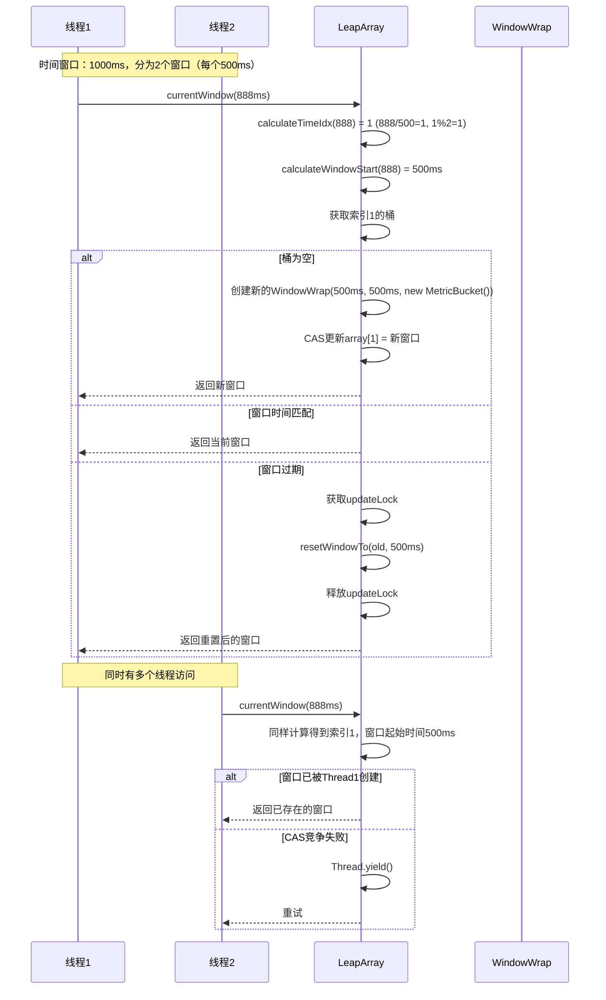
```mermaid
sequenceDiagram
    participant Thread1 as 线程1
    participant Thread2 as 线程2
    participant LeapArray as LeapArray
    participant WindowWrap as WindowWrap
    
    Note over Thread1,Thread2: 时间窗口：1000ms，分为2个窗口（每个500ms）
    
    Thread1->>LeapArray: currentWindow(888ms)
    LeapArray->>LeapArray: calculateTimeIdx(888) = 1 (888/500=1, 1%2=1)
    LeapArray->>LeapArray: calculateWindowStart(888) = 500ms
    LeapArray->>LeapArray: 获取索引1的桶
    alt 桶为空
        LeapArray->>LeapArray: 创建新的WindowWrap(500ms, 500ms, new MetricBucket())
        LeapArray->>LeapArray: CAS更新array[1] = 新窗口
        LeapArray-->>Thread1: 返回新窗口
    else 窗口时间匹配
        LeapArray-->>Thread1: 返回当前窗口
    else 窗口过期
        LeapArray->>LeapArray: 获取updateLock
        LeapArray->>LeapArray: resetWindowTo(old, 500ms)
        LeapArray->>LeapArray: 释放updateLock
        LeapArray-->>Thread1: 返回重置后的窗口
    end
    
    Note over Thread1,Thread2: 同时有多个线程访问
    Thread2->>LeapArray: currentWindow(888ms)
    LeapArray->>LeapArray: 同样计算得到索引1，窗口起始时间500ms
    alt 窗口已被Thread1创建
        LeapArray-->>Thread2: 返回已存在的窗口
    else CAS竞争失败
        LeapArray->>LeapArray: Thread.yield()
        LeapArray-->>Thread2: 重试
    end
```

### 三、MetricBucket和MetricItem

#### 3.1 MetricBucket

MetricBucket是单个时间窗口内的具体统计数据，包含各种指标的计数。

**文件路径**：`sentinel-core/src/main/java/com/alibaba/csp/sentinel/slots/statistic/data/MetricBucket.java`

```java
/*
 * Copyright 1999-2018 Alibaba Group Holding Ltd.
 *
 * Licensed under the Apache License, Version 2.0 (the "License");
 * you may not use this file except in compliance with the License.
 * You may obtain a copy of the License at
 *
 *      http://www.apache.org/licenses/LICENSE-2.0
 *
 * Unless required by applicable law or agreed to in writing, software
 * distributed under the License is distributed on an "AS IS" BASIS,
 * WITHOUT WARRANTIES OR CONDITIONS OF ANY KIND, either express or implied.
 * See the License for the specific language governing permissions and
 * limitations under the License.
 */
package com.alibaba.csp.sentinel.slots.statistic.data;

import com.alibaba.csp.sentinel.config.SentinelConfig;
import com.alibaba.csp.sentinel.slots.statistic.MetricEvent;
import java.util.concurrent.atomic.LongAdder;

/**
 * Represents metrics data in a period of time span.
 *
 * @author jialiang.linjl
 * @author Eric Zhao
 */
public class MetricBucket {

    private final LongAdder[] counters;

    private volatile long minRt;

    public MetricBucket() {
        MetricEvent[] events = MetricEvent.values();
        this.counters = new LongAdder[events.length];
        for (MetricEvent event : events) {
            counters[event.ordinal()] = new LongAdder();
        }
        initMinRt();
    }

    public MetricBucket reset(MetricBucket bucket) {
        for (MetricEvent event : MetricEvent.values()) {
            counters[event.ordinal()].reset();
            counters[event.ordinal()].add(bucket.get(event));
        }
        initMinRt();
        return this;
    }

    private void initMinRt() {
        this.minRt = SentinelConfig.statisticMaxRt();
    }

    /**
     * Reset the adders.
     *
     * @return new metric bucket in initial state
     */
    public MetricBucket reset() {
        for (MetricEvent event : MetricEvent.values()) {
            counters[event.ordinal()].reset();
        }
        initMinRt();
        return this;
    }

    public long get(MetricEvent event) {
        return counters[event.ordinal()].sum();
    }

    public MetricBucket add(MetricEvent event, long n) {
        counters[event.ordinal()].add(n);
        return this;
    }

    public long pass() {
        return get(MetricEvent.PASS);
    }

    public long occupiedPass() {
        return get(MetricEvent.OCCUPIED_PASS);
    }

    public long block() {
        return get(MetricEvent.BLOCK);
    }

    public long exception() {
        return get(MetricEvent.EXCEPTION);
    }

    public long rt() {
        return get(MetricEvent.RT);
    }

    public long minRt() {
        return minRt;
    }

    public long success() {
        return get(MetricEvent.SUCCESS);
    }

    public void addPass(int n) {
        add(MetricEvent.PASS, n);
    }

    public void addOccupiedPass(int n) {
        add(MetricEvent.OCCUPIED_PASS, n);
    }

    public void addException(int n) {
        add(MetricEvent.EXCEPTION, n);
    }

    public void addBlock(int n) {
        add(MetricEvent.BLOCK, n);
    }

    public void addSuccess(int n) {
        add(MetricEvent.SUCCESS, n);
    }

    public void addRT(long rt) {
        add(MetricEvent.RT, rt);

        // Not thread-safe, but it's okay.
        if (rt < minRt) {
            minRt = rt;
        }
    }

    @Override
    public String toString() {
        return "p: " + pass() + ", b: " + block() + ", w: " + occupiedPass();
    }
}
```

##### 核心组件分析：

1. **MetricEvent枚举**：
```java
public enum MetricEvent {
    /**
     * Normal pass.
     */
    PASS,
    /**
     * Normal block.
     */
    BLOCK,
    EXCEPTION,
    SUCCESS,
    RT,

    /**
     * Passed in future quota (pre-occupied, since 1.5.0).
     */
    OCCUPIED_PASS
}
```
- PASS：正常通过的请求
- BLOCK：被拒绝的请求
- EXCEPTION：业务异常
- SUCCESS：成功完成的请求
- RT：响应时间
- OCCUPIED_PASS：提前占用的通过请求（用于流量控制）

2. **LongAdder[] counters**：
- 使用LongAdder数组保存各种指标的计数，比AtomicLong具有更好的并发性能
- 每个MetricEvent对应一个LongAdder计数器

3. **minRt字段**：
- 最小响应时间，初始值为SentinelConfig.statisticMaxRt()，默认是5000ms
- 在addRT方法中更新最小响应时间，虽然不是线程安全的，但在高并发下影响不大

##### 核心方法：
- `add(MetricEvent event, long n)`：增加指定事件的计数
- `get(MetricEvent event)`：获取指定事件的计数总和
- `addRT(long rt)`：添加响应时间并更新最小响应时间

#### 3.2 MetricItem

MetricItem是可序列化的统计对象，用于传输和存储统计数据。

**文件路径**：`sentinel-core/src/main/java/com/alibaba/csp/sentinel/node/metric/MetricNode.java`

```java
/*
 * Copyright 1999-2018 Alibaba Group Holding Ltd.
 *
 * Licensed under the Apache License, Version 2.0 (the "License");
 * you may not use this file except in compliance with the License.
 * You may obtain a copy of the License at
 *
 *      http://www.apache.org/licenses/LICENSE-2.0
 *
 * Unless required by applicable law or agreed to in writing, software
 * distributed under the License is distributed on an "AS IS" BASIS,
 * WITHOUT WARRANTIES OR CONDITIONS OF ANY KIND, either express or implied.
 * See the License for the specific language governing permissions and
 * limitations under the License.
 */
package com.alibaba.csp.sentinel.node.metric;

import java.io.Serializable;

/**
 * Metric entity for entropy.
 *
 * @author leyou
 * @author Jason Jiao
 */
public class MetricNode implements Serializable {

    private static final long serialVersionUID = -2891673963996307755L;

    private long timestamp;
    private long blockQps;
    private long exceptionQps;
    private long successQps;
    private long passQps;
    private long rt;
    private long occupiedPassQps;

    public long getTimestamp() {
        return timestamp;
    }

    public void setTimestamp(long timestamp) {
        this.timestamp = timestamp;
    }

    public long getBlockQps() {
        return blockQps;
    }

    public void setBlockQps(long blockQps) {
        this.blockQps = blockQps;
    }

    public long getExceptionQps() {
        return exceptionQps;
    }

    public void setExceptionQps(long exceptionQps) {
        this.exceptionQps = exceptionQps;
    }

    public long getSuccessQps() {
        return successQps;
    }

    public void setSuccessQps(long successQps) {
        this.successQps = successQps;
    }

    public long getPassQps() {
        return passQps;
    }

    public void setPassQps(long passQps) {
        this.passQps = passQps;
    }

    public long getRt() {
        return rt;
    }

    public void setRt(long rt) {
        this.rt = rt;
    }

    public long getOccupiedPassQps() {
        return occupiedPassQps;
    }

    public void setOccupiedPassQps(long occupiedPassQps) {
        this.occupiedPassQps = occupiedPassQps;
    }

    @Override
    public String toString() {
        return "MetricNode{" +
            "timestamp=" + timestamp +
            ", blockQps=" + blockQps +
            ", exceptionQps=" + exceptionQps +
            ", successQps=" + successQps +
            ", passQps=" + passQps +
            ", rt=" + rt +
            ", occupiedPassQps=" + occupiedPassQps +
            '}';
    }
}
```

##### 设计特点：
- 实现了Serializable接口，支持序列化
- 包含了所有核心统计指标：时间戳、拒绝QPS、异常QPS、成功QPS、通过QPS、响应时间、占用通过QPS
- 用于在不同组件之间传输统计数据，比如监控系统

#### 3.3 ArrayMetric

ArrayMetric是Metric接口的具体实现，使用LeapArray封装了MetricBucket的统计操作。

**文件路径**：`sentinel-core/src/main/java/com/alibaba/csp/sentinel/slots/statistic/metric/ArrayMetric.java`

```java
/*
 * Copyright 1999-2018 Alibaba Group Holding Ltd.
 *
 * Licensed under the Apache License, Version 2.0 (the "License");
 * you may not use this file except in compliance with the License.
 * You may obtain a copy of the License at
 *
 *      http://www.apache.org/licenses/LICENSE-2.0
 *
 * Unless required by applicable law or agreed to in writing, software
 * distributed under the License is distributed on an "AS IS" BASIS,
 * WITHOUT WARRANTIES OR CONDITIONS OF ANY KIND, either express or implied.
 * See the License for the specific language governing permissions and
 * limitations under the License.
 */
package com.alibaba.csp.sentinel.slots.statistic.metric;

import java.util.ArrayList;
import java.util.List;

import com.alibaba.csp.sentinel.config.SentinelConfig;
import com.alibaba.csp.sentinel.node.metric.MetricNode;
import com.alibaba.csp.sentinel.slots.statistic.MetricEvent;
import com.alibaba.csp.sentinel.slots.statistic.base.LeapArray;
import com.alibaba.csp.sentinel.slots.statistic.data.MetricBucket;
import com.alibaba.csp.sentinel.slots.statistic.base.WindowWrap;
import com.alibaba.csp.sentinel.slots.statistic.metric.occupy.OccupiableBucketLeapArray;
import com.alibaba.csp.sentinel.util.function.Predicate;

/**
 * The basic metric class in Sentinel using a {@link BucketLeapArray} internal.
 *
 * @author jialiang.linjl
 * @author Eric Zhao
 */
public class ArrayMetric implements Metric {

    private final LeapArray<MetricBucket> data;

    public ArrayMetric(int sampleCount, int intervalInMs) {
        this.data = new OccupiableBucketLeapArray(sampleCount, intervalInMs);
    }

    public ArrayMetric(int sampleCount, int intervalInMs, boolean enableOccupy) {
        if (enableOccupy) {
            this.data = new OccupiableBucketLeapArray(sampleCount, intervalInMs);
        } else {
            this.data = new BucketLeapArray(sampleCount, intervalInMs);
        }
    }

    /**
     * For unit test.
     */
    public ArrayMetric(LeapArray<MetricBucket> array) {
        this.data = array;
    }

    @Override
    public long success() {
        data.currentWindow();
        long success = 0;

        List<MetricBucket> list = data.values();
        for (MetricBucket window : list) {
            success += window.success();
        }
        return success;
    }

    @Override
    public long maxSuccess() {
        data.currentWindow();
        long success = 0;

        List<MetricBucket> list = data.values();
        for (MetricBucket window : list) {
            if (window.success() > success) {
                success = window.success();
            }
        }
        return Math.max(success, 1);
    }

    @Override
    public long exception() {
        data.currentWindow();
        long exception = 0;
        List<MetricBucket> list = data.values();
        for (MetricBucket window : list) {
            exception += window.exception();
        }
        return exception;
    }

    @Override
    public long block() {
        data.currentWindow();
        long block = 0;
        List<MetricBucket> list = data.values();
        for (MetricBucket window : list) {
            block += window.block();
        }
        return block;
    }

    @Override
    public long pass() {
        data.currentWindow();
        long pass = 0;
        List<MetricBucket> list = data.values();

        for (MetricBucket window : list) {
            pass += window.pass();
        }
        return pass;
    }

    @Override
    public long occupiedPass() {
        data.currentWindow();
        long pass = 0;
        List<MetricBucket> list = data.values();
        for (MetricBucket window : list) {
            pass += window.occupiedPass();
        }
        return pass;
    }

    @Override
    public long rt() {
        data.currentWindow();
        long rt = 0;
        List<MetricBucket> list = data.values();
        for (MetricBucket window : list) {
            rt += window.rt();
        }
        return rt;
    }

    @Override
    public long minRt() {
        data.currentWindow();
        long rt = SentinelConfig.statisticMaxRt();
        List<MetricBucket> list = data.values();
        for (MetricBucket window : list) {
            if (window.minRt() < rt) {
                rt = window.minRt();
            }
        }

        return Math.max(1, rt);
    }

    @Override
    public List<MetricNode> details() {
        List<MetricNode> details = new ArrayList<>();
        data.currentWindow();
        List<WindowWrap<MetricBucket>> list = data.list();
        for (WindowWrap<MetricBucket> window : list) {
            if (window == null) {
                continue;
            }

            details.add(fromBucket(window));
        }

        return details;
    }

    @Override
    public List<MetricNode> detailsOnCondition(Predicate<Long> timePredicate) {
        List<MetricNode> details = new ArrayList<>();
        data.currentWindow();
        List<WindowWrap<MetricBucket>> list = data.list();
        for (WindowWrap<MetricBucket> window : list) {
            if (window == null) {
                continue;
            }
            if (timePredicate != null && !timePredicate.test(window.windowStart())) {
                continue;
            }

            details.add(fromBucket(window));
        }

        return details;
    }

    private MetricNode fromBucket(WindowWrap<MetricBucket> wrap) {
        MetricNode node = new MetricNode();
        node.setBlockQps(wrap.value().block());
        node.setExceptionQps(wrap.value().exception());
        node.setPassQps(wrap.value().pass());
        long successQps = wrap.value().success();
        node.setSuccessQps(successQps);
        if (successQps != 0) {
            node.setRt(wrap.value().rt() / successQps);
        } else {
            node.setRt(wrap.value().rt());
        }
        node.setTimestamp(wrap.windowStart());
        node.setOccupiedPassQps(wrap.value().occupiedPass());
        return node;
    }

    @Override
    public MetricBucket[] windows() {
        data.currentWindow();
        return data.values().toArray(new MetricBucket[0]);
    }

    @Override
    public void addException(int count) {
        WindowWrap<MetricBucket> wrap = data.currentWindow();
        wrap.value().addException(count);
    }

    @Override
    public void addBlock(int count) {
        WindowWrap<MetricBucket> wrap = data.currentWindow();
        wrap.value().addBlock(count);
    }

    @Override
    public void addWaiting(long time, int acquireCount) {
        data.addWaiting(time, acquireCount);
    }

    @Override
    public void addOccupiedPass(int acquireCount) {
        WindowWrap<MetricBucket> wrap = data.currentWindow();
        wrap.value().addOccupiedPass(acquireCount);
    }

    @Override
    public void addSuccess(int count) {
        WindowWrap<MetricBucket> wrap = data.currentWindow();
        wrap.value().addSuccess(count);
    }

    @Override
    public void addPass(int count) {
        WindowWrap<MetricBucket> wrap = data.currentWindow();
        wrap.value().addPass(count);
    }

    @Override
    public void addRT(long rt) {
        WindowWrap<MetricBucket> wrap = data.currentWindow();
        wrap.value().addRT(rt);
    }

    @Override
    public void debug() {
        data.debug(System.currentTimeMillis());
    }

    @Override
    public long previousWindowBlock() {
        data.currentWindow();
        WindowWrap<MetricBucket> wrap = data.getPreviousWindow();
        if (wrap == null) {
            return 0;
        }
        return wrap.value().block();
    }

    @Override
    public long previousWindowPass() {
        data.currentWindow();
        WindowWrap<MetricBucket> wrap = data.getPreviousWindow();
        if (wrap == null) {
            return 0;
        }
        return wrap.value().pass();
    }

    public void add(MetricEvent event, long count) {
        data.currentWindow().value().add(event, count);
    }

    public long getCurrentCount(MetricEvent event) {
        return data.currentWindow().value().get(event);
    }

    /**
     * Get total sum for provided event in {@code intervalInSec}.
     *
     * @param event event to calculate
     * @return total sum for event
     */
    public long getSum(MetricEvent event) {
        data.currentWindow();
        long sum = 0;

        List<MetricBucket> buckets = data.values();
        for (MetricBucket bucket : buckets) {
            sum += bucket.get(event);
        }
        return sum;
    }

    /**
     * Get average count for provided event per second.
     *
     * @param event event to calculate
     * @return average count per second for event
     */
    public double getAvg(MetricEvent event) {
        return getSum(event) / data.getIntervalInSecond();
    }

    @Override
    public long getWindowPass(long timeMillis) {
        MetricBucket bucket = data.getWindowValue(timeMillis);
        if (bucket == null) {
            return 0L;
        }
        return bucket.pass();
    }

    @Override
    public long waiting() {
        return data.currentWaiting();
    }

    @Override
    public double getWindowIntervalInSec() {
        return data.getIntervalInSecond();
    }

    @Override
    public int getSampleCount() {
        return data.getSampleCount();
    }
}
```

##### 核心功能：
1. **指标统计**：
   - 实现了所有Metric接口的方法，包括success()、exception()、block()、pass()、rt()等
   - 所有统计方法都会先获取当前窗口，然后聚合所有有效窗口的值

2. **窗口操作**：
   - `addPass(int)`、`addBlock(int)`、`addSuccess(int)`等方法：向当前窗口添加统计数据
   - `previousWindowBlock()`、`previousWindowPass()`：获取上一个窗口的统计数据

3. **数据转换**：
   - `fromBucket(WindowWrap<MetricBucket>)`：将MetricBucket转换为可序列化的MetricNode
   - `details()`和`detailsOnCondition()`：获取所有有效窗口的MetricNode列表

### 四、滑动窗口配置和关键流程

#### 4.1 默认配置

在StatisticNode中，默认的滑动窗口配置如下：

```java
// 秒级滑动窗口：默认2个窗口，每个窗口500ms，总间隔1000ms（1秒）
private transient volatile Metric rollingCounterInSecond = new ArrayMetric(SampleCountProperty.SAMPLE_COUNT,
    IntervalProperty.INTERVAL);

// 分钟级滑动窗口：60个窗口，每个窗口1000ms（1秒），总间隔60000ms（1分钟）
private transient Metric rollingCounterInMinute = new ArrayMetric(60, 60 * 1000, false);
```

默认配置的详细参数：

| 配置项 | 秒级窗口 | 分钟级窗口 |
|-------|---------|----------|
| 窗口数量(sampleCount) | `SampleCountProperty.SAMPLE_COUNT`（默认2） | 60 |
| 每个窗口长度(windowLengthInMs) | `IntervalProperty.INTERVAL / sampleCount`（默认500ms） | 1000ms（1秒） |
| 总时间间隔(intervalInMs) | `IntervalProperty.INTERVAL`（默认1000ms，1秒） | 60 * 1000ms（1分钟） |

可以通过以下类修改配置：
- `SampleCountProperty`：修改每秒的窗口数量
- `IntervalProperty`：修改统计间隔时间

#### 4.2 请求统计完整流程

从`SphU.entry()`到滑动窗口更新的完整链路：

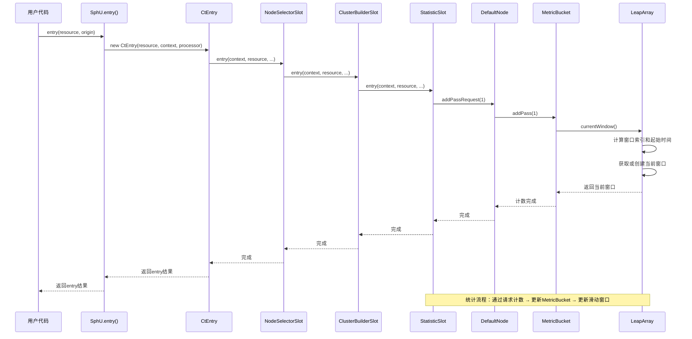
```mermaid
sequenceDiagram
    participant User as 用户代码
    participant SphU as SphU.entry()
    participant CtEntry as CtEntry
    participant NodeSelectorSlot as NodeSelectorSlot
    participant ClusterBuilderSlot as ClusterBuilderSlot
    participant StatisticSlot as StatisticSlot
    participant DefaultNode as DefaultNode
    participant MetricBucket as MetricBucket
    participant LeapArray as LeapArray
    
    User->>SphU: entry(resource, origin)
    SphU->>CtEntry: new CtEntry(resource, context, processor)
    CtEntry->>NodeSelectorSlot: entry(context, resource, ...)
    NodeSelectorSlot->>ClusterBuilderSlot: entry(context, resource, ...)
    ClusterBuilderSlot->>StatisticSlot: entry(context, resource, ...)
    StatisticSlot->>DefaultNode: addPassRequest(1)
    DefaultNode->>MetricBucket: addPass(1)
    MetricBucket->>LeapArray: currentWindow()
    LeapArray->>LeapArray: 计算窗口索引和起始时间
    LeapArray->>LeapArray: 获取或创建当前窗口
    LeapArray-->>MetricBucket: 返回当前窗口
    MetricBucket-->>DefaultNode: 计数完成
    DefaultNode-->>StatisticSlot: 完成
    StatisticSlot-->>ClusterBuilderSlot: 完成
    ClusterBuilderSlot-->>NodeSelectorSlot: 完成
    NodeSelectorSlot-->>CtEntry: 完成
    CtEntry-->>SphU: 返回entry结果
    SphU-->>User: 返回entry结果
    
    Note over StatisticSlot,LeapArray: 统计流程：通过请求计数 → 更新MetricBucket → 更新滑动窗口
```

#### 4.3 QPS计算流程

passQps()方法从滑动窗口中聚合计算QPS的流程：

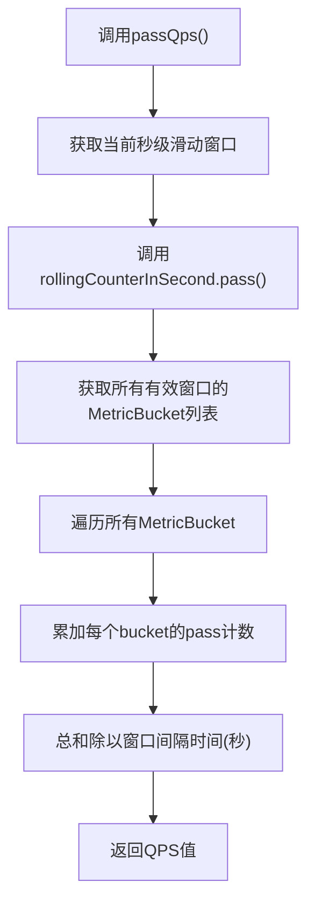
```mermaid
flowchart TD
    A["调用passQps()"] --> B[获取当前秒级滑动窗口]
    B --> C["调用rollingCounterInSecond.pass()"]
    C --> D[获取所有有效窗口的MetricBucket列表]
    D --> E[遍历所有MetricBucket]
    E --> F[累加每个bucket的pass计数]
    F --> G["总和除以窗口间隔时间(秒)"]
    G --> H[返回QPS值]
```

以StatisticNode的passQps()方法为例：
```java
@Override
public double passQps() {
    return rollingCounterInSecond.pass() / rollingCounterInSecond.getWindowIntervalInSec();
}
```

而ArrayMetric的pass()方法实现：
```java
@Override
public long pass() {
    data.currentWindow();
    long pass = 0;
    List<MetricBucket> list = data.values();

    for (MetricBucket window : list) {
        pass += window.pass();
    }
    return pass;
}
```

#### 4.4 并发处理机制

1. **CAS更新窗口**：
在LeapArray的currentWindow方法中，当创建新窗口时使用CAS操作：
```java
WindowWrap<T> window = new WindowWrap<T>(windowLengthInMs, windowStart, newEmptyBucket(timeMillis));
if (array.compareAndSet(idx, null, window)) {
    // Successfully updated, return the created bucket.
    return window;
} else {
    // Contention failed, the thread will yield its time slice to wait for bucket available.
    Thread.yield();
}
```
- 使用AtomicReferenceArray的compareAndSet方法保证原子性
- 当多个线程同时创建同一个窗口时，只有一个线程成功，其他线程yield后重试

2. **AtomicReferenceArray的作用**：
- 提供了对数组元素的原子性更新操作
- 保证在多线程环境下数组元素的可见性和原子性
- 比synchronized数组具有更好的并发性能

3. **ReentrantLock的使用场景**：
当窗口过期需要重置时，使用ReentrantLock保证更新的原子性：
```java
if (updateLock.tryLock()) {
    try {
        // Successfully get the update lock, now we reset the bucket.
        return resetWindowTo(old, windowStart);
    } finally {
        updateLock.unlock();
    }
} else {
    // Contention failed, the thread will yield its time slice to wait for bucket available.
    Thread.yield();
}
```
- 仅在窗口过期时才会获取锁，减少了锁的竞争
- 使用tryLock避免线程无限等待
- 保证在多线程同时重置同一个窗口时的数据一致性

### 总结

Sentinel的Node体系和滑动窗口算法是其流量控制和统计功能的核心：

1. **Node体系**：
   - 采用分层的节点结构，从顶层的Node接口到底层的具体实现类
   - StatisticNode提供基础的统计功能，包含秒级和分钟级两个滑动窗口
   - DefaultNode关联具体资源和集群节点，构建调用树
   - ClusterNode提供全局统计和来源统计
   - EntranceNode作为调用树的入口，聚合所有子节点的统计

2. **滑动窗口算法**：
   - LeapArray是滑动窗口的核心实现，使用环形数组和时间索引
   - 支持动态创建和重置窗口，适应时间的流逝
   - 使用AtomicReferenceArray和CAS操作保证高并发下的性能
   - 使用ReentrantLock在必要时保证数据一致性
   - 支持未来配额占用，实现更灵活的流量控制

3. **统计数据模型**：
   - MetricBucket保存单个窗口的详细统计数据
   - 使用LongAdder保证高并发下的计数性能
   - ArrayMetric封装了滑动窗口的操作，提供统一的统计接口

这种设计既保证了统计的准确性和实时性，又具有良好的并发性能，能够满足高并发系统的需求。

---

## 第三章 Slot Chain 机制与限流降级实现

### 一、概述

Sentinel 是阿里巴巴开源的流量控制和熔断降级框架，其核心设计基于**责任链模式**的 Slot Chain 机制。通过将不同的流量控制功能模块化到各个 Slot 中，Sentinel 实现了高扩展性和灵活性的流量治理能力。

本章节将全面深入分析 Sentinel 的 Slot Chain 机制、限流算法、降级策略以及相关核心组件的实现原理。

### 二、Slot Chain 机制详解

#### 2.1 核心接口与抽象类

##### 2.1.1 ProcessorSlot 接口

`ProcessorSlot` 是所有 Slot 的顶级接口，定义了 Slot 的基本契约：

```java
public interface ProcessorSlot<T> {
    void entry(Context context, ResourceWrapper resourceWrapper, T param, int count, boolean prioritized,
               Object... args) throws Throwable;
    void fireEntry(Context context, ResourceWrapper resourceWrapper, Object obj, int count, boolean prioritized,
                   Object... args) throws Throwable;
    void exit(Context context, ResourceWrapper resourceWrapper, int count, Object... args);
    void fireExit(Context context, ResourceWrapper resourceWrapper, int count, Object... args);
}
```

- `entry()`：处理当前请求的核心业务逻辑
- `fireEntry()`：触发下一个 Slot 的 entry 方法，实现责任链传递
- `exit()`：处理请求退出时的清理逻辑
- `fireExit()`：触发下一个 Slot 的 exit 方法

##### 2.1.2 AbstractLinkedProcessorSlot 抽象类

`AbstractLinkedProcessorSlot` 是 ProcessorSlot 的抽象实现，提供了责任链的基础功能：

```java
public abstract class AbstractLinkedProcessorSlot<T> implements ProcessorSlot<T> {
    private AbstractLinkedProcessorSlot<?> next = null;

    @Override
    public void fireEntry(Context context, ResourceWrapper resourceWrapper, Object obj, int count,
                          boolean prioritized, Object... args) throws Throwable {
        if (next != null) {
            next.transformEntry(context, resourceWrapper, obj, count, prioritized, args);
        }
    }

    @SuppressWarnings("unchecked")
    void transformEntry(Context context, ResourceWrapper resourceWrapper, Object o, int count,
                        boolean prioritized, Object... args) throws Throwable {
        T t = (T)o;
        entry(context, resourceWrapper, t, count, prioritized, args);
    }

    @Override
    public void fireExit(Context context, ResourceWrapper resourceWrapper, int count, Object... args) {
        if (next != null) {
            next.exit(context, resourceWrapper, count, args);
        }
    }
}
```

- 维护了下一个 Slot 的引用（`next` 字段）
- 实现了责任链的传递逻辑（`fireEntry` / `fireExit`）
- 提供了类型安全的 entry 方法调用（`transformEntry`）

#### 2.2 Slot 链构建机制

##### 2.2.1 SlotChainBuilder 接口

```java
public interface SlotChainBuilder {
    ProcessorSlotChain build();
}
```

##### 2.2.2 DefaultSlotChainBuilder 实现

```java
public class DefaultSlotChainBuilder implements SlotChainBuilder {
    @Override
    public ProcessorSlotChain build() {
        ProcessorSlotChain chain = new DefaultProcessorSlotChain();
        List<ProcessorSlot> sortedSlotList = SpiLoader.of(ProcessorSlot.class).loadInstanceListSorted();
        for (ProcessorSlot slot : sortedSlotList) {
            if (!(slot instanceof AbstractLinkedProcessorSlot)) {
                continue;
            }
            chain.addLast((AbstractLinkedProcessorSlot<?>) slot);
        }
        return chain;
    }
}
```

- 通过 Java SPI 机制加载所有实现了 ProcessorSlot 接口的 Slot
- 按照 `@Spi` 注解中的 `order` 值排序
- 将所有 Slot 按顺序添加到责任链中

##### 2.2.3 SlotChainProvider

```java
public final class SlotChainProvider {
    private static volatile SlotChainBuilder slotChainBuilder = null;

    public static ProcessorSlotChain newSlotChain() {
        if (slotChainBuilder != null) {
            return slotChainBuilder.build();
        }
        slotChainBuilder = SpiLoader.of(SlotChainBuilder.class).loadFirstInstanceOrDefault();
        if (slotChainBuilder == null) {
            slotChainBuilder = new DefaultSlotChainBuilder();
        }
        return slotChainBuilder.build();
    }
}
```

- 懒加载 SlotChainBuilder
- 优先使用 SPI 加载的实现，否则使用默认的 DefaultSlotChainBuilder
- 提供全局统一的 Slot 链创建入口

#### 2.3 Slot 执行顺序

Sentinel 中 Slot 的执行顺序是固定的，由 SPI 加载时的 `order` 值决定：


```mermaid
flowchart LR
    A[NodeSelectSlot<br/>order=-1000<br/>构建 DefaultNode 调用树] --> B[ClusterBuilderSlot<br/>order=-500<br/>构建 ClusterNode]
    B --> C[StatisticSlot<br/>order=0<br/>实时统计请求指标]
    C --> D[FlowSlot<br/>order=1000<br/>限流检查]
    D --> E[AuthoritySlot<br/>order=2000<br/>黑白名单授权检查]
    E --> F[SystemSlot<br/>order=3000<br/>系统级保护检查]
    F --> G[DegradeSlot<br/>order=4000<br/>熔断降级检查]
    G --> H[业务逻辑执行]
    H --> I[DegradeSlot.exit]
    I --> J[SystemSlot.exit]
    J --> K[AuthoritySlot.exit]
    K --> L[FlowSlot.exit]
    L --> M[StatisticSlot.exit<br/>记录 RT/success]
    M --> N[ClusterBuilderSlot.exit]
    N --> O[NodeSelectSlot.exit]
```

| Slot | order | 职责 |
| --- | --- | --- |
| NodeSelectSlot | -1000 | 为每个 Context + Resource 构建一个 DefaultNode，组织调用树 |
| ClusterBuilderSlot | -500 | 为每个 Resource 构建全局唯一的 ClusterNode |
| StatisticSlot | 0 | 实时统计通过/拒绝/异常/RT/线程数等指标 |
| FlowSlot | 1000 | 基于 FlowRule 检查流量是否通过 |
| AuthoritySlot | 2000 | 基于 AuthorityRule 检查黑白名单 |
| SystemSlot | 3000 | 基于 SystemRule 检查系统级指标（CPU、Load、RT）|
| DegradeSlot | 4000 | 基于 CircuitBreaker 检查熔断状态 |

#### 2.4 SlotChain 与 Context、Entry 的交互

当调用 `SphU.entry()` 时，Sentinel 会创建一个 `CtEntry` 实例，并将其与当前的 `Context` 绑定：

```java
Entry e = new CtEntry(resourceWrapper, chain, context, count, args);
try {
    chain.entry(context, resourceWrapper, null, count, prioritized, args);
} catch (BlockException e1) {
    e.exit(count, args);
    throw e1;
}
```

- `Context` 维护了当前调用的上下文信息，包括当前线程的调用栈
- `CtEntry` 持有 SlotChain 的引用，负责触发整个责任链的执行
- 当请求完成时，通过调用 `entry.exit()` 触发 Slot 链的 exit 逻辑

### 三、核心 Slot 组件分析

#### 3.1 NodeSelectSlot

`NodeSelectSlot` 负责为每个资源在不同上下文中创建和选择对应的 `DefaultNode`：

```java
public class NodeSelectorSlot extends AbstractLinkedProcessorSlot<Object> {
    private volatile Map<String, DefaultNode> map = new HashMap<String, DefaultNode>(10);

    @Override
    public void entry(Context context, ResourceWrapper resourceWrapper, Object obj, int count,
                      boolean prioritized, Object... args) throws Throwable {
        DefaultNode node = map.get(context.getName());
        if (node == null) {
            synchronized (this) {
                node = map.get(context.getName());
                if (node == null) {
                    node = new DefaultNode(resourceWrapper, null);
                    HashMap<String, DefaultNode> cacheMap = new HashMap<String, DefaultNode>(map.size());
                    cacheMap.putAll(map);
                    cacheMap.put(context.getName(), node);
                    map = cacheMap;
                    ((DefaultNode) context.getLastNode()).addChild(node);
                }
            }
        }
        context.setCurNode(node);
        fireEntry(context, resourceWrapper, node, count, prioritized, args);
    }
}
```

- 使用 `context.getName()` 作为 key，在同一个 Context 中共享同一个 DefaultNode
- 构建资源的调用树结构，每个 Context 对应一个入口节点
- 将当前节点设置到 Context 中，供后续 Slot 使用
- 使用双重检查锁（DCL）+ 整体替换 Map 保证线程安全

#### 3.2 ClusterBuilderSlot

`ClusterBuilderSlot` 负责创建全局唯一的 `ClusterNode`，存储资源的全局统计信息：

```java
public class ClusterBuilderSlot extends AbstractLinkedProcessorSlot<DefaultNode> {
    private static volatile Map<ResourceWrapper, ClusterNode> clusterNodeMap = new HashMap<>();
    private static final Object lock = new Object();
    private volatile ClusterNode clusterNode = null;

    @Override
    public void entry(Context context, ResourceWrapper resourceWrapper, DefaultNode node, int count,
                      boolean prioritized, Object... args) throws Throwable {
        if (clusterNode == null) {
            synchronized (lock) {
                if (clusterNode == null) {
                    clusterNode = new ClusterNode(resourceWrapper.getName(), resourceWrapper.getResourceType());
                    HashMap<ResourceWrapper, ClusterNode> newMap = new HashMap<>(Math.max(clusterNodeMap.size(), 16));
                    newMap.putAll(clusterNodeMap);
                    newMap.put(node.getId(), clusterNode);
                    clusterNodeMap = newMap;
                }
            }
        }
        node.setClusterNode(clusterNode);

        if (!"".equals(context.getOrigin())) {
            Node originNode = node.getClusterNode().getOrCreateOriginNode(context.getOrigin());
            context.getCurEntry().setOriginNode(originNode);
        }

        fireEntry(context, resourceWrapper, node, count, prioritized, args);
    }
}
```

- 每个资源对应一个全局的 ClusterNode（跨所有 Context 共享）
- 支持按调用来源（origin）区分统计
- 将 ClusterNode 关联到当前的 DefaultNode

#### 3.3 StatisticSlot

`StatisticSlot` 负责实时统计请求的各种指标，是统计的核心 Slot：

```java
public class StatisticSlot extends AbstractLinkedProcessorSlot<DefaultNode> {
    @Override
    public void entry(Context context, ResourceWrapper resourceWrapper, DefaultNode node, int count,
                      boolean prioritized, Object... args) throws Throwable {
        try {
            // 先 fireEntry，让后续 Slot 执行检查
            fireEntry(context, resourceWrapper, node, count, prioritized, args);
            // 通过后增加线程数和通过请求计数
            node.increaseThreadNum();
            node.addPassRequest(count);

            if (context.getCurEntry().getOriginNode() != null) {
                context.getCurEntry().getOriginNode().increaseThreadNum();
                context.getCurEntry().getOriginNode().addPassRequest(count);
            }

            if (resourceWrapper.getEntryType() == EntryType.IN) {
                Constants.ENTRY_NODE.increaseThreadNum();
                Constants.ENTRY_NODE.addPassRequest(count);
            }

            for (ProcessorSlotEntryCallback<DefaultNode> handler : StatisticSlotCallbackRegistry.getEntryCallbacks()) {
                handler.onPass(context, resourceWrapper, node, count, args);
            }
        } catch (PriorityWaitException ex) {
            // 处理优先级等待
            node.increaseThreadNum();
        } catch (BlockException e) {
            // 处理被限流的情况
            node.increaseBlockQps(count);
        } catch (Throwable e) {
            context.getCurEntry().setError(e);
            throw e;
        }
    }

    @Override
    public void exit(Context context, ResourceWrapper resourceWrapper, int count, Object... args) {
        Node node = context.getCurNode();
        if (context.getCurEntry().getBlockError() == null) {
            long completeStatTime = TimeUtil.currentTimeMillis();
            context.getCurEntry().setCompleteTimestamp(completeStatTime);
            long rt = completeStatTime - context.getCurEntry().getCreateTimestamp();
            Throwable error = context.getCurEntry().getError();
            recordCompleteFor(node, count, rt, error);
            recordCompleteFor(context.getCurEntry().getOriginNode(), count, rt, error);
            if (resourceWrapper.getEntryType() == EntryType.IN) {
                recordCompleteFor(Constants.ENTRY_NODE, count, rt, error);
            }
        }
        fireExit(context, resourceWrapper, count, args);
    }
}
```

- 在 entry 阶段先调用 `fireEntry` 让后续 Slot（限流/降级等）执行检查，只有通过才统计 pass
- 在 exit 阶段统计响应时间（RT）和成功请求数
- 支持按来源、按入口类型分别统计
- 提供回调机制（`ProcessorSlotEntryCallback`），允许外部扩展统计逻辑

#### 3.4 FlowSlot

`FlowSlot` 负责流量控制检查，将逻辑委托给 `FlowRuleChecker`：

```java
public class FlowSlot extends AbstractLinkedProcessorSlot<DefaultNode> {
    private final FlowRuleChecker checker;

    @Override
    public void entry(Context context, ResourceWrapper resourceWrapper, DefaultNode node, int count,
                      boolean prioritized, Object... args) throws Throwable {
        checkFlow(resourceWrapper, context, node, count, prioritized);
        fireEntry(context, resourceWrapper, node, count, prioritized, args);
    }

    void checkFlow(ResourceWrapper resource, Context context, DefaultNode node, int count, boolean prioritized)
        throws BlockException {
        checker.checkFlow(ruleProvider, resource, context, node, count, prioritized);
    }
}
```

#### 3.5 AuthoritySlot

`AuthoritySlot` 负责黑白名单授权检查：

```java
public class AuthoritySlot extends AbstractLinkedProcessorSlot<DefaultNode> {
    @Override
    public void entry(Context context, ResourceWrapper resourceWrapper, DefaultNode node, int count,
                      boolean prioritized, Object... args) throws Throwable {
        checkBlackWhiteAuthority(resourceWrapper, context);
        fireEntry(context, resourceWrapper, node, count, prioritized, args);
    }

    void checkBlackWhiteAuthority(ResourceWrapper resource, Context context) throws AuthorityException {
        List<AuthorityRule> rules = AuthorityRuleManager.getRules(resource.getName());
        if (rules == null) {
            return;
        }
        for (AuthorityRule rule : rules) {
            if (!AuthorityRuleChecker.passCheck(rule, context)) {
                throw new AuthorityException(context.getOrigin(), rule);
            }
        }
    }
}
```

#### 3.6 SystemSlot

`SystemSlot` 负责系统级保护检查（如 CPU 使用率、系统 Load、入口 QPS、平均 RT 等）：

```java
public class SystemSlot extends AbstractLinkedProcessorSlot<DefaultNode> {
    @Override
    public void entry(Context context, ResourceWrapper resourceWrapper, DefaultNode node, int count,
                      boolean prioritized, Object... args) throws Throwable {
        SystemRuleManager.checkSystem(resourceWrapper, count);
        fireEntry(context, resourceWrapper, node, count, prioritized, args);
    }
}
```

#### 3.7 DegradeSlot

`DegradeSlot` 负责熔断降级检查，通过 CircuitBreaker 实现状态机：

```java
public class DegradeSlot extends AbstractLinkedProcessorSlot<DefaultNode> {
    @Override
    public void entry(Context context, ResourceWrapper resourceWrapper, DefaultNode node, int count,
                      boolean prioritized, Object... args) throws Throwable {
        performChecking(context, resourceWrapper);
        fireEntry(context, resourceWrapper, node, count, prioritized, args);
    }

    void performChecking(Context context, ResourceWrapper r) throws BlockException {
        List<CircuitBreaker> circuitBreakers = DegradeRuleManager.getCircuitBreakers(r.getName());
        if (circuitBreakers == null || circuitBreakers.isEmpty()) {
            return;
        }
        for (CircuitBreaker cb : circuitBreakers) {
            if (!cb.tryPass(context)) {
                throw new DegradeException(cb.getRule().getLimitApp(), cb.getRule());
            }
        }
    }

    @Override
    public void exit(Context context, ResourceWrapper r, int count, Object... args) {
        Entry curEntry = context.getCurEntry();
        if (curEntry.getBlockError() != null) {
            fireExit(context, r, count, args);
            return;
        }
        List<CircuitBreaker> circuitBreakers = DegradeRuleManager.getCircuitBreakers(r.getName());
        if (circuitBreakers == null || circuitBreakers.isEmpty()) {
            fireExit(context, r, count, args);
            return;
        }

        if (curEntry.getBlockError() == null) {
            for (CircuitBreaker circuitBreaker : circuitBreakers) {
                circuitBreaker.onRequestComplete(context);
            }
        }

        fireExit(context, r, count, args);
    }
}
```

- 在 entry 阶段检查熔断状态，决定是否允许请求通过（`tryPass`）
- 在 exit 阶段记录请求结果，用于更新熔断状态（`onRequestComplete`）
- 支持多种熔断策略（RT、异常比例、异常数）

### 四、限流算法实现

#### 4.1 TrafficShapingController 接口

```java
public interface TrafficShapingController {
    boolean canPass(Node node, int acquireCount, boolean prioritized);
    boolean canPass(Node node, int acquireCount);
}
```

#### 4.2 DefaultController（快速失败）

快速失败是默认的流量控制行为，当并发线程数或 QPS 超过阈值时直接拒绝：

```java
public class DefaultController implements TrafficShapingController {
    private double count;
    private int grade;

    @Override
    public boolean canPass(Node node, int acquireCount, boolean prioritized) {
        int curCount = avgUsedTokens(node);
        if (curCount + acquireCount > count) {
            // 超过阈值，处理优先级请求
            if (prioritized && grade == RuleConstant.FLOW_GRADE_QPS) {
                long currentTime = TimeUtil.currentTimeMillis();
                long waitInMs = node.tryOccupyNext(currentTime, acquireCount, count);
                if (waitInMs < OccupyTimeoutProperty.getOccupyTimeout()) {
                    node.addWaitingRequest(currentTime + waitInMs, acquireCount);
                    node.addOccupiedPass(acquireCount);
                    sleep(waitInMs);
                    throw new PriorityWaitException(waitInMs);
                }
            }
            return false;
        }
        return true;
    }

    private int avgUsedTokens(Node node) {
        if (node == null) {
            return DEFAULT_AVG_USED_TOKENS;
        }
        return grade == RuleConstant.FLOW_GRADE_THREAD ? node.curThreadNum() : (int)(node.passQps());
    }
}
```

- 当并发线程数或 QPS 超过阈值时，拒绝请求
- 支持优先级请求（`prioritized=true`），允许"借用"未来配额，等待一段时间后再通过
- `grade` 区分按线程数限流（FLOW_GRADE_THREAD）和按 QPS 限流（FLOW_GRADE_QPS）

#### 4.3 ThrottlingController（匀速排队 - 漏桶算法）

匀速排队严格控制请求通过的间隔时间，相当于漏桶算法：

```java
public class ThrottlingController implements TrafficShapingController {
    private final int maxQueueingTimeMs;
    private final double count;
    private final AtomicLong latestPassedTime = new AtomicLong(-1);

    private boolean checkPassUsingCachedMs(int acquireCount, double maxCountPerStat) {
        long currentTime = TimeUtil.currentTimeMillis();
        // 计算本次请求需要消耗的时间
        long costTime = Math.round(1.0d * statDurationMs * acquireCount / maxCountPerStat);
        // 期望通过时间 = 上次通过时间 + 本次消耗时间
        long expectedTime = costTime + latestPassedTime.get();
        if (expectedTime <= currentTime) {
            // 期望时间已过，立即通过
            latestPassedTime.set(currentTime);
            return true;
        } else {
            // 需要等待
            long waitTime = costTime + latestPassedTime.get() - TimeUtil.currentTimeMillis();
            if (waitTime > maxQueueingTimeMs) {
                // 等待时间超过最大排队时间，拒绝
                return false;
            }
            long oldTime = latestPassedTime.addAndGet(costTime);
            waitTime = oldTime - TimeUtil.currentTimeMillis();
            if (waitTime > maxQueueingTimeMs) {
                latestPassedTime.addAndGet(-costTime);
                return false;
            }
            if (waitTime > 0) {
                sleepMs(waitTime);
            }
            return true;
        }
    }
}
```

- `latestPassedTime` 记录上一个请求通过的时间，是漏桶算法的关键状态
- 计算每个请求需要等待的时间间隔（`costTime`）
- 当等待时间超过 `maxQueueingTimeMs` 时拒绝请求
- 否则等待指定时间后通过请求，实现匀速排队

#### 4.4 WarmUpController（预热策略）

预热策略基于令牌桶算法 + 冷启动因子，避免系统刚启动时被大流量打垮：

```java
public class WarmUpController implements TrafficShapingController {
    protected double count;
    private int coldFactor;
    protected int warningToken = 0;
    private int maxToken;
    protected double slope;
    protected AtomicLong storedTokens = new AtomicLong(0);
    protected AtomicLong lastFilledTime = new AtomicLong(0);

    private void construct(double count, int warmUpPeriodInSec, int coldFactor) {
        this.count = count;
        this.coldFactor = coldFactor;
        // 预警令牌数
        warningToken = (int)(warmUpPeriodInSec * count) / (coldFactor - 1);
        // 最大令牌数
        maxToken = warningToken + (int)(2 * warmUpPeriodInSec * count / (1.0 + coldFactor));
        // 斜率
        slope = (coldFactor - 1.0) / count / (maxToken - warningToken);
    }

    @Override
    public boolean canPass(Node node, int acquireCount, boolean prioritized) {
        long passQps = (long) node.passQps();
        long previousQps = (long) node.previousPassQps();
        // 根据上一秒的 QPS 同步令牌
        syncToken(previousQps);
        long restToken = storedTokens.get();
        if (restToken >= warningToken) {
            // 处于预热阶段，通过率较低
            long aboveToken = restToken - warningToken;
            double warningQps = Math.nextUp(1.0 / (aboveToken * slope + 1.0 / count));
            if (passQps + acquireCount <= warningQps) {
                return true;
            }
        } else {
            // 已结束预热，按设定的 QPS 阈值通过
            if (passQps + acquireCount <= count) {
                return true;
            }
        }
        return false;
    }
}
```

- `coldFactor`：冷启动因子，默认值为 3
- `warmUpPeriodInSec`：预热周期，单位秒
- `warningToken`：预热阈值令牌数
- `maxToken`：最大令牌数
- 系统启动初期，通过的 QPS 会逐渐增加到阈值，避免瞬间大流量冲击

#### 4.5 WarmUpRateLimiterController（预热 + 匀速）

结合了预热和匀速排队策略：

```java
public class WarmUpRateLimiterController extends WarmUpController {
    private final int timeoutInMs;
    private final AtomicLong latestPassedTime = new AtomicLong(-1);

    @Override
    public boolean canPass(Node node, int acquireCount, boolean prioritized) {
        long previousQps = (long) node.previousPassQps();
        syncToken(previousQps);
        long currentTime = TimeUtil.currentTimeMillis();
        long restToken = storedTokens.get();
        long costTime = 0;
        long expectedTime = 0;
        if (restToken >= warningToken) {
            // 预热阶段：通过率较低，等待时间较长
            long aboveToken = restToken - warningToken;
            double warmingQps = Math.nextUp(1.0 / (aboveToken * slope + 1.0 / count));
            costTime = Math.round(1.0 * (acquireCount) / warmingQps * 1000);
        } else {
            // 正常阶段：按设定的 QPS 匀速通过
            costTime = Math.round(1.0 * (acquireCount) / count * 1000);
        }
        expectedTime = costTime + latestPassedTime.get();
        if (expectedTime <= currentTime) {
            latestPassedTime.set(currentTime);
            return true;
        } else {
            long waitTime = costTime + latestPassedTime.get() - currentTime;
            if (waitTime > timeoutInMs) {
                return false;
            } else {
                long oldTime = latestPassedTime.addAndGet(costTime);
                try {
                    waitTime = oldTime - TimeUtil.currentTimeMillis();
                    if (waitTime > timeoutInMs) {
                        latestPassedTime.addAndGet(-costTime);
                        return false;
                    }
                    if (waitTime > 0) {
                        Thread.sleep(waitTime);
                    }
                    return true;
                } catch (InterruptedException e) {
                }
            }
        }
        return false;
    }
}
```

- 在预热期间逐渐增加允许通过的 QPS
- 同时保持请求的匀速通过
- 综合了 `WarmUpController` 的预热机制和 `ThrottlingController` 的匀速排队机制

#### 4.6 四种限流算法对比


```mermaid
graph TB
    subgraph DefaultController[快速失败]
        D1["curCount + acquireCount &gt; count?"]
        D1 -->|是| D2[优先级请求?<br/>借用未来配额]
        D1 -->|否| D3[通过]
        D2 -->|等待时间合理| D4[等待后通过]
        D2 -->|超时| D5[拒绝]
    end

    subgraph ThrottlingController[匀速排队 漏桶]
        T1[计算costTime]
        T1 --> T2["expectedTime = costTime + lastPassedTime"]
        T2 -->|expectedTime &lt;= now| T3[立即通过]
        T2 -->|需要等待| T4["waitTime &gt; maxQueueingTimeMs?"]
        T4 -->|是| T5[拒绝]
        T4 -->|否| T6[sleep waitTime 后通过]
    end

    subgraph WarmUpController[预热]
        W1[syncToken 同步令牌]
        W1 --> W2{"restToken &gt;= warningToken?"}
        W2 -->|是 预热阶段| W3[warningQps 较低阈值]
        W2 -->|否 正常阶段| W4[正常 count 阈值]
        W3 --> W5["passQps &lt;= warningQps?"]
        W4 --> W6["passQps &lt;= count?"]
    end

    subgraph WarmUpRateLimiterController[预热+匀速]
        WR1[结合预热令牌桶 + 匀速排队]
    end
```

### 五、FlowRule 与 FlowRuleChecker

#### 5.1 FlowRule 字段详解

```java
public class FlowRule extends AbstractRule {
    private int grade = RuleConstant.FLOW_GRADE_THREAD; // 阈值类型：线程数或QPS
    private double count;                                 // 流控阈值
    private int strategy = RuleConstant.STRATEGY_DIRECT;  // 流控策略
    private String refResource;                           // 关联资源
    private int controlBehavior = RuleConstant.CONTROL_BEHAVIOR_DEFAULT; // 流量控制行为
    private int warmUpPeriodSec = 10;                     // 预热时长
    private int maxQueueingTimeMs = 500;                  // 最大排队等待时长
    private ClusterFlowConfig clusterConfig;              // 集群流控配置
    private TrafficShapingController rater;               // 流量整形控制器
}
```

| 字段 | 含义 | 取值 |
| --- | --- | --- |
| `grade` | 阈值类型 | 0=线程数, 1=QPS |
| `count` | 流控阈值 | 数值 |
| `strategy` | 流控策略 | 0=直接, 1=关联, 2=链路 |
| `refResource` | 关联资源名 | 关联/链路模式的参考资源 |
| `controlBehavior` | 控制行为 | 0=快速失败, 1=预热, 2=匀速排队, 3=预热+匀速 |
| `warmUpPeriodSec` | 预热时长 | 秒 |
| `maxQueueingTimeMs` | 最大排队等待 | 毫秒 |
| `clusterConfig` | 集群流控配置 | ClusterFlowConfig |
| `rater` | 流量整形控制器 | TrafficShapingController 实例 |

#### 5.2 FlowRuleChecker.checkFlow()

```java
public class FlowRuleChecker {
    public void checkFlow(Function<String, Collection<FlowRule>> ruleProvider, ResourceWrapper resource,
                          Context context, DefaultNode node, int count, boolean prioritized) throws BlockException {
        if (ruleProvider == null || resource == null) {
            return;
        }
        Collection<FlowRule> rules = ruleProvider.apply(resource.getName());
        if (rules != null) {
            for (FlowRule rule : rules) {
                if (!canPassCheck(rule, context, node, count, prioritized)) {
                    throw new FlowException(rule.getLimitApp(), rule);
                }
            }
        }
    }

    public boolean canPassCheck(FlowRule rule, Context context, DefaultNode node, int acquireCount,
                                                    boolean prioritized) {
        String limitApp = rule.getLimitApp();
        if (limitApp == null) {
            return true;
        }
        if (rule.isClusterMode()) {
            return passClusterCheck(rule, context, node, acquireCount, prioritized);
        }
        return passLocalCheck(rule, context, node, acquireCount, prioritized);
    }
}
```

#### 5.3 节点选择策略（按 limitApp + strategy 选择 Node）

```java
static Node selectNodeByRequesterAndStrategy(FlowRule rule, Context context, DefaultNode node) {
    String limitApp = rule.getLimitApp();
    int strategy = rule.getStrategy();
    String origin = context.getOrigin();

    if (limitApp.equals(origin) && filterOrigin(origin)) {
        // 针对特定调用方
        if (strategy == RuleConstant.STRATEGY_DIRECT) {
            return context.getOriginNode();
        }
        return selectReferenceNode(rule, context, node);
    } else if (RuleConstant.LIMIT_APP_DEFAULT.equals(limitApp)) {
        // 针对所有调用方（默认）
        if (strategy == RuleConstant.STRATEGY_DIRECT) {
            return node.getClusterNode();
        }
        return selectReferenceNode(rule, context, node);
    } else if (RuleConstant.LIMIT_APP_OTHER.equals(limitApp)
        && FlowRuleManager.isOtherOrigin(origin, rule.getResource())) {
        // 针对其他调用方
        if (strategy == RuleConstant.STRATEGY_DIRECT) {
            return context.getOriginNode();
        }
        return selectReferenceNode(rule, context, node);
    }
    return null;
}

static Node selectReferenceNode(FlowRule rule, Context context, DefaultNode node) {
    String refResource = rule.getRefResource();
    int strategy = rule.getStrategy();
    if (StringUtil.isEmpty(refResource)) {
        return null;
    }
    if (strategy == RuleConstant.STRATEGY_RELATE) {
        // 关联模式：使用关联资源的 ClusterNode
        return ClusterBuilderSlot.getClusterNode(refResource);
    }
    if (strategy == RuleConstant.STRATEGY_CHAIN) {
        // 链路模式：仅当入口资源匹配时生效
        if (!refResource.equals(context.getName())) {
            return null;
        }
        return node;
    }
    return null;
}
```

- **直接模式（STRATEGY_DIRECT）**：直接检查当前资源的统计信息
- **关联模式（STRATEGY_RELATE）**：检查关联资源的统计信息（适合资源之间有优先级关系）
- **链路模式（STRATEGY_CHAIN）**：检查调用链路的统计信息（仅当入口资源匹配时生效）

#### 5.4 限流规则检查流程

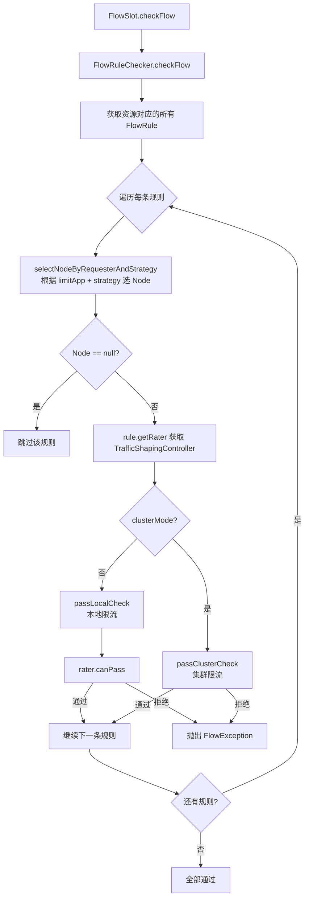
```mermaid
flowchart TD
    A[FlowSlot.checkFlow] --> B[FlowRuleChecker.checkFlow]
    B --> C[获取资源对应的所有 FlowRule]
    C --> D{遍历每条规则}
    D --> E[selectNodeByRequesterAndStrategy<br/>根据 limitApp + strategy 选 Node]
    E --> F{Node == null?}
    F -->|是| G[跳过该规则]
    F -->|否| H[rule.getRater 获取 TrafficShapingController]
    H --> I{clusterMode?}
    I -->|是| J[passClusterCheck<br/>集群限流]
    I -->|否| K[passLocalCheck<br/>本地限流]
    K --> L[rater.canPass]
    L -->|通过| M[继续下一条规则]
    L -->|拒绝| N[抛出 FlowException]
    J -->|通过| M
    J -->|拒绝| N
    M --> O{还有规则?}
    O -->|是| D
    O -->|否| P[全部通过]
```

### 六、降级策略 DegradeRule 与 CircuitBreaker

#### 6.1 DegradeRule 字段详解

```java
public class DegradeRule extends AbstractRule {
    private int grade = RuleConstant.DEGRADE_GRADE_RT;     // 降级策略
    private double count;                                    // 降级阈值
    private int timeWindow;                                  // 恢复超时时间（秒）
    private int minRequestAmount = RuleConstant.DEGRADE_DEFAULT_MIN_REQUEST_AMOUNT; // 最小请求数量
    private double slowRatioThreshold = 1.0d;                // 慢请求比例阈值
    private int statIntervalMs = 1000;                       // 统计间隔时长
}
```

| grade 值 | 降级策略 | count 含义 |
| --- | --- | --- |
| 0 (DEGRADE_GRADE_RT) | 慢调用比例 | 最大允许 RT（ms）|
| 1 (DEGRADE_GRADE_EXCEPTION_RATIO) | 异常比例 | 异常比例阈值（0.0-1.0）|
| 2 (DEGRADE_GRADE_EXCEPTION_COUNT) | 异常数 | 异常数量阈值 |

#### 6.2 熔断状态机

Sentinel 的熔断降级有三种状态，基于 `AbstractCircuitBreaker` 实现：

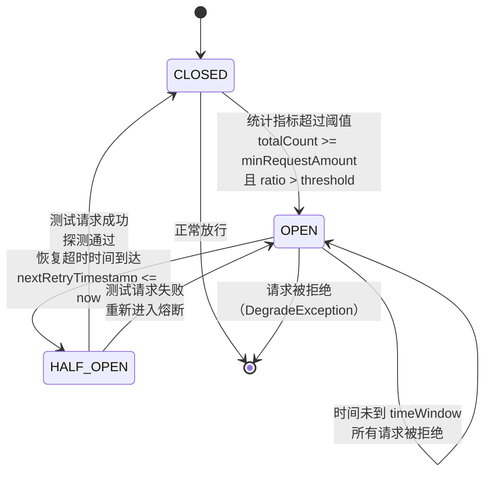
```mermaid
stateDiagram-v2
    [*] --> CLOSED
    CLOSED --> OPEN: 统计指标超过阈值<br/>totalCount >= minRequestAmount<br/>且 ratio > threshold
    OPEN --> OPEN: 时间未到 timeWindow<br/>所有请求被拒绝
    OPEN --> HALF_OPEN: 恢复超时时间到达<br/>nextRetryTimestamp <= now
    HALF_OPEN --> CLOSED: 测试请求成功<br/>探测通过
    HALF_OPEN --> OPEN: 测试请求失败<br/>重新进入熔断
    CLOSED --> [*]: 正常放行
    OPEN --> [*]: 请求被拒绝（DegradeException）
```

| 状态 | 说明 |
| --- | --- |
| **CLOSED** | 正常状态，所有请求都允许通过（需通过指标检查）|
| **OPEN** | 熔断状态，所有请求都被拒绝（抛 DegradeException）|
| **HALF_OPEN** | 半开状态，允许一个探测请求通过测试 |

#### 6.3 RT 降级策略（慢调用比例）- ResponseTimeCircuitBreaker

```java
public class ResponseTimeCircuitBreaker extends AbstractCircuitBreaker {
    @Override
    public void onRequestComplete(Context context) {
        SlowRequestCounter counter = slidingCounter.currentWindow().value();
        Entry entry = context.getCurEntry();
        long rt = entry.getCompleteTimestamp() - entry.getCreateTimestamp();
        // 慢调用计数
        if (rt > maxAllowedRt) {
            counter.slowCount.add(1);
        }
        counter.totalCount.add(1);
        handleStateChangeWhenThresholdExceeded(rt);
    }

    private void handleStateChangeWhenThresholdExceeded(long rt) {
        if (currentState.get() == State.OPEN) {
            return;
        }
        // 半开状态：根据探测结果转换
        if (currentState.get() == State.HALF_OPEN) {
            if (rt > maxAllowedRt) {
                fromHalfOpenToOpen(1.0d);
            } else {
                fromHalfOpenToClose();
            }
            return;
        }
        // 正常状态：聚合所有窗口，判断是否达到阈值
        List<SlowRequestCounter> counters = slidingCounter.values();
        long slowCount = 0;
        long totalCount = 0;
        for (SlowRequestCounter counter : counters) {
            slowCount += counter.slowCount.sum();
            totalCount += counter.totalCount.sum();
        }
        // 请求数不足，不触发
        if (totalCount < minRequestAmount) {
            return;
        }
        // 慢调用比例超过阈值，熔断
        double currentRatio = slowCount * 1.0d / totalCount;
        if (currentRatio > maxSlowRequestRatio) {
            transformToOpen(currentRatio);
        }
    }
}
```

#### 6.4 异常比例/数量降级 - ExceptionCircuitBreaker

```java
public class ExceptionCircuitBreaker extends AbstractCircuitBreaker {
    @Override
    public void onRequestComplete(Context context) {
        Entry entry = context.getCurEntry();
        Throwable error = entry.getError();
        SimpleErrorCounter counter = stat.currentWindow().value();
        if (error != null) {
            counter.getErrorCount().add(1);
        }
        counter.getTotalCount().add(1);
        handleStateChangeWhenThresholdExceeded(error);
    }

    private void handleStateChangeWhenThresholdExceeded(Throwable error) {
        if (currentState.get() == State.OPEN) {
            return;
        }
        if (currentState.get() == State.HALF_OPEN) {
            if (error == null) {
                fromHalfOpenToClose();
            } else {
                fromHalfOpenToOpen(1.0d);
            }
            return;
        }
        List<SimpleErrorCounter> counters = stat.values();
        long errCount = 0;
        long totalCount = 0;
        for (SimpleErrorCounter counter : counters) {
            errCount += counter.errorCount.sum();
            totalCount += counter.totalCount.sum();
        }
        if (totalCount < minRequestAmount) {
            return;
        }
        double curCount = errCount;
        if (strategy == DEGRADE_GRADE_EXCEPTION_RATIO) {
            curCount = errCount * 1.0d / totalCount;
        }
        if (curCount > threshold) {
            transformToOpen(curCount);
        }
    }
}
```

#### 6.5 tryPass 方法（半开探测）

```java
public abstract class AbstractCircuitBreaker implements CircuitBreaker {
    @Override
    public boolean tryPass(Context context) {
        if (currentState.get() == State.CLOSED) {
            return true;
        }
        if (currentState.get() == State.OPEN) {
            // 对于 OPEN 状态，检查是否到达恢复时间，若是则转换为 HALF_OPEN
            return retryTimeoutArrived() && fromOpenToHalfOpen(context);
        }
        return false;
    }

    protected boolean retryTimeoutArrived() {
        return TimeUtil.currentTimeMillis() >= nextRetryTimestamp;
    }
}
```

### 七、Context 与 Entry

#### 7.1 Context 的创建与管理

```java
public class ContextUtil {
    private static ThreadLocal<Context> contextThreadLocal = new ThreadLocal<>();

    public static Context enter(String name) {
        return trueEnter(name, "");
    }

    public static Context enter(String name, String origin) {
        return trueEnter(name, origin);
    }

    protected static Context trueEnter(String name, String origin) {
        Context context = contextThreadLocal.get();
        if (context == null) {
            context = new DefaultContext(name, origin);
            contextThreadLocal.set(context);
        } else {
            // 复用现有上下文
        }
        return context;
    }
}
```

- 每个线程有一个独立的上下文，通过 `ThreadLocal` 存储
- Context 包含调用来源（origin）、当前调用栈、附加属性等信息
- 相同的 Context 名称共享同一个 EntranceNode

#### 7.2 CtEntry 实现

```java
class CtEntry extends Entry {
    protected Entry parent = null;
    protected Entry child = null;
    protected ProcessorSlot<Object> chain;
    protected Context context;
    protected LinkedList<BiConsumer<Context, Entry>> exitHandlers;

    @Override
    public void exit(int count, Object... args) throws ErrorEntryFreeException {
        trueExit(count, args);
    }

    protected void exitForContext(Context context, int count, Object... args) throws ErrorEntryFreeError {
        if (chain != null) {
            chain.exit(context, resourceWrapper, count, args);
        }
        callExitHandlersAndCleanUp(context);
        context.setCurEntry(parent);
        if (parent != null) {
            ((CtEntry) parent).child = null;
        }
        clearEntryContext();
    }
}
```

- 维护调用栈的父子关系（`parent` / `child`）
- 触发 Slot 链的 exit 逻辑
- 支持退出回调处理器（`exitHandlers`）

#### 7.3 SphU.entry() 完整流程

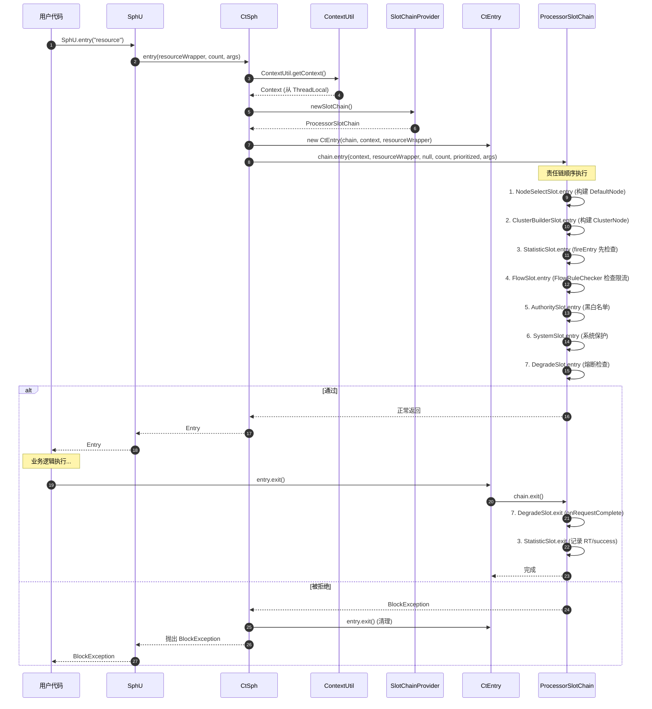
```mermaid
sequenceDiagram
    autonumber
    participant User as 用户代码
    participant SphU as SphU
    participant CtSph as CtSph
    participant Ctx as ContextUtil
    participant ChainProvider as SlotChainProvider
    participant Entry as CtEntry
    participant Chain as ProcessorSlotChain

    User->>SphU: SphU.entry("resource")
    SphU->>CtSph: entry(resourceWrapper, count, args)
    CtSph->>Ctx: ContextUtil.getContext()
    Ctx-->>CtSph: Context (从 ThreadLocal)
    CtSph->>ChainProvider: newSlotChain()
    ChainProvider-->>CtSph: ProcessorSlotChain
    CtSph->>Entry: new CtEntry(chain, context, resourceWrapper)
    CtSph->>Chain: chain.entry(context, resourceWrapper, null, count, prioritized, args)

    Note over Chain: 责任链顺序执行

    Chain->>Chain: 1. NodeSelectSlot.entry (构建 DefaultNode)
    Chain->>Chain: 2. ClusterBuilderSlot.entry (构建 ClusterNode)
    Chain->>Chain: 3. StatisticSlot.entry (fireEntry 先检查)
    Chain->>Chain: 4. FlowSlot.entry (FlowRuleChecker 检查限流)
    Chain->>Chain: 5. AuthoritySlot.entry (黑白名单)
    Chain->>Chain: 6. SystemSlot.entry (系统保护)
    Chain->>Chain: 7. DegradeSlot.entry (熔断检查)

    alt 通过
        Chain-->>CtSph: 正常返回
        CtSph-->>SphU: Entry
        SphU-->>User: Entry
        Note over User: 业务逻辑执行...
        User->>Entry: entry.exit()
        Entry->>Chain: chain.exit()
        Chain->>Chain: 7. DegradeSlot.exit (onRequestComplete)
        Chain->>Chain: 3. StatisticSlot.exit (记录 RT/success)
        Chain-->>Entry: 完成
    else 被拒绝
        Chain-->>CtSph: BlockException
        CtSph->>Entry: entry.exit() (清理)
        CtSph-->>SphU: 抛出 BlockException
        SphU-->>User: BlockException
    end
```

### 八、Slot Chain 设计总结

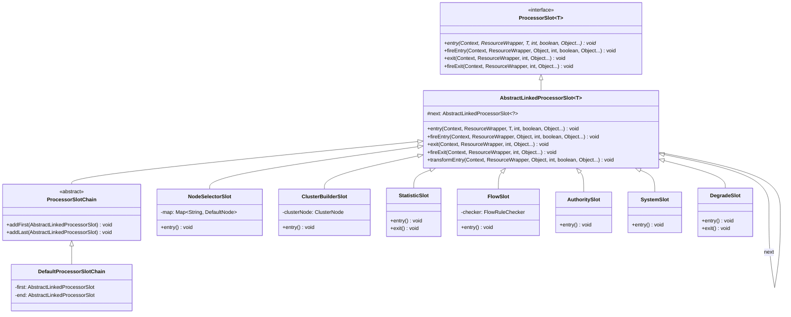
```mermaid
classDiagram
    class ProcessorSlot~T~ {
        <<interface>>
        +entry(Context, ResourceWrapper, T, int, boolean, Object...)* void
        +fireEntry(Context, ResourceWrapper, Object, int, boolean, Object...) void
        +exit(Context, ResourceWrapper, int, Object...) void
        +fireExit(Context, ResourceWrapper, int, Object...) void
    }

    class AbstractLinkedProcessorSlot~T~ {
        #next: AbstractLinkedProcessorSlot~?~
        +entry(Context, ResourceWrapper, T, int, boolean, Object...) void
        +fireEntry(Context, ResourceWrapper, Object, int, boolean, Object...) void
        +exit(Context, ResourceWrapper, int, Object...) void
        +fireExit(Context, ResourceWrapper, int, Object...) void
        +transformEntry(Context, ResourceWrapper, Object, int, boolean, Object...) void
    }

    class ProcessorSlotChain {
        <<abstract>>
        +addFirst(AbstractLinkedProcessorSlot) void
        +addLast(AbstractLinkedProcessorSlot) void
    }

    class DefaultProcessorSlotChain {
        -first: AbstractLinkedProcessorSlot
        -end: AbstractLinkedProcessorSlot
    }

    class NodeSelectorSlot {
        -map: Map~String, DefaultNode~
        +entry() void
    }

    class ClusterBuilderSlot {
        -clusterNode: ClusterNode
        +entry() void
    }

    class StatisticSlot {
        +entry() void
        +exit() void
    }

    class FlowSlot {
        -checker: FlowRuleChecker
        +entry() void
    }

    class AuthoritySlot {
        +entry() void
    }

    class SystemSlot {
        +entry() void
    }

    class DegradeSlot {
        +entry() void
        +exit() void
    }

    ProcessorSlot <|-- AbstractLinkedProcessorSlot
    AbstractLinkedProcessorSlot <|-- ProcessorSlotChain
    ProcessorSlotChain <|-- DefaultProcessorSlotChain
    AbstractLinkedProcessorSlot <|-- NodeSelectorSlot
    AbstractLinkedProcessorSlot <|-- ClusterBuilderSlot
    AbstractLinkedProcessorSlot <|-- StatisticSlot
    AbstractLinkedProcessorSlot <|-- FlowSlot
    AbstractLinkedProcessorSlot <|-- AuthoritySlot
    AbstractLinkedProcessorSlot <|-- SystemSlot
    AbstractLinkedProcessorSlot <|-- DegradeSlot
    AbstractLinkedProcessorSlot <|-- AbstractLinkedProcessorSlot : next
```

Sentinel 通过 Slot Chain 机制实现了流量控制和熔断降级功能的模块化和可扩展性。每个 Slot 专注于一个特定的功能，通过组合不同的 Slot 可以实现复杂的流量治理策略。

核心特性总结：

1. **责任链模式**：通过 SlotChain 将各个功能模块解耦，提高扩展性，每个 Slot 通过 `fireEntry` 触发下一个 Slot
2. **SPI 扩展机制**：通过 `@Spi` 注解的 `order` 值控制 Slot 执行顺序，支持自定义 Slot 注入链中
3. **多样化的限流算法**：支持快速失败（计数）、匀速排队（漏桶）、预热（令牌桶）、预热+匀速四种策略
4. **灵活的降级策略**：支持慢调用比例、异常比例、异常数三种熔断策略，基于 CircuitBreaker 状态机实现
5. **细粒度的统计信息**：通过 Node 体系支持按资源、按来源、按入口类型的多维度统计
6. **完善的上下文管理**：通过 Context（ThreadLocal）和 Entry（父子链）维护调用状态和生命周期
7. **tryPass 与 onRequestComplete 双阶段**：entry 阶段检查熔断状态，exit 阶段更新熔断状态

这种设计使得 Sentinel 能够高效地处理各种复杂的流量控制场景，同时保持良好的扩展性和灵活性。


---

## 第四章 动态数据源实现

### 一、核心接口和抽象类

#### 1.1 ReadableDataSource接口
**文件路径**：`sentinel-extension/sentinel-datasource-extension/src/main/java/com/alibaba/csp/sentinel/datasource/ReadableDataSource.java`

```java
/*
 * Copyright 1999-2018 Alibaba Group Holding Ltd.
 *
 * Licensed under the Apache License, Version 2.0 (the "License");
 * you may not use this file except in compliance with the License.
 * You may obtain a copy of the License at
 *
 *      http://www.apache.org/licenses/LICENSE-2.0
 *
 * Unless required by applicable law or agreed to in writing, software
 * distributed under the License is distributed on an "AS IS" BASIS,
 * WITHOUT WARRANTIES OR CONDITIONS OF ANY KIND, either express or implied.
 * See the License for the specific language governing permissions and
 * limitations under the License.
 */
package com.alibaba.csp.sentinel.datasource;

import com.alibaba.csp.sentinel.property.SentinelProperty;

/**
 * The readable data source is responsible for retrieving configs (read-only).
 *
 * @param <S> source data type
 * @param <T> target data type
 * @author leyou
 * @author Eric Zhao
 */
public interface ReadableDataSource<S, T> {

    /**
     * Load data data source as the target type.
     *
     * @return the target data.
     * @throws Exception IO or other error occurs
     */
    T loadConfig() throws Exception;

    /**
     * Read original data from the data source.
     *
     * @return the original data.
     * @throws Exception IO or other error occurs
     */
    S readSource() throws Exception;

    /**
     * Get {@link SentinelProperty} of the data source.
     *
     * @return the property.
     */
    SentinelProperty<T> getProperty();

    /**
     * Close the data source.
     *
     * @throws Exception IO or other error occurs
     */
    void close() throws Exception;
}
```

**方法分析**：
1.  **`T loadConfig() throws Exception`**：加载并转换配置为目标类型，内部会先调用`readSource()`获取原始数据，再通过转换器转换为规则对象
2.  **`S readSource() throws Exception`**：从数据源读取原始数据（未经过转换器处理）
3.  **`SentinelProperty<T> getProperty()`**：获取与数据源绑定的SentinelProperty对象，用于监听配置变更
4.  **`void close() throws Exception`**：关闭数据源并释放资源

#### 1.2 WritableDataSource接口
**文件路径**：`sentinel-extension/sentinel-datasource-extension/src/main/java/com/alibaba/csp/sentinel/datasource/WritableDataSource.java`

```java
/*
 * Copyright 1999-2018 Alibaba Group Holding Ltd.
 *
 * Licensed under the Apache License, Version 2.0 (the "License");
 * you may not use this file except in compliance with the License.
 * You may obtain a copy of the License at
 *
 *      http://www.apache.org/licenses/LICENSE-2.0
 *
 * Unless required by applicable law or agreed to in writing, software
 * distributed under the License is distributed on an "AS IS" BASIS,
 * WITHOUT WARRANTIES OR CONDITIONS OF ANY KIND, either express or implied.
 * See the License for the specific language governing permissions and
 * limitations under the License.
 */
package com.alibaba.csp.sentinel.datasource;

/**
 * Interface of writable data source support.
 *
 * @author Eric Zhao
 * @since 0.2.0
 */
public interface WritableDataSource<T> {

    /**
     * Write the {@code value} to the data source.
     *
     * @param value value to write
     * @throws Exception IO or other error occurs
     */
    void write(T value) throws Exception;

    /**
     * Close the data source.
     *
     * @throws Exception IO or other error occurs
     */
    void close() throws Exception;
}
```

**方法分析**：
1.  **`void write(T value) throws Exception`**：将规则对象写入到数据源
2.  **`void close() throws Exception`**：关闭数据源并释放资源

#### 1.3 AbstractDataSource抽象类
**文件路径**：`sentinel-extension/sentinel-datasource-extension/src/main/java/com/alibaba/csp/sentinel/datasource/AbstractDataSource.java`

```java
/*
 * Copyright 1999-2018 Alibaba Group Holding Ltd.
 *
 * Licensed under the Apache License, Version 2.0 (the "License");
 * you may not use this file except in compliance with the License.
 * You may obtain a copy of the License at
 *
 *      http://www.apache.org/licenses/LICENSE-2.0
 *
 * Unless required by applicable law or agreed to in writing, software
 * distributed under the License is distributed on an "AS IS" BASIS,
 * WITHOUT WARRANTIES OR CONDITIONS OF ANY KIND, either express or implied.
 * See the License for the specific language governing permissions and
 * limitations under the License.
 */
package com.alibaba.csp.sentinel.datasource;

import com.alibaba.csp.sentinel.property.DynamicSentinelProperty;
import com.alibaba.csp.sentinel.property.SentinelProperty;

/**
 * The abstract readable data source provides basic functionality for loading and parsing config.
 *
 * @param <S> source data type
 * @param <T> target data type
 * @author Carpenter Lee
 * @author Eric Zhao
 */
public abstract class AbstractDataSource<S, T> implements ReadableDataSource<S, T> {

    protected final Converter<S, T> parser;
    protected final SentinelProperty<T> property;

    public AbstractDataSource(Converter<S, T> parser) {
        if (parser == null) {
            throw new IllegalArgumentException("parser can't be null");
        }
        this.parser = parser;
        this.property = new DynamicSentinelProperty<T>();
    }

    @Override
    public T loadConfig() throws Exception {
        return loadConfig(readSource());
    }

    public T loadConfig(S conf) throws Exception {
        T value = parser.convert(conf);
        return value;
    }

    @Override
    public SentinelProperty<T> getProperty() {
        return property;
    }
}
```

**核心分析**：
1.  **`Converter<S, T> parser`**：转换器字段，用于将原始数据源类型S转换为目标规则类型T
2.  **`SentinelProperty<T> property`**：属性对象，用于管理配置变更和监听器
3.  **构造函数**：接收一个转换器参数，初始化转换器和SentinelProperty
4.  **`loadConfig()`**：无参版本，先调用`readSource()`获取原始数据，再调用带参`loadConfig(S conf)`进行转换
5.  **`loadConfig(S conf)`**：带参版本，直接使用传入的原始数据通过转换器转换为目标类型
6.  **`getProperty()`**：返回SentinelProperty对象，供外部注册监听器

#### 1.4 AutoRefreshDataSource抽象类
**文件路径**：`sentinel-extension/sentinel-datasource-extension/src/main/java/com/alibaba/csp/sentinel/datasource/AutoRefreshDataSource.java`

```java
/*
 * Copyright 1999-2018 Alibaba Group Holding Ltd.
 *
 * Licensed under the Apache License, Version 2.0 (the "License");
 * you may not use this file except in compliance with the License.
 * You may obtain a copy of the License at
 *
 *      http://www.apache.org/licenses/LICENSE-2.0
 *
 * Unless required by applicable law or agreed to in writing, software
 * distributed under the License is distributed on an "AS IS" BASIS,
 * WITHOUT WARRANTIES OR CONDITIONS OF ANY KIND, either express or implied.
 * See the License for the specific language governing permissions and
 * limitations under the License.
 */
package com.alibaba.csp.sentinel.datasource;

import java.util.concurrent.Executors;
import java.util.concurrent.ScheduledExecutorService;
import java.util.concurrent.TimeUnit;

import com.alibaba.csp.sentinel.concurrent.NamedThreadFactory;
import com.alibaba.csp.sentinel.log.RecordLog;

/**
 * A {@link ReadableDataSource} automatically fetches the backend data.
 *
 * @param <S> source data type
 * @param <T> target data type
 * @author Carpenter Lee
 */
public abstract class AutoRefreshDataSource<S, T> extends AbstractDataSource<S, T> {

    private ScheduledExecutorService service;
    protected long recommendRefreshMs = 3000;

    public AutoRefreshDataSource(Converter<S, T> configParser) {
        super(configParser);
        startTimerService();
    }

    public AutoRefreshDataSource(Converter<S, T> configParser, final long recommendRefreshMs) {
        super(configParser);
        if (recommendRefreshMs <= 0) {
            throw new IllegalArgumentException("recommendRefreshMs must > 0, but " + recommendRefreshMs + " get");
        }
        this.recommendRefreshMs = recommendRefreshMs;
        startTimerService();
    }

    @SuppressWarnings("PMD.ThreadPoolCreationRule")
    private void startTimerService() {
        service = Executors.newScheduledThreadPool(1,
            new NamedThreadFactory("sentinel-datasource-auto-refresh-task", true));
        service.scheduleAtFixedRate(new Runnable() {
            @Override
            public void run() {
                try {
                    if (!isModified()) {
                        return;
                    }
                    T newValue = loadConfig();
                    getProperty().updateValue(newValue);
                } catch (Throwable e) {
                    RecordLog.info("loadConfig exception", e);
                }
            }
        }, recommendRefreshMs, recommendRefreshMs, TimeUnit.MILLISECONDS);
    }

    @Override
    public void close() throws Exception {
        if (service != null) {
            service.shutdownNow();
            service = null;
        }
    }

    protected boolean isModified() {
        return true;
    }
}
```

**核心分析**：
1.  **`ScheduledExecutorService service`**：定时任务执行线程池
2.  **`long recommendRefreshMs`**：默认刷新间隔，默认为3000毫秒（3秒）
3.  **构造函数**：
    - 单参数构造函数：使用默认刷新间隔启动定时任务
    - 双参数构造函数：自定义刷新间隔并启动定时任务
4.  **`startTimerService()`**：
    - 创建单线程定时线程池，线程名为`sentinel-datasource-auto-refresh-task`
    - 使用`scheduleAtFixedRate`以固定频率执行刷新任务
5.  **刷新任务逻辑**：
    1.  调用`isModified()`检查数据源是否被修改
    2.  如果数据源已修改，调用`loadConfig()`加载并转换配置
    3.  通过`getProperty().updateValue(newValue)`更新配置并通知所有监听器
6.  **`isModified()`**：默认实现总是返回true，子类需要重写此方法以实现具体的修改检测逻辑
7.  **`close()`**：关闭定时任务线程池

**初次加载和定时加载的差异**：
- **初次加载**：在构造函数中通过调用`firstLoad()`方法（如FileRefreshableDataSource）或在数据源初始化时直接加载一次配置
- **定时加载**：通过定时任务周期性地检查数据源是否修改，并在修改时重新加载配置

### 二、文件数据源FileRefreshableDataSource

#### 2.1 完整实现
**文件路径**：`sentinel-extension/sentinel-datasource-extension/src/main/java/com/alibaba/csp/sentinel/datasource/FileRefreshableDataSource.java`

```java
/*
 * Copyright 1999-2018 Alibaba Group Holding Ltd.
 *
 * Licensed under the Apache License, Version 2.0 (the "License");
 * you may not use this file except in compliance with the License.
 * You may obtain a copy of the License at
 *
 *      http://www.apache.org/licenses/LICENSE-2.0
 *
 * Unless required by applicable law or agreed to in writing, software
 * distributed under the License is distributed on an "AS IS" BASIS,
 * WITHOUT WARRANTIES OR CONDITIONS OF ANY KIND, either express or implied.
 * See the License for the specific language governing permissions and
 * limitations under the License.
 */
package com.alibaba.csp.sentinel.datasource;

import java.io.File;
import java.io.FileInputStream;
import java.io.FileNotFoundException;
import java.nio.channels.FileChannel;
import java.nio.charset.Charset;

import com.alibaba.csp.sentinel.log.RecordLog;

/**
 * <p>
 * A {@link ReadableDataSource} based on file. This class will automatically
 * fetches the backend file every isModified period.
 * </p>
 * <p>
 * Limitations: Default read buffer size is 1 MB. If file size is greater than
 * buffer size, exceeding bytes will be ignored. Default charset is UTF-8.
 * </p>
 *
 * @author Carpenter Lee
 * @author Eric Zhao
 */
public class FileRefreshableDataSource<T> extends AutoRefreshDataSource<String, T> {

    private static final int MAX_SIZE = 1024 * 1024 * 4;
    private static final long DEFAULT_REFRESH_MS = 3000;
    private static final int DEFAULT_BUF_SIZE = 1024 * 1024;
    private static final Charset DEFAULT_CHAR_SET = Charset.forName("utf-8");

    private byte[] buf;
    private final Charset charset;
    private final File file;

    private long lastModified = 0L;

    /**
     * Create a file based {@link ReadableDataSource} whose read buffer size is
     * 1MB, charset is UTF8, and read interval is 3 seconds.
     *
     * @param file         the file to read
     * @param configParser the config decoder (parser)
     */
    public FileRefreshableDataSource(File file, Converter<String, T> configParser) throws FileNotFoundException {
        this(file, configParser, DEFAULT_REFRESH_MS, DEFAULT_BUF_SIZE, DEFAULT_CHAR_SET);
    }

    public FileRefreshableDataSource(String fileName, Converter<String, T> configParser) throws FileNotFoundException {
        this(new File(fileName), configParser, DEFAULT_REFRESH_MS, DEFAULT_BUF_SIZE, DEFAULT_CHAR_SET);
    }

    public FileRefreshableDataSource(File file, Converter<String, T> configParser, int bufSize)
        throws FileNotFoundException {
        this(file, configParser, DEFAULT_REFRESH_MS, bufSize, DEFAULT_CHAR_SET);
    }

    public FileRefreshableDataSource(File file, Converter<String, T> configParser, Charset charset)
        throws FileNotFoundException {
        this(file, configParser, DEFAULT_REFRESH_MS, DEFAULT_BUF_SIZE, charset);
    }

    public FileRefreshableDataSource(File file, Converter<String, T> configParser, long recommendRefreshMs, int bufSize,
                                     Charset charset) throws FileNotFoundException {
        super(configParser, recommendRefreshMs);
        if (bufSize <= 0 || bufSize > MAX_SIZE) {
            throw new IllegalArgumentException("bufSize must between (0, " + MAX_SIZE + "], but " + bufSize + " get");
        }
        if (file == null || file.isDirectory()) {
            throw new IllegalArgumentException("File can't be null or a directory");
        }
        if (charset == null) {
            throw new IllegalArgumentException("charset can't be null");
        }
        this.buf = new byte[bufSize];
        this.file = file;
        this.charset = charset;
        // If the file does not exist, the last modified will be 0.
        this.lastModified = file.lastModified();
        firstLoad();
    }

    private void firstLoad() {
        try {
            T newValue = loadConfig();
            getProperty().updateValue(newValue);
        } catch (Throwable e) {
            RecordLog.info("loadConfig exception", e);
        }
    }

    @Override
    public String readSource() throws Exception {
        if (!file.exists()) {
            // Will throw FileNotFoundException later.
            RecordLog.warn(String.format("[FileRefreshableDataSource] File does not exist: %s", file.getAbsolutePath()));
        }
        FileInputStream inputStream = null;
        try {
            inputStream = new FileInputStream(file);
            FileChannel channel = inputStream.getChannel();
            if (channel.size() > buf.length) {
                throw new IllegalStateException(file.getAbsolutePath() + " file size=" + channel.size()
                    + ", is bigger than bufSize=" + buf.length + ". Can't read");
            }
            int len = inputStream.read(buf);
            return new String(buf, 0, len, charset);
        } finally {
            if (inputStream != null) {
                try {
                    inputStream.close();
                } catch (Exception ignore) {
                }
            }
        }
    }

    @Override
    protected boolean isModified() {
        long curLastModified = file.lastModified();
        if (curLastModified != this.lastModified) {
            this.lastModified = curLastModified;
            return true;
        }
        return false;
    }

    @Override
    public void close() throws Exception {
        super.close();
        buf = null;
    }
}
```

**核心分析**：
1.  **常量定义**：
    - `MAX_SIZE`：最大文件大小限制，4MB
    - `DEFAULT_REFRESH_MS`：默认刷新间隔，3000毫秒
    - `DEFAULT_BUF_SIZE`：默认缓冲区大小，1MB
    - `DEFAULT_CHAR_SET`：默认字符集，UTF-8
2.  **字段定义**：
    - `byte[] buf`：读取文件的缓冲区
    - `Charset charset`：文件编码字符集
    - `File file`：要读取的文件对象
    - `long lastModified`：上次记录的文件最后修改时间戳
3.  **构造函数重载**：提供多种参数组合的构造函数，方便用户使用
4.  **`firstLoad()`**：初次加载配置，在构造函数末尾调用，完成初始规则加载
5.  **`readSource()`**：
    - 检查文件是否存在
    - 使用FileInputStream和FileChannel读取文件内容
    - 检查文件大小是否超过缓冲区限制
    - 将读取的字节转换为字符串返回
6.  **`isModified()`**：重写父类方法，通过比较文件的最后修改时间戳来判断文件是否被修改
7.  **`close()`**：关闭父类的定时任务线程池，并释放缓冲区

**文件监听机制**：
FileRefreshableDataSource使用**轮询方式**检测文件变更，而不是Java NIO的Watch Service。每次定时任务执行时，都会调用`file.lastModified()`获取当前文件的最后修改时间，并与上次记录的时间戳比较。如果不同，则认为文件已修改，重新加载配置。

**文件修改检测**：
通过比较文件的`lastModified`时间戳来检测文件是否被修改，这是一种简单且高效的检测方式。

**缓存md5避免重复加载**：
在FileRefreshableDataSource的实现中，并没有使用md5缓存，而是通过比较`lastModified`时间戳来避免重复加载。只有当文件的最后修改时间发生变化时，才会重新加载文件内容。

**FirstLoaderListener机制**：
在构造函数的末尾调用了`firstLoad()`方法，该方法会调用`loadConfig()`加载初始配置，并通过`getProperty().updateValue(newValue)`更新规则，完成初始规则加载。

#### 2.2 文件数据源时序图

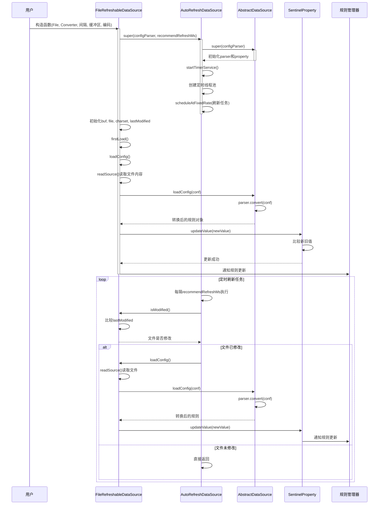
```mermaid
sequenceDiagram
    participant User as 用户
    participant FileRefreshableDataSource
    participant AutoRefreshDataSource
    participant AbstractDataSource
    participant SentinelProperty
    participant RuleManager as 规则管理器
    
    User->>FileRefreshableDataSource: 构造函数(File, Converter, 间隔, 缓冲区, 编码)
    activate FileRefreshableDataSource
    FileRefreshableDataSource->>AutoRefreshDataSource: super(configParser, recommendRefreshMs)
    activate AutoRefreshDataSource
    AutoRefreshDataSource->>AbstractDataSource: super(configParser)
    activate AbstractDataSource
    AbstractDataSource-->>AutoRefreshDataSource: 初始化parser和property
    deactivate AbstractDataSource
    AutoRefreshDataSource->>AutoRefreshDataSource: startTimerService()
    AutoRefreshDataSource->>AutoRefreshDataSource: 创建定时线程池
    AutoRefreshDataSource->>AutoRefreshDataSource: scheduleAtFixedRate(刷新任务)
    deactivate AutoRefreshDataSource
    FileRefreshableDataSource->>FileRefreshableDataSource: 初始化buf, file, charset, lastModified
    FileRefreshableDataSource->>FileRefreshableDataSource: firstLoad()
    FileRefreshableDataSource->>FileRefreshableDataSource: loadConfig()
    FileRefreshableDataSource->>FileRefreshableDataSource: readSource()读取文件内容
    FileRefreshableDataSource->>AbstractDataSource: loadConfig(conf)
    AbstractDataSource->>AbstractDataSource: parser.convert(conf)
    AbstractDataSource-->>FileRefreshableDataSource: 转换后的规则对象
    FileRefreshableDataSource->>SentinelProperty: updateValue(newValue)
    SentinelProperty->>SentinelProperty: 比较新旧值
    SentinelProperty-->>FileRefreshableDataSource: 更新成功
    FileRefreshableDataSource->>RuleManager: 通知规则更新
    deactivate FileRefreshableDataSource
    
    loop 定时刷新任务
        AutoRefreshDataSource->>AutoRefreshDataSource: 每隔recommendRefreshMs执行
        AutoRefreshDataSource->>FileRefreshableDataSource: isModified()
        FileRefreshableDataSource->>FileRefreshableDataSource: 比较lastModified
        FileRefreshableDataSource-->>AutoRefreshDataSource: 文件是否修改
        alt 文件已修改
            AutoRefreshDataSource->>FileRefreshableDataSource: loadConfig()
            FileRefreshableDataSource->>FileRefreshableDataSource: readSource()读取文件
            FileRefreshableDataSource->>AbstractDataSource: loadConfig(conf)
            AbstractDataSource->>AbstractDataSource: parser.convert(conf)
            AbstractDataSource-->>FileRefreshableDataSource: 转换后的规则
            FileRefreshableDataSource->>SentinelProperty: updateValue(newValue)
            SentinelProperty->>RuleManager: 通知规则更新
        else 文件未修改
            AutoRefreshDataSource->>AutoRefreshDataSource: 直接返回
        end
    end
```

### 三、Nacos数据源

#### 3.1 NacosDataSource实现
**文件路径**：`sentinel-extension/sentinel-datasource-nacos/src/main/java/com/alibaba/csp/sentinel/datasource/nacos/NacosDataSource.java`

```java
/*
 * Copyright 1999-2018 Alibaba Group Holding Ltd.
 *
 * Licensed under the Apache License, Version 2.0 (the "License");
 * you may not use this file except in compliance with the License.
 * You may obtain a copy of the License at
 *
 *      http://www.apache.org/licenses/LICENSE-2.0
 *
 * Unless required by applicable law or agreed to in writing, software
 * distributed under the License is distributed on an "AS IS" BASIS,
 * WITHOUT WARRANTIES OR CONDITIONS OF ANY KIND, either express or implied.
 * See the License for the specific language governing permissions and
 * limitations under the License.
 */
package com.alibaba.csp.sentinel.datasource.nacos;

import java.util.Properties;
import java.util.concurrent.ArrayBlockingQueue;
import java.util.concurrent.Executor;
import java.util.concurrent.ExecutorService;
import java.util.concurrent.ThreadPoolExecutor;
import java.util.concurrent.TimeUnit;

import com.alibaba.csp.sentinel.concurrent.NamedThreadFactory;
import com.alibaba.csp.sentinel.datasource.AbstractDataSource;
import com.alibaba.csp.sentinel.datasource.Converter;
import com.alibaba.csp.sentinel.log.RecordLog;
import com.alibaba.csp.sentinel.util.AssertUtil;
import com.alibaba.csp.sentinel.util.StringUtil;
import com.alibaba.nacos.api.NacosFactory;
import com.alibaba.nacos.api.PropertyKeyConst;
import com.alibaba.nacos.api.config.ConfigService;
import com.alibaba.nacos.api.config.listener.Listener;

/**
 * A read-only {@code DataSource} with Nacos backend. When the data in Nacos backend has been modified,
 * Nacos will automatically push the new value so that the dynamic configuration can be real-time.
 *
 * @author Eric Zhao
 */
public class NacosDataSource<T> extends AbstractDataSource<String, T> {

    private static final int DEFAULT_TIMEOUT = 3000;

    /**
     * Single-thread pool. Once the thread pool is blocked, we throw up the old task.
     */
    private final ExecutorService pool = new ThreadPoolExecutor(1, 1, 0, TimeUnit.MILLISECONDS,
        new ArrayBlockingQueue<Runnable>(1), new NamedThreadFactory("sentinel-nacos-ds-update", true),
        new ThreadPoolExecutor.DiscardOldestPolicy());

    private final Listener configListener;
    private final String groupId;
    private final String dataId;
    private final Properties properties;

    /**
     * Note: The Nacos config might be null if its initialization failed.
     */
    private ConfigService configService = null;

    /**
     * Constructs an read-only DataSource with Nacos backend.
     *
     * @param serverAddr server address of Nacos, cannot be empty
     * @param groupId    group ID, cannot be empty
     * @param dataId     data ID, cannot be empty
     * @param parser     customized data parser, cannot be empty
     */
    public NacosDataSource(final String serverAddr, final String groupId, final String dataId,
                           Converter<String, T> parser) {
        this(NacosDataSource.buildProperties(serverAddr), groupId, dataId, parser);
    }

    /**
     *
     * @param properties properties for construct {@link ConfigService} using {@link NacosFactory#createConfigService(Properties)}
     * @param groupId    group ID, cannot be empty
     * @param dataId     data ID, cannot be empty
     * @param parser     customized data parser, cannot be empty
     */
    public NacosDataSource(final Properties properties, final String groupId, final String dataId,
                           Converter<String, T> parser) {
        super(parser);
        if (StringUtil.isBlank(groupId) || StringUtil.isBlank(dataId)) {
            throw new IllegalArgumentException(String.format("Bad argument: groupId=[%s], dataId=[%s]",
                groupId, dataId));
        }
        AssertUtil.notNull(properties, "Nacos properties must not be null, you could put some keys from PropertyKeyConst");
        this.groupId = groupId;
        this.dataId = dataId;
        this.properties = properties;
        this.configListener = new Listener() {
            @Override
            public Executor getExecutor() {
                return pool;
            }

            @Override
            public void receiveConfigInfo(final String configInfo) {
                RecordLog.info("[NacosDataSource] New property value received for (properties: {}) (dataId: {}, groupId: {}): {}",
                    properties, dataId, groupId, configInfo);
                T newValue = NacosDataSource.this.parser.convert(configInfo);
                // Update the new value to the property.
                getProperty().updateValue(newValue);
            }
        };
        initNacosListener();
        loadInitialConfig();
    }

    private void loadInitialConfig() {
        try {
            T newValue = loadConfig();
            if (newValue == null) {
                RecordLog.warn("[NacosDataSource] WARN: initial config is null, you may have to check your data source");
            }
            getProperty().updateValue(newValue);
        } catch (Exception ex) {
            RecordLog.warn("[NacosDataSource] Error when loading initial config", ex);
        }
    }

    private void initNacosListener() {
        try {
            this.configService = NacosFactory.createConfigService(this.properties);
            // Add config listener.
            configService.addListener(dataId, groupId, configListener);
        } catch (Exception e) {
            RecordLog.warn("[NacosDataSource] Error occurred when initializing Nacos data source", e);
            e.printStackTrace();
        }
    }

    @Override
    public String readSource() throws Exception {
        if (configService == null) {
            throw new IllegalStateException("Nacos config service has not been initialized or error occurred");
        }
        return configService.getConfig(dataId, groupId, DEFAULT_TIMEOUT);
    }

    @Override
    public void close() {
        if (configService != null) {
            configService.removeListener(dataId, groupId, configListener);
            try {
                configService.shutDown();
            } catch (Exception e) {
                RecordLog.warn("[NacosDataSource] Error occurred when closing Nacos data source", e);
                e.printStackTrace();
            }
        }
        pool.shutdownNow();
    }

    private static Properties buildProperties(String serverAddr) {
        Properties properties = new Properties();
        properties.setProperty(PropertyKeyConst.SERVER_ADDR, serverAddr);
        return properties;
    }
}
```

**核心分析**：
1.  **常量定义**：`DEFAULT_TIMEOUT`：默认超时时间，3000毫秒
2.  **线程池**：创建了一个单线程线程池，用于处理Nacos配置变更通知，拒绝策略为DiscardOldestPolicy
3.  **字段定义**：
    - `Listener configListener`：Nacos配置变更监听器
    - `String groupId`：Nacos配置分组ID
    - `String dataId`：Nacos配置数据ID
    - `Properties properties`：Nacos连接配置属性
    - `ConfigService configService`：Nacos配置服务实例
4.  **构造函数**：
    - 单参数构造函数：通过serverAddr构建Nacos连接属性，调用双参数构造函数
    - 双参数构造函数：初始化groupId、dataId、parser，创建配置监听器，初始化Nacos监听器，加载初始配置
5.  **`loadInitialConfig()`**：加载初始配置，在构造函数末尾调用
6.  **`initNacosListener()`**：
    - 通过NacosFactory创建ConfigService实例
    - 为指定的dataId和groupId添加配置监听器
7.  **`readSource()`**：从Nacos服务器读取配置内容
8.  **`close()`**：移除配置监听器，关闭ConfigService，关闭线程池

**Nacos配置服务初始化**：
通过`NacosFactory.createConfigService(this.properties)`创建ConfigService实例，该实例会与Nacos服务器建立连接。

**Listener机制**：
通过`configService.addListener(dataId, groupId, configListener)`为指定的Nacos配置添加监听器。当Nacos配置发生变化时，Nacos服务器会主动推送配置变更通知到客户端，客户端调用`receiveConfigInfo`方法处理配置变更。

**如何从Nacos读取配置**：
通过`configService.getConfig(dataId, groupId, DEFAULT_TIMEOUT)`方法从Nacos服务器读取配置内容，该方法会阻塞直到获取到配置或超时。

**initNacosListener方法**：
该方法负责初始化Nacos配置服务和添加配置监听器，是Nacos数据源的核心初始化方法。

#### 3.2 Nacos数据源时序图

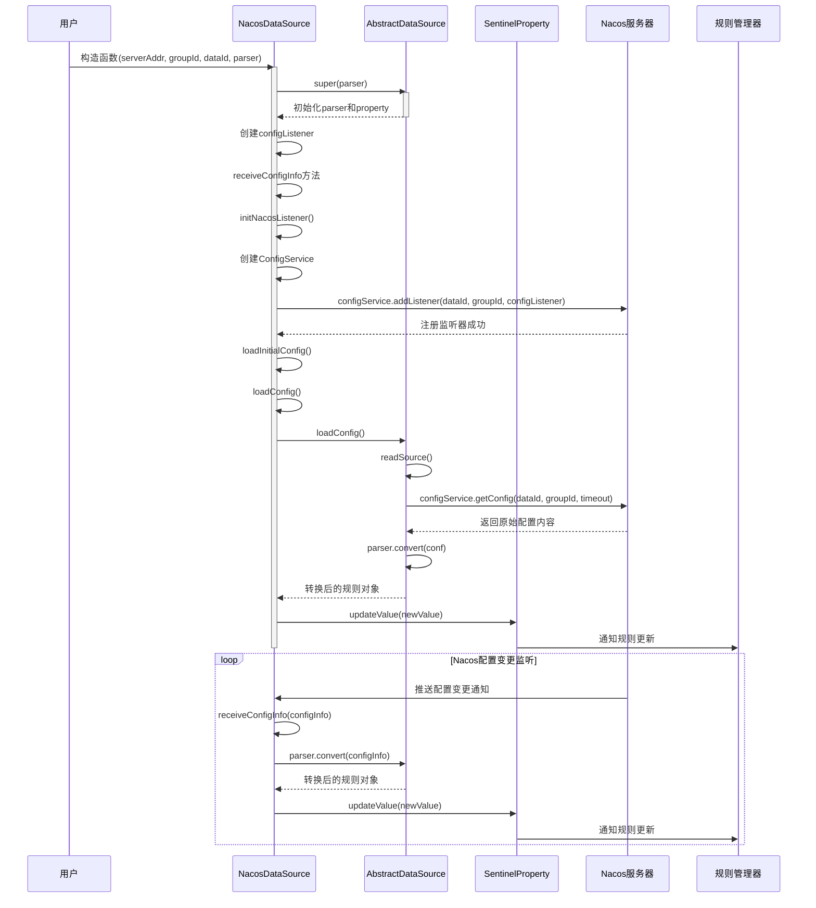
```mermaid
sequenceDiagram
    participant User as 用户
    participant NacosDataSource
    participant AbstractDataSource
    participant SentinelProperty
    participant NacosServer as Nacos服务器
    participant RuleManager as 规则管理器
    
    User->>NacosDataSource: 构造函数(serverAddr, groupId, dataId, parser)
    activate NacosDataSource
    NacosDataSource->>AbstractDataSource: super(parser)
    activate AbstractDataSource
    AbstractDataSource-->>NacosDataSource: 初始化parser和property
    deactivate AbstractDataSource
    NacosDataSource->>NacosDataSource: 创建configListener
    NacosDataSource->>NacosDataSource: receiveConfigInfo方法
    NacosDataSource->>NacosDataSource: initNacosListener()
    NacosDataSource->>NacosDataSource: 创建ConfigService
    NacosDataSource->>NacosServer: configService.addListener(dataId, groupId, configListener)
    NacosServer-->>NacosDataSource: 注册监听器成功
    NacosDataSource->>NacosDataSource: loadInitialConfig()
    NacosDataSource->>NacosDataSource: loadConfig()
    NacosDataSource->>AbstractDataSource: loadConfig()
    AbstractDataSource->>AbstractDataSource: readSource()
    AbstractDataSource->>NacosServer: configService.getConfig(dataId, groupId, timeout)
    NacosServer-->>AbstractDataSource: 返回原始配置内容
    AbstractDataSource->>AbstractDataSource: parser.convert(conf)
    AbstractDataSource-->>NacosDataSource: 转换后的规则对象
    NacosDataSource->>SentinelProperty: updateValue(newValue)
    SentinelProperty->>RuleManager: 通知规则更新
    deactivate NacosDataSource
    
    loop Nacos配置变更监听
        NacosServer->>NacosDataSource: 推送配置变更通知
        NacosDataSource->>NacosDataSource: receiveConfigInfo(configInfo)
        NacosDataSource->>AbstractDataSource: parser.convert(configInfo)
        AbstractDataSource-->>NacosDataSource: 转换后的规则对象
        NacosDataSource->>SentinelProperty: updateValue(newValue)
        SentinelProperty->>RuleManager: 通知规则更新
    end
```

### 四、Apollo数据源

#### 4.1 ApolloDataSource实现
**文件路径**：`sentinel-extension/sentinel-datasource-apollo/src/main/java/com/alibaba/csp/sentinel/datasource/apollo/ApolloDataSource.java`

```java
package com.alibaba.csp.sentinel.datasource.apollo;

import com.alibaba.csp.sentinel.datasource.AbstractDataSource;
import com.alibaba.csp.sentinel.datasource.Converter;
import com.alibaba.csp.sentinel.log.RecordLog;

import com.ctrip.framework.apollo.Config;
import com.ctrip.framework.apollo.ConfigChangeListener;
import com.ctrip.framework.apollo.ConfigService;
import com.ctrip.framework.apollo.model.ConfigChange;
import com.ctrip.framework.apollo.model.ConfigChangeEvent;
import com.google.common.base.Preconditions;
import com.google.common.base.Strings;
import com.google.common.collect.Sets;

/**
 * A read-only {@code DataSource} with <a href="http://github.com/ctripcorp/apollo">Apollo</a> as its configuration
 * source.
 * <br />
 * When the rule is changed in Apollo, it will take effect in real time.
 *
 * @author Jason Song
 * @author Haojun Ren
 */
public class ApolloDataSource<T> extends AbstractDataSource<String, T> {

    private final Config config;
    private final String ruleKey;
    private final String defaultRuleValue;

    private ConfigChangeListener configChangeListener;

    /**
     * Constructs the Apollo data source
     *
     * @param namespaceName        the namespace name in Apollo, should not be null or empty
     * @param ruleKey              the rule key in the namespace, should not be null or empty
     * @param defaultRuleValue     the default rule value when the ruleKey is not found or any error
     *                             occurred
     * @param parser               the parser to transform string configuration to actual flow rules
     */
    public ApolloDataSource(String namespaceName, String ruleKey, String defaultRuleValue,
                            Converter<String, T> parser) {
        super(parser);

        Preconditions.checkArgument(!Strings.isNullOrEmpty(namespaceName), "Namespace name could not be null or empty");
        Preconditions.checkArgument(!Strings.isNullOrEmpty(ruleKey), "RuleKey could not be null or empty!");

        this.ruleKey = ruleKey;
        this.defaultRuleValue = defaultRuleValue;

        this.config = ConfigService.getConfig(namespaceName);

        initialize();

        RecordLog.info("Initialized rule for namespace: {}, rule key: {}", namespaceName, ruleKey);
    }

    private void initialize() {
        initializeConfigChangeListener();
        loadAndUpdateRules();
    }

    private void loadAndUpdateRules() {
        try {
            T newValue = loadConfig();
            if (newValue == null) {
                RecordLog.warn("[ApolloDataSource] WARN: rule config is null, you may have to check your data source");
            }
            getProperty().updateValue(newValue);
        } catch (Throwable ex) {
            RecordLog.warn("[ApolloDataSource] Error when loading rule config", ex);
        }
    }

    private void initializeConfigChangeListener() {
        configChangeListener = new ConfigChangeListener() {
            @Override
            public void onChange(ConfigChangeEvent changeEvent) {
                ConfigChange change = changeEvent.getChange(ruleKey);
                //change is never null because the listener will only notify for this key
                if (change != null) {
                    RecordLog.info("[ApolloDataSource] Received config changes: {}", change);
                }
                loadAndUpdateRules();
            }
        };
        config.addChangeListener(configChangeListener, Sets.newHashSet(ruleKey));
    }

    @Override
    public String readSource() throws Exception {
        return config.getProperty(ruleKey, defaultRuleValue);
    }

    @Override
    public void close() throws Exception {
        config.removeChangeListener(configChangeListener);
    }
}
```

**核心分析**：
1.  **字段定义**：
    - `Config config`：Apollo配置实例
    - `String ruleKey`：配置项的key
    - `String defaultRuleValue`：默认配置值
    - `ConfigChangeListener configChangeListener`：Apollo配置变更监听器
2.  **构造函数**：
    - 接收命名空间、ruleKey、默认值和转换器
    - 通过`ConfigService.getConfig(namespaceName)`获取指定命名空间的配置实例
    - 调用initialize()方法初始化配置监听器和加载初始规则
3.  **`initialize()`**：初始化配置监听器和加载初始规则
4.  **`loadAndUpdateRules()`**：加载并更新规则，调用`loadConfig()`获取配置并转换为规则对象，通过SentinelProperty更新规则
5.  **`initializeConfigChangeListener()`**：
    - 创建ConfigChangeListener实例，当配置发生变化时调用`loadAndUpdateRules()`重新加载规则
    - 通过`config.addChangeListener(configChangeListener, Sets.newHashSet(ruleKey))`为指定的ruleKey添加监听器
6.  **`readSource()`**：从Apollo配置中获取配置内容
7.  **`close()`**：移除配置监听器

**ConfigService.getConfig(namespace)**：
通过`ConfigService.getConfig(namespaceName)`获取指定命名空间的Apollo配置实例，该实例会与Apollo服务器建立连接并获取配置。

**ConfigChangeListener**：
Apollo的配置变更监听器，当配置发生变化时会调用`onChange`方法。在Sentinel的Apollo数据源中，该监听器会监听指定的ruleKey，当该key的配置发生变化时，重新加载规则并更新到Sentinel中。

**如何订阅Apollo配置变更**：
通过`config.addChangeListener(configChangeListener, Sets.newHashSet(ruleKey))`方法为指定的ruleKey添加配置变更监听器，当该key的配置发生变化时，Apollo客户端会收到通知并调用监听器的`onChange`方法。

### 五、ZooKeeper数据源

#### 5.1 ZookeeperDataSource实现
**文件路径**：`sentinel-extension/sentinel-datasource-zookeeper/src/main/java/com/alibaba/csp/sentinel/datasource/zookeeper/ZookeeperDataSource.java`

```java
package com.alibaba.csp.sentinel.datasource.zookeeper;

import com.alibaba.csp.sentinel.concurrent.NamedThreadFactory;
import com.alibaba.csp.sentinel.datasource.AbstractDataSource;
import com.alibaba.csp.sentinel.datasource.Converter;
import com.alibaba.csp.sentinel.log.RecordLog;
import com.alibaba.csp.sentinel.util.StringUtil;
import org.apache.curator.framework.AuthInfo;
import org.apache.curator.framework.CuratorFramework;
import org.apache.curator.framework.CuratorFrameworkFactory;
import org.apache.curator.framework.recipes.cache.ChildData;
import org.apache.curator.framework.recipes.cache.CuratorCache;
import org.apache.curator.framework.recipes.cache.CuratorCacheListener;
import org.apache.curator.retry.ExponentialBackoffRetry;

import java.util.Arrays;
import java.util.HashMap;
import java.util.List;
import java.util.Map;
import java.util.concurrent.ArrayBlockingQueue;
import java.util.concurrent.ExecutorService;
import java.util.concurrent.ThreadPoolExecutor;
import java.util.concurrent.TimeUnit;

/**
 * A read-only {@code DataSource} with ZooKeeper backend.
 *
 * @author guonanjun
 */
public class ZookeeperDataSource<T> extends AbstractDataSource<String, T> {

    private static final int RETRY_TIMES = 3;
    private static final int SLEEP_TIME = 1000;

    private static volatile Map<String, CuratorFramework> zkClientMap = new HashMap<>();
    private static final Object lock = new Object();


    private final ExecutorService pool = new ThreadPoolExecutor(1, 1, 0, TimeUnit.MILLISECONDS,
            new ArrayBlockingQueue<Runnable>(1), new NamedThreadFactory("sentinel-zookeeper-ds-update", true),
            new ThreadPoolExecutor.DiscardOldestPolicy());

    private CuratorCacheListener listener;
    private final String path;

    private CuratorFramework zkClient = null;
    private CuratorCache nodeCache = null;

    public ZookeeperDataSource(final String serverAddr, final String path, Converter<String, T> parser) {
        super(parser);
        if (StringUtil.isBlank(serverAddr) || StringUtil.isBlank(path)) {
            throw new IllegalArgumentException(String.format("Bad argument: serverAddr=[%s], path=[%s]", serverAddr, path));
        }
        this.path = path;

        init(serverAddr, null);
    }

    /**
     * This constructor is Nacos-style.
     */
    public ZookeeperDataSource(final String serverAddr, final String groupId, final String dataId,
                               Converter<String, T> parser) {
        super(parser);
        if (StringUtil.isBlank(serverAddr) || StringUtil.isBlank(groupId) || StringUtil.isBlank(dataId)) {
            throw new IllegalArgumentException(String.format("Bad argument: serverAddr=[%s], groupId=[%s], dataId=[%s]", serverAddr, groupId, dataId));
        }
        this.path = getPath(groupId, dataId);

        init(serverAddr, null);
    }

    /**
     * This constructor adds authentication information.
     */
    public ZookeeperDataSource(final String serverAddr, final List<AuthInfo> authInfos, final String groupId, final String dataId,
                               Converter<String, T> parser) {
        super(parser);
        if (StringUtil.isBlank(serverAddr) || StringUtil.isBlank(groupId) || StringUtil.isBlank(dataId)) {
            throw new IllegalArgumentException(String.format("Bad argument: serverAddr=[%s], authInfos=[%s], groupId=[%s], dataId=[%s]", serverAddr, authInfos, groupId, dataId));
        }
        this.path = getPath(groupId, dataId);

        init(serverAddr, authInfos);
    }

    private void init(final String serverAddr, final List<AuthInfo> authInfos) {
        initZookeeperListener(serverAddr, authInfos);
        loadInitialConfig();
    }

    private void loadInitialConfig() {
        try {
            T newValue = loadConfig();
            if (newValue == null) {
                RecordLog.warn("[ZookeeperDataSource] WARN: initial config is null, you may have to check your data source");
            }
            getProperty().updateValue(newValue);
        } catch (Exception ex) {
            RecordLog.warn("[ZookeeperDataSource] Error when loading initial config", ex);
        }
    }

    private void initZookeeperListener(final String serverAddr, final List<AuthInfo> authInfos) {
        try {

            this.listener = CuratorCacheListener.builder().forNodeCache(() -> {
                try {
                    T newValue = loadConfig();
                    RecordLog.info("[ZookeeperDataSource] New property value received for ({}, {}): {}",
                            serverAddr, path, newValue);
                    // Update the new value to the property.
                    getProperty().updateValue(newValue);
                } catch (Exception ex) {
                    RecordLog.warn("[ZookeeperDataSource] loadConfig exception", ex);
                }
            }).build();

            String zkKey = getZkKey(serverAddr, authInfos);
            if (zkClientMap.containsKey(zkKey)) {
                this.zkClient = zkClientMap.get(zkKey);
            } else {
                synchronized (lock) {
                    if (!zkClientMap.containsKey(zkKey)) {
                        CuratorFramework zc = null;
                        if (authInfos == null || authInfos.size() == 0) {
                            zc = CuratorFrameworkFactory.newClient(serverAddr, new ExponentialBackoffRetry(SLEEP_TIME, RETRY_TIMES));
                        } else {
                            zc = CuratorFrameworkFactory.builder().
                                    connectString(serverAddr).
                                    retryPolicy(new ExponentialBackoffRetry(SLEEP_TIME, RETRY_TIMES)).
                                    authorization(authInfos).
                                    build();
                        }
                        this.zkClient = zc;
                        this.zkClient.start();
                        Map<String, CuratorFramework> newZkClientMap = new HashMap<>(zkClientMap.size());
                        newZkClientMap.putAll(zkClientMap);
                        newZkClientMap.put(zkKey, zc);
                        zkClientMap = newZkClientMap;
                    } else {
                        this.zkClient = zkClientMap.get(zkKey);
                    }
                }
            }

            this.nodeCache = CuratorCache.build(this.zkClient, this.path);
            this.nodeCache.listenable().addListener(this.listener, this.pool);
            this.nodeCache.start();
        } catch (Exception e) {
            RecordLog.warn("[ZookeeperDataSource] Error occurred when initializing Zookeeper data source", e);
            e.printStackTrace();
        }
    }

    @Override
    public String readSource() throws Exception {
        if (this.zkClient == null) {
            throw new IllegalStateException("Zookeeper has not been initialized or error occurred");
        }
        String configInfo = null;
        ChildData childData = nodeCache.get(path).orElse(null);
        if (null != childData && childData.getData() != null) {

            configInfo = new String(childData.getData());
        }
        return configInfo;
    }

    @Override
    public void close() throws Exception {
        if (this.nodeCache != null) {
            this.nodeCache.listenable().removeListener(listener);
            this.nodeCache.close();
        }
        if (this.zkClient != null) {
            this.zkClient.close();
        }
        pool.shutdown();
    }

    private String getPath(String groupId, String dataId) {
        return String.format("/%s/%s", groupId, dataId);
    }

    private String getZkKey(final String serverAddr, final List<AuthInfo> authInfos) {
        if (authInfos == null || authInfos.size() == 0) {
            return serverAddr;
        }
        StringBuilder builder = new StringBuilder(64);
        builder.append(serverAddr).append(getAuthInfosKey(authInfos));
        return builder.toString();
    }

    private String getAuthInfosKey(List<AuthInfo> authInfos) {
        StringBuilder builder = new StringBuilder(32);
        for (AuthInfo authInfo : authInfos) {
            if (authInfo == null) {
                builder.append("{}");
            } else {
                builder.append("{" + "sc=" + authInfo.getScheme() + ",au=" + Arrays.toString(authInfo.getAuth()) + "}");
            }
        }
        return builder.toString();
    }

    protected CuratorFramework getZkClient() {
        return this.zkClient;
    }


}
```

**核心分析**：
1.  **常量定义**：
    - `RETRY_TIMES`：重试次数，3次
    - `SLEEP_TIME`：重试间隔，1000毫秒
2.  **静态字段**：
    - `zkClientMap`：缓存CuratorFramework实例，按serverAddr和authInfos分组
    - `lock`：同步锁，用于线程安全地创建CuratorFramework实例
3.  **线程池**：单线程线程池，用于处理ZooKeeper节点变更通知
4.  **字段定义**：
    - `CuratorCacheListener listener`：ZooKeeper节点变更监听器
    - `String path`：ZooKeeper节点路径
    - `CuratorFramework zkClient`：Curator客户端实例
    - `CuratorCache nodeCache`：Curator节点缓存，用于监听节点变化
5.  **构造函数重载**：
    - 单路径构造函数：直接指定ZooKeeper节点路径
    - Nacos风格构造函数：通过groupId和dataId构建节点路径
    - 认证构造函数：带有认证信息的构造函数
6.  **`init()`**：初始化ZooKeeper监听器和加载初始配置
7.  **`loadInitialConfig()`**：加载初始配置
8.  **`initZookeeperListener()`**：
    - 创建CuratorCacheListener，当节点发生变化时重新加载配置
    - 获取或创建CuratorFramework实例，使用ExponentialBackoffRetry重试策略
    - 缓存CuratorFramework实例到zkClientMap
    - 创建CuratorCache并添加监听器，启动节点缓存
9.  **`readSource()`**：从ZooKeeper节点读取配置内容
10. **`close()`**：移除监听器，关闭节点缓存和Curator客户端，关闭线程池

**CuratorFrameworkFactory客户端创建**：
通过`CuratorFrameworkFactory.newClient()`或`CuratorFrameworkFactory.builder()`创建CuratorFramework实例，使用ExponentialBackoffRetry重试策略。如果有认证信息，还会设置认证信息。

**NodeCacheListener监听ZK节点变化**：
使用CuratorCache和CuratorCacheListener监听ZooKeeper节点的变化。当节点数据发生变化时，会调用监听器的回调方法，重新加载配置并更新到Sentinel中。

**path和config字段**：
- `path`：ZooKeeper节点的路径，用于指定要监听的节点
- `config`：在ZookeeperDataSource中没有单独的config字段，而是通过CuratorCache获取节点数据

### 六、Redis数据源

#### 6.1 RedisDataSource实现
**文件路径**：`sentinel-extension/sentinel-datasource-redis/src/main/java/com/alibaba/csp/sentinel/datasource/redis/RedisDataSource.java`

```java
/*
 * Copyright 1999-2018 Alibaba Group Holding Ltd.
 *
 * Licensed under the Apache License, Version 2.0 (the "License");
 * you may not use this file except in compliance with the License.
 * You may obtain a copy of the License at
 *
 *      http://www.apache.org/licenses/LICENSE-2.0
 *
 * Unless required by applicable law or agreed to in writing, software
 * distributed under the License is distributed on an "AS IS" BASIS,
 * WITHOUT WARRANTIES OR CONDITIONS OF ANY KIND, either express or implied.
 * See the License for the specific language governing permissions and
 * limitations under the License.
 */

package com.alibaba.csp.sentinel.datasource.redis;

import com.alibaba.csp.sentinel.datasource.AbstractDataSource;
import com.alibaba.csp.sentinel.datasource.Converter;
import com.alibaba.csp.sentinel.datasource.redis.config.RedisConnectionConfig;
import com.alibaba.csp.sentinel.util.AssertUtil;
import com.alibaba.csp.sentinel.log.RecordLog;
import com.alibaba.csp.sentinel.util.StringUtil;

import io.lettuce.core.RedisClient;
import io.lettuce.core.RedisURI;
import io.lettuce.core.SslOptions;
import io.lettuce.core.api.sync.RedisCommands;
import io.lettuce.core.cluster.ClusterClientOptions;
import io.lettuce.core.cluster.RedisClusterClient;
import io.lettuce.core.cluster.api.sync.RedisAdvancedClusterCommands;
import io.lettuce.core.cluster.pubsub.StatefulRedisClusterPubSubConnection;
import io.lettuce.core.pubsub.RedisPubSubAdapter;
import io.lettuce.core.pubsub.StatefulRedisPubSubConnection;
import io.lettuce.core.pubsub.api.sync.RedisPubSubCommands;

import java.io.File;
import java.time.Duration;
import java.util.ArrayList;
import java.util.List;

/**
 * <p>
 * A read-only {@code DataSource} with Redis backend.
 * </p>
 * <p>
 * The data source first loads initial rules from a Redis String during initialization.
 * Then the data source subscribe from specific channel. When new rules is published to the channel,
 * the data source will observe the change in realtime and update to memory.
 * </p>
 * <p>
 * Note that for consistency, users should publish the value and save the value to the ruleKey simultaneously
 * like this (using Redis transaction):
 * <pre>
 *  MULTI
 *  SET ruleKey value
 *  PUBLISH channel value
 *  EXEC
 * </pre>
 * </p>
 *
 * @author tiger
 */
public class RedisDataSource<T> extends AbstractDataSource<String, T> {

    private final RedisClient redisClient;

    private final RedisClusterClient redisClusterClient;

    private final String ruleKey;

    /**
     * Constructor of {@code RedisDataSource}.
     *
     * @param connectionConfig Redis connection config
     * @param ruleKey          data key in Redis
     * @param channel          channel to subscribe in Redis
     * @param parser           customized data parser, cannot be empty
     */
    public RedisDataSource(RedisConnectionConfig connectionConfig, String ruleKey, String channel,
                           Converter<String, T> parser) {
        super(parser);
        AssertUtil.notNull(connectionConfig, "Redis connection config can not be null");
        AssertUtil.notEmpty(ruleKey, "Redis ruleKey can not be empty");
        AssertUtil.notEmpty(channel, "Redis subscribe channel can not be empty");
        if (connectionConfig.getRedisClusters().size() == 0) {
            this.redisClient = getRedisClient(connectionConfig);
            this.redisClusterClient = null;
        } else {
            this.redisClusterClient = getRedisClusterClient(connectionConfig);
            this.redisClient = null;
        }
        this.ruleKey = ruleKey;
        loadInitialConfig();
        subscribeFromChannel(channel);
    }

    /**
     * init SslOptions, support jks or pem format
     *
     * @param connectionConfig Redis connection config
     * @return a new SslOptions
     */
    private SslOptions initSslOptions(RedisConnectionConfig connectionConfig) {
        if (!connectionConfig.isSslEnable()){
            return null;
        }

        SslOptions.Builder sslOptionsBuilder = SslOptions.builder();

        if (connectionConfig.getTrustedCertificatesPath() != null){
            if (connectionConfig.getTrustedCertificatesPath().endsWith(".jks")){
                // if the value is end with .jks，think it is java key store format，to invoke truststore method
                sslOptionsBuilder.truststore(
                        new File(connectionConfig.getTrustedCertificatesPath()),
                        connectionConfig.getTrustedCertificatesJksPassword()
                );
            } else {
                // if the value is not end with .jks，think it is pem format，to invoke trustManager method
                sslOptionsBuilder.trustManager(new File(connectionConfig.getTrustedCertificatesPath()));
            }
        }

        if (connectionConfig.getKeyCertChainFilePath() != null || connectionConfig.getKeyFilePath() != null) {
            if (connectionConfig.getKeyFilePath().endsWith(".jks")){
                sslOptionsBuilder.keystore(
                        new File(connectionConfig.getKeyCertChainFilePath()),
                        connectionConfig.getKeyFilePassword() == null ? null : connectionConfig.getKeyFilePassword().toCharArray()
                );
            } else {
                sslOptionsBuilder.keyManager(
                        new File(connectionConfig.getKeyCertChainFilePath()),
                        new File(connectionConfig.getKeyFilePath()),
                        connectionConfig.getKeyFilePassword() == null ? null : connectionConfig.getKeyFilePassword().toCharArray()
                );
            }
        }
        return sslOptionsBuilder.build();
    }

    /**
     * Build Redis client fromm {@code RedisConnectionConfig}.
     *
     * @return a new {@link RedisClient}
     */
    private RedisClient getRedisClient(RedisConnectionConfig connectionConfig) {
        RedisClient redisClient;
        if (connectionConfig.getRedisSentinels().size() == 0) {
            RecordLog.info("[RedisDataSource] Creating stand-alone mode Redis client");
            redisClient = getRedisStandaloneClient(connectionConfig);
        } else {
            RecordLog.info("[RedisDataSource] Creating Redis Sentinel mode Redis client");
            redisClient = getRedisSentinelClient(connectionConfig);
        }
        SslOptions sslOptions = initSslOptions(connectionConfig);
        if (sslOptions != null){
            redisClient.setOptions(
                    ClusterClientOptions.builder().sslOptions(sslOptions).build()
            );
        }
        return redisClient;
    }

    private RedisClusterClient getRedisClusterClient(RedisConnectionConfig connectionConfig) {
        char[] password = connectionConfig.getPassword();
        String clientName = connectionConfig.getClientName();

        //If any uri is successful for connection, the others are not tried anymore
        List<RedisURI> redisUris = new ArrayList<>();
        for (RedisConnectionConfig config : connectionConfig.getRedisClusters()) {
            RedisURI.Builder clusterRedisUriBuilder = RedisURI.builder();
            clusterRedisUriBuilder.withHost(config.getHost())
                .withPort(config.getPort())
                .withSsl(connectionConfig.isSslEnable())
                .withTimeout(Duration.ofMillis(connectionConfig.getTimeout()));
            //All redis nodes must have same password
            if (password != null) {
                clusterRedisUriBuilder.withPassword(connectionConfig.getPassword());
            }
            redisUris.add(clusterRedisUriBuilder.build());
        }
        RedisClusterClient redisClusterClient =  RedisClusterClient.create(redisUris);
        SslOptions sslOptions = initSslOptions(connectionConfig);
        if (sslOptions != null){
            redisClusterClient.setOptions(
                    ClusterClientOptions.builder().sslOptions(sslOptions).build()
            );
        }
        return redisClusterClient;
    }


    private RedisClient getRedisStandaloneClient(RedisConnectionConfig connectionConfig) {
        char[] password = connectionConfig.getPassword();
        String clientName = connectionConfig.getClientName();
        RedisURI.Builder redisUriBuilder = RedisURI.builder();
        redisUriBuilder.withHost(connectionConfig.getHost())
            .withPort(connectionConfig.getPort())
            .withDatabase(connectionConfig.getDatabase())
            .withSsl(connectionConfig.isSslEnable())
            .withTimeout(Duration.ofMillis(connectionConfig.getTimeout()));
        if (password != null) {
            redisUriBuilder.withPassword(connectionConfig.getPassword());
        }
        if (StringUtil.isNotEmpty(connectionConfig.getClientName())) {
            redisUriBuilder.withClientName(clientName);
        }
        return RedisClient.create(redisUriBuilder.build());
    }

    private RedisClient getRedisSentinelClient(RedisConnectionConfig connectionConfig) {
        char[] password = connectionConfig.getPassword();
        String clientName = connectionConfig.getClientName();
        RedisURI.Builder sentinelRedisUriBuilder = RedisURI.builder();
        for (RedisConnectionConfig config : connectionConfig.getRedisSentinels()) {
            sentinelRedisUriBuilder.withSentinel(config.getHost(), config.getPort());
        }
        if (password != null) {
            sentinelRedisUriBuilder.withPassword(connectionConfig.getPassword());
        }
        if (StringUtil.isNotEmpty(connectionConfig.getClientName())) {
            redisUriBuilder.withClientName(clientName);
        }
        sentinelRedisUriBuilder.withSentinelMasterId(connectionConfig.getRedisSentinelMasterId())
            .withSsl(connectionConfig.isSslEnable())
            .withTimeout(Duration.ofMillis(connectionConfig.getTimeout()));
        return RedisClient.create(sentinelRedisUriBuilder.build());
    }

    private void subscribeFromChannel(String channel) {
        RedisPubSubAdapter<String, String> adapterListener = new DelegatingRedisPubSubListener();
        if (redisClient != null) {
            StatefulRedisPubSubConnection<String, String> pubSubConnection = redisClient.connectPubSub();
            pubSubConnection.addListener(adapterListener);
            RedisPubSubCommands<String, String> sync = pubSubConnection.sync();
            sync.subscribe(channel);
        } else {
            StatefulRedisClusterPubSubConnection<String, String> pubSubConnection = redisClusterClient.connectPubSub();
            pubSubConnection.addListener(adapterListener);
            RedisPubSubCommands<String, String> sync = pubSubConnection.sync();
            sync.subscribe(channel);
        }
    }

    private void loadInitialConfig() {
        try {
            T newValue = loadConfig();
            if (newValue == null) {
                RecordLog.warn("[RedisDataSource] WARN: initial config is null, you may have to check your data source");
            }
            getProperty().updateValue(newValue);
        } catch (Exception ex) {
            RecordLog.warn("[RedisDataSource] Error when loading initial config", ex);
        }
    }

    @Override
    public String readSource() {
        if (this.redisClient == null && this.redisClusterClient == null) {
            throw new IllegalStateException("Redis client or Redis Cluster client has not been initialized or error occurred");
        }

        if (redisClient != null) {
            RedisCommands<String, String> stringRedisCommands = redisClient.connect().sync();
            return stringRedisCommands.get(ruleKey);
        } else {
            RedisAdvancedClusterCommands<String, String> stringRedisCommands = redisClusterClient.connect().sync();
            return stringRedisCommands.get(ruleKey);
        }
    }

    @Override
    public void close() {
        if (redisClient != null) {
            redisClient.shutdown();
        } else {
            redisClusterClient.shutdown();
        }

    }

    private class DelegatingRedisPubSubListener extends RedisPubSubAdapter<String, String> {

        DelegatingRedisPubSubListener() {
        }

        @Override
        public void message(String channel, String message) {
            RecordLog.info("[RedisDataSource] New property value received for channel {}: {}", channel, message);
            getProperty().updateValue(parser.convert(message));
        }
    }
}
```

**核心分析**：
1.  **字段定义**：
    - `RedisClient redisClient`：单机Redis客户端
    - `RedisClusterClient redisClusterClient`：Redis集群客户端
    - `String ruleKey`：Redis中存储规则的key
2.  **构造函数**：
    - 接收Redis连接配置、ruleKey、订阅频道和转换器
    - 根据配置创建单机或集群Redis客户端
    - 加载初始配置并订阅指定频道
3.  **`initSslOptions()`**：初始化SSL选项，支持JKS和PEM格式的证书
4.  **`getRedisClient()`**：根据配置创建单机或哨兵模式的Redis客户端
5.  **`getRedisClusterClient()`**：创建Redis集群客户端
6.  **`getRedisStandaloneClient()`**：创建单机Redis客户端
7.  **`getRedisSentinelClient()`**：创建哨兵模式Redis客户端
8.  **`subscribeFromChannel()`**：订阅Redis频道，接收配置变更通知
9.  **`loadInitialConfig()`**：加载初始配置
10. **`readSource()`**：从Redis中读取配置内容
11. **`close()`**：关闭Redis客户端
12. **`DelegatingRedisPubSubListener`**：Redis订阅消息监听器，当收到频道消息时重新加载配置

**JedisPub/Sub订阅频道机制**：
使用Lettuce客户端的Pub/Sub功能，通过`redisClient.connectPubSub()`或`redisClusterClient.connectPubSub()`创建发布订阅连接，添加监听器并订阅指定频道。

**Pub/Sub模式实现**：
当Redis中的规则发生变化时，需要手动执行Redis事务，先SET规则值，再PUBLISH消息到指定频道。Sentinel的Redis数据源会订阅该频道，当收到消息时重新加载规则并更新到Sentinel中。

### 七、Converter转换器

#### 7.1 Converter接口
**文件路径**：`sentinel-extension/sentinel-datasource-extension/src/main/java/com/alibaba/csp/sentinel/datasource/Converter.java`

```java
/*
 * Copyright 1999-2018 Alibaba Group Holding Ltd.
 *
 * Licensed under the Apache License, Version 2.0 (the "License");
 * you may not use this file except in compliance with the License.
 * You may obtain a copy of the License at
 *
 *      http://www.apache.org/licenses/LICENSE-2.0
 *
 * Unless required by applicable law or agreed to in writing, software
 * distributed under the License is distributed on an "AS IS" BASIS,
 * WITHOUT WARRANTIES OR CONDITIONS OF ANY KIND, either express or implied.
 * See the License for the specific language governing permissions and
 * limitations under the License.
 */
package com.alibaba.csp.sentinel.datasource;

/**
 * Convert an object from source type {@code S} to target type {@code T}.
 *
 * @author leyou
 * @author Eric Zhao
 */
public interface Converter<S, T> {

    /**
     * Convert {@code source} to the target type.
     *
     * @param source the source object
     * @return the target object
     */
    T convert(S source);
}
```

**方法分析**：
- **`T convert(S source)`**：将源类型S的对象转换为目标类型T的对象

#### 7.2 JsonConverter实现
虽然没有找到直接的JsonConverter实现类，但可以推断其实现逻辑：
1.  接收原始的JSON字符串作为源类型S
2.  使用JSON库（如fastjson或Jackson）将JSON字符串解析为目标类型T的对象
3.  返回解析后的目标对象

**基于fastjson的实现示例**：
```java
public class JsonConverter<T> implements Converter<String, T> {
    private final Class<T> targetType;

    public JsonConverter(Class<T> targetType) {
        this.targetType = targetType;
    }

    @Override
    public T convert(String source) {
        if (StringUtil.isBlank(source)) {
            return null;
        }
        return JSON.parseObject(source, targetType);
    }
}
```

**基于Jackson的实现示例**：
```java
public class JsonConverter<T> implements Converter<String, T> {
    private final ObjectMapper objectMapper;
    private final JavaType javaType;

    public JsonConverter(Class<T> targetType) {
        this.objectMapper = new ObjectMapper();
        this.javaType = objectMapper.constructType(targetType);
    }

    @Override
    public T convert(String source) {
        if (StringUtil.isBlank(source)) {
            return null;
        }
        try {
            return objectMapper.readValue(source, javaType);
        } catch (IOException e) {
            throw new RuntimeException("Failed to convert JSON string to object", e);
        }
    }
}
```

**解析FlowRule、DegradeRule等规则列表**：
转换器通常会将JSON字符串解析为Sentinel规则对象的列表，例如：
- `List<FlowRule>`：限流规则列表
- `List<DegradeRule>`：降级规则列表
- `List<ParamFlowRule>`：参数限流规则列表
- `List<SystemRule>`：系统保护规则列表

### 八、规则注册机制

#### 8.1 SentinelProperty和SentinelListener
**SentinelProperty接口**：
**文件路径**：`sentinel-core/src/main/java/com/alibaba/csp/sentinel/property/SentinelProperty.java`

```java
/*
 * Copyright 1999-2018 Alibaba Group Holding Ltd.
 *
 * Licensed under the Apache License, Version 2.0 (the "License");
 * you may not use this file except in compliance with the License.
 * You may obtain a copy of the License at
 *
 *      http://www.apache.org/licenses/LICENSE-2.0
 *
 * Unless required by applicable law or agreed to in writing, software
 * distributed under the License is distributed on an "AS IS" BASIS,
 * WITHOUT WARRANTIES OR CONDITIONS OF ANY KIND, either express or implied.
 * See the License for the specific language governing permissions and
 * limitations under the License.
 */
package com.alibaba.csp.sentinel.property;

/**
 * <p>
 * This class holds current value of the config, and is responsible for informing all {@link PropertyListener}s
 * added on this when the config is updated.
 * </p>
 * <p>
 * Note that not every {@link #updateValue(Object)} invocation should inform the listeners, only when
 * {@code newValue} is not Equals to the old value, informing is needed.
 * </p>
 *
 * @param <T> the target type.
 * @author Carpenter Lee
 */
public interface SentinelProperty<T> {

    /**
     * <p>
     * Add a {@link PropertyListener} to this {@link SentinelProperty}. After the listener is added,
     * {@link #updateValue(Object)} will inform the listener if needed.
     * </p>
     * <p>
     * This method can invoke multi times to add more than one listeners.
     * </p>
     *
     * @param listener listener to add.
     */
    void addListener(PropertyListener<T> listener);

    /**
     * Remove the {@link PropertyListener} on this. After removing, {@link #updateValue(Object)}
     * will not inform the listener.
     *
     * @param listener the listener to remove.
     */
    void removeListener(PropertyListener<T> listener);

    /**
     * Update the {@code newValue} as the current value of this property and inform all {@link PropertyListener}s
     * added on this only when new {@code newValue} is not Equals to the old value.
     *
     * @param newValue the new value.
     * @return true if the value in property has been updated, otherwise false
     */
    boolean updateValue(T newValue);
}
```

**PropertyListener接口**：
**文件路径**：`sentinel-core/src/main/java/com/alibaba/csp/sentinel/property/PropertyListener.java`

```java
/*
 * Copyright 1999-2018 Alibaba Group Holding Ltd.
 *
 * Licensed under the Apache License, Version 2.0 (the "License");
 * you may not use this file except in compliance with the License.
 * You may obtain a copy of the License at
 *
 *      http://www.apache.org/licenses/LICENSE-2.0
 *
 * Unless required by applicable law or agreed to in writing, software
 * distributed under the License is distributed on an "AS IS" BASIS,
 * WITHOUT WARRANTIES OR CONDITIONS OF ANY KIND, either express or implied.
 * See the License for the specific language governing permissions and
 * limitations under the License.
 */
package com.alibaba.csp.sentinel.property;

/**
 * This class holds callback method when {@link SentinelProperty#updateValue(Object)} need inform the listener
 *
 * @author jialiang.linjl
 */
public interface PropertyListener<T> {

    /**
     * Callback method when {@link SentinelProperty#updateValue(Object)} need inform the listener.
     *
     * @param value updated value.
     */
    void configUpdate(T value);

    /**
     * The first time of the {@code value}'s load.
     *
     * @param value the value loaded.
     */
    void configLoad(T value);
}
```

**DynamicSentinelProperty实现**：
**文件路径**：`sentinel-core/src/main/java/com/alibaba/csp/sentinel/property/DynamicSentinelProperty.java`

```java
/*
 * Copyright 1999-2018 Alibaba Group Holding Ltd.
 *
 * Licensed under the Apache License, Version 2.0 (the "License");
 * you may not use this file except in compliance with the License.
 * You may obtain a copy of the License at
 *
 *      http://www.apache.org/licenses/LICENSE-2.0
 *
 * Unless required by applicable law or agreed to in writing, software
 * distributed under the License is distributed on an "AS IS" BASIS,
 * WITHOUT WARRANTIES OR CONDITIONS OF ANY KIND, either express or implied.
 * See the License for the specific language governing permissions and
 * limitations under the License.
 */
package com.alibaba.csp.sentinel.property;

import com.alibaba.csp.sentinel.log.RecordLog;

import java.util.Set;
import java.util.concurrent.CopyOnWriteArraySet;

public class DynamicSentinelProperty<T> implements SentinelProperty<T> {

    protected Set<PropertyListener<T>> listeners = new CopyOnWriteArraySet<>();
    private T value = null;

    public DynamicSentinelProperty() {
    }

    public DynamicSentinelProperty(T value) {
        super();
        this.value = value;
    }

    @Override
    public void addListener(PropertyListener<T> listener) {
        listeners.add(listener);
        listener.configLoad(value);
    }

    @Override
    public void removeListener(PropertyListener<T> listener) {
        listeners.remove(listener);
    }

    @Override
    public boolean updateValue(T newValue) {
        if (isEqual(value, newValue)) {
            return false;
        }
        RecordLog.info("[DynamicSentinelProperty] Config will be updated to: {}", newValue);

        value = newValue;
        for (PropertyListener<T> listener : listeners) {
            listener.configUpdate(newValue);
        }
        return true;
    }

    private boolean isEqual(T oldValue, T newValue) {
        if (oldValue == null && newValue == null) {
            return true;
        }

        if (oldValue == null) {
            return false;
        }

        return oldValue.equals(newValue);
    }

    public void close() {
        listeners.clear();
    }
}
```

**核心分析**：
1.  **`SentinelProperty<T>`**：属性接口，用于管理配置和监听器
    - `addListener(PropertyListener<T> listener)`：添加监听器
    - `removeListener(PropertyListener<T> listener)`：移除监听器
    - `updateValue(T newValue)`：更新配置值，并通知所有监听器
2.  **`PropertyListener<T>`**：监听器接口，用于接收配置变更通知
    - `configUpdate(T value)`：配置更新回调方法
    - `configLoad(T value)`：配置加载回调方法
3.  **`DynamicSentinelProperty<T>`**：SentinelProperty的实现类
    - 使用CopyOnWriteArraySet存储监听器，保证线程安全
    - 维护当前配置值
    - 在添加监听器时会立即调用`configLoad`方法加载当前配置
    - 在更新配置值时，会比较新旧值，只有当值不同时才会通知所有监听器

**updateValue方法如何通知所有监听器**：
在`DynamicSentinelProperty.updateValue`方法中，首先比较新旧值，如果不同则更新当前值，然后遍历所有监听器，调用每个监听器的`configUpdate`方法，通知配置变更。

**addListener机制**：
在`DynamicSentinelProperty.addListener`方法中，将监听器添加到监听器集合中，然后立即调用监听器的`configLoad`方法，传入当前的配置值，完成初始配置加载。

#### 8.2 FlowRuleManager.loadRules()
**文件路径**：`sentinel-core/src/main/java/com/alibaba/csp/sentinel/slots/block/flow/FlowRuleManager.java`

```java
/*
 * Copyright 1999-2018 Alibaba Group Holding Ltd.
 *
 * Licensed under the Apache License, Version 2.0 (the "License");
 * you may not use this file except in compliance with the License.
 * You may obtain a copy of the License at
 *
 *      http://www.apache.org/licenses/LICENSE-2.0
 *
 * Unless required by applicable law or agreed to in writing, software
 * distributed under the License is distributed on an "AS IS" BASIS,
 * WITHOUT WARRANTIES OR CONDITIONS OF ANY KIND, either express or implied.
 * See the License for the specific language governing permissions and
 * limitations under the License.
 */
package com.alibaba.csp.sentinel.slots.block.flow;

import com.alibaba.csp.sentinel.concurrent.NamedThreadFactory;
import com.alibaba.csp.sentinel.config.SentinelConfig;
import com.alibaba.csp.sentinel.log.RecordLog;
import com.alibaba.csp.sentinel.node.metric.MetricTimerListener;
import com.alibaba.csp.sentinel.property.DynamicSentinelProperty;
import com.alibaba.csp.sentinel.property.PropertyListener;
import com.alibaba.csp.sentinel.property.SentinelProperty;
import com.alibaba.csp.sentinel.slots.block.RuleManager;
import com.alibaba.csp.sentinel.util.AssertUtil;
import com.alibaba.csp.sentinel.util.StringUtil;

import java.util.ArrayList;
import java.util.HashMap;
import java.util.List;
import java.util.Map;
import java.util.concurrent.Executors;
import java.util.concurrent.ScheduledExecutorService;
import java.util.concurrent.TimeUnit;

/**
 * <p>
 * One resources can have multiple rules. And these rules take effects in the following order:
 * <ol>
 * <li>requests from specified caller</li>
 * <li>no specified caller</li>
 * </ol>
 * </p>
 *
 * @author jialiang.linjl
 * @author Eric Zhao
 * @author Weihua
 */
public class FlowRuleManager {

    private static volatile RuleManager<FlowRule> flowRules = new RuleManager<>();

    private static final FlowPropertyListener LISTENER = new FlowPropertyListener();
    private static SentinelProperty<List<FlowRule>> currentProperty = new DynamicSentinelProperty<List<FlowRule>>();

    /** the corePool size of SCHEDULER must be set at 1, so the two task ({@link #startMetricTimerListener()} can run orderly by the SCHEDULER **/
    @SuppressWarnings("PMD.ThreadPoolCreationRule")
    private static final ScheduledExecutorService SCHEDULER = Executors.newScheduledThreadPool(1,
        new NamedThreadFactory("sentinel-metrics-record-task", true));

    static {
        currentProperty.addListener(LISTENER);
        startMetricTimerListener();
    }

    /**
     * <p> Start the MetricTimerListener
     * <ol>
     *     <li>If the flushInterval more than 0,
     * the timer will run with the flushInterval as the rate </li>.
     *      <li>If the flushInterval less than 0(include) or value is not valid,
     * then means the timer will not be started </li>
     * <ol></p>
     */
    private static void startMetricTimerListener() {
        long flushInterval = SentinelConfig.metricLogFlushIntervalSec();
        if (flushInterval <= 0) {
            RecordLog.info("[FlowRuleManager] The MetricTimerListener isn't started. If you want to start it, "
                    + "please change the value(current: {}) of config({}) more than 0 to start it.", flushInterval,
                SentinelConfig.METRIC_FLUSH_INTERVAL);
            return;
        }
        SCHEDULER.scheduleAtFixedRate(new MetricTimerListener(), 0, flushInterval, TimeUnit.SECONDS);
    }

    /**
     * Listen to the {@link SentinelProperty} for {@link FlowRule}s. The property is the source of {@link FlowRule}s.
     * Flow rules can also be set by {@link #loadRules(List)} directly.
     *
     * @param property the property to listen.
     */
    public static void register2Property(SentinelProperty<List<FlowRule>> property) {
        AssertUtil.notNull(property, "property cannot be null");
        synchronized (LISTENER) {
            RecordLog.info("[FlowRuleManager] Registering new property to flow rule manager");
            currentProperty.removeListener(LISTENER);
            property.addListener(LISTENER);
            currentProperty = property;
        }
    }

    /**
     * Get a copy of the rules.
     *
     * @return a new copy of the rules.
     */
    public static List<FlowRule> getRules() {
        return flowRules.getRules();
    }

    /**
     * Load {@link FlowRule}s, former rules will be replaced.
     *
     * @param rules new rules to load.
     */
    public static void loadRules(List<FlowRule> rules) {
        currentProperty.updateValue(rules);
    }

    static List<FlowRule> getFlowRules(String resource) {
        return flowRules.getRules(resource);
    }

    public static boolean hasConfig(String resource) {
        return flowRules.hasConfig(resource);
    }

    public static boolean isOtherOrigin(String origin, String resourceName) {
        if (StringUtil.isEmpty(origin)) {
            return false;
        }

        List<FlowRule> rules = flowRules.getRules(resourceName);

        if (rules != null) {
            for (FlowRule rule : rules) {
                if (origin.equals(rule.getLimitApp())) {
                    return false;
                }
            }
        }

        return true;
    }

    private static final class FlowPropertyListener implements PropertyListener<List<FlowRule>> {

        @Override
        public synchronized void configUpdate(List<FlowRule> value) {
            Map<String, List<FlowRule>> rules = FlowRuleUtil.buildFlowRuleMap(value);
            flowRules.updateRules(rules);
            RecordLog.info("[FlowRuleManager] Flow rules received: {}", rules);
        }

        @Override
        public synchronized void configLoad(List<FlowRule> conf) {
            Map<String, List<FlowRule>> rules = FlowRuleUtil.buildFlowRuleMap(conf);
            flowRules.updateRules(rules);
            RecordLog.info("[FlowRuleManager] Flow rules loaded: {}", rules);
        }
    }

}
```

**核心分析**：
1.  **静态字段**：
    - `RuleManager<FlowRule> flowRules`：限流规则管理器，存储所有限流规则
    - `FlowPropertyListener LISTENER`：限流规则监听器实例
    - `SentinelProperty<List<FlowRule>> currentProperty`：当前的属性对象
2.  **静态代码块**：
    - 添加监听器到currentProperty
    - 启动指标记录定时任务
3.  **`register2Property()`**：注册新的属性对象，替换当前的属性对象，并添加监听器
4.  **`getRules()`**：获取所有限流规则的副本
5.  **`loadRules()`**：加载限流规则，替换旧的规则，通过`currentProperty.updateValue(rules)`更新属性值
6.  **`FlowPropertyListener`**：内部类，实现PropertyListener接口
    - `configUpdate()`：配置更新时调用，将规则列表转换为规则映射，更新flowRules
    - `configLoad()`：配置加载时调用，与configUpdate逻辑相同

**规则加载的完整流程**：
1.  调用`FlowRuleManager.loadRules(rules)`方法
2.  调用`currentProperty.updateValue(rules)`更新属性值
3.  在`updateValue`方法中，比较新旧值，如果不同则更新当前值
4.  遍历所有监听器，调用每个监听器的`configUpdate`方法
5.  在`FlowPropertyListener.configUpdate`方法中，将规则列表转换为规则映射
6.  调用`flowRules.updateRules(rules)`更新规则管理器中的规则
7.  记录日志，输出更新后的规则

#### 8.3 DegradeRuleManager.loadRules()
**文件路径**：`sentinel-core/src/main/java/com/alibaba/csp/sentinel/slots/block/degrade/DegradeRuleManager.java`

```java
/*
 * Copyright 1999-2018 Alibaba Group Holding Ltd.
 *
 * Licensed under the Apache License, Version 2.0 (the "License");
 * you may not use this file except in compliance with the License.
 * You may obtain a copy of the License at
 *
 *      http://www.apache.org/licenses/LICENSE-2.0
 *
 * Unless required by applicable law or agreed to in writing, software
 * distributed under the License is distributed on an "AS IS" BASIS,
 * WITHOUT WARRANTIES OR CONDITIONS OF ANY KIND, either express or implied.
 * See the License for the specific language governing permissions and
 * limitations under the License.
 */
package com.alibaba.csp.sentinel.slots.block.degrade;

import java.util.ArrayList;
import java.util.HashMap;
import java.util.HashSet;
import java.util.List;
import java.util.Map;
import java.util.Set;
import java.util.stream.Collectors;

import com.alibaba.csp.sentinel.log.RecordLog;
import com.alibaba.csp.sentinel.property.DynamicSentinelProperty;
import com.alibaba.csp.sentinel.property.PropertyListener;
import com.alibaba.csp.sentinel.property.SentinelProperty;
import com.alibaba.csp.sentinel.slots.block.RuleConstant;
import com.alibaba.csp.sentinel.slots.block.RuleManager;
import com.alibaba.csp.sentinel.slots.block.degrade.circuitbreaker.CircuitBreaker;
import com.alibaba.csp.sentinel.slots.block.degrade.circuitbreaker.ExceptionCircuitBreaker;
import com.alibaba.csp.sentinel.slots.block.degrade.circuitbreaker.ResponseTimeCircuitBreaker;
import com.alibaba.csp.sentinel.util.AssertUtil;
import com.alibaba.csp.sentinel.util.StringUtil;

/**
 * The rule manager for circuit breaking rules ({@link DegradeRule}).
 *
 * @author youji.zj
 * @author jialiang.linjl
 * @author Eric Zhao
 */
public final class DegradeRuleManager {

    private static volatile RuleManager<CircuitBreaker> circuitBreakers = new RuleManager<>(DegradeRuleManager::generateCbs, cb -> cb.getRule().isRegex());
    private static volatile RuleManager<DegradeRule> ruleMap = new RuleManager<>();

    private static final RulePropertyListener LISTENER = new RulePropertyListener();
    private static SentinelProperty<List<DegradeRule>> currentProperty
        = new DynamicSentinelProperty<>();

    static {
        currentProperty.addListener(LISTENER);
    }

    /**
     * Listen to the {@link SentinelProperty} for {@link DegradeRule}s. The property is the source
     * of {@link DegradeRule}s. Degrade rules can also be set by {@link #loadRules(List)} directly.
     *
     * @param property the property to listen.
     */
    public static void register2Property(SentinelProperty<List<DegradeRule>> property) {
        AssertUtil.notNull(property, "property cannot be null");
        synchronized (LISTENER) {
            RecordLog.info("[DegradeRuleManager] Registering new property to degrade rule manager");
            currentProperty.removeListener(LISTENER);
            property.addListener(LISTENER);
            currentProperty = property;
        }
    }

    static List<CircuitBreaker> getCircuitBreakers(String resourceName) {
        return circuitBreakers.getRules(resourceName);
    }

    public static boolean hasConfig(String resource) {
       return circuitBreakers.hasConfig(resource);
    }

    /**
     * <p>Get existing circuit breaking rules.</p>
     * <p>Note: DO NOT modify the rules from the returned list directly.
     * The behavior is <strong>undefined</strong>.</p>
     *
     * @return list of existing circuit breaking rules, or empty list if no rules were loaded
     */
    public static List<DegradeRule> getRules() {
        return ruleMap.getRules();
    }
    public static Set<DegradeRule> getRulesOfResource(String resource) {
        AssertUtil.assertNotBlank(resource, "resource name cannot be blank");
        return new HashSet<>(ruleMap.getRules(resource));
    }

    /**
     * Load {@link DegradeRule}s, former rules will be replaced.
     *
     * @param rules new rules to load.
     */
    public static void loadRules(List<DegradeRule> rules) {
        try {
            currentProperty.updateValue(rules);
        } catch (Throwable e) {
            RecordLog.error("[DegradeRuleManager] Unexpected error when loading degrade rules", e);
        }
    }

    /**
     * Set degrade rules for provided resource. Former rules of the resource will be replaced.
     *
     * @param resourceName valid resource name
     * @param rules        new rule set to load
     * @return whether the rules has actually been updated
     * @since 1.5.0
     */
    public static boolean setRulesForResource(String resourceName, Set<DegradeRule> rules) {
        AssertUtil.notEmpty(resourceName, "resourceName cannot be empty");
        try {
            Map<String, List<DegradeRule>> newRuleMap = ruleMap.getOriginalRules();
            if (rules == null) {
                newRuleMap.remove(resourceName);
            } else {
                Set<DegradeRule> newSet = new HashSet<>();
                for (DegradeRule rule : rules) {
                    if (isValidRule(rule) && resourceName.equals(rule.getResource())) {
                        newSet.add(rule);
                    }
                }
                newRuleMap.put(resourceName, new ArrayList<>(newSet));
            }
            List<DegradeRule> allRules = new ArrayList<>();
            for (List<DegradeRule> set : newRuleMap.values()) {
                allRules.addAll(set);
            }
            return currentProperty.updateValue(allRules);
        } catch (Throwable e) {
            RecordLog.error("[DegradeRuleManager] Unexpected error when setting circuit breaking"
                + " rules for resource: " + resourceName, e);
            return false;
        }
    }

    private static CircuitBreaker getExistingSameCbOrNew(/*@Valid*/ DegradeRule rule) {
        List<CircuitBreaker> cbs = getCircuitBreakers(rule.getResource());
        if (cbs == null || cbs.isEmpty()) {
            return newCircuitBreakerFrom(rule);
        }
        for (CircuitBreaker cb : cbs) {
            if (rule.equals(cb.getRule())) {
                // Reuse the circuit breaker if the rule remains unchanged.
                return cb;
            }
        }
        return newCircuitBreakerFrom(rule);
    }

    /**
     * Create a circuit breaker instance from provided circuit breaking rule.
     *
     * @param rule a valid circuit breaking rule
     * @return new circuit breaker based on provided rule; null if rule is invalid or unsupported type
     */
    private static CircuitBreaker newCircuitBreakerFrom(/*@Valid*/ DegradeRule rule) {
        switch (rule.getGrade()) {
            case RuleConstant.DEGRADE_GRADE_RT:
                return new ResponseTimeCircuitBreaker(rule);
            case RuleConstant.DEGRADE_GRADE_EXCEPTION_RATIO:
            case RuleConstant.DEGRADE_GRADE_EXCEPTION_COUNT:
                return new ExceptionCircuitBreaker(rule);
            default:
                return null;
        }
    }

    public static boolean isValidRule(DegradeRule rule) {
        boolean baseValid = rule != null && !StringUtil.isBlank(rule.getResource())
            && rule.getCount() >= 0 && rule.getTimeWindow() > 0;
        if (!baseValid) {
            return false;
        }
        if (rule.getMinRequestAmount() <= 0 || rule.getStatIntervalMs() <= 0) {
            return false;
        }
        if (!RuleManager.checkRegexResourceField(rule)) {
            return false;
        }
        switch (rule.getGrade()) {
            case RuleConstant.DEGRADE_GRADE_RT:
                return rule.getSlowRatioThreshold() >= 0 && rule.getSlowRatioThreshold() <= 1;
            case RuleConstant.DEGRADE_GRADE_EXCEPTION_RATIO:
                return rule.getCount() <= 1;
            case RuleConstant.DEGRADE_GRADE_EXCEPTION_COUNT:
                return true;
            default:
                return false;
        }
    }

    private static List<CircuitBreaker> generateCbs(List<CircuitBreaker> cbs) {
        return cbs.stream().map(cb -> newCircuitBreakerFrom(cb.getRule())).collect(Collectors.toList());
    }

    private static class RulePropertyListener implements PropertyListener<List<DegradeRule>> {

        private synchronized void reloadFrom(List<DegradeRule> list) {
            Map<String, List<CircuitBreaker>> cbs = buildCircuitBreakers(list);
            Map<String, List<DegradeRule>> rules = buildCircuitBreakerRules(cbs);
            circuitBreakers.updateRules(cbs);
            ruleMap.updateRules(rules);
        }

        @Override
        public void configUpdate(List<DegradeRule> conf) {
            reloadFrom(conf);
            RecordLog.info("[DegradeRuleManager] Degrade rules has been updated to: {}", ruleMap);
        }

        @Override
        public void configLoad(List<DegradeRule> conf) {
            reloadFrom(conf);
            RecordLog.info("[DegradeRuleManager] Degrade rules loaded: {}", ruleMap);
        }

        private Map<String, List<DegradeRule>> buildCircuitBreakerRules(Map<String, List<CircuitBreaker>> cbs) {
            Map<String, List<DegradeRule>> result = new HashMap<>(cbs.size());
            for (Map.Entry<String, List<CircuitBreaker>> entry : cbs.entrySet()) {
                String resource = entry.getKey();
                Set<DegradeRule> rules = entry.getValue().stream().map(CircuitBreaker::getRule).collect(Collectors.toSet());
                result.put(resource, new ArrayList<>(rules));
            }
            return result;
        }

        private Map<String, List<CircuitBreaker>> buildCircuitBreakers(List<DegradeRule> list) {
            Map<String, List<CircuitBreaker>> cbMap = new HashMap<>(8);
            if (list == null || list.isEmpty()) {
                return cbMap;
            }
            for (DegradeRule rule : list) {
                if (!isValidRule(rule)) {
                    RecordLog.warn("[DegradeRuleManager] Ignoring invalid rule when loading new rules: {}", rule);
                    continue;
                }

                if (StringUtil.isBlank(rule.getLimitApp())) {
                    rule.setLimitApp(RuleConstant.LIMIT_APP_DEFAULT);
                }
                CircuitBreaker cb = getExistingSameCbOrNew(rule);
                if (cb == null) {
                    RecordLog.warn("[DegradeRuleManager] Unknown circuit breaking strategy, ignoring: {}", rule);
                    continue;
                }

                String resourceName = rule.getResource();

                List<CircuitBreaker> cbList = cbMap.get(resourceName);
                if (cbList == null) {
                    cbList = new ArrayList<>();
                    cbMap.put(resourceName, cbList);
                }
                cbList.add(cb);
            }
            return cbMap;
        }
    }
}
```

**规则加载流程**：
1.  调用`DegradeRuleManager.loadRules(rules)`方法
2.  调用`currentProperty.updateValue(rules)`更新属性值
3.  在`updateValue`方法中，比较新旧值，如果不同则更新当前值
4.  遍历所有监听器，调用每个监听器的`configUpdate`方法
5.  在`RulePropertyListener.configUpdate`方法中，调用`reloadFrom`方法重新加载规则
6.  `reloadFrom`方法：
    - 调用`buildCircuitBreakers`将规则列表转换为断路器映射
    - 调用`buildCircuitBreakerRules`将断路器映射转换为规则映射
    - 更新circuitBreakers和ruleMap
7.  记录日志，输出更新后的规则

与FlowRuleManager不同的是，DegradeRuleManager需要将规则转换为断路器实例，因为降级规则需要基于断路器来实现熔断逻辑。

### 九、关键流程分析

#### 9.1 数据源初始化时序图

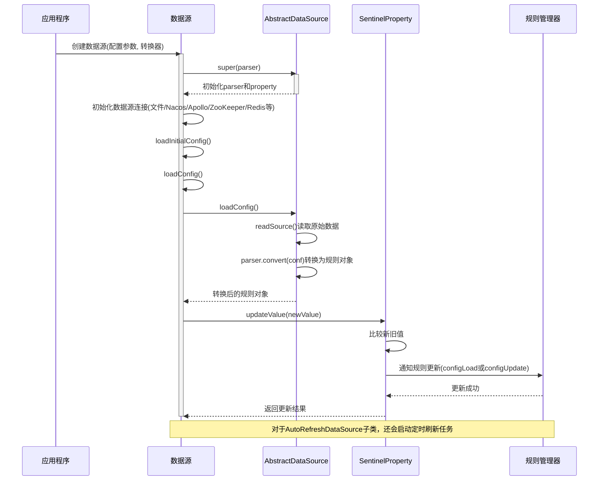
```mermaid
sequenceDiagram
    participant App as 应用程序
    participant DataSource as 数据源
    participant AbstractDataSource
    participant SentinelProperty
    participant RuleManager as 规则管理器
    
    App->>DataSource: 创建数据源(配置参数, 转换器)
    activate DataSource
    DataSource->>AbstractDataSource: super(parser)
    activate AbstractDataSource
    AbstractDataSource-->>DataSource: 初始化parser和property
    deactivate AbstractDataSource
    DataSource->>DataSource: 初始化数据源连接(文件/Nacos/Apollo/ZooKeeper/Redis等)
    DataSource->>DataSource: loadInitialConfig()
    DataSource->>DataSource: loadConfig()
    DataSource->>AbstractDataSource: loadConfig()
    AbstractDataSource->>AbstractDataSource: readSource()读取原始数据
    AbstractDataSource->>AbstractDataSource: parser.convert(conf)转换为规则对象
    AbstractDataSource-->>DataSource: 转换后的规则对象
    DataSource->>SentinelProperty: updateValue(newValue)
    SentinelProperty->>SentinelProperty: 比较新旧值
    SentinelProperty->>RuleManager: 通知规则更新(configLoad或configUpdate)
    RuleManager-->>SentinelProperty: 更新成功
    SentinelProperty-->>DataSource: 返回更新结果
    deactivate DataSource
    
    Note over DataSource,RuleManager: 对于AutoRefreshDataSource子类，还会启动定时刷新任务
```

#### 9.2 配置变更处理流程图

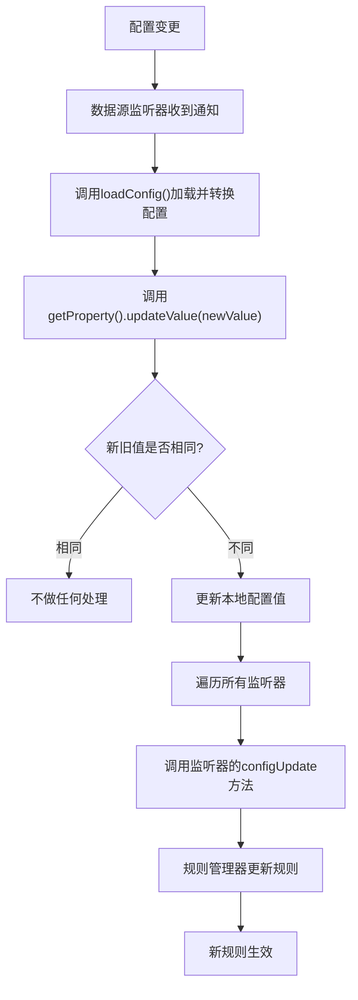
```mermaid
flowchart TD
    A[配置变更] --> B[数据源监听器收到通知]
    B --> C["调用loadConfig()加载并转换配置"]
    C --> D["调用getProperty().updateValue(newValue)"]
    D --> E{新旧值是否相同?}
    E -- 相同 --> F[不做任何处理]
    E -- 不同 --> G[更新本地配置值]
    G --> H[遍历所有监听器]
    H --> I[调用监听器的configUpdate方法]
    I --> J[规则管理器更新规则]
    J --> K[新规则生效]
```

#### 9.3 各种数据源对比

| 数据源类型 | 实现类 | 配置监听方式 | 优点 | 缺点 | 使用场景 |
|---------|---------|---------|---------|---------|---------|
| 文件数据源 | FileRefreshableDataSource | 轮询文件最后修改时间 | 简单易用，无需额外中间件 | 实时性差，有 polling 开销 | 小型项目，本地配置 |
| Nacos数据源 | NacosDataSource | 长连接推送 | 实时性好，支持配置管理 | 需要依赖Nacos服务器 | 中大型微服务项目 |
| Apollo数据源 | ApolloDataSource | 长连接推送 | 成熟的配置管理功能，支持灰度发布 | 需要依赖Apollo服务器 | 企业级微服务项目 |
| ZooKeeper数据源 | ZookeeperDataSource | 节点监听 | 高可用，支持分布式配置 | API相对复杂 | 需要分布式协调的场景 |
| Redis数据源 | RedisDataSource | 发布/订阅 | 简单易用，支持集群 | 需要手动维护SET和PUBLISH的原子性 | 已有Redis基础设施的项目 |

**类图对比**：

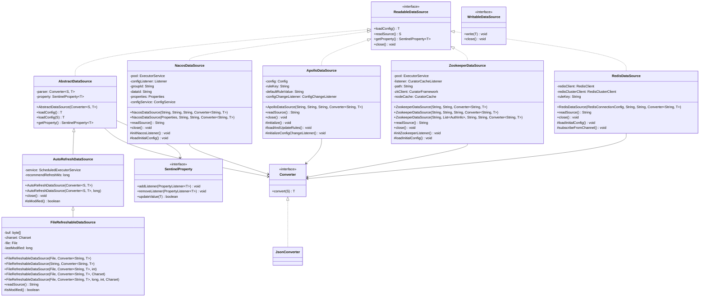
```mermaid
classDiagram
    class ReadableDataSource{
        <<interface>>
        +loadConfig() T
        +readSource() S
        +getProperty() SentinelProperty~T~
        +close() void
    }
    class WritableDataSource{
        <<interface>>
        +write(T) void
        +close() void
    }
    class AbstractDataSource{
        -parser: Converter~S, T~
        -property: SentinelProperty~T~
        +AbstractDataSource(Converter~S, T~)
        +loadConfig() T
        +loadConfig(S) T
        +getProperty() SentinelProperty~T~
    }
    class AutoRefreshDataSource{
        -service: ScheduledExecutorService
        -recommendRefreshMs: long
        +AutoRefreshDataSource(Converter~S, T~)
        +AutoRefreshDataSource(Converter~S, T~, long)
        +close() void
        #isModified() boolean
    }
    class FileRefreshableDataSource{
        -buf: byte[]
        -charset: Charset
        -file: File
        -lastModified: long
        +FileRefreshableDataSource(File, Converter~String, T~)
        +FileRefreshableDataSource(String, Converter~String, T~)
        +FileRefreshableDataSource(File, Converter~String, T~, int)
        +FileRefreshableDataSource(File, Converter~String, T~, Charset)
        +FileRefreshableDataSource(File, Converter~String, T~, long, int, Charset)
        +readSource() String
        #isModified() boolean
    }
    class NacosDataSource{
        -pool: ExecutorService
        -configListener: Listener
        -groupId: String
        -dataId: String
        -properties: Properties
        -configService: ConfigService
        +NacosDataSource(String, String, String, Converter~String, T~)
        +NacosDataSource(Properties, String, String, Converter~String, T~)
        +readSource() String
        +close() void
        #initNacosListener() void
        #loadInitialConfig() void
    }
    class ApolloDataSource{
        -config: Config
        -ruleKey: String
        -defaultRuleValue: String
        -configChangeListener: ConfigChangeListener
        +ApolloDataSource(String, String, String, Converter~String, T~)
        +readSource() String
        +close() void
        #initialize() void
        #loadAndUpdateRules() void
        #initializeConfigChangeListener() void
    }
    class ZookeeperDataSource{
        -pool: ExecutorService
        -listener: CuratorCacheListener
        -path: String
        -zkClient: CuratorFramework
        -nodeCache: CuratorCache
        +ZookeeperDataSource(String, String, Converter~String, T~)
        +ZookeeperDataSource(String, String, String, Converter~String, T~)
        +ZookeeperDataSource(String, List~AuthInfo~, String, String, Converter~String, T~)
        +readSource() String
        +close() void
        #initZookeeperListener() void
        #loadInitialConfig() void
    }
    class RedisDataSource{
        -redisClient: RedisClient
        -redisClusterClient: RedisClusterClient
        -ruleKey: String
        +RedisDataSource(RedisConnectionConfig, String, String, Converter~String, T~)
        +readSource() String
        +close() void
        #loadInitialConfig() void
        #subscribeFromChannel() void
    }
    class Converter{
        <<interface>>
        +convert(S) T
    }
    class SentinelProperty{
        <<interface>>
        +addListener(PropertyListener~T~) void
        +removeListener(PropertyListener~T~) void
        +updateValue(T) boolean
    }
    
    ReadableDataSource <|.. AbstractDataSource
    AbstractDataSource <|-- AutoRefreshDataSource
    AutoRefreshDataSource <|-- FileRefreshableDataSource
    ReadableDataSource <|.. NacosDataSource
    ReadableDataSource <|.. ApolloDataSource
    ReadableDataSource <|.. ZookeeperDataSource
    ReadableDataSource <|.. RedisDataSource
    Converter <|.. JsonConverter
    AbstractDataSource --> Converter
    AbstractDataSource --> SentinelProperty
    NacosDataSource --> Converter
    ApolloDataSource --> Converter
    ZookeeperDataSource --> Converter
    RedisDataSource --> Converter
```

### 总结

Sentinel的动态数据源实现提供了一种灵活的方式来从不同的配置中心加载和更新规则。其核心设计思想包括：

1.  **抽象分层**：通过ReadableDataSource和WritableDataSource接口定义数据源的基本行为，通过AbstractDataSource提供基础实现，通过AutoRefreshDataSource提供自动刷新功能。
2.  **转换器模式**：通过Converter接口将原始配置数据转换为Sentinel规则对象，实现了解耦。
3.  **属性监听机制**：通过SentinelProperty和PropertyListener实现配置变更的监听和通知，使得规则更新能够实时生效。
4.  **多样化的数据源支持**：支持文件、Nacos、Apollo、ZooKeeper、Redis等多种数据源，满足不同场景的需求。
5.  **统一的规则管理**：通过RuleManager和各规则管理器（如FlowRuleManager、DegradeRuleManager）统一管理规则，使得规则的加载和更新变得简单。

这种设计使得Sentinel能够灵活地集成到不同的环境中，同时保持了代码的清晰和可维护性。


---


## 第五章 集群限流实现

### 一、集群限流架构

#### 1.1 整体架构
Sentinel集群限流采用客户端-服务端（C/S）架构，主要包含以下核心角色：

- **Token Client**：集群限流客户端，运行在业务应用中，负责向Token Server申请令牌，并根据返回结果进行流量控制
- **Token Server**：集群限流服务端，负责集中管理所有集群限流规则，并统一分配令牌
- **集群规则存储**：集中存储所有集群限流规则，支持动态更新

##### 部署模式
Sentinel集群限流支持两种部署模式：
1. **嵌入模式（Embedded）**：Token Server嵌入在业务应用内部，与业务应用共享进程资源
2. **独立模式（Standalone）**：Token Server作为独立的服务进程运行，多个业务应用可以连接到同一个Token Server

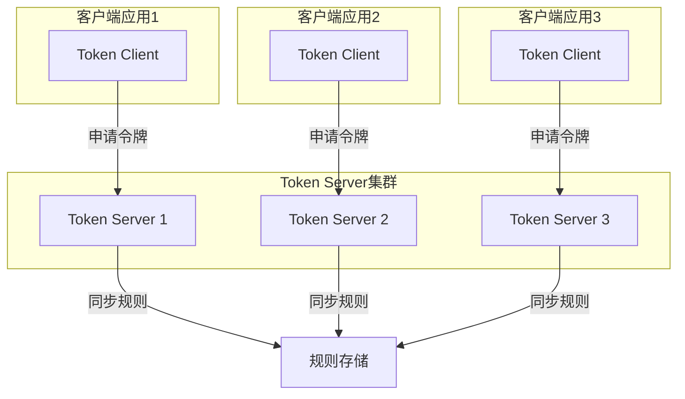
```mermaid
graph TD
    subgraph 客户端应用1
        Client1[Token Client]
    end
    
    subgraph 客户端应用2
        Client2[Token Client]
    end
    
    subgraph 客户端应用3
        Client3[Token Client]
    end
    
    subgraph Token Server集群
        Server1[Token Server 1]
        Server2[Token Server 2]
        Server3[Token Server 3]
    end
    
    Client1 -->|申请令牌| Server1
    Client2 -->|申请令牌| Server2
    Client3 -->|申请令牌| Server3
    
    Server1 -->|同步规则| RuleStorage[规则存储]
    Server2 -->|同步规则| RuleStorage
    Server3 -->|同步规则| RuleStorage
```

**架构优势**：
- 集中式流量控制：所有流量统计和限流决策都在服务端完成，保证全局一致性
- 高扩展性：支持水平扩展Token Server集群
- 灵活的部署模式：支持嵌入模式和独立模式两种部署方式
- 自动故障转移：客户端支持自动重连和服务发现

#### 1.2 ClusterFlowConfig配置
`ClusterFlowConfig`是集群限流规则的核心配置类，定义了集群限流的各种参数。

```java
/*
 * Copyright 1999-2018 Alibaba Group Holding Ltd.
 *
 * Licensed under the Apache License, Version 2.0 (the "License");
 * you may not use this file except in compliance with the License.
 * You may obtain a copy of the License at
 *
 *      http://www.apache.org/licenses/LICENSE-2.0
 *
 * Unless required by applicable law or agreed to in writing, software
 * distributed under the License is distributed on an "AS IS" BASIS,
 * WITHOUT WARRANTIES OR CONDITIONS OF ANY KIND, either express or implied.
 * See the License for the specific language governing permissions and
 * limitations under the License.
 */
package com.alibaba.csp.sentinel.slots.block.flow;

import com.alibaba.csp.sentinel.slots.block.ClusterRuleConstant;
import com.alibaba.csp.sentinel.slots.block.RuleConstant;

import java.util.Objects;

/**
 * Flow rule config in cluster mode.
 *
 * @author Eric Zhao
 * @since 1.4.0
 */
public class ClusterFlowConfig {

    /**
     * Global unique ID.
     */
    private Long flowId;

    /**
     * Threshold type (average by local value or global value).
     */
    private int thresholdType = ClusterRuleConstant.FLOW_THRESHOLD_AVG_LOCAL;
    private boolean fallbackToLocalWhenFail = true;

    /**
     * 0: normal.
     */
    private int strategy = ClusterRuleConstant.FLOW_CLUSTER_STRATEGY_NORMAL;

    private int sampleCount = ClusterRuleConstant.DEFAULT_CLUSTER_SAMPLE_COUNT;
    /**
     * The time interval length of the statistic sliding window (in milliseconds)
     */
    private int windowIntervalMs = RuleConstant.DEFAULT_WINDOW_INTERVAL_MS;

    /**
     * if the client keep the token for more than resourceTimeout,resourceTimeoutStrategy will work.
     */
    private long resourceTimeout = 2000;

    /**
     * 0:ignore,1:release the token.
     */
    private int resourceTimeoutStrategy = RuleConstant.DEFAULT_RESOURCE_TIMEOUT_STRATEGY;

    /**
     * if a client is offline,the server will delete all the token the client holds after clientOfflineTime.
     */
    private long clientOfflineTime = 2000;
    
    // 省略getter和setter
}
```

**关键参数分析**：

| 参数名 | 类型 | 默认值 | 说明 |
|-------|------|--------|------|
| flowId | Long | null | 集群规则的全局唯一ID |
| thresholdType | int | FLOW_THRESHOLD_AVG_LOCAL | 阈值类型：<br>- `FLOW_THRESHOLD_GLOBAL(0)`: 全局阈值<br>- `FLOW_THRESHOLD_AVG_LOCAL(1)`: 单机平均阈值 |
| fallbackToLocalWhenFail | boolean | true | 当Token Server不可用时，是否回退到本地限流 |
| strategy | int | FLOW_CLUSTER_STRATEGY_NORMAL | 集群流控策略 |
| sampleCount | int | DEFAULT_CLUSTER_SAMPLE_COUNT | 滑动窗口样本数 |
| windowIntervalMs | int | DEFAULT_WINDOW_INTERVAL_MS | 滑动窗口时间间隔（毫秒） |
| resourceTimeout | long | 2000 | 客户端持有令牌的超时时间（毫秒） |
| clientOfflineTime | long | 2000 | 客户端离线后，服务端保留其令牌的时间（毫秒） |

### 二、Token Client实现

#### 2.1 DefaultClusterTokenClient
`DefaultClusterTokenClient`是Token Client的默认实现类，负责与Token Server通信，申请令牌。

```java
/*
 * Copyright 1999-2018 Alibaba Group Holding Ltd.
 *
 * Licensed under the Apache License, Version 2.0 (the "License");
 * you may not use this file except in compliance with the License.
 * You may obtain a copy of the License at
 *
 *      http://www.apache.org/licenses/LICENSE-2.0
 *
 * Unless required by applicable law or agreed to in writing, software
 * distributed under the License is distributed on an "AS IS" BASIS,
 * WITHOUT WARRANTIES OR CONDITIONS OF ANY KIND, either express or implied.
 * See the License for the specific language governing permissions and
 * limitations under the License.
 */
package com.alibaba.csp.sentinel.cluster.client;

import java.util.Collection;
import java.util.concurrent.atomic.AtomicBoolean;

import com.alibaba.csp.sentinel.cluster.ClusterConstants;
import com.alibaba.csp.sentinel.cluster.ClusterErrorMessages;
import com.alibaba.csp.sentinel.cluster.ClusterTransportClient;
import com.alibaba.csp.sentinel.cluster.TokenResult;
import com.alibaba.csp.sentinel.cluster.TokenResultStatus;
import com.alibaba.csp.sentinel.cluster.TokenServerDescriptor;
import com.alibaba.csp.sentinel.cluster.client.config.ClusterClientAssignConfig;
import com.alibaba.csp.sentinel.cluster.client.config.ClusterClientConfigManager;
import com.alibaba.csp.sentinel.cluster.client.config.ServerChangeObserver;
import com.alibaba.csp.sentinel.cluster.log.ClusterClientStatLogUtil;
import com.alibaba.csp.sentinel.cluster.request.ClusterRequest;
import com.alibaba.csp.sentinel.cluster.request.data.FlowRequestData;
import com.alibaba.csp.sentinel.cluster.request.data.ParamFlowRequestData;
import com.alibaba.csp.sentinel.cluster.response.ClusterResponse;
import com.alibaba.csp.sentinel.cluster.response.data.FlowTokenResponseData;
import com.alibaba.csp.sentinel.log.RecordLog;
import com.alibaba.csp.sentinel.util.StringUtil;

/**
 * Default implementation of {@link ClusterTokenClient}.
 *
 * @author Eric Zhao
 * @since 1.4.0
 */
public class DefaultClusterTokenClient implements ClusterTokenClient {

    private ClusterTransportClient transportClient;
    private TokenServerDescriptor serverDescriptor;

    private final AtomicBoolean shouldStart = new AtomicBoolean(false);

    public DefaultClusterTokenClient() {
        ClusterClientConfigManager.addServerChangeObserver(new ServerChangeObserver() {
            @Override
            public void onRemoteServerChange(ClusterClientAssignConfig assignConfig) {
                changeServer(assignConfig);
            }
        });
        initNewConnection();
    }

    @Override
    public TokenResult requestToken(Long flowId, int acquireCount, boolean prioritized) {
        if (notValidRequest(flowId, acquireCount)) {
            return badRequest();
        }
        FlowRequestData data = new FlowRequestData().setCount(acquireCount)
            .setFlowId(flowId).setPriority(prioritized);
        ClusterRequest<FlowRequestData> request = new ClusterRequest<>(ClusterConstants.MSG_TYPE_FLOW, data);
        try {
            TokenResult result = sendTokenRequest(request);
            logForResult(result);
            return result;
        } catch (Exception ex) {
            ClusterClientStatLogUtil.log(ex.getMessage());
            return new TokenResult(TokenResultStatus.FAIL);
        }
    }

    @Override
    public TokenResult requestParamToken(Long flowId, int acquireCount, Collection<Object> params) {
        if (notValidRequest(flowId, acquireCount) || params == null || params.isEmpty()) {
            return badRequest();
        }
        ParamFlowRequestData data = new ParamFlowRequestData().setCount(acquireCount)
            .setFlowId(flowId).setParams(params);
        ClusterRequest<ParamFlowRequestData> request = new ClusterRequest<>(ClusterConstants.MSG_TYPE_PARAM_FLOW, data);
        try {
            TokenResult result = sendTokenRequest(request);
            logForResult(result);
            return result;
        } catch (Exception ex) {
            ClusterClientStatLogUtil.log(ex.getMessage());
            return new TokenResult(TokenResultStatus.FAIL);
        }
    }

    private TokenResult sendTokenRequest(ClusterRequest request) throws Exception {
        if (transportClient == null) {
            RecordLog.warn(
                "[DefaultClusterTokenClient] Client not created, please check your config for cluster client");
            return clientFail();
        }
        ClusterResponse response = transportClient.sendRequest(request);
        TokenResult result = new TokenResult(response.getStatus());
        if (response.getData() != null) {
            FlowTokenResponseData responseData = (FlowTokenResponseData)response.getData();
            result.setRemaining(responseData.getRemainingCount())
                .setWaitInMs(responseData.getWaitInMs());
        }
        return result;
    }
}
```

**核心方法分析**：

1. **requestToken方法**（行149-165）：
   - 参数：flowId（规则ID）、acquireCount（申请的令牌数）、prioritized（是否优先请求）
   - 功能：构造FlowRequestData请求对象，发送到Token Server
   - 异常处理：捕获所有异常，返回失败结果

2. **sendTokenRequest方法**（行206-220）：
   - 功能：实际发送请求到Token Server，并等待响应
   - 流程：
     - 检查transportClient是否可用
     - 设置请求ID
     - 发送请求并等待响应
     - 解析响应数据，封装为TokenResult返回

#### 2.2 客户端启动和连接
客户端的连接管理由`NettyTransportClient`实现，基于Netty NIO框架实现高效的网络通信。

```java
/*
 * Copyright 1999-2018 Alibaba Group Holding Ltd.
 *
 * Licensed under the Apache License, Version 2.0 (the "License");
 * you may not use this file except in compliance with the License.
 * You may obtain a copy of the License at
 *
 *      http://www.apache.org/licenses/LICENSE-2.0
 *
 * Unless required by applicable law or agreed to in writing, software
 * distributed under the License is distributed on an "AS IS" BASIS,
 * WITHOUT WARRANTIES OR CONDITIONS OF ANY KIND, either express or implied.
 * See the License for the specific language governing permissions and
 * limitations under the License.
 */
package com.alibaba.csp.sentinel.cluster.client;

import java.util.AbstractMap.SimpleEntry;
import java.util.concurrent.Executors;
import java.util.concurrent.ScheduledExecutorService;
import java.util.concurrent.TimeUnit;
import java.util.concurrent.atomic.AtomicBoolean;
import java.util.concurrent.atomic.AtomicInteger;

import com.alibaba.csp.sentinel.cluster.ClusterErrorMessages;
import com.alibaba.csp.sentinel.cluster.ClusterTransportClient;
import com.alibaba.csp.sentinel.cluster.client.codec.netty.NettyRequestEncoder;
import com.alibaba.csp.sentinel.cluster.client.codec.netty.NettyResponseDecoder;
import com.alibaba.csp.sentinel.cluster.client.config.ClusterClientConfigManager;
import com.alibaba.csp.sentinel.cluster.client.handler.TokenClientHandler;
import com.alibaba.csp.sentinel.cluster.client.handler.TokenClientPromiseHolder;
import com.alibaba.csp.sentinel.cluster.exception.SentinelClusterException;
import com.alibaba.csp.sentinel.cluster.request.ClusterRequest;
import com.alibaba.csp.sentinel.cluster.request.Request;
import com.alibaba.csp.sentinel.cluster.response.ClusterResponse;
import com.alibaba.csp.sentinel.concurrent.NamedThreadFactory;
import com.alibaba.csp.sentinel.log.RecordLog;
import com.alibaba.csp.sentinel.util.AssertUtil;

import io.netty.bootstrap.Bootstrap;
import io.netty.buffer.PooledByteBufAllocator;
import io.netty.channel.Channel;
import io.netty.channel.ChannelFuture;
import io.netty.channel.ChannelInitializer;
import io.netty.channel.ChannelOption;
import io.netty.channel.ChannelPipeline;
import io.netty.channel.ChannelPromise;
import io.netty.channel.nio.NioEventLoopGroup;
import io.netty.channel.socket.SocketChannel;
import io.netty.channel.socket.nio.NioSocketChannel;
import io.netty.handler.codec.LengthFieldBasedFrameDecoder;
import io.netty.handler.codec.LengthFieldPrepender;
import io.netty.util.concurrent.GenericFutureListener;

/**
 * Netty transport client implementation for Sentinel cluster transport.
 *
 * @author Eric Zhao
 * @since 1.4.0
 */
public class NettyTransportClient implements ClusterTransportClient {

    @SuppressWarnings("PMD.ThreadPoolCreationRule")
    private static final ScheduledExecutorService SCHEDULER = Executors.newScheduledThreadPool(1,
        new NamedThreadFactory("sentinel-cluster-transport-client-scheduler", true));

    public static final int RECONNECT_DELAY_MS = 2000;

    private final String host;
    private final int port;

    private Channel channel;
    private NioEventLoopGroup eventLoopGroup;
    private TokenClientHandler clientHandler;

    private final AtomicInteger idGenerator = new AtomicInteger(0);
    private final AtomicInteger currentState = new AtomicInteger(ClientConstants.CLIENT_STATUS_OFF);
    private final AtomicInteger failConnectedTime = new AtomicInteger(0);

    private final AtomicBoolean shouldRetry = new AtomicBoolean(true);

    public NettyTransportClient(String host, int port) {
        AssertUtil.assertNotBlank(host, "remote host cannot be blank");
        AssertUtil.isTrue(port > 0, "port should be positive");
        this.host = host;
        this.port = port;
    }

    private Bootstrap initClientBootstrap() {
        Bootstrap b = new Bootstrap();
        eventLoopGroup = new NioEventLoopGroup();
        b.group(eventLoopGroup)
            .channel(NioSocketChannel.class)
            .option(ChannelOption.TCP_NODELAY, true)
            .option(ChannelOption.ALLOCATOR, PooledByteBufAllocator.DEFAULT)
            .option(ChannelOption.CONNECT_TIMEOUT_MILLIS, ClusterClientConfigManager.getConnectTimeout())
            .handler(new ChannelInitializer<SocketChannel>() {
                @Override
                public void initChannel(SocketChannel ch) throws Exception {
                    clientHandler = new TokenClientHandler(currentState, disconnectCallback);

                    ChannelPipeline pipeline = ch.pipeline();
                    pipeline.addLast(new LengthFieldBasedFrameDecoder(1024, 0, 2, 0, 2));
                    pipeline.addLast(new NettyResponseDecoder());
                    pipeline.addLast(new LengthFieldPrepender(2));
                    pipeline.addLast(new NettyRequestEncoder());
                    pipeline.addLast(clientHandler);
                }
            });

        return b;
    }

    private void connect(Bootstrap b) {
        if (currentState.compareAndSet(ClientConstants.CLIENT_STATUS_OFF, ClientConstants.CLIENT_STATUS_PENDING)) {
            b.connect(host, port)
                .addListener(new GenericFutureListener<ChannelFuture>() {
                @Override
                public void operationComplete(ChannelFuture future) {
                    if (future.cause() != null) {
                        RecordLog.warn(
                            String.format("[NettyTransportClient] Could not connect to <%s:%d> after %d times",
                                host, port, failConnectedTime.get()), future.cause());
                        failConnectedTime.incrementAndGet();
                        channel = null;
                    } else {
                        failConnectedTime.set(0);
                        channel = future.channel();
                        RecordLog.info("[NettyTransportClient] Successfully connect to server <{}:{}>", host, port);
                    }
                }
            });
        }
    }

    private Runnable disconnectCallback = new Runnable() {
        @Override
        public void run() {
            if (!shouldRetry.get()) {
                return;
            }
            SCHEDULER.schedule(new Runnable() {
                @Override
                public void run() {
                    if (shouldRetry.get()) {
                        RecordLog.info("[NettyTransportClient] Reconnecting to server <{}:{}>", host, port);
                        try {
                            startInternal();
                        } catch (Exception e) {
                            RecordLog.warn("[NettyTransportClient] Failed to reconnect to server", e);
                        }
                    }
                }
            }, RECONNECT_DELAY_MS * (failConnectedTime.get() + 1), TimeUnit.MILLISECONDS);
            cleanUp();
        }
    };

    @Override
    public ClusterResponse sendRequest(ClusterRequest request) throws Exception {
        if (!isReady()) {
            throw new SentinelClusterException(ClusterErrorMessages.CLIENT_NOT_READY);
        }
        if (!validRequest(request)) {
            throw new SentinelClusterException(ClusterErrorMessages.BAD_REQUEST);
        }
        int xid = getCurrentId();
        try {
            request.setId(xid);

            channel.writeAndFlush(request);

            ChannelPromise promise = channel.newPromise();
            TokenClientPromiseHolder.putPromise(xid, promise);

            if (!promise.await(ClusterClientConfigManager.getRequestTimeout())) {
                throw new SentinelClusterException(ClusterErrorMessages.REQUEST_TIME_OUT);
            }

            SimpleEntry<ChannelPromise, ClusterResponse> entry = TokenClientPromiseHolder.getEntry(xid);
            if (entry == null || entry.getValue() == null) {
                // Should not go through here.
                throw new SentinelClusterException(ClusterErrorMessages.UNEXPECTED_STATUS);
            }
            return entry.getValue();
        } finally {
            TokenClientPromiseHolder.remove(xid);
        }
    }
}
```

**连接管理机制**：

1. **启动流程**：
   - 初始化Netty Bootstrap，配置连接参数
   - 建立到Token Server的连接
   - 添加编解码器和业务处理器

2. **心跳保活**：
   - 通过`TokenClientHandler`处理心跳和响应
   - 连接断开后自动触发重连机制
   - 重连延迟随失败次数指数退避

3. **请求处理**：
   - 为每个请求生成唯一ID
   - 发送请求并等待响应
   - 使用Promise机制实现同步等待
   - 超时处理和资源清理

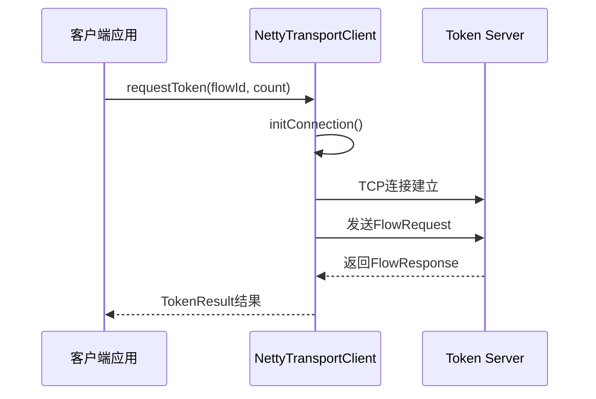
```mermaid
sequenceDiagram
    participant Client as 客户端应用
    participant NettyClient as NettyTransportClient
    participant TokenServer as Token Server
    
    Client->>NettyClient: requestToken(flowId, count)
    NettyClient->>NettyClient: initConnection()
    NettyClient->>TokenServer: TCP连接建立
    NettyClient->>TokenServer: 发送FlowRequest
    TokenServer-->>NettyClient: 返回FlowResponse
    NettyClient-->>Client: TokenResult结果
```

### 三、Token Server实现

#### 3.1 DefaultClusterTokenServer
`SentinelDefaultTokenServer`是Token Server的默认实现类，支持嵌入模式和独立模式两种部署方式。

```java
/*
 * Copyright 1999-2018 Alibaba Group Holding Ltd.
 *
 * Licensed under the Apache License, Version 2.0 (the "License");
 * you may not use this file except in compliance with the License.
 * You may obtain a copy of the License at
 *
 *      http://www.apache.org/licenses/LICENSE-2.0
 *
 * Unless required by applicable law or agreed to in writing, software
 * distributed under the License is distributed on an "AS IS" BASIS,
 * WITHOUT WARRANTIES OR CONDITIONS OF ANY KIND, either express or implied.
 * See the License for the specific language governing permissions and
 * limitations under the License.
 */
package com.alibaba.csp.sentinel.cluster.server;

import java.util.HashSet;
import java.util.Set;
import java.util.concurrent.atomic.AtomicBoolean;

import com.alibaba.csp.sentinel.cluster.ClusterStateManager;
import com.alibaba.csp.sentinel.cluster.registry.ConfigSupplierRegistry;
import com.alibaba.csp.sentinel.cluster.server.config.ClusterServerConfigManager;
import com.alibaba.csp.sentinel.cluster.server.config.ServerTransportConfig;
import com.alibaba.csp.sentinel.cluster.server.config.ServerTransportConfigObserver;
import com.alibaba.csp.sentinel.cluster.server.connection.ConnectionManager;
import com.alibaba.csp.sentinel.init.InitExecutor;
import com.alibaba.csp.sentinel.log.RecordLog;
import com.alibaba.csp.sentinel.util.HostNameUtil;
import com.alibaba.csp.sentinel.util.StringUtil;

/**
 * @author Eric Zhao
 * @since 1.4.0
 */
public class SentinelDefaultTokenServer implements ClusterTokenServer {

    private final boolean embedded;

    private ClusterTokenServer server;
    private int port;
    private final AtomicBoolean shouldStart = new AtomicBoolean(false);

    static {
        InitExecutor.doInit();
    }

    public SentinelDefaultTokenServer() {
        this(false);
    }

    public SentinelDefaultTokenServer(boolean embedded) {
        this.embedded = embedded;
        ClusterServerConfigManager.addTransportConfigChangeObserver(new ServerTransportConfigObserver() {
            @Override
            public void onTransportConfigChange(ServerTransportConfig config) {
                changeServerConfig(config);
            }
        });
        initNewServer();
    }

    private void initNewServer() {
        if (server != null) {
            return;
        }
        int port = ClusterServerConfigManager.getPort();
        if (port > 0) {
            this.server = new NettyTransportServer(port);
            this.port = port;
        }
    }

    private synchronized void changeServerConfig(ServerTransportConfig config) {
        if (config == null || config.getPort() <= 0) {
            return;
        }
        int newPort = config.getPort();
        if (newPort == port) {
            return;
        }
        try {
            if (server != null) {
                stopServer();
            }
            this.server = new NettyTransportServer(newPort);
            this.port = newPort;
            startServerIfScheduled();
        } catch (Exception ex) {
            RecordLog.warn("[SentinelDefaultTokenServer] Failed to apply modification to token server", ex);
        }
    }

    @Override
    public void start() throws Exception {
        if (shouldStart.compareAndSet(false, true)) {
            startServerIfScheduled();
        }
    }

    private void startServerIfScheduled() throws Exception {
        if (shouldStart.get()) {
            if (server != null) {
                server.start();
                ClusterStateManager.markToServer();
                if (embedded) {
                    RecordLog.info("[SentinelDefaultTokenServer] Running in embedded mode");
                    handleEmbeddedStart();
                }
            }
        }
    }
}
```

#### 3.2 NettyTransportServer
`NettyTransportServer`是基于Netty的服务端实现，负责监听客户端连接并处理请求。

```java
/*
 * Copyright 1999-2018 Alibaba Group Holding Ltd.
 *
 * Licensed under the Apache License, Version 2.0 (the "License");
 * you may not use this file except in compliance with the License.
 * You may obtain a copy of the License at
 *
 *      http://www.apache.org/licenses/LICENSE-2.0
 *
 * Unless required by applicable law or agreed to in writing, software
 * distributed under the License is distributed on an "AS IS" BASIS,
 * WITHOUT WARRANTIES OR CONDITIONS OF ANY KIND, either express or implied.
 * See the License for the specific language governing permissions and
 * limitations under the License.
 */
package com.alibaba.csp.sentinel.cluster.server;

import java.util.ArrayList;
import java.util.List;
import java.util.concurrent.atomic.AtomicInteger;

import com.alibaba.csp.sentinel.cluster.server.codec.netty.NettyRequestDecoder;
import com.alibaba.csp.sentinel.cluster.server.codec.netty.NettyResponseEncoder;
import com.alibaba.csp.sentinel.cluster.server.connection.Connection;
import com.alibaba.csp.sentinel.cluster.server.connection.ConnectionPool;
import com.alibaba.csp.sentinel.cluster.server.handler.TokenServerHandler;
import com.alibaba.csp.sentinel.log.RecordLog;

import io.netty.bootstrap.ServerBootstrap;
import io.netty.buffer.PooledByteBufAllocator;
import io.netty.channel.ChannelFuture;
import io.netty.channel.ChannelInitializer;
import io.netty.channel.ChannelOption;
import io.netty.channel.ChannelPipeline;
import io.netty.channel.nio.NioEventLoopGroup;
import io.netty.channel.socket.SocketChannel;
import io.netty.channel.socket.nio.NioServerSocketChannel;
import io.netty.handler.codec.LengthFieldBasedFrameDecoder;
import io.netty.handroid.codec.LengthFieldPrepender;
import io.netty.handler.logging.LogLevel;
import io.netty.handler.logging.LoggingHandler;
import io.netty.util.concurrent.GenericFutureListener;
import io.netty.util.internal.SystemPropertyUtil;

import static com.alibaba.csp.sentinel.cluster.server.ServerConstants.*;

/**
 * @author Eric Zhao
 * @since 1.4.0
 */
public class NettyTransportServer implements ClusterTokenServer {

    private static final int DEFAULT_EVENT_LOOP_THREADS = Math.max(1,
        SystemPropertyUtil.getInt("io.netty.eventLoopThreads", Runtime.getRuntime().availableProcessors() * 2));
    private static final int MAX_RETRY_TIMES = 3;
    private static final int RETRY_SLEEP_MS = 2000;

    private final int port;

    private NioEventLoopGroup bossGroup;
    private NioEventLoopGroup workerGroup;

    private final ConnectionPool connectionPool = new ConnectionPool();

    private final AtomicInteger currentState = new AtomicInteger(SERVER_STATUS_OFF);
    private final AtomicInteger failedTimes = new AtomicInteger(0);

    public NettyTransportServer(int port) {
        this.port = port;
    }

    @Override
    public void start() {
        if (!currentState.compareAndSet(SERVER_STATUS_OFF, SERVER_STATUS_STARTING)) {
            return;
        }

        ServerBootstrap b = new ServerBootstrap();
        this.bossGroup = new NioEventLoopGroup(1);
        this.workerGroup = new NioEventLoopGroup(DEFAULT_EVENT_LOOP_THREADS);
        b.group(bossGroup, workerGroup)
            .channel(NioServerSocketChannel.class)
            .option(ChannelOption.SO_BACKLOG, 128)
            .handler(new LoggingHandler(LogLevel.INFO))
            .childHandler(new ChannelInitializer<SocketChannel>() {
                @Override
                public void initChannel(SocketChannel ch) throws Exception {
                    ChannelPipeline p = ch.pipeline();
                    p.addLast(new LengthFieldBasedFrameDecoder(1024, 0, 2, 0, 2));
                    p.addLast(new NettyRequestDecoder());
                    p.addLast(new LengthFieldPrepender(2));
                    p.addLast(new NettyResponseEncoder());
                    p.addLast(new TokenServerHandler(connectionPool));
                }
            })
            .childOption(ChannelOption.ALLOCATOR, PooledByteBufAllocator.DEFAULT)
            .childOption(ChannelOption.SO_SNDBUF, 32 * 1024)
            .childOption(ChannelOption.CONNECT_TIMEOUT_MILLIS, 10000)
            .childOption(ChannelOption.SO_TIMEOUT, 10)
            .childOption(ChannelOption.TCP_NODELAY, true)
            .childOption(ChannelOption.SO_RCVBUF, 32 * 1024);
        b.bind(port).addListener(new GenericFutureListener<ChannelFuture>() {
            @Override
            public void operationComplete(ChannelFuture future) {
                if (future.cause() != null) {
                    RecordLog.info("[NettyTransportServer] Token server start failed (port=" + port + "), failedTimes: " + failedTimes.get(),
                        future.cause());
                    currentState.compareAndSet(SERVER_STATUS_STARTING, SERVER_STATUS_OFF);
                    int failCount = failedTimes.incrementAndGet();
                    if (failCount > MAX_RETRY_TIMES) {
                        return;
                    }

                    try {
                        Thread.sleep(failCount * RETRY_SLEEP_MS);
                        start();
                    } catch (Throwable e) {
                        RecordLog.info("[NettyTransportServer] Failed to start token server when retrying", e);
                    }
                } else {
                    RecordLog.info("[NettyTransportServer] Token server started success at port {}", port);
                    currentState.compareAndSet(SERVER_STATUS_STARTING, SERVER_STATUS_STARTED);
                }
            }
        });
    }
}
```

#### 3.3 TokenServiceImpl
`DefaultTokenService`是Token服务的默认实现，负责处理客户端的令牌请求。

```java
/*
 * Copyright 1999-2018 Alibaba Group Holding Ltd.
 *
 * Licensed under the Apache License, Version 2.0 (the "License");
 * you may not use this file except in compliance with the License.
 * You may obtain a copy of the License at
 *
 *      http://www.apache.org/licenses/LICENSE-2.0
 *
 * Unless required by applicable law or agreed to in writing, software
 * distributed under the License is distributed on an "AS IS" BASIS,
 * WITHOUT WARRANTIES OR CONDITIONS OF ANY KIND, either express or implied.
 * See the License for the specific language governing permissions and
 * limitations under the License.
 */
package com.alibaba.csp.sentinel.cluster.flow;

import com.alibaba.csp.sentinel.cluster.TokenResult;
import com.alibaba.csp.sentinel.cluster.TokenResultStatus;
import com.alibaba.csp.sentinel.cluster.TokenService;
import com.alibaba.csp.sentinel.cluster.flow.rule.ClusterFlowRuleManager;
import com.alibaba.csp.sentinel.cluster.flow.rule.ClusterParamFlowRuleManager;
import com.alibaba.csp.sentinel.slots.block.flow.FlowRule;
import com.alibaba.csp.sentinel.slots.block.flow.param.ParamFlowRule;
import com.alibaba.csp.sentinel.spi.Spi;

import java.util.Collection;

/**
 * Default implementation for cluster {@link TokenService}.
 *
 * @author Eric Zhao
 * @since 1.4.0
 */
@Spi(isDefault = true)
public class DefaultTokenService implements TokenService {

    @Override
    public TokenResult requestToken(Long ruleId, int acquireCount, boolean prioritized) {
        if (notValidRequest(ruleId, acquireCount)) {
            return badRequest();
        }
        // The rule should be valid.
        FlowRule rule = ClusterFlowRuleManager.getFlowRuleById(ruleId);
        if (rule == null) {
            return new TokenResult(TokenResultStatus.NO_RULE_EXISTS);
        }

        return ClusterFlowChecker.acquireClusterToken(rule, acquireCount, prioritized);
    }

    @Override
    public TokenResult requestParamToken(Long ruleId, int acquireCount, Collection<Object> params) {
        if (notValidRequest(ruleId, acquireCount) || params == null || params.isEmpty()) {
            return badRequest();
        }
        // The rule should be valid.
        ParamFlowRule rule = ClusterParamFlowRuleManager.getParamRuleById(ruleId);
        if (rule == null) {
            return new TokenResult(TokenResultStatus.NO_RULE_EXISTS);
        }

        return ClusterParamFlowChecker.acquireClusterToken(rule, acquireCount, params);
    }
}
```

**服务端请求处理流程**：

1. **TokenServerHandler**接收客户端请求
2. 根据请求类型选择对应的处理器
3. **DefaultTokenService**根据规则ID获取对应的限流规则
4. **ClusterFlowChecker**进行实际的流控检查，计算剩余令牌数
5. 返回令牌申请结果

```mermaid
sequenceDiagram
    participant Client as 客户端应用
    participant ServerHandler as TokenServerHandler
    participant TokenService as DefaultTokenService
    participant FlowChecker as ClusterFlowChecker
    participant MetricStore as 集群流量统计
    
    Client->>ServerHandler: TCP连接建立
    Client->>ServerHandler: 发送FlowRequest
    ServerHandler->>TokenService: 调用requestToken()
    TokenService->>FlowChecker: acquireClusterToken()
    FlowChecker->>MetricStore: 获取当前QPS统计
    MetricStore-->>FlowChecker: 返回当前QPS
    FlowChecker->>FlowChecker: 计算剩余令牌
    FlowChecker-->>TokenService: TokenResult
    TokenService-->>ServerHandler: TokenResult
    ServerHandler-->>Client: 返回FlowResponse
```

### 四、通信协议

#### 4.1 请求和响应数据结构
Sentinel集群通信使用自定义的二进制协议，主要包含`ClusterRequest`和`ClusterResponse`两个核心类。

**ClusterRequest.java**
```java
/*
 * Copyright 1999-2018 Alibaba Group Holding Ltd.
 *
 * Licensed under the Apache License, Version 2.0 (the "License");
 * you may not use this file except in compliance with the License.
 * You may obtain a copy of the License at
 *
 *      http://www.apache.org/licenses/LICENSE-2.0
 *
 * Unless required by applicable law or agreed to in writing, software
 * distributed under the License is distributed on an "AS IS" BASIS,
 * WITHOUT WARRANTIES OR CONDITIONS OF ANY KIND, either express or implied.
 * See the License for the specific language governing permissions and
 * limitations under the License.
 */
package com.alibaba.csp.sentinel.cluster.request;

/**
 * @author Eric Zhao
 * @since 1.4.0
 */
public class ClusterRequest<T> implements Request {

    private int id;
    private int type;

    private T data;

    public ClusterRequest() {}

    public ClusterRequest(int id, int type, T data) {
        this.id = id;
        this.type = type;
        this.data = data;
    }

    public ClusterRequest(int type, T data) {
        this.type = type;
        this.data = data;
    }
}
```

**ClusterResponse.java**
```java
/*
 * Copyright 1999-2018 Alibaba Group Holding Ltd.
 *
 * Licensed under the Apache License, Version 2.0 (the "License");
 * you may not use this file except in compliance with the License.
 * You may obtain a copy of the License at
 *
 *      http://www.apache.org/licenses/LICENSE-2.0
 *
 * Unless required by applicable law or agreed to in writing, software
 * distributed under the License is distributed on an "AS IS" BASIS,
 * WITHOUT WARRANTIES OR CONDITIONS OF ANY KIND, either express or implied.
 * See the License for the specific language governing permissions and
 * limitations under the License.
 */
package com.alibaba.csp.sentinel.cluster.response;

/**
 * @author Eric Zhao
 * @since 1.4.0
 */
public class ClusterResponse<T> implements Response {

    private int id;
    private int type;
    private int status;

    private T data;

    public ClusterResponse() {}

    public ClusterResponse(int id, int type, int status, T data) {
        this.id = id;
        this.type = type;
        this.status = status;
        this.data = data;
    }
}
```

**协议字段说明**：

| 字段 | 类型 | 说明 |
|------|------|------|
| id | int | 请求/响应的唯一标识，用于匹配请求和响应 |
| type | int | 请求类型，如：流量限流、参数限流、心跳等 |
| status | int | 响应状态码，如：成功、失败、限流等 |
| data | T | 具体的数据负载，根据请求类型不同而不同 |

**请求类型枚举**：
- `MSG_TYPE_FLOW(0)`: 流量限流请求
- `MSG_TYPE_PARAM_FLOW(1)`: 参数流量限流请求
- `MSG_TYPE_PING(2)`: 心跳请求
- `MSG_TYPE_CONCURRENT(3)`: 并发限流请求

#### 4.2 序列化机制
Sentinel集群通信使用基于Netty的编解码器，实现请求和响应的序列化和反序列化。

**主要编解码器类**：
- `NettyRequestEncoder`: 客户端请求编码器
- `NettyResponseDecoder`: 客户端响应解码器
- `NettyRequestDecoder`: 服务端请求解码器
- `NettyResponseEncoder`: 服务端响应编码器

编解码器采用长度字段前置的设计，确保网络通信的粘包/拆包处理：
```java
// 服务端通道初始化示例
pipeline.addLast(new LengthFieldBasedFrameDecoder(1024, 0, 2, 0, 2));
pipeline.addLast(new NettyRequestDecoder());
pipeline.addLast(new LengthFieldPrepender(2));
pipeline.addLast(new NettyResponseEncoder());
pipeline.addLast(new TokenServerHandler(connectionPool));
```

### 五、集群限流规则

#### 5.1 FlowRule的clusterMode
在Sentinel中，普通的`FlowRule`可以通过`clusterMode`字段配置为集群限流规则：

```java
public class FlowRule extends AbstractRule {
    // ...
    private boolean clusterMode = false;
    private ClusterFlowConfig clusterConfig;
    // ...
}
```

当`clusterMode`设置为true时，该规则将采用集群限流模式，流量统计和限流决策将在Token Server端完成。

#### 5.2 规则在服务端的存储
`ClusterFlowRuleManager`是集群限流规则的管理类，负责加载、存储和更新集群限流规则。

```java
/*
 * Copyright 1999-2018 Alibaba Group Holding Ltd.
 *
 * Licensed under the Apache License, Version 2.0 (the "License");
 * you may not use this file except in compliance with the License.
 * You may obtain a copy of the License at
 *
 *      http://www.apache.org/licenses/LICENSE-2.0
 *
 * Unless required by applicable law or agreed to in writing, software
 * distributed under the License is distributed on an "AS IS" BASIS,
 * WITHOUT WARRANTIES OR CONDITIONS OF ANY KIND, either express or implied.
 * See the License for the specific language governing permissions and
 * limitations under the License.
 */
package com.alibaba.csp.sentinel.cluster.flow.rule;

import com.alibaba.csp.sentinel.cluster.flow.statistic.ClusterMetricStatistics;
import com.alibaba.csp.sentinel.cluster.flow.statistic.concurrent.CurrentConcurrencyManager;
import com.alibaba.csp.sentinel.cluster.flow.statistic.metric.ClusterMetric;
import com.alibaba.csp.sentinel.cluster.server.ServerConstants;
import com.alibaba.csp.sentinel.cluster.server.connection.ConnectionManager;
import com.alibaba.csp.sentinel.cluster.server.util.ClusterRuleUtil;
import com.alibaba.csp.sentinel.log.RecordLog;
import com.alibaba.csp.sentinel.property.DynamicSentinelProperty;
import com.alibaba.csp.sentinel.property.PropertyListener;
import com.alibaba.csp.sentinel.property.SentinelProperty;
import com.alibaba.csp.sentinel.slots.block.RuleConstant;
import com.alibaba.csp.sentinel.slots.block.flow.ClusterFlowConfig;
import com.alibaba.csp.sentinel.slots.block.flow.FlowRule;
import com.alibaba.csp.sentinel.slots.block.flow.FlowRuleUtil;
import com.alibaba.csp.sentinel.util.AssertUtil;
import com.alibaba.csp.sentinel.util.StringUtil;
import com.alibaba.csp.sentinel.util.function.Function;
import com.alibaba.csp.sentinel.util.function.Predicate;

import java.util.*;
import java.util.concurrent.ConcurrentHashMap;

/**
 * Manager for cluster flow rules.
 *
 * @author Eric Zhao
 * @since 1.4.0
 */
public final class ClusterFlowRuleManager {

    /**
     * (flowId, clusterRule)
     */
    private static final Map<Long, FlowRule> FLOW_RULES = new ConcurrentHashMap<>();
    /**
     * (namespace, [flowId...])
     */
    private static final Map<String, Set<Long>> NAMESPACE_FLOW_ID_MAP = new ConcurrentHashMap<>();
    /**
     * <p>This map (flowId, namespace) is used for getting connected count
     * when checking a specific rule in {@code ruleId}:</p>
     *
     * <pre>
     * ruleId -> namespace -> connection group -> connected count
     * </pre>
     */
    private static final Map<Long, String> FLOW_NAMESPACE_MAP = new ConcurrentHashMap<>();

    /**
     * Load flow rules for a specific namespace. The former rules of the namespace will be replaced.
     *
     * @param namespace a valid namespace
     * @param rules     rule list
     */
    public static void loadRules(String namespace, List<FlowRule> rules) {
        AssertUtil.notEmpty(namespace, "namespace cannot be empty");
        NamespaceFlowProperty<FlowRule> property = PROPERTY_MAP.get(namespace);
        if (property != null) {
            property.getProperty().updateValue(rules);
        }
    }

    private static void applyClusterFlowRule(List<FlowRule> list, /*@Valid*/ String namespace) {
        if (list == null || list.isEmpty()) {
            clearAndResetRulesFor(namespace);
            return;
        }
        final ConcurrentHashMap<Long, FlowRule> ruleMap = new ConcurrentHashMap<>();

        Set<Long> flowIdSet = new HashSet<>();

        for (FlowRule rule : list) {
            if (!rule.isClusterMode()) {
                continue;
            }
            if (!FlowRuleUtil.isValidRule(rule)) {
                RecordLog.warn(
                        "[ClusterFlowRuleManager] Ignoring invalid flow rule when loading new flow rules: " + rule);
                continue;
            }
            if (StringUtil.isBlank(rule.getLimitApp())) {
                rule.setLimitApp(RuleConstant.LIMIT_APP_DEFAULT);
            }

            // Flow id should not be null after filtered.
            ClusterFlowConfig clusterConfig = rule.getClusterConfig();
            Long flowId = clusterConfig.getFlowId();
            if (flowId == null) {
                continue;
            }
            ruleMap.put(flowId, rule);
            FLOW_NAMESPACE_MAP.put(flowId, namespace);
            flowIdSet.add(flowId);
            
            // 初始化集群流量统计
            ClusterMetricStatistics.putMetricIfAbsent(flowId,
                    new ClusterMetric(clusterConfig.getSampleCount(), clusterConfig.getWindowIntervalMs()));
        }

        // 清理不再使用的集群统计
        clearAndResetRulesConditional(namespace, new Predicate<Long>() {
            @Override
            public boolean test(Long flowId) {
                return !ruleMap.containsKey(flowId);
            }
        });

        FLOW_RULES.putAll(ruleMap);
        NAMESPACE_FLOW_ID_MAP.put(namespace, flowIdSet);
    }
}
```

**规则管理流程**：

1. 规则加载：通过`loadRules`方法加载指定命名空间的集群限流规则
2. 规则解析：过滤出集群模式的规则，并验证规则合法性
3. 统计初始化：为每个规则初始化对应的集群流量统计器
4. 动态更新：通过Sentinel的动态属性机制，支持规则的实时更新
5. 清理机制：自动清理不再使用的规则和统计数据

### 六、Token请求和分配流程

#### 6.1 ClusterFlowChecker
`ClusterFlowChecker`是集群限流的核心检查类，负责实际的令牌分配和流量统计。

```java
/*
 * Copyright 1999-2018 Alibaba Group Holding Ltd.
 *
 * Licensed under the Apache License, Version 2.0 (the "License");
 * you may not use this file except in compliance with the License.
 * You may obtain a copy of the License at
 *
 *      http://www.apache.org/licenses/LICENSE-2.0
 *
 * Unless required by applicable law or agreed to in writing, software
 * distributed under the License is distributed on an "AS IS" BASIS,
 * WITHOUT WARRANTIES OR CONDITIONS OF ANY KIND, either express or implied.
 * See the License for the specific language governing permissions and
 * limitations under the License.
 */
package com.alibaba.csp.sentinel.cluster.flow;

import com.alibaba.csp.sentinel.cluster.TokenResultStatus;
import com.alibaba.csp.sentinel.cluster.TokenResult;
import com.alibaba.csp.sentinel.cluster.flow.rule.ClusterFlowRuleManager;
import com.alibaba.csp.sentinel.cluster.flow.statistic.ClusterMetricStatistics;
import com.alibaba.csp.sentinel.cluster.flow.statistic.limit.GlobalRequestLimiter;
import com.alibaba.csp.sentinel.cluster.server.config.ClusterServerConfigManager;
import com.alibaba.csp.sentinel.cluster.flow.statistic.data.ClusterFlowEvent;
import com.alibaba.csp.sentinel.cluster.flow.statistic.metric.ClusterMetric;
import com.alibaba.csp.sentinel.cluster.server.log.ClusterServerStatLogUtil;
import com.alibaba.csp.sentinel.slots.block.ClusterRuleConstant;
import com.alibaba.csp.sentinel.slots.block.flow.FlowRule;

/**
 * Flow checker for cluster flow rules.
 *
 * @author Eric Zhao
 * @since 1.4.0
 */
final class ClusterFlowChecker {

    private static double calcGlobalThreshold(FlowRule rule) {
        double count = rule.getCount();
        switch (rule.getClusterConfig().getThresholdType()) {
            case ClusterRuleConstant.FLOW_THRESHOLD_GLOBAL:
                return count;
            case ClusterRuleConstant.FLOW_THRESHOLD_AVG_LOCAL:
            default:
                int connectedCount = ClusterFlowRuleManager.getConnectedCount(rule.getClusterConfig().getFlowId());
                return count * connectedCount;
        }
    }

    static TokenResult acquireClusterToken(/*@Valid*/ FlowRule rule, int acquireCount, boolean prioritized) {
        Long id = rule.getClusterConfig().getFlowId();

        if (!allowProceed(id)) {
            return new TokenResult(TokenResultStatus.TOO_MANY_REQUEST);
        }

        ClusterMetric metric = ClusterMetricStatistics.getMetric(id);
        if (metric == null) {
            return new TokenResult(TokenResultStatus.FAIL);
        }

        double latestQps = metric.getAvg(ClusterFlowEvent.PASS);
        double globalThreshold = calcGlobalThreshold(rule) * ClusterServerConfigManager.getExceedCount();
        double nextRemaining = globalThreshold - latestQps - acquireCount;

        if (nextRemaining >= 0) {
            metric.add(ClusterFlowEvent.PASS, acquireCount);
            metric.add(ClusterFlowEvent.PASS_REQUEST, 1);
            if (prioritized) {
                // Add prioritized pass.
                metric.add(ClusterFlowEvent.OCCUPIED_PASS, acquireCount);
            }
            // Remaining count is cut down to a smaller integer.
            return new TokenResult(TokenResultStatus.OK)
                .setRemaining((int) nextRemaining)
                .setWaitInMs(0);
        } else {
            if (prioritized) {
                // Try to occupy incoming buckets.
                double occupyAvg = metric.getAvg(ClusterFlowEvent.WAITING);
                if (occupyAvg <= ClusterServerConfigManager.getMaxOccupyRatio() * globalThreshold) {
                    int waitInMs = metric.tryOccupyNext(ClusterFlowEvent.PASS, acquireCount, globalThreshold);
                    // waitInMs > 0 indicates pre-occupy incoming buckets successfully.
                    if (waitInMs > 0) {
                        ClusterServerStatLogUtil.log("flow|waiting|" + id);
                        return new TokenResult(TokenResultStatus.SHOULD_WAIT)
                            .setRemaining(0)
                            .setWaitInMs(waitInMs);
                    }
                    // Or else occupy failed, should be blocked.
                }
            }
            // Blocked.
            metric.add(ClusterFlowEvent.BLOCK, acquireCount);
            metric.add(ClusterFlowEvent.BLOCK_REQUEST, 1);
            ClusterServerStatLogUtil.log("flow|block|" + id, acquireCount);
            ClusterServerStatLogUtil.log("flow|block_request|" + id, 1);
            if (prioritized) {
                // Add prioritized block.
                metric.add(ClusterFlowEvent.OCCUPIED_BLOCK, acquireCount);
                ClusterServerStatLogUtil.log("flow|occupied_block|" + id, 1);
            }

            return blockedResult();
        }
    }
}
```

**令牌分配流程**：

1. **全局限流检查**：通过`GlobalRequestLimiter`检查全局请求速率，防止服务端被压垮
2. **获取流量统计**：从`ClusterMetricStatistics`获取当前资源的流量统计数据
3. **计算全局阈值**：根据阈值类型（全局或单机平均）计算总阈值
4. **剩余令牌计算**：计算当前请求后的剩余令牌数
5. **通过检查**：如果有足够的剩余令牌，更新统计数据并返回成功
6. **排队等待**：如果请求是优先的，尝试占用未来的令牌配额
7. **限流拒绝**：如果没有足够的令牌，更新统计数据并返回限流结果

```mermaid
flowchart TD
    A[开始令牌申请] --> B[全局限流检查]
    B -->|检查失败| C[返回限流结果]
    B -->|检查通过| D[获取流量统计]
    D -->|统计不存在| E[返回失败结果]
    D -->|统计存在| F[计算当前QPS和阈值]
    F --> G[计算剩余令牌]
    G -->|剩余足够| H[更新通过统计]
    H --> I[返回成功结果]
    G -->|剩余不足| J[检查是否优先请求]
    J -->|非优先请求| K[更新阻塞统计]
    K --> L[返回阻塞结果]
    J -->|优先请求| M[尝试占用未来配额]
    M -->|占用成功| N[返回等待结果]
    M -->|占用失败| K
```

#### 6.2 集群滑动窗口统计
`ClusterMetric`是集群限流的滑动窗口统计实现，负责统计资源的QPS和延迟等信息。

```java
public class ClusterMetric {
    private final int sampleCount;
    private final int windowLengthInMs;
    private final MetricBucket[] windows;
    
    // ...
    
    public void add(ClusterFlowEvent event, int count) {
        long currentTime = TimeUtil.currentTimeMillis();
        int idx = getWindowIndex(currentTime);
        MetricBucket window = windows[idx];
        if (window == null) {
            window = new MetricBucket();
            windows[idx] = window;
        }
        window.add(event, count);
    }
    
    public double getAvg(ClusterFlowEvent event) {
        long currentTime = TimeUtil.currentTimeMillis();
        long start = currentTime - windowLengthInMs;
        double sum = 0;
        int validWindow = 0;
        for (MetricBucket window : windows) {
            if (window != null && window.getWindowStart() >= start) {
                sum += window.get(event);
                validWindow++;
            }
        }
        if (validWindow == 0) {
            return 0;
        }
        return sum / validWindow * 1000 / windowLengthInMs;
    }
}
```

**滑动窗口设计**：
- 将时间窗口划分为多个样本窗口（sampleCount）
- 每个样本窗口独立统计流量数据
- 实时计算当前时间窗口内的总流量
- 支持QPS、并发数等多种统计维度

#### 6.3 Token分配流程图
```mermaid
sequenceDiagram
    participant Client as 客户端应用
    participant ClusterClient as DefaultClusterTokenClient
    participant NettyClient as NettyTransportClient
    participant ServerHandler as TokenServerHandler
    participant TokenService as DefaultTokenService
    participant FlowChecker as ClusterFlowChecker
    participant MetricStore as ClusterMetricStatistics
    
    Client->>ClusterClient: requestToken(flowId, count)
    ClusterClient->>NettyClient: 构造FlowRequest
    NettyClient->>ServerHandler: 发送请求
    ServerHandler->>TokenService: requestToken(flowId, count)
    TokenService->>FlowChecker: acquireClusterToken(rule, count)
    FlowChecker->>MetricStore: 获取当前QPS
    MetricStore-->>FlowChecker: 返回当前QPS
    FlowChecker->>FlowChecker: 计算剩余令牌
    FlowChecker-->>TokenService: TokenResult(OK, remaining)
    TokenService-->>ServerHandler: 返回结果
    ServerHandler-->>NettyClient: 返回FlowResponse
    NettyClient-->>ClusterClient: TokenResult
    ClusterClient-->>Client: TokenResult
```

### 七、集群通信Transport

#### 7.1 NettyTransportClient
`NettyTransportClient`是Sentinel集群通信的客户端实现，基于Netty NIO框架。

**核心功能**：
- 建立和维护到Token Server的TCP连接
- 实现请求的发送和响应的接收
- 自动重连机制
- 请求超时处理

#### 7.2 NettyServerTransport
`NettyTransportServer`是Sentinel集群通信的服务端实现，基于Netty NIO框架。

**核心功能**：
- 监听客户端连接
- 处理客户端请求
- 管理客户端连接池
- 支持动态配置更新

#### 7.3 编解码器
Sentinel集群通信使用自定义的编解码器，实现高效的二进制数据传输：

1. **LengthFieldBasedFrameDecoder**：解决TCP粘包/拆包问题，基于长度字段解码
2. **LengthFieldPrepender**：在消息前添加长度字段
3. **NettyRequestEncoder**：将ClusterRequest对象编码为二进制数据
4. **NettyResponseDecoder**：将二进制数据解码为ClusterResponse对象

```java
// 客户端通道初始化
pipeline.addLast(new LengthFieldBasedFrameDecoder(1024, 0, 2, 0, 2));
pipeline.addLast(new NettyResponseDecoder());
pipeline.addLast(new LengthFieldPrepender(2));
pipeline.addLast(new NettyRequestEncoder());
pipeline.addLast(clientHandler);
```

### 八、关键流程

#### 8.1 集群限流整体时序图
```mermaid
sequenceDiagram
    participant ClientApp as 客户端应用
    participant SentinelSlot as Sentinel Slot Chain
    participant ClusterClient as DefaultClusterTokenClient
    participant NettyClient as NettyTransportClient
    participant Firewall as 网络防火墙
    participant NettyServer as NettyTransportServer
    participant TokenServer as DefaultTokenService
    participant RuleManager as ClusterFlowRuleManager
    participant MetricStore as ClusterMetricStatistics
    
    ClientApp->>SentinelSlot: 访问受保护资源
    SentinelSlot->>ClusterClient: requestToken(flowId, count)
    ClusterClient->>NettyClient: 构造并发送请求
    NettyClient->>Firewall: TCP数据包
    Firewall->>NettyServer: 转发数据包
    NettyServer->>TokenServer: 解码请求
    TokenServer->>RuleManager: 获取集群规则
    RuleManager-->>TokenServer: 返回FlowRule
    TokenServer->>MetricStore: 获取当前流量统计
    MetricStore-->>TokenServer: 返回统计数据
    TokenServer->>TokenServer: 计算剩余令牌
    TokenServer->>NettyServer: 返回响应
    NettyServer->>Firewall: TCP响应包
    Firewall->>NettyClient: 转发响应包
    NettyClient->>ClusterClient: 解码响应
    ClusterClient-->>SentinelSlot: TokenResult
    alt 令牌申请成功
        SentinelSlot->>ClientApp: 允许访问
    else 令牌申请失败
        SentinelSlot->>ClientApp: 限流降级
    end
```

#### 8.2 集群规则同步流程
```mermaid
flowchart TD
    A[规则配置中心] --> B[动态数据源]
    B --> C[ClusterFlowRuleManager]
    C --> D[更新内存规则缓存]
    C --> E[初始化/更新集群统计]
    D --> F[新请求使用新规则]
    E --> G[统计数据基于新规则]
    
    subgraph 服务端规则同步
    B
    C
    D
    E
    F
    G
    end
```

#### 8.3 嵌入模式vs独立模式对比

| 特性 | 嵌入模式 | 独立模式 |
|------|----------|----------|
| 部署方式 | 与业务应用同进程 | 独立服务进程 |
| 资源占用 | 共享业务应用资源 | 独立占用系统资源 |
| 单点故障风险 | 与业务应用相互影响 | 隔离性更好，影响范围小 |
| 扩展性 | 受限于单个应用实例 | 支持水平扩展集群 |
| 配置复杂度 | 简单 | 相对复杂，需要服务发现 |
| 适用场景 | 小规模应用、测试环境 | 大规模生产环境 |

### 九、集群限流的状态管理

#### 9.1 集群节点状态
`ClusterStateManager`负责管理集群节点的状态，包括节点角色（Client/Server）和连接状态。

```java
public class ClusterStateManager {
    private static final AtomicInteger STATE = new AtomicInteger(CLUSTER_MODE_OFF);
    
    public static void markToClient() {
        STATE.set(CLUSTER_MODE_CLIENT);
    }
    
    public static void markToServer() {
        STATE.set(CLUSTER_MODE_SERVER);
    }
    
    public static boolean isClientMode() {
        return STATE.get() == CLUSTER_MODE_CLIENT;
    }
    
    public static boolean isServerMode() {
        return STATE.get() == CLUSTER_MODE_SERVER;
    }
}
```

**节点状态枚举**：
- `CLUSTER_MODE_OFF(0)`: 未初始化
- `CLUSTER_MODE_CLIENT(1)`: 客户端模式
- `CLUSTER_MODE_SERVER(2)`: 服务端模式

#### 9.2 集群流量统计
`ClusterMetricStatistics`是全局的集群流量统计管理器，负责维护所有资源的流量统计数据。

```java
public class ClusterMetricStatistics {
    private static final Map<Long, ClusterMetric> METRIC_MAP = new ConcurrentHashMap<>();
    
    public static ClusterMetric getMetric(long flowId) {
        return METRIC_MAP.get(flowId);
    }
    
    public static void putMetricIfAbsent(long flowId, ClusterMetric metric) {
        METRIC_MAP.putIfAbsent(flowId, metric);
    }
    
    public static void removeMetric(long flowId) {
        METRIC_MAP.remove(flowId);
    }
}
```

**统计管理机制**：
- 全局的ConcurrentHashMap存储所有资源的统计数据
- 动态添加和删除统计器
- 支持按命名空间隔离统计数据

### 总结

Sentinel的集群限流实现提供了一种高效、可靠的全局流量控制方案。通过集中式的令牌管理，实现了跨应用实例的流量控制，确保了全局的流量一致性。

**核心优点**：
1. **全局一致性**：所有流量统计和限流决策都在服务端完成，保证全局限流规则的一致性
2. **高可用性**：支持自动重连和故障转移，客户端和服务端都具备容错能力
3. **灵活扩展**：支持嵌入模式和独立模式两种部署方式，满足不同场景的需求
4. **动态配置**：支持实时更新限流规则，无需重启应用
5. **丰富的统计**：提供详细的流量统计数据，便于监控和分析

**适用场景**：
- 分布式系统中的全局流量控制
- 多实例应用的统一限流
- 需要严格保证流量一致性的核心业务
- 高并发场景下的流量削峰

Sentinel的集群限流模块为微服务架构提供了强大的流量保护能力，是构建高可用分布式系统的重要组件。


---


## 第六章 客户端与 Dashboard 通信机制

### 一、通信架构概述

Sentinel 客户端与 Dashboard 的通信采用**客户端主动注册 + 双向命令交互**的架构模式。客户端内嵌一个 HTTP 服务器，Dashboard 通过 HTTP 调用客户端暴露的命令接口来实现监控数据拉取和规则下发。

#### 1.1 整体架构

```mermaid
graph TB
    subgraph 客户端应用
        A[业务代码 SphU.entry]
        B[Sentinel Core<br/>统计/限流/降级]
        C[内置HTTP服务器<br/>CommandCenter]
        D[心跳发送器<br/>HeartbeatSender]
    end

    subgraph Dashboard服务端
        E[Sentinel Dashboard<br/>Web控制台]
        F[监控数据存储]
        G[规则存储]
    end

    A --> B
    B --> C
    D -->|1. 周期性心跳注册| E
    E -->|2. 拉取监控数据| C
    E -->|3. 下发规则| C
    E -->|4. 拉取Node树| C
    C -->|返回metric/tree数据| E
    C -->|返回规则加载结果| E
    E --> F
    E --> G

    classDef client fill:#e1f5ff,stroke:#0288d1
    classDef server fill:#fff3e0,stroke:#f57c00

    class A,B,C,D client
    class E,F,G server
```

**通信特点**：

| 方向 | 通信方式 | 说明 |
| --- | --- | --- |
| 客户端 -> Dashboard | HTTP POST | 心跳注册、上报状态 |
| Dashboard -> 客户端 | HTTP GET/POST | 拉取监控数据、下发规则、查询Node树 |

#### 1.2 模块组成

| 模块 | 职责 | 核心类 |
| --- | --- | --- |
| **sentinel-transport-common** | 通用接口和抽象，定义 CommandCenter、HeartbeatSender、CommandHandler 等 SPI 接口 | `CommandCenter`、`HeartbeatSender`、`CommandHandler`、`TransportConfig` |
| **sentinel-transport-simple-http** | 基于 Java 原生 Socket 的轻量级 HTTP 实现 | `SimpleHttpCommandCenter`、`SimpleHttpHeartbeatSender`、`HttpEventTask` |
| **sentinel-transport-netty-http** | 基于 Netty NIO 的高性能 HTTP 实现 | `NettyHttpCommandCenter`、`HttpServer`、`HttpServerHandler` |

#### 1.3 通信架构图

```mermaid
graph LR
    subgraph Common[transport-common]
        CC[CommandCenter 接口]
        HS[HeartbeatSender 接口]
        CH[CommandHandler 接口]
        TC[TransportConfig 配置]
    end

    subgraph SimpleHttp[transport-simple-http]
        SHCC[SimpleHttpCommandCenter]
        SHHS[SimpleHttpHeartbeatSender]
        HET[HttpEventTask]
    end

    subgraph NettyHttp[transport-netty-http]
        NHCC[NettyHttpCommandCenter]
        HS2[HttpServer]
        HSH[HttpServerHandler]
    end

    CC -.extends.-> SHCC
    CC -.extends.-> NHCC
    HS -.extends.-> SHHS
    SHCC --> HET
    NHCC --> HS2 --> HSH

    classDef iface fill:#e8f5e9,stroke:#388e3c
    classDef impl fill:#fff3e0,stroke:#f57c00

    class CC,HS,CH,TC iface
    class SHCC,SHHS,HET,NHCC,HS2,HSH impl
```

### 二、客户端启动与注册机制

#### 2.1 InitFunc 初始化机制

Sentinel 使用统一的初始化机制加载所有扩展组件，通过 `@InitOrder` 注解和 SPI 机制实现自动装配。

```java
// 文件路径：sentinel-core/src/main/java/com/alibaba/csp/sentinel/init/InitFunc.java
public interface InitFunc {
    void init() throws Exception;
}
```

**CommandCenterInitFunc**（命令中心初始化）：

```java
// 文件路径：sentinel-transport/sentinel-transport-common/src/main/java/com/alibaba/csp/sentinel/transport/init/CommandCenterInitFunc.java
@InitOrder(order = 0)
public class CommandCenterInitFunc implements InitFunc {
    @Override
    public void init() throws Exception {
        // 通过SPI加载CommandCenter实现
        CommandCenter commandCenter = CommandCenterProvider.getCommandCenter();
        if (commandCenter == null) {
            RecordLog.warn("[CommandCenterInitFunc] Cannot resolve CommandCenter");
            return;
        }
        // beforeStart: 注册所有CommandHandler
        commandCenter.beforeStart();
        // start: 启动HTTP服务器监听
        commandCenter.start();
        RecordLog.info("[CommandCenterInit] Starting command center: "
                + commandCenter.getClass().getCanonicalName());
    }
}
```

**HeartbeatSenderInitFunc**（心跳发送器初始化）：

```java
// 文件路径：sentinel-transport/sentinel-transport-common/src/main/java/com/alibaba/csp/sentinel/transport/init/HeartbeatSenderInitFunc.java
@InitOrder(order = 0)
public class HeartbeatSenderInitFunc implements InitFunc {
    @Override
    public void init() {
        // 通过SPI加载HeartbeatSender实现
        HeartbeatSender sender = HeartbeatSenderProvider.getHeartbeatSender();
        if (sender == null) {
            RecordLog.warn("[HeartbeatSenderInitFunc] WARN: No HeartbeatSender loaded");
            return;
        }
        // 初始化定时任务线程池
        initSchedulerIfNeeded();
        // 获取心跳间隔
        long interval = retrieveInterval(sender);
        setIntervalIfNotExists(interval);
        // 调度心跳定时任务
        scheduleHeartbeatTask(sender, interval);
    }

    private void scheduleHeartbeatTask(final HeartbeatSender sender, long interval) {
        pool.scheduleAtFixedRate(new Runnable() {
            @Override
            public void run() {
                try {
                    sender.sendHeartbeat();
                } catch (Throwable e) {
                    RecordLog.warn("[HeartbeatSenderInitFunc] Send heartbeat error", e);
                }
            }
        }, 5000, interval, TimeUnit.MILLISECONDS);  // 初始延迟5秒
    }
}
```

#### 2.2 心跳发送机制

**HeartbeatSender 接口**：

```java
// 文件路径：sentinel-transport/sentinel-transport-common/src/main/java/com/alibaba/csp/sentinel/transport/HeartbeatSender.java
public interface HeartbeatSender {
    boolean sendHeartbeat() throws Exception;
    long intervalMs();
}
```

**SimpleHttpHeartbeatSender 实现**：

```java
// 文件路径：sentinel-transport/sentinel-transport-simple-http/src/main/java/com/alibaba/csp/sentinel/transport/heartbeat/SimpleHttpHeartbeatSender.java
public class SimpleHttpHeartbeatSender implements HeartbeatSender {
    private static final int OK_STATUS = 200;
    private static final long DEFAULT_INTERVAL = 1000 * 10;  // 默认10秒间隔
    private final HeartbeatMessage heartBeat = new HeartbeatMessage();
    private final SimpleHttpClient httpClient = new SimpleHttpClient();
    private final List<Endpoint> addressList;

    public SimpleHttpHeartbeatSender() {
        // 从配置获取Dashboard地址列表
        this.addressList = TransportConfig.getConsoleServerList();
    }

    @Override
    public boolean sendHeartbeat() throws Exception {
        if (TransportConfig.getRuntimePort() <= 0) {
            RecordLog.info("[SimpleHttpHeartbeatSender] Command server port not initialized, "
                + "won't send heartbeat");
            return false;
        }
        Endpoint addrInfo = getAvailableAddress();
        if (addrInfo == null) {
            return false;
        }
        // 构造POST请求
        SimpleHttpRequest request = new SimpleHttpRequest(addrInfo, TransportConfig.getHeartbeatApiPath());
        request.setParams(heartBeat.generateCurrentMessage());
        try {
            SimpleHttpResponse response = httpClient.post(request);
            if (response.getStatusCode() == OK_STATUS) {
                return true;
            }
        } catch (Exception e) {
            RecordLog.warn("[SimpleHttpHeartbeatSender] Failed to send heartbeat to " + addrInfo, e);
        }
        return false;
    }

    @Override
    public long intervalMs() {
        return DEFAULT_INTERVAL;
    }
}
```

**心跳数据内容（HeartbeatMessage）**：

```java
// 文件路径：sentinel-transport/sentinel-transport-simple-http/src/main/java/com/alibaba/csp/sentinel/transport/heartbeat/HeartbeatMessage.java
public class HeartbeatMessage {
    private final Map<String, String> message = new HashMap<String, String>();

    public HeartbeatMessage() {
        message.put("hostname", HostNameUtil.getHostName());     // 主机名
        message.put("ip", TransportConfig.getHeartbeatClientIp()); // 客户端IP
        message.put("app", AppNameUtil.getAppName());            // 应用名
        message.put("app_type", String.valueOf(SentinelConfig.getAppType())); // 应用类型
        message.put("port", String.valueOf(TransportConfig.getPort())); // 客户端端口
    }

    public Map<String, String> generateCurrentMessage() {
        message.put("v", Constants.SENTINEL_VERSION);  // Sentinel版本
        message.put("version", String.valueOf(TimeUtil.currentTimeMillis())); // 时间戳
        message.put("port", String.valueOf(TransportConfig.getPort())); // 端口
        return message;
    }
}
```

**心跳配置项**：

| 配置项 | 默认值 | 说明 |
| --- | --- | --- |
| `csp.sentinel.heartbeat.interval.ms` | 10000（10秒） | 心跳发送间隔 |
| `csp.sentinel.heartbeat.api.path` | `/registry/machine` | 心跳API路径 |
| `csp.sentinel.heartbeat.client.ip` | 自动获取 | 客户端IP |
| `csp.sentinel.dashboard.server` | 无 | Dashboard地址 |

#### 2.3 客户端注册时序图

```mermaid
sequenceDiagram
    autonumber
    participant App as 应用启动
    participant Init as InitExecutor
    participant CmdInit as CommandCenterInitFunc
    participant HbInit as HeartbeatSenderInitFunc
    participant CmdCenter as CommandCenter
    participant HbSender as HeartbeatSender
    participant Dashboard as Dashboard

    App->>Init: 触发Sentinel初始化
    Init->>Init: SPI扫描所有InitFunc实现
    Init->>CmdInit: 调用init()
    CmdInit->>CmdCenter: beforeStart()注册命令处理器
    CmdInit->>CmdCenter: start()启动HTTP服务器
    CmdCenter-->>CmdInit: 监听端口就绪(默认8719)
    Init->>HbInit: 调用init()
    HbInit->>HbSender: 获取心跳发送器实例
    HbInit->>HbInit: 创建定时任务线程池
    HbInit->>HbInit: scheduleAtFixedRate(初始延迟5秒)
    Note over HbSender: 5秒后首次执行
    HbSender->>HbSender: 生成HeartbeatMessage
    HbSender->>Dashboard: POST /registry/machine
    Note over Dashboard: 参数: hostname/ip/app/port/version
    Dashboard->>Dashboard: 注册客户端节点信息
    Dashboard-->>HbSender: 返回200 OK
    Note over HbSender: 之后每10秒发送一次心跳
```

### 三、命令处理器机制（CommandHandler）

#### 3.1 CommandCenter 核心接口

```java
// 文件路径：sentinel-transport/sentinel-transport-common/src/main/java/com/alibaba/csp/sentinel/transport/CommandCenter.java
public interface CommandCenter {
    void beforeStart() throws Exception;  // 启动前注册命令处理器
    void start() throws Exception;        // 启动HTTP服务器
    void stop() throws Exception;         // 停止服务器
}
```

**SimpleHttpCommandCenter.start() 启动流程**：

```java
// 文件路径：sentinel-transport/sentinel-transport-simple-http/src/main/java/com/alibaba/csp/sentinel/transport/command/SimpleHttpCommandCenter.java
@Override
public void start() throws Exception {
    int nThreads = Runtime.getRuntime().availableProcessors();
    // 创建业务线程池
    this.bizExecutor = new ThreadPoolExecutor(nThreads, nThreads, 0L, TimeUnit.MILLISECONDS,
        new ArrayBlockingQueue<Runnable>(10),
        new NamedThreadFactory("sentinel-command-center-service-executor", true),
        new RejectedExecutionHandler() {
            @Override
            public void rejectedExecution(Runnable r, ThreadPoolExecutor executor) {
                CommandCenterLog.info("EventTask rejected");
                throw new RejectedExecutionException();
            }
        });

    Runnable serverInitTask = new Runnable() {
        int port;
        {
            try {
                port = Integer.parseInt(TransportConfig.getPort());
            } catch (Exception e) {
                port = DEFAULT_PORT;  // 默认8719
            }
        }

        @Override
        public void run() {
            boolean success = false;
            // 从基础端口开始尝试绑定，直到找到可用端口
            ServerSocket serverSocket = getServerSocketFromBasePort(port);
            if (serverSocket != null) {
                CommandCenterLog.info("[CommandCenter] Begin listening at port " + serverSocket.getLocalPort());
                socketReference = serverSocket;
                // 启动接收线程
                executor.submit(new ServerThread(serverSocket));
                success = true;
                port = serverSocket.getLocalPort();
            }
            // 记录实际运行端口
            TransportConfig.setRuntimePort(port);
            executor.shutdown();
        }
    };
    new Thread(serverInitTask).start();
}
```

#### 3.2 CommandHandler 接口与注解

**CommandHandler 接口**：

```java
// 文件路径：sentinel-transport/sentinel-transport-common/src/main/java/com/alibaba/csp/sentinel/command/CommandHandler.java
public interface CommandHandler<R> {
    CommandResponse<R> handle(CommandRequest request);
}
```

**@CommandMapping 注解**：

```java
// 文件路径：sentinel-transport/sentinel-transport-common/src/main/java/com/alibaba/csp/sentinel/command/annotation/CommandMapping.java
@Retention(RetentionPolicy.RUNTIME)
@Target({ElementType.TYPE})
@Documented
public @interface CommandMapping {
    String name();  // 命令名称（URL路径）
    String desc();  // 命令描述
}
```

**命令处理器注册机制**：

```java
// 文件路径：sentinel-transport/sentinel-transport-common/src/main/java/com/alibaba/csp/sentinel/command/CommandHandlerProvider.java
public Map<String, CommandHandler> namedHandlers() {
    Map<String, CommandHandler> map = new HashMap<String, CommandHandler>();
    // 通过SPI加载所有CommandHandler实现
    List<CommandHandler> handlers = spiLoader.loadInstanceList();
    for (CommandHandler handler : handlers) {
        // 解析@CommandMapping注解获取命令名称
        String name = parseCommandName(handler);
        if (StringUtil.isEmpty(name)) {
            continue;
        }
        map.put(name, handler);
    }
    return map;
}

private String parseCommandName(CommandHandler handler) {
    CommandMapping commandMapping = handler.getClass().getAnnotation(CommandMapping.class);
    if (commandMapping != null) {
        return commandMapping.name();
    } else {
        return null;
    }
}
```

#### 3.3 关键命令处理器

| 命令名 | 处理器类 | 功能 |
| --- | --- | --- |
| `/tree` | FetchTreeCommandHandler | 获取调用链路 Node 树 |
| `/clusterNode` | FetchClusterNodeCommandHandler | 获取 ClusterNode 统计 |
| `/originNode` | FetchOriginCommandHandler | 获取来源 Node 统计 |
| `/metric` | SendMetricCommandHandler | 获取监控数据（按时间范围）|
| `/setRules` | ModifyRulesCommandHandler | 修改规则（流控/降级/系统/授权）|
| `/getRules` | FetchActiveRuleCommandHandler | 获取当前生效的规则 |
| `/onoff` | OnOffGETCommandHandler | 关闭/开启 Sentinel |

**FetchTreeCommandHandler 示例**：

```java
// 文件路径：sentinel-transport/sentinel-transport-common/src/main/java/com/alibaba/csp/sentinel/command/handler/FetchTreeCommandHandler.java
@CommandMapping(name = "tree", desc = "get metrics in tree mode, use id to specify detailed tree root")
public class FetchTreeCommandHandler implements CommandHandler<String> {
    @Override
    public CommandResponse<String> handle(CommandRequest request) {
        String id = request.getParam("id");
        StringBuilder sb = new StringBuilder();
        DefaultNode start = Constants.ROOT;

        if (id == null) {
            // 从根节点开始遍历
            visitTree(0, start, sb);
        } else {
            // 根据id查找对应节点
        }
        sb.append("\r\n\r\n");
        sb.append("t:threadNum  pq:passQps  bq:blockQps  tq:totalQps  rt:averageRt  "
            + "prq: passRequestQps 1mp:1m-pass 1mb:1m-block 1mt:1m-total").append("\r\n");
        return CommandResponse.ofSuccess(sb.toString());
    }
}
```

**ModifyRulesCommandHandler 示例**：

```java
// 文件路径：sentinel-transport/sentinel-transport-common/src/main/java/com/alibaba/csp/sentinel/command/handler/ModifyRulesCommandHandler.java
@CommandMapping(name = "setRules", desc = "modify the rules, accept param: type={ruleType}&data={ruleJson}")
public class ModifyRulesCommandHandler implements CommandHandler<String> {
    @Override
    public CommandResponse<String> handle(CommandRequest request) {
        String type = request.getParam("type");
        String data = request.getParam("data");

        if (FLOW_RULE_TYPE.equalsIgnoreCase(type)) {
            // 解析JSON为FlowRule列表
            List<FlowRule> flowRules = JSONArray.parseArray(data, FlowRule.class);
            // 加载规则到管理器
            FlowRuleManager.loadRules(flowRules);
            // 写入持久化数据源
            writeToDataSource(getFlowDataSource(), flowRules);
            return CommandResponse.ofSuccess("success");
        } else if (DEGRADE_RULE_TYPE.equalsIgnoreCase(type)) {
            // 降级规则
        } else if (SYSTEM_RULE_TYPE.equalsIgnoreCase(type)) {
            // 系统规则
        } else if (AUTHORITY_RULE_TYPE.equalsIgnoreCase(type)) {
            // 授权规则
        }
        return CommandResponse.ofFailure(new IllegalArgumentException("invalid type"));
    }
}
```

#### 3.4 命令分发流程

```mermaid
sequenceDiagram
    autonumber
    participant Dashboard as Dashboard
    participant Server as 客户端HTTP服务器
    participant Pool as 业务线程池
    participant Task as HttpEventTask
    participant Map as 命令处理器映射
    participant Handler as CommandHandler

    Dashboard->>Server: HTTP请求 /command?name=tree
    Server->>Server: accept()接收连接
    Server->>Pool: submit(new HttpEventTask(socket))
    Pool->>Task: 线程池调度执行
    Task->>Task: 读取Socket输入流
    Task->>Task: 解析HTTP请求行和请求头
    Task->>Task: 解析URL路径和查询参数
    Task->>Task: 提取commandName(如tree)
    Task->>Map: handlerMap.get("tree")
    Map-->>Task: 返回FetchTreeCommandHandler
    Task->>Handler: handle(CommandRequest)
    Handler->>Handler: 执行业务逻辑
    Handler-->>Task: 返回CommandResponse
    Task->>Task: 构造HTTP响应(状态码+body)
    Task->>Server: 写入Socket输出流
    Server-->>Dashboard: 返回HTTP响应
```

### 四、通信协议实现

#### 4.1 SimpleHttp 实现

**核心组件**：

| 类 | 职责 |
| --- | --- |
| `SimpleHttpCommandCenter` | 命令中心，启动 ServerSocket 监听 |
| `ServerThread` | 接收线程，循环 accept 连接 |
| `HttpEventTask` | 处理单个 HTTP 请求的任务 |
| `SimpleHttpClient` | HTTP 客户端，用于发送心跳 |
| `SimpleHttpResponseParser` | HTTP 响应解析器 |

**HttpEventTask 处理流程**：

```java
// 文件路径：sentinel-transport/sentinel-transport-simple-http/src/main/java/com/alibaba/csp/sentinel/transport/command/http/HttpEventTask.java
public class HttpEventTask implements Runnable {
    private final Socket socket;
    private final Map<String, CommandHandler> handlerMap;

    @Override
    public void run() {
        BufferedReader in = null;
        PrintWriter printWriter = null;
        try {
            // 获取输入输出流
            in = new BufferedReader(new InputStreamReader(socket.getInputStream()));
            OutputStream outputStream = socket.getOutputStream();
            printWriter = new PrintWriter(new OutputStreamWriter(outputStream, "UTF-8"));

            // 解析HTTP请求行: GET /tree HTTP/1.1
            String line = in.readLine();
            StringTokenizer st = new StringTokenizer(line);
            String method = st.nextToken();   // GET/POST
            String uri = st.nextToken();       // /tree?param=xxx
            // 解析命令名和参数
            CommandRequest request = parseRequest(uri);

            // 查找命令处理器
            String commandName = request.getCommandName();
            CommandHandler<?> handler = handlerMap.get(commandName);
            if (handler != null) {
                // 执行命令处理
                CommandResponse<?> response = handler.handle(request);
                // 输出HTTP响应
                printWriter.print("HTTP/1.1 200 OK\r\n");
                printWriter.print("Content-Type: text/plain; charset=UTF-8\r\n");
                printWriter.print("\r\n");
                printWriter.print(response.getResult());
            }
        } finally {
            // 关闭资源
        }
    }
}
```

#### 4.2 NettyHttp 实现

**核心组件**：

| 类 | 职责 |
| --- | --- |
| `NettyHttpCommandCenter` | 命令中心，启动 Netty 服务器 |
| `HttpServer` | Netty 服务器启动类 |
| `HttpServerInitializer` | Netty Pipeline 初始化器 |
| `HttpServerHandler` | HTTP 请求处理器 |
| `HttpEventTask` | 业务处理任务 |

**NettyHttpCommandCenter.start() 启动流程**：

```java
// 文件路径：sentinel-transport/sentinel-transport-netty-http/src/main/java/com/alibaba/csp/sentinel/transport/command/netty/HttpServer.java
public void start() {
    EventLoopGroup bossGroup = new NioEventLoopGroup(1);
    EventLoopGroup workerGroup = new NioEventLoopGroup();
    try {
        ServerBootstrap b = new ServerBootstrap();
        b.group(bossGroup, workerGroup)
         .channel(NioServerSocketChannel.class)
         .childHandler(new ChannelInitializer<SocketChannel>() {
            @Override
            protected void initChannel(SocketChannel ch) {
                ChannelPipeline p = ch.pipeline();
                // HTTP编解码器
                p.addLast(new HttpRequestDecoder());
                p.addLast(new HttpResponseEncoder());
                p.addLast(new HttpObjectAggregator(1024 * 1024));
                // 自定义处理器
                p.addLast(new HttpServerHandler(handlerMap, bizExecutor));
            }
         });

        int port = getPort();
        ChannelFuture f = b.bind(port).sync();
        // 保存实际监听端口
        TransportConfig.setRuntimePort(f.channel().localPort());
        f.channel().closeFuture().sync();
    } finally {
        bossGroup.shutdownGracefully();
        workerGroup.shutdownGracefully();
    }
}
```

#### 4.3 两种实现对比

```mermaid
graph TB
    subgraph SimpleHttp实现
        S1[ServerSocket<br/>阻塞IO]
        S2[ServerThread<br/>单线程accept]
        S3[业务线程池<br/>处理HttpEventTask]
        S4[同步读写<br/>BufferedReader/PrintWriter]
    end

    subgraph NettyHttp实现
        N1[NioServerSocketChannel<br/>非阻塞IO]
        N2[BossEventLoopGroup<br/>接收连接]
        N3[WorkerEventLoopGroup<br/>处理IO事件]
        N4[Pipeline<br/>HttpRequestDecoder/Encoder]
        N5[HttpServerHandler<br/>事件驱动]
    end

    S1 --> S2 --> S3 --> S4
    N1 --> N2 --> N3 --> N4 --> N5

    classDef bio fill:#ffcdd2,stroke:#c62828
    classDef nio fill:#c8e6c9,stroke:#388e3c

    class S1,S2,S3,S4 bio
    class N1,N2,N3,N4,N5 nio
```

| 特性 | SimpleHttp | NettyHttp |
| --- | --- | --- |
| IO 模型 | 阻塞 IO（BIO） | 非阻塞 IO（NIO） |
| 并发性能 | 较低，每连接占用一个线程 | 较高，事件驱动复用线程 |
| 资源占用 | 较高 | 较低 |
| 依赖 | 无额外依赖 | 需 Netty 依赖 |
| 适用场景 | 轻量级客户端、测试 | 生产环境、高并发 |

### 五、Dashboard 与客户端交互流程

#### 5.1 Dashboard 拉取监控数据

客户端通过 `MetricTimerListener` 定时将监控数据写入日志文件，Dashboard 通过 `/metric` 命令从日志文件查询历史监控数据。

```mermaid
sequenceDiagram
    autonumber
    participant Dashboard as Dashboard
    participant Server as 客户端HTTP服务器
    participant MetricHandler as SendMetricCommandHandler
    participant Searcher as MetricSearcher
    participant LogFile as 监控日志文件

    Dashboard->>Server: GET /metric?startTime=x&endTime=x&identity=resource
    Server->>MetricHandler: handle(request)
    MetricHandler->>MetricHandler: 解析startTime/endTime/identity参数
    MetricHandler->>Searcher: findByTimeAndResource(start, end, identity)
    Searcher->>LogFile: 读取日志文件指定时间范围
    LogFile-->>Searcher: 返回原始metric行
    Searcher->>Searcher: 聚合每秒的MetricNode
    Searcher-->>MetricHandler: 返回List of MetricNode
    MetricHandler->>MetricHandler: 格式化为字符串(toThinString)
    MetricHandler-->>Server: 返回CommandResponse
    Server-->>Dashboard: HTTP 200 + 监控数据
    Dashboard->>Dashboard: 解析并展示到监控图表
```

**MetricTimerListener 定时记录**：

```java
// 文件路径：sentinel-core/src/main/java/com/alibaba/csp/sentinel/node/metric/MetricTimerListener.java
public class MetricTimerListener implements Runnable {
    @Override
    public void run() {
        Map<Long, List<MetricNode>> maps = new TreeMap<Long, List<MetricNode>>();
        // 遍历所有ClusterNode，收集每秒的MetricNode
        for (Entry<MachineNode, ClusterNode> entry : Constants.ROOT.getChildList()) {
            // ...
        }
        // 写入日志文件
        for (Entry<Long, List<MetricNode>> entry : maps.entrySet()) {
            for (MetricNode node : entry.getValue()) {
                metricWriter.write(node);
            }
        }
    }
}
```

#### 5.2 Dashboard 下发规则

```mermaid
sequenceDiagram
    autonumber
    participant User as 平台管理员
    participant Dashboard as Dashboard
    participant Server as 客户端HTTP服务器
    participant RuleHandler as ModifyRulesCommandHandler
    participant FlowMgr as FlowRuleManager
    participant Property as SentinelProperty

    User->>Dashboard: 在控制台编辑流控规则
    Dashboard->>Dashboard: 规则JSON序列化
    Dashboard->>Server: POST /setRules?type=flow&data=jsonRules
    Server->>RuleHandler: handle(request)
    RuleHandler->>RuleHandler: URL解码data参数
    RuleHandler->>RuleHandler: JSON反序列化为List of FlowRule
    RuleHandler->>FlowMgr: loadRules(flowRules)
    FlowMgr->>Property: updateValue(flowRules)
    Property->>Property: 通知所有PropertyListener
    Property->>FlowMgr: FlowPropertyListener.onPropertyChanged
    FlowMgr->>FlowMgr: 更新flowRules映射
    RuleHandler->>RuleHandler: writeToDataSource(持久化)
    RuleHandler-->>Server: 返回"success"
    Server-->>Dashboard: HTTP 200 success
    Dashboard-->>User: 显示规则修改成功
```

#### 5.3 Dashboard 拉取 Node 树

```mermaid
sequenceDiagram
    autonumber
    participant Dashboard as Dashboard
    participant Server as 客户端HTTP服务器
    participant TreeHandler as FetchTreeCommandHandler
    participant Root as Constants.ROOT

    Dashboard->>Server: GET /tree
    Server->>TreeHandler: handle(request)
    TreeHandler->>Root: 获取根节点(EntranceNode)
    TreeHandler->>TreeHandler: visitTree(0, root, sb)
    TreeHandler->>TreeHandler: 递归遍历所有子DefaultNode
    TreeHandler->>TreeHandler: 格式化输出每个节点的统计信息
    Note over TreeHandler: 格式: Entry-context(t:N pq:N bq:N tq:N rt:N)
    TreeHandler-->>Server: 返回树状结构字符串
    Server-->>Dashboard: HTTP 200 + Node树数据
    Dashboard->>Dashboard: 解析并展示调用链路
```

#### 5.4 客户端配置和连接

**关键配置项（TransportConfig）**：

```java
// 文件路径：sentinel-transport/sentinel-transport-common/src/main/java/com/alibaba/csp/sentinel/transport/config/TransportConfig.java
public class TransportConfig {
    public static final String CONSOLE_SERVER = "csp.sentinel.dashboard.server";      // Dashboard地址
    public static final String SERVER_PORT = "csp.sentinel.api.port";                // 客户端通信端口
    public static final String HEARTBEAT_INTERVAL_MS = "csp.sentinel.heartbeat.interval.ms"; // 心跳间隔
    public static final String HEARTBEAT_CLIENT_IP = "csp.sentinel.heartbeat.client.ip";     // 客户端IP
    public static final String HEARTBEAT_API_PATH = "csp.sentinel.heartbeat.api.path";      // 心跳API路径
    public static final String UNREADY_STATISTIC_CACHE_TTL = "csp.sentinel.unready.statistic.cache.ttl"; // 未就绪统计缓存TTL

    private static volatile int runtimePort;  // 实际运行端口

    public static int getRuntimePort() {
        return runtimePort;
    }

    public static void setRuntimePort(int port) {
        runtimePort = port;
    }

    // 获取Dashboard地址列表
    public static List<Endpoint> getConsoleServerList() {
        String config = SentinelConfig.getConfig(CONSOLE_SERVER);
        if (StringUtil.isBlank(config)) {
            return new ArrayList<Endpoint>();
        }
        // 解析逗号分隔的地址列表
        // 支持格式: host1:port1,host2:port2
        // ...
    }
}
```

**配置示例**：

| 配置项 | 示例值 | 说明 |
| --- | --- | --- |
| `-Dcsp.sentinel.dashboard.server` | `127.0.0.1:8080` | Dashboard 地址 |
| `-Dcsp.sentinel.api.port` | `8720` | 客户端监听端口（默认 8719） |
| `-Dcsp.sentinel.heartbeat.interval.ms` | `10000` | 心跳间隔（毫秒） |
| `-Dproject.name` | `my-app` | 应用名 |

### 六、关键流程

#### 6.1 客户端启动完整流程

```mermaid
sequenceDiagram
    autonumber
    participant App as 应用启动
    participant Init as InitExecutor
    participant CmdInit as CommandCenterInitFunc
    participant HbInit as HeartbeatSenderInitFunc
    participant CmdCenter as SimpleHttpCommandCenter
    participant ServerThread as ServerThread
    participant HbSender as SimpleHttpHeartbeatSender
    participant Dashboard as Dashboard

    App->>Init: Sentinel首次使用(Entry或loadRules)
    Init->>Init: SPI扫描META-INF/services/com.alibaba.csp.sentinel.init.InitFunc
    Init->>CmdInit: init() 命令中心初始化
    CmdInit->>CmdCenter: CommandCenterProvider.getCommandCenter()
    CmdInit->>CmdCenter: beforeStart() 注册所有CommandHandler
    Note over CmdCenter: 通过SPI加载所有@CommandMapping注解的处理器
    CmdInit->>CmdCenter: start() 启动HTTP服务器
    CmdCenter->>CmdCenter: 创建业务线程池(N个核心线程)
    CmdCenter->>CmdCenter: getServerSocketFromBasePort(8719)
    Note over CmdCenter: 从8719开始尝试，直到找到可用端口
    CmdCenter->>ServerThread: executor.submit(new ServerThread)
    ServerThread->>ServerThread: while(true) serverSocket.accept()
    Note over ServerThread: 接收到连接后submit(new HttpEventTask)
    CmdCenter-->>CmdInit: TransportConfig.setRuntimePort(port)
    Init->>HbInit: init() 心跳发送器初始化
    HbInit->>HbSender: HeartbeatSenderProvider.getHeartbeatSender()
    HbInit->>HbInit: initSchedulerIfNeeded()创建ScheduledExecutorService
    HbInit->>HbInit: scheduleAtFixedRate(初始延迟5秒, 间隔10秒)
    Note over HbSender: 5秒后首次执行
    HbSender->>HbSender: 检查TransportConfig.getRuntimePort()
    HbSender->>HbSender: 生成HeartbeatMessage(hostname/ip/app/port)
    HbSender->>Dashboard: POST /registry/machine
    Dashboard->>Dashboard: 注册客户端节点
    Dashboard-->>HbSender: 200 OK
```

#### 6.2 心跳保活机制流程图

```mermaid
flowchart TD
    Start[定时任务触发] --> CheckPort{"运行端口是否就绪?<br/>getRuntimePort > 0"}
    CheckPort -->|"否"| Skip[跳过本次心跳]
    CheckPort -->|"是"| GetAddr[获取可用Dashboard地址]
    GetAddr --> CheckAddr{"有可用地址?"}
    CheckAddr -->|"否"| Skip
    CheckAddr -->|"是"| BuildMsg[构建HeartbeatMessage]
    BuildMsg --> SendReq[发送HTTP POST请求]
    SendReq --> CheckResp{"响应状态码?"}
    CheckResp -->|"200 OK"| LogSuccess[记录成功日志]
    CheckResp -->|"超时/异常"| LogFail[记录失败日志]
    CheckResp -->|"其他状态码"| LogFail
    LogSuccess --> Wait[等待下一次间隔]
    LogFail --> Wait
    Skip --> Wait
    Wait -->|"10秒后"| Start
```

#### 6.3 规则同步机制

```mermaid
sequenceDiagram
    autonumber
    participant User as 管理员
    participant Dashboard as Dashboard
    participant Client as 客户端
    participant RuleHandler as ModifyRulesCommandHandler
    participant RuleMgr as FlowRuleManager
    participant Listener as FlowPropertyListener
    participant Stat as StatisticSlot

    User->>Dashboard: 编辑流控规则
    Dashboard->>Dashboard: 序列化规则为JSON
    Dashboard->>Client: POST /setRules?type=flow&data=json
    Client->>RuleHandler: handle(request)
    RuleHandler->>RuleHandler: 解析type和data参数
    RuleHandler->>RuleHandler: JSON反序列化为List of FlowRule
    RuleHandler->>RuleMgr: FlowRuleManager.loadRules(rules)
    RuleMgr->>RuleMgr: 更新flowRules映射
    RuleMgr->>Listener: SentinelProperty.updateValue(rules)
    Listener->>Listener: FlowPropertyListener.configUpdate
    Listener->>Stat: 新规则在下次请求时生效
    RuleHandler->>RuleHandler: writeToDataSource持久化规则
    RuleHandler-->>Client: 返回"success"
    Client-->>Dashboard: HTTP 200
    Dashboard-->>User: 显示规则下发成功

    Note over Stat: 后续请求流程
    User->>Client: 业务请求
    Client->>Stat: SphU.entry
    Stat->>Stat: FlowSlot检查新规则
    Stat->>Stat: 根据新阈值决定是否放行
```

### 七、Transport 扩展机制

#### 7.1 CommandCenter SPI 扩展

通过 SPI 机制可以自定义 CommandCenter 实现：

```mermaid
graph LR
    A[CommandCenter接口] --> B[SimpleHttpCommandCenter]
    A --> C[NettyHttpCommandCenter]
    A --> D[自定义实现]
    B --> E[META-INF/services<br/>注册]
    C --> E
    D --> E
    E --> F[CommandCenterProvider<br/>SPI加载]
    F --> G[运行时使用]

    classDef iface fill:#e8f5e9,stroke:#388e3c
    classDef impl fill:#fff3e0,stroke:#f57c00

    class A iface
    class B,C,D,E,F,G impl
```

**自定义步骤**：

1. 实现 `CommandCenter` 接口
2. 在 `META-INF/services/com.alibaba.csp.sentinel.transport.CommandCenter` 文件中注册
3. 通过 `@Spi` 注解指定加载顺序

#### 7.2 CommandHandler 扩展

自定义命令处理器：

```java
@CommandMapping(name = "myCommand", desc = "My custom command")
public class MyCustomCommandHandler implements CommandHandler<String> {
    @Override
    public CommandResponse<String> handle(CommandRequest request) {
        String param = request.getParam("param");
        return CommandResponse.ofSuccess("Processed: " + param);
    }
}
```

注册到 `META-INF/services/com.alibaba.csp.sentinel.command.CommandHandler`，Dashboard 即可通过 `/myCommand?param=xxx` 调用。

### 八、总结

Sentinel 客户端与 Dashboard 的通信机制采用了模块化、可扩展的设计：

1. **分层架构**：transport-common 定义通用接口，simple-http 和 netty-http 提供具体实现
2. **SPI 扩展**：CommandCenter、HeartbeatSender、CommandHandler 都支持 SPI 自定义扩展
3. **命令驱动**：基于 CommandHandler 模式实现灵活的交互协议，Dashboard 通过 HTTP 调用客户端暴露的命令接口
4. **双通信栈**：SimpleHttp（轻量级）和 NettyHttp（高性能）满足不同场景需求
5. **主动注册**：客户端启动后主动向 Dashboard 发送心跳注册，Dashboard 通过心跳维持的客户端列表主动拉取数据或下发规则
6. **端口自适配**：客户端从 8719 开始尝试绑定端口，直到找到可用端口，并通过心跳上报实际端口给 Dashboard


---

## 第七章 Guava RateLimiter 原理及与 Sentinel 限流对比

### 一、Guava RateLimiter 概述

Google Guava 的 `RateLimiter` 是 Java 生态中最经典的单机限流器实现，基于**令牌桶算法**。Sentinel 的 `WarmUpController` 预热限流算法正是参考了 Guava `SmoothWarmingUp` 的设计思路。理解 Guava RateLimiter 的实现原理，有助于更深入地理解 Sentinel 限流的设计取舍。

**核心思想**：以稳定速率向令牌桶中发放令牌，请求消费令牌；桶满则停止发放，桶空则请求需要等待。

### 二、类继承体系

```mermaid
classDiagram
    class RateLimiter {
        <<abstract>>
        -SleepingStopwatch stopwatch
        -volatile Object mutexDoNotUseDirectly
        +acquire(int) double
        +tryAcquire(int, long, TimeUnit) boolean
        +setRate(double) void
        +getRate() double
        +create(double) RateLimiter
        +create(double, long, TimeUnit) RateLimiter
    }
    class SleepingStopwatch {
        <<abstract>>
        +readMicros() long
        +sleepMicrosUninterruptibly(long) void
    }
    class SmoothRateLimiter {
        <<abstract>>
        #double storedPermits
        #double maxPermits
        #double stableIntervalMicros
        -long nextFreeTicketMicros
        #resync(long) void
        #reserveEarliestAvailable(int, long) long
    }
    class SmoothBursty {
        +final double maxBurstSeconds
    }
    class SmoothWarmingUp {
        -long warmupPeriodMicros
        -double slope
        -double thresholdPermits
        -double coldFactor
    }

    RateLimiter --> SleepingStopwatch
    SmoothRateLimiter --|> RateLimiter
    SmoothBursty --|> SmoothRateLimiter
    SmoothWarmingUp --|> SmoothRateLimiter
```

**层次说明**：

- **RateLimiter**：抽象基类，定义公共 API（`acquire`、`tryAcquire`、`setRate`），持有时间源 `SleepingStopwatch`，通过 `mutex` 实现线程安全
- **SmoothRateLimiter**：实现令牌桶核心逻辑（`storedPermits`、`maxPermits`、`stableIntervalMicros`、`nextFreeTicketMicros`）
- **SmoothBursty**：支持突发流量的实现，存储令牌"免费"消费，允许最多 `maxBurstSeconds` 秒的突发
- **SmoothWarmingUp**：带预热期的实现，使用梯形模型计算存储令牌的等待时间

### 三、核心字段解析

```mermaid
flowchart LR
    subgraph SmoothRateLimiter 字段
        A["storedPermits<br/>当前存储令牌数"]
        B["maxPermits<br/>最大存储令牌数"]
        C["stableIntervalMicros<br/>稳定发放间隔(微秒)<br/>= 1000000 / permitsPerSecond"]
        D["nextFreeTicketMicros<br/>下一次可发放令牌的时间点"]
    end
    subgraph SmoothBursty 特有
        E["maxBurstSeconds<br/>允许突发秒数<br/>默认 1.0"]
    end
    subgraph SmoothWarmingUp 特有
        F["warmupPeriodMicros<br/>预热周期(微秒)"]
        G["slope<br/>预热区等待时间斜率"]
        H["thresholdPermits<br/>预热阈值令牌数"]
        I["coldFactor<br/>冷启动因子<br/>默认 3.0"]
    end
```

**字段关系**：

- `storedPermits`：桶中当前令牌数，会随时间增长（最大到 `maxPermits`）
- `maxPermits`：桶容量上限。SmoothBursty 中 `maxPermits = maxBurstSeconds * permitsPerSecond`；SmoothWarmingUp 中由预热参数计算
- `stableIntervalMicros`：两个令牌之间的稳定间隔时间（微秒），是令牌发放速率的倒数
- `nextFreeTicketMicros`：下一个"免费"令牌可用的时间点，是请求排队的核心状态

### 四、令牌桶算法核心实现

#### 4.1 令牌桶模型

```mermaid
flowchart TB
    subgraph 令牌桶模型
        direction TB
        T1["稳定速率发放令牌<br/>每 stableIntervalMicros 一个"]
        T1 --> T2["令牌桶<br/>storedPermits ≤ maxPermits"]
        T2 --> T3{桶满?}
        T3 -- 是 --> T4["丢弃多余令牌"]
        T3 -- 否 --> T2
        T5["请求到来"] --> T6{桶中有令牌?}
        T6 -- 是 --> T7["消费存储令牌"]
        T6 -- 否 --> T8["生成新令牌<br/>按 stableIntervalMicros 等待"]
        T7 --> T9["计算等待时间"]
        T8 --> T9
        T9 --> T10["线程休眠等待"]
        T10 --> T11["返回令牌"]
    end
```

#### 4.2 acquire 阻塞获取流程

```mermaid
sequenceDiagram
    participant Caller as 调用线程
    participant RL as RateLimiter
    participant SW as SleepingStopwatch

    Caller->>RL: acquire(permits)
    RL->>RL: mutex 同步
    RL->>SW: readMicros()
    SW-->>RL: nowMicros
    RL->>RL: reserveEarliestAvailable(permits, nowMicros)
    Note over RL: 1. resync 同步令牌<br/>2. 计算等待时间 waitMicros<br/>3. 更新 nextFreeTicketMicros<br/>4. 扣减 storedPermits
    RL-->>Caller: waitMicros
    Caller->>SW: sleepMicrosUninterruptibly(waitMicros)
    Note over SW: 线程阻塞等待
    SW-->>Caller: 返回
    Caller->>Caller: 返回等待秒数
```

`acquire()` 方法**永远成功**，只是阻塞调用线程直到令牌可用。核心方法 `reserveEarliestAvailable` 的实现：

```java
final long reserveEarliestAvailable(int requiredPermits, long nowMicros) {
    resync(nowMicros);                                    // 1. 懒加载同步令牌
    long returnValue = nextFreeTicketMicros;               // 2. 记录返回时间点

    double storedPermitsToSpend = min(requiredPermits, storedPermits);  // 3. 优先消费存储令牌
    double freshPermits = requiredPermits - storedPermitsToSpend;       // 4. 不足部分需新生成

    long waitMicros = storedPermitsToWaitTime(storedPermits, storedPermitsToSpend)  // 5. 存储令牌等待时间
                   + (long)(freshPermits * stableIntervalMicros);      // 6. 新令牌等待时间

    nextFreeTicketMicros = saturatedAdd(nextFreeTicketMicros, waitMicros);  // 7. 推进时间点
    storedPermits -= storedPermitsToSpend;                 // 8. 扣减存储令牌
    return returnValue;                                   // 9. 返回旧时间点（关键!）
}
```

**关键设计**：方法返回的是**旧的** `nextFreeTicketMicros`，而不是更新后的值。这意味着：

- 多个并发调用者各自获得自己令牌可用的时间点
- 先到的请求先获得令牌，后到的请求排队等待
- 每个调用者只需等待自己预约的时间，不会因为后续请求而等待更久

#### 4.3 tryAcquire 非阻塞获取流程

```mermaid
sequenceDiagram
    participant Caller as 调用线程
    participant RL as RateLimiter
    participant SW as SleepingStopwatch

    Caller->>RL: tryAcquire(permits, timeout, unit)
    RL->>RL: mutex 同步
    RL->>SW: readMicros()
    SW-->>RL: nowMicros
    RL->>RL: canAcquire(nowMicros, timeoutMicros)?
    Note over RL: 检查: nextFreeTicketMicros - timeoutMicros ≤ nowMicros?
    alt 不可获取
        RL-->>Caller: false
        Note over Caller: 立即返回，不阻塞
    else 可获取
        RL->>RL: reserveAndGetWaitLength(permits, nowMicros)
        RL-->>Caller: waitMicros
        Caller->>SW: sleepMicrosUninterruptibly(waitMicros)
        SW-->>Caller: 返回
        Caller->>Caller: 返回 true
    end
```

`tryAcquire()` 的 `canAcquire` 判断逻辑：

```java
private boolean canAcquire(long nowMicros, long timeoutMicros) {
    return queryEarliestAvailable() - timeoutMicros <= nowMicros;
    // queryEarliestAvailable() 返回 nextFreeTicketMicros
}
```

- `tryAcquire()` 无参版本等价于 `tryAcquire(1, 0, MICROSECONDS)`，即仅当令牌立即可用时才返回 true
- `tryAcquire(permits, timeout, unit)` 允许在超时时间内等待

#### 4.4 resync 懒加载同步机制

Guava RateLimiter **不会**通过后台线程持续发放令牌，而是采用**懒加载**机制：每次操作时根据时间差同步令牌数。

```java
void resync(long nowMicros) {
    if (nowMicros > nextFreeTicketMicros) {
        // 计算自上次发放以来新增的令牌数
        double newPermits = (nowMicros - nextFreeTicketMicros) / coolDownIntervalMicros();
        storedPermits = min(maxPermits, storedPermits + newPermits);
        nextFreeTicketMicros = nowMicros;
    }
    // 如果 nowMicros <= nextFreeTicketMicros，说明上次请求还在排队，不新增令牌
}
```

```mermaid
flowchart TD
    A["操作触发 resync"] --> B{"nowMicros > nextFreeTicketMicros?"}
    B -- 是 --> C["计算新增令牌<br/>newPermits = 时间差 / coolDownInterval"]
    C --> D["storedPermits = min(maxPermits, storedPermits + newPermits)"]
    D --> E["nextFreeTicketMicros = nowMicros"]
    B -- 否 --> F["不修改<br/>上次请求仍在排队中"]
```

**coolDownIntervalMicros** 的差异：

- **SmoothBursty**：返回 `stableIntervalMicros`，即令牌以稳定速率累积
- **SmoothWarmingUp**：返回 `warmupPeriodMicros / maxPermits`，预热周期内令牌匀速累积

### 五、SmoothBursty 突发流量实现

#### 5.1 核心特点

SmoothBursty 允许系统在空闲后处理突发请求，最多允许 `maxBurstSeconds`（默认 1 秒）的突发流量。

```java
void doSetRate(double permitsPerSecond, double stableIntervalMicros) {
    double oldMaxPermits = this.maxPermits;
    maxPermits = maxBurstSeconds * permitsPerSecond;    // 桶容量 = 突发秒数 × QPS
    if (oldMaxPermits == Double.POSITIVE_INFINITY) {
        storedPermits = maxPermits;                       // 首次创建：桶满
    } else {
        storedPermits = storedPermits * maxPermits / oldMaxPermits;  // 按比例缩放
    }
}

// 关键：存储令牌的等待时间为 0
long storedPermitsToWaitTime(double storedPermits, double permitsToTake) {
    return 0L;
}
```

#### 5.2 突发流量示例

```mermaid
flowchart LR
    subgraph scene1["场景: QPS=5 maxBurstSeconds=1"]
        A["系统空闲后<br/>桶中有 5 个令牌"] --> B["突发 10 个请求"]
        B --> C["前 5 个：立即通过<br/>waitTime = 0"]
        B --> D["后 5 个：每个等待<br/>200ms (stableInterval)"]
        D --> E["总等待 1 秒"]
    end
```

**分析**：
- 系统空闲时，令牌桶会累积到 `maxPermits = 5`（1 秒 × 5 QPS）
- 突发 10 个请求时，前 5 个消费存储令牌（等待时间为 0），立即通过
- 后 5 个需要"新生成"令牌，每个等待 `stableIntervalMicros = 200,000 微秒`（200ms）
- 总等待时间：5 × 200ms = 1 秒

### 六、SmoothWarmingUp 预热实现

#### 6.1 梯形模型

SmoothWarmingUp 使用**梯形模型**：存储令牌数越多（系统越冷），消费每个令牌的等待时间越长。

```mermaid
flowchart TB
    subgraph 等待时间函数
        direction LR
        A["storedPermits = maxPermits<br/>(最冷)"] --> B["等待时间 = coldInterval<br/>= stableInterval × coldFactor<br/>= 3 × stableInterval"]
        B --> C["storedPermits 递减<br/>(预热中)"]
        C --> D["storedPermits = thresholdPermits<br/>(预热完成)"]
        D --> E["等待时间 = stableInterval<br/>(稳定速率)"]
        E --> F["storedPermits < thresholdPermits<br/>(稳定区)"]
        F --> G["等待时间 = stableInterval<br/>(不变)"]
    end
```

```mermaid
graph LR
    subgraph storedPermits与等待时间关系
        direction TB
        P1["横轴: storedPermits (令牌数)"]
        P2["0 → thresholdPermits → maxPermits"]
        P3["纵轴: 每令牌等待时间"]
        P4["stableInterval → stableInterval → coldInterval (3x)"]
        P5["稳定区: 恒定 stableInterval"]
        P6["预热区: 线性增长 stableInterval 到 coldInterval"]
    end
```

#### 6.2 参数计算

```java
void doSetRate(double permitsPerSecond, double stableIntervalMicros) {
    double oldMaxPermits = this.maxPermits;
    double coldIntervalMicros = stableIntervalMicros * coldFactor;    // cold = 3 × stable

    // 预热阈值：预热周期的一半对应的令牌数
    thresholdPermits = 0.5 * warmupPeriodMicros / stableIntervalMicros;
    // 最大令牌数：梯形面积公式
    maxPermits = thresholdPermits + 2.0 * warmupPeriodMicros / (stableIntervalMicros + coldIntervalMicros);
    // 斜率：(coldInterval - stableInterval) / (maxPermits - thresholdPermits)
    slope = (coldIntervalMicros - stableIntervalMicros) / (maxPermits - thresholdPermits);

    if (oldMaxPermits == Double.POSITIVE_INFINITY) {
        storedPermits = 0.0;    // 关键：冷启动时桶为空
    } else {
        storedPermits = storedPermits * maxPermits / oldMaxPermits;
    }
}
```

**与 SmoothBursty 的关键区别**：

1. **初始令牌数为 0**（SmoothBursty 初始为 `maxPermits`），系统从"最冷"状态启动
2. **存储令牌有等待时间**（SmoothBursty 为 0），预热区的令牌需要更长时间消费
3. **冷启动因子 `coldFactor`** 默认为 3，最冷时每个令牌等待时间是稳定时的 3 倍

#### 6.3 等待时间计算（梯形积分）

```java
long storedPermitsToWaitTime(double storedPermits, double permitsToTake) {
    long availablePermitsAboveThreshold = storedPermits - thresholdPermits;
    long micros = 0;

    if (availablePermitsAboveThreshold > 0) {
        // 预热区：令牌高于阈值，等待时间线性增长
        double permitsAboveThresholdToTake = min(availablePermitsAboveThreshold, permitsToTake);

        // 梯形面积 = (上底 + 下底) × 高 / 2
        double heightAtTop = permitsToTime(availablePermitsAboveThreshold);
        double heightAtBottom = permitsToTime(availablePermitsAboveThreshold - permitsAboveThresholdToTake);
        micros = (long)(permitsAboveThresholdToTake * (heightAtTop + heightAtBottom) / 2.0);

        permitsToTake -= permitsAboveThresholdToTake;
    }

    // 稳定区：令牌低于阈值，等待时间恒定
    micros += (long)(stableIntervalMicros * permitsToTake);
    return micros;
}

// 线性函数：令牌数 -> 每令牌等待时间
private double permitsToTime(double permits) {
    return stableIntervalMicros + permits * slope;
}
```

```mermaid
flowchart TD
    A["消费 permitsToTake 个令牌"] --> B{"storedPermits > thresholdPermits?"}
    B -- 是 预热区 --> C["计算预热区消费量<br/>permitsAboveThresholdToTake"]
    C --> D["梯形积分<br/>micros = permitsAboveThresholdToTake ×<br/>(heightAtTop + heightAtBottom) / 2"]
    D --> E["剩余 permitsToTake 进入稳定区"]
    E --> F["稳定区等待<br/>micros += stableInterval × 剩余量"]
    B -- 否 稳定区 --> F
    F --> G["返回总等待时间"]
```

### 七、线程同步模型

Guava RateLimiter 使用**单一全局锁**（mutex）保证线程安全，所有操作同步执行：

```java
private Object mutex() {
    Object mutex = mutexDoNotUseDirectly;
    if (mutex == null) {
        synchronized (this) {
            mutex = mutexDoNotUseDirectly;
            if (mutex == null) {
                mutexDoNotUseDirectly = mutex = new Object();
            }
        }
    }
    return mutex;
}

// 所有公共方法都加锁
public double acquire(int permits) {
    long microsToWait;
    synchronized (mutex()) {
        microsToWait = reserve(permits);
    }
    stopwatch.sleepMicrosUninterruptibly(microsToWait);
    return 1.0 * microsToWait / SECONDS.toMicros(1L);
}
```

**特点**：
- 双重检查锁（double-checked locking）延迟初始化 mutex
- 所有 `acquire`、`tryAcquire`、`setRate` 操作都争抢同一把锁
- 锁内只做计算（reserve），锁外做休眠（sleep），减少锁持有时间

```mermaid
flowchart LR
    T1["线程1"] --> M["mutex 全局锁"]
    T2["线程2"] --> M
    T3["线程3"] --> M
    M --> S1["串行执行 reserve"]
    S1 --> S2["锁外并行 sleep"]
```

### 八、Guava RateLimiter 与 Sentinel 限流对比

#### 8.1 架构设计对比

```mermaid
graph TB
    subgraph Guava RateLimiter
        GA["统计与控制耦合<br/>storedPermits 既是统计也是控制状态"]
        GA --> GB["基于时间间隔<br/>stableIntervalMicros"]
        GB --> GC["单机限流<br/>无分布式支持"]
        GC --> GD["线程阻塞<br/>acquire 休眠等待"]
    end

    subgraph Sentinel
        SA["统计与控制分离<br/>StatisticNode 独立统计"]
        SA --> SB["基于 QPS 计数<br/>滑动窗口聚合"]
        SB --> SC["单机 + 集群限流<br/>Token Server 架构"]
        SC --> SD["多种控制行为<br/>拒绝/排队/预热/降级"]
    end
```

#### 8.2 核心差异对比表

| 对比维度 | Guava RateLimiter | Sentinel |
|---------|-------------------|----------|
| **限流算法** | 令牌桶（时间间隔模型） | 滑动窗口统计 + 多种控制器 |
| **统计方式** | 内部状态 `storedPermits`、`nextFreeTicketMicros` | 独立 `StatisticNode` 滑动窗口（LeapArray + MetricBucket） |
| **控制行为** | 仅阻塞等待（`acquire`）或立即返回（`tryAcquire`） | 快速失败、匀速排队、预热、预热+匀速、熔断降级 |
| **限流维度** | 仅按 QPS（permitsPerSecond） | 按 QPS 或并发线程数，支持调用者、关联资源、链路限流 |
| **分布式** | 仅单机 | 支持集群限流（Token Client/Server） |
| **动态配置** | `setRate()` 手动调用 | 动态数据源（Nacos/Apollo/ZooKeeper/文件）自动推送 |
| **预热实现** | `SmoothWarmingUp` 梯形模型，连续微秒级 | `WarmUpController` 借鉴 Guava，但按秒级 QPS 同步 |
| **突发处理** | `SmoothBursty` 支持突发（maxBurstSeconds） | `DefaultController` 直接拒绝，不支持突发 |
| **线程安全** | 单一 mutex 全局锁 | CAS + ReentrantLock（LeapArray） |
| **时间精度** | 微秒级（`System.nanoTime`） | 毫秒级（`TimeUtil.currentTimeMillis`） |
| **资源模型** | 单个 RateLimiter 实例对应一个限流点 | 资源名 + Slot Chain，一个资源可有多条规则 |
| **上下文** | 无上下文概念 | Context + Entry，支持调用链路追踪 |

#### 8.3 限流算法实现对比

```mermaid
flowchart TB
    subgraph Guava 限流流程
        G1["请求到来"] --> G2["resync 同步令牌"]
        G2 --> G3["计算 storedPermitsToSpend<br/>和 freshPermits"]
        G3 --> G4["计算等待时间<br/>storedPermitsToWaitTime + fresh × stableInterval"]
        G4 --> G5["更新 nextFreeTicketMicros"]
        G5 --> G6["线程 sleep 等待"]
        G6 --> G7["返回令牌"]
    end

    subgraph Sentinel 限流流程
        S1["请求到来"] --> S2["StatisticSlot 统计<br/>滑动窗口记录 passQps"]
        S2 --> S3["FlowSlot 检查规则"]
        S3 --> S4["选择 TrafficShapingController"]
        S4 --> S5["根据控制器类型判断"]
        S5 --> S6["快速失败: passQps > count?"]
        S5 --> S7["匀速排队: 计算间隔等待"]
        S5 --> S8["预热: 令牌桶 + QPS 阈值"]
        S6 --> S9["拒绝 或 通过"]
        S7 --> S9
        S8 --> S9
    end
```

#### 8.4 预热算法对比

Sentinel 的 `WarmUpController` 明确注释了参考 Guava `SmoothWarmingUp` 的设计，但实现方式不同：

```mermaid
graph TB
    subgraph Guava SmoothWarmingUp
        GA["冷启动: storedPermits = 0"] --> GB["请求消费令牌"]
        GB --> GC["storedPermits 增长<br/>系统逐渐变冷"]
        GC --> GD["梯形积分计算等待时间<br/>storedPermitsToWaitTime"]
        GD --> GE["微秒级连续控制"]
    end

    subgraph Sentinel WarmUpController
        SA["冷启动: storedTokens = maxToken"] --> SB["请求消费令牌"]
        SB --> SC["每秒同步令牌<br/>syncToken(previousQps)"]
        SC --> SD["storedTokens >= warningToken?"]
        SD -- 是 预热 --> SE["通过率低<br/>warningQps = 1/(slope×aboveToken + 1/count)"]
        SD -- 否 正常 --> SF["通过率 = count"]
        SE --> SG["秒级离散控制"]
        SF --> SG
    end
```

**关键差异**：

1. **令牌初始状态相反**：
   - Guava：`storedPermits = 0`（空桶），随时间累积令牌，令牌越多系统越冷
   - Sentinel：`storedTokens = maxToken`（满桶），随请求消费令牌，令牌越少系统越热

2. **同步时机**：
   - Guava：每次请求都 `resync`，微秒级精度
   - Sentinel：每秒 `syncToken` 一次，基于上一秒 QPS

3. **控制方式**：
   - Guava：通过**等待时间**控制（计算每个请求需要 sleep 多久）
   - Sentinel：通过**QPS 阈值**控制（当前 passQps 是否超过动态阈值）

4. **冷启动因子**：
   - 两者都默认 `coldFactor = 3`
   - Guava 用于计算 `coldIntervalMicros = stableInterval × 3`
   - Sentinel 用于计算 `slope = (coldFactor - 1) / count / (maxToken - warningToken)`

#### 8.5 匀速排队对比

```mermaid
graph TB
    subgraph Guava SmoothBursty
        GB1["基于 nextFreeTicketMicros<br/>记录下次可发令牌时间"]
        GB1 --> GB2["存储令牌免费消费<br/>waitTime = 0"]
        GB2 --> GB3["新令牌按 stableInterval 等待"]
        GB3 --> GB4["支持突发: 最多 maxBurstSeconds 秒"]
    end

    subgraph Sentinel ThrottlingController
        ST1["基于 latestPassedTime<br/>记录上次通过时间"]
        ST1 --> ST2["计算 costTime = acquireCount / count × statDuration"]
        ST2 --> ST3["expectedTime = costTime + latestPassedTime"]
        ST3 --> ST4["超过 maxQueueingTimeMs 则拒绝"]
        ST4 --> ST5["否则 sleep 后通过"]
    end
```

**差异分析**：

| 方面 | Guava SmoothBursty | Sentinel ThrottlingController |
|------|-------------------|-------------------------------|
| 状态变量 | `nextFreeTicketMicros`（微秒级时间点） | `latestPassedTime`（毫秒级时间点） |
| 突发支持 | 支持（存储令牌免费消费） | 不支持（每次都计算间隔） |
| 等待上限 | 无上限（`acquire` 永远等待） | `maxQueueingTimeMs` 超时拒绝 |
| 时间精度 | 微秒 | 毫秒 |
| 并发控制 | mutex 全局锁 | AtomicLong CAS |

#### 8.6 适用场景对比

```mermaid
graph TB
    subgraph Guava RateLimiter 适用场景
        G1["单机 API 限流"]
        G2["需要突发流量支持"]
        G3["简单阻塞式限流"]
        G4["微秒级精度控制"]
        G5["无需动态配置变更"]
    end

    subgraph Sentinel 适用场景
        S1["微服务集群限流"]
        S2["多维度流控<br/>QPS/线程数/调用者/关联资源"]
        S3["需要熔断降级"]
        S4["动态规则推送"]
        S5["监控可视化"]
        S6["预热启动保护"]
    end
```

### 九、总结

Guava RateLimiter 和 Sentinel 在限流领域各有侧重：

1. **Guava RateLimiter**：轻量、精确、单机，基于令牌桶的时间间隔模型，`SmoothBursty` 支持突发流量，`SmoothWarmingUp` 提供梯形预热模型，适合简单单机限流场景

2. **Sentinel**：重量级、多维、集群化，统计与控制分离，滑动窗口 + 多种控制器，支持集群限流和动态配置，适合微服务生产环境

3. **设计渊源**：Sentinel 的 `WarmUpController` 明确参考了 Guava `SmoothWarmingUp` 的令牌桶 + 冷启动思路，但将其从"时间间隔等待"模型改造为"QPS 阈值判断"模型，以适配 Sentinel 的滑动窗口统计架构

4. **核心差异本质**：
   - Guava 是**时间驱动**：令牌按时间生成，请求按时间间隔放行
   - Sentinel 是**统计驱动**：滑动窗口统计 QPS，根据统计值判断是否放行
