# Sentinel 滑动窗口实现原理深度分析

> 本文档基于 Sentinel 源码（`sentinel-core` 模块）逐行分析滑动窗口（Sliding Window）的实现机制，完整剖析"一个请求到来，数据是怎么统计的、窗口是怎么计算的"这一核心问题。

---

## 目录

- [一、整体架构概览](#一整体架构概览)
- [二、核心数据结构](#二核心数据结构)
- [三、滑动窗口核心算法](#三滑动窗口核心算法)
- [四、一个请求到来，数据是怎么统计的](#四一个请求到来数据是怎么统计的)
- [五、窗口是怎么计算的](#五窗口是怎么计算的)
- [六、数据聚合查询](#六数据聚合查询)
- [七、占用未来 Token 机制（OccupiableBucketLeapArray）](#七占用未来-token-机制occupiablebuckeleaparray)
- [八、双窗口设计：秒级 + 分钟级](#八双窗口设计秒级--分钟级)
- [九、TimeUtil 高性能时间获取](#九timeutil-高性能时间获取)
- [十、并发安全分析](#十并发安全分析)
- [十一、完整时序图](#十一完整时序图)
- [十二、源码细节与设计精髓](#十二源码细节与设计精髓)

---

## 一、整体架构概览

Sentinel 的滑动窗口位于 `sentinel-core` 的 `slots.statistic` 包下，是流量统计、限流、熔断的数据基础。其核心思想是：**将一段时间区间等分成若干个小的"桶"（Bucket），每个桶记录该时间片段内的统计数据；随着时间推进，新数据写入当前桶，老桶被回收复用，从而实现"滑动"的窗口效果。**

### 1.1 核心类关系

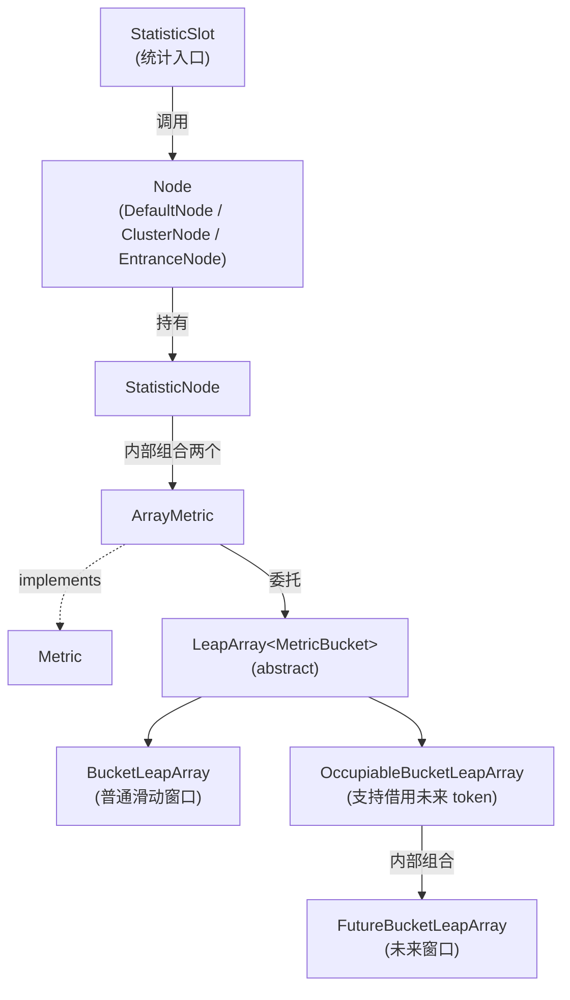

### 1.2 关键源码文件

| 文件 | 作用 |
| --- | --- |
| `LeapArray.java` | 滑动窗口核心抽象类，定义窗口创建、获取、过期等核心逻辑 |
| `WindowWrap.java` | 单个时间窗口的包装类 |
| `MetricBucket.java` | 指标桶，记录 PASS/BLOCK/EXCEPTION/SUCCESS/RT/OCCUPIED_PASS 六种事件 |
| `MetricEvent.java` | 指标事件枚举 |
| `BucketLeapArray.java` | LeapArray 的基础实现 |
| `OccupiableBucketLeapArray.java` | 支持借用未来 token 的窗口 |
| `FutureBucketLeapArray.java` | 未来窗口，配合 OccupiableBucketLeapArray 使用 |
| `ArrayMetric.java` | Metric 接口实现，对外提供统计 API |
| `StatisticSlot.java` | Slot Chain 中的统计节点，请求进出的统计入口 |
| `StatisticNode.java` | 统计节点，组合秒级与分钟级两个滑动窗口 |
| `TimeUtil.java` | 高性能时间获取 |

---

## 二、核心数据结构

### 2.1 LeapArray —— 滑动窗口的骨架

`LeapArray` 是整个滑动窗口的"骨架"，定义了窗口数组、窗口长度、样本数等核心属性。源码（`sentinel-core/src/main/java/com/alibaba/csp/sentinel/slots/statistic/base/LeapArray.java`）：

```java
public abstract class LeapArray<T> {

    protected int windowLengthInMs;       // 单个窗口时间长度（ms）
    protected int sampleCount;            // 样本数（桶的个数）
    protected int intervalInMs;           // 总时间间隔（ms）
    private double intervalInSecond;      // 总时间间隔（秒）

    // 真正存储窗口数据的数组 —— 原子引用数组，保证并发安全
    protected final AtomicReferenceArray<WindowWrap<T>> array;

    // 仅在桶过期需重置时使用的条件锁
    private final ReentrantLock updateLock = new ReentrantLock();

    public LeapArray(int sampleCount, int intervalInMs) {
        AssertUtil.isTrue(sampleCount > 0, "bucket count is invalid: " + sampleCount);
        AssertUtil.isTrue(intervalInMs > 0, "total time interval of the sliding window should be positive");
        // 关键约束：总时长必须能被样本数整除
        AssertUtil.isTrue(intervalInMs % sampleCount == 0, "time span needs to be evenly divided");

        this.windowLengthInMs = intervalInMs / sampleCount;
        this.intervalInMs = intervalInMs;
        this.intervalInSecond = intervalInMs / 1000.0;
        this.sampleCount = sampleCount;

        this.array = new AtomicReferenceArray<>(sampleCount);
    }
    // ...
}
```

**关键点：**
1. **窗口数组用 `AtomicReferenceArray` 实现**，单元素读写具备 volatile 语义，配合 CAS 实现无锁写入。
2. **三大约束**：`sampleCount > 0`、`intervalInMs > 0`、`intervalInMs % sampleCount == 0`（保证窗口能等分时间）。
3. **窗口长度** = `intervalInMs / sampleCount`。默认配置下：`intervalInMs = 1000ms`，`sampleCount = 2`，所以 `windowLengthInMs = 500ms`。

### 2.2 WindowWrap —— 单个窗口的包装

`WindowWrap` 是对单个时间窗口的封装，记录窗口的起始时间和统计数据（`sentinel-core/src/main/java/com/alibaba/csp/sentinel/slots/statistic/base/WindowWrap.java`）：

```java
public class WindowWrap<T> {

    private final long windowLengthInMs;   // 窗口时长
    private long windowStart;              // 窗口起始时间戳
    private T value;                       // 窗口内的统计数据（泛型）

    public WindowWrap(long windowLengthInMs, long windowStart, T value) {
        this.windowLengthInMs = windowLengthInMs;
        this.windowStart = windowStart;
        this.value = value;
    }

    // 重置窗口的起始时间（用于窗口复用）
    public WindowWrap<T> resetTo(long startTime) {
        this.windowStart = startTime;
        return this;
    }

    // 判断给定时间是否落在当前窗口内
    public boolean isTimeInWindow(long timeMillis) {
        return windowStart <= timeMillis && timeMillis < windowStart + windowLengthInMs;
    }
    // ...
}
```

**关键点：**
- `windowStart` 不是 final，可以被重置，这是滑动窗口"复用桶"机制的基础。
- `value` 是泛型，对统计场景而言是 `MetricBucket`。

### 2.3 MetricBucket —— 指标桶

`MetricBucket` 是窗口内实际存储统计数据的容器（`sentinel-core/src/main/java/com/alibaba/csp/sentinel/slots/statistic/data/MetricBucket.java`）：

```java
public class MetricBucket {

    private final LongAdder[] counters;   // 6 种事件计数器数组
    private volatile long minRt;          // 最小响应时间

    public MetricBucket() {
        MetricEvent[] events = MetricEvent.values();
        this.counters = new LongAdder[events.length];
        for (MetricEvent event : events) {
            counters[event.ordinal()] = new LongAdder();
        }
        initMinRt();
    }

    private void initMinRt() {
        this.minRt = SentinelConfig.statisticMaxRt();   // 默认 5000ms
    }

    public MetricBucket reset() {
        for (MetricEvent event : MetricEvent.values()) {
            counters[event.ordinal()].reset();
        }
        initMinRt();
        return this;
    }

    public long get(MetricEvent event) {
        return counters[event.ordinal()].sum();
    }

    public MetricBucket add(MetricEvent event, long n) {
        counters[event.ordinal()].add(n);
        return this;
    }

    public void addRT(long rt) {
        add(MetricEvent.RT, rt);
        // Not thread-safe, but it's okay.
        if (rt < minRt) {
            minRt = rt;
        }
    }
    // ...
}
```

**关键点：**
1. **使用 `LongAdder` 而非 `AtomicLong`**：在高并发场景下，LongAdder 通过 Cell 分段减少 CAS 失败，性能远超 AtomicLong。
2. **minRt 的更新非线程安全**：源码注释明确指出 `Not thread-safe, but it's okay.` —— 因为 minRt 只是用于辅助判断，微小误差不影响限流决策。
3. **`minRt` 初始化为 5000ms**（`DEFAULT_STATISTIC_MAX_RT = 5000`），表示"未观测到任何请求时的默认 RT"。

### 2.4 MetricEvent —— 六种统计事件

```java
public enum MetricEvent {
    PASS,             // 通过的请求数
    BLOCK,            // 被限流/降级的请求数
    EXCEPTION,        // 业务异常数
    SUCCESS,          // 成功完成（exit）的请求数
    RT,               // 累计响应时间
    OCCUPIED_PASS     // 预占用的未来 token 数（1.5.0+）
}
```

这六种事件用枚举的 `ordinal()` 直接映射到 `LongAdder[]` 的下标，访问 O(1)。

---

## 三、滑动窗口核心算法

### 3.1 窗口索引计算 —— calculateTimeIdx

```java
private int calculateTimeIdx(long timeMillis) {
    long timeId = timeMillis / windowLengthInMs;
    return (int)(timeId % array.length());
}
```

**算法解析：**
- `timeMillis / windowLengthInMs` 得到从"时间原点"开始，当前是第几个窗口（timeId）。
- `timeId % array.length()` 把这个序号映射到固定大小的数组中，**形成环形数组（RingBuffer）效果**。

**举例**：假设 `windowLengthInMs = 500ms`，`array.length() = 2`：

| 当前时间 (ms) | timeId | idx |
| --- | --- | --- |
| 0    - 499   | 0 | 0 |
| 500  - 999   | 1 | 1 |
| 1000 - 1499  | 2 | 0 |
| 1500 - 1999  | 3 | 1 |
| 2000 - 2499  | 4 | 0 |

可以看到，**两个桶被循环复用**：时间 0 和时间 1000 共用 idx=0 的桶，时间 500 和时间 1500 共用 idx=1 的桶。这就是"滑动"的本质——不需要无限长的数组，固定大小的环形数组即可。

### 3.2 窗口起始时间计算 —— calculateWindowStart

```java
protected long calculateWindowStart(long timeMillis) {
    return timeMillis - timeMillis % windowLengthInMs;
}
```

**算法解析：**
- 将当前时间对窗口长度取余，再减去这个余数，得到当前窗口的起始时间。
- 这相当于把时间"对齐"到窗口边界。

**举例**：`windowLengthInMs = 500ms`
- `timeMillis = 888ms` → `888 - 888 % 500 = 888 - 388 = 500ms`，窗口起始时间为 500ms。
- `timeMillis = 1234ms` → `1234 - 1234 % 500 = 1234 - 234 = 1000ms`，窗口起始时间为 1000ms。

### 3.3 获取当前窗口 —— currentWindow（核心）

`currentWindow` 是滑动窗口最核心的方法，它根据当前时间找到对应的窗口，并处理四种情况（`LeapArray.java:116-202`）：

```java
public WindowWrap<T> currentWindow(long timeMillis) {
    if (timeMillis < 0) {
        return null;
    }

    int idx = calculateTimeIdx(timeMillis);
    long windowStart = calculateWindowStart(timeMillis);

    while (true) {
        WindowWrap<T> old = array.get(idx);
        // 情况 1：桶不存在 → 创建新桶并 CAS 写入
        if (old == null) {
            WindowWrap<T> window = new WindowWrap<T>(windowLengthInMs, windowStart, newEmptyBucket(timeMillis));
            if (array.compareAndSet(idx, null, window)) {
                return window;
            } else {
                Thread.yield();    // CAS 失败，让出 CPU 等待
            }
        }
        // 情况 2：桶存在且时间匹配 → 直接返回
        else if (windowStart == old.windowStart()) {
            return old;
        }
        // 情况 3：桶存在但已过期 → 重置桶
        else if (windowStart > old.windowStart()) {
            if (updateLock.tryLock()) {
                try {
                    return resetWindowTo(old, windowStart);
                } finally {
                    updateLock.unlock();
                }
            } else {
                Thread.yield();
            }
        }
        // 情况 4：桶的时间比当前还新（时钟回拨） → 返回新桶但不写入
        else if (windowStart < old.windowStart()) {
            return new WindowWrap<T>(windowLengthInMs, windowStart, newEmptyBucket(timeMillis));
        }
    }
}
```

#### 四种情况详解

`currentWindow` 的整体决策流程如下：

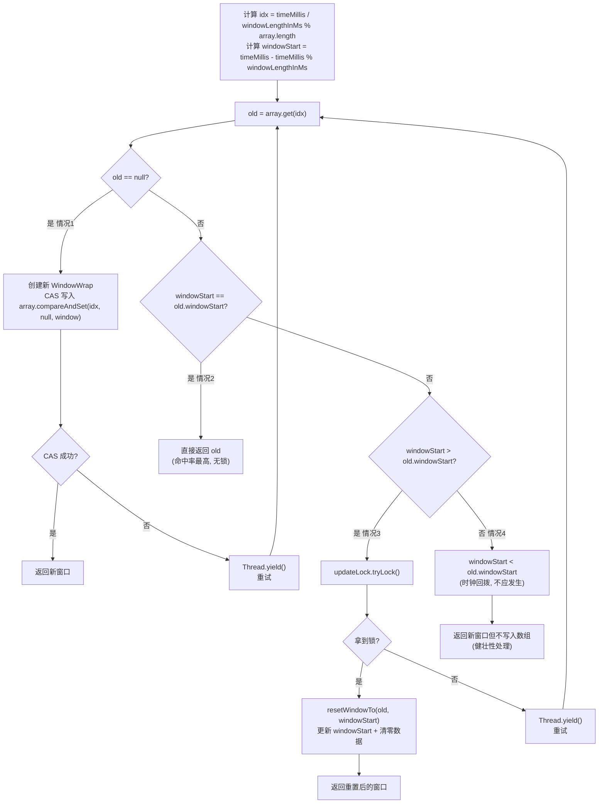

**情况 1：桶不存在（old == null）**
首次访问该 idx 或桶从未初始化。用 CAS 写入新桶，只有一个线程成功，其他线程 yield 等待重试。

**情况 2：桶存在且 windowStart 匹配**
最常见的命中场景（生产环境 99% 走此分支），直接返回旧桶即可，完全无锁。

**情况 3：桶存在但已过期（windowStart > old.windowStart）**
说明时间已经走过了至少一个完整的窗口周期。此时该 idx 的桶里装的是"上一轮"的数据，需要重置为当前 windowStart 并清零数据。这里使用 `updateLock` 保证重置过程的原子性。

**情况 4：windowStart < old.windowStart（不应发生）**
通常意味着时钟回拨或并发条件下的异常情况。源码注释 `Should not go through here`，但为了健壮性仍返回一个新桶（不写入数组）。

### 3.4 窗口过期判断 —— isWindowDeprecated

```java
public boolean isWindowDeprecated(long time, WindowWrap<T> windowWrap) {
    return time - windowWrap.windowStart() > intervalInMs;
}
```

**算法解析：**
- 如果当前时间减去窗口起始时间**大于**整个滑动窗口的总时长 `intervalInMs`，则该窗口已经"滑出"统计范围，被判定为过期。
- 默认配置下 `intervalInMs = 1000ms`，即超过 1 秒前的窗口都视为过期。

**举例**：`intervalInMs = 1000ms`，`windowStart = 500ms`
- 当前时间 1500ms：`1500 - 500 = 1000`，**不大于** 1000，**未过期**
- 当前时间 1501ms：`1501 - 500 = 1001`，**大于** 1000，**已过期**

注意是严格大于 `>` 而不是 `>=`，这保证整个 intervalInMs 时间区间内的窗口都有效。

---

## 四、一个请求到来，数据是怎么统计的

### 4.1 请求生命周期与统计时序

Sentinel 的请求处理采用 Slot Chain 模式。每个请求经过一系列 Slot，其中 `StatisticSlot`（order=0）负责统计。完整流程如下：

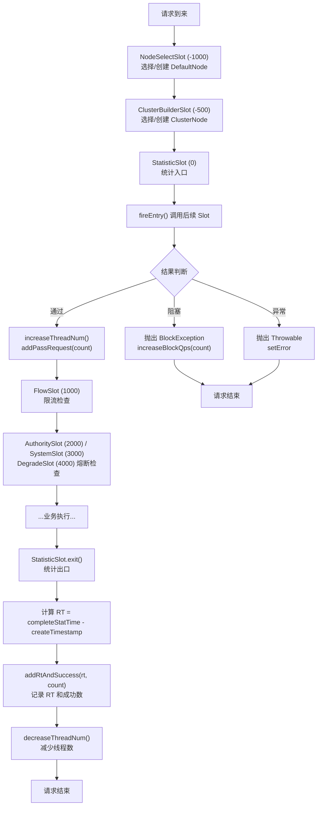

### 4.2 统计入参 —— StatisticSlot.entry()

```java
@Override
public void entry(Context context, ResourceWrapper resourceWrapper, DefaultNode node, int count,
                  boolean prioritized, Object... args) throws Throwable {
    try {
        // 先调用后续 Slot 进行限流/降级检查
        fireEntry(context, resourceWrapper, node, count, prioritized, args);

        // ★ 请求通过：增加线程数 + 通过请求数
        node.increaseThreadNum();
        node.addPassRequest(count);

        if (context.getCurEntry().getOriginNode() != null) {
            // 同时统计来源（origin）节点
            context.getCurEntry().getOriginNode().increaseThreadNum();
            context.getCurEntry().getOriginNode().addPassRequest(count);
        }

        if (resourceWrapper.getEntryType() == EntryType.IN) {
            // 入口类型为 IN 时，还要统计全局入口节点
            Constants.ENTRY_NODE.increaseThreadNum();
            Constants.ENTRY_NODE.addPassRequest(count);
        }

        // 执行注册的 entry 回调
        for (ProcessorSlotEntryCallback<DefaultNode> handler : StatisticSlotCallbackRegistry.getEntryCallbacks()) {
            handler.onPass(context, resourceWrapper, node, count, args);
        }
    } catch (PriorityWaitException ex) {
        // 优先级等待异常：也算通过，但不计 pass
        node.increaseThreadNum();
        // ...（省略 origin / entry node 处理）
    } catch (BlockException e) {
        // ★ 被限流/降级：增加 block 计数
        context.getCurEntry().setBlockError(e);
        node.increaseBlockQps(count);
        // ...（省略 origin / entry node 处理）
        throw e;
    } catch (Throwable e) {
        // 业务异常：记录 error
        context.getCurEntry().setError(e);
        throw e;
    }
}
```

**关键统计点：**
1. **通过**：`node.addPassRequest(count)` + `node.increaseThreadNum()`
2. **阻塞**：`node.increaseBlockQps(count)`
3. **优先级等待**：只增加 `threadNum`，不计 pass（因为是借用了未来 token）
4. **三个 Node 都会被统计**：DefaultNode（资源）、OriginNode（来源）、ENTRY_NODE（全局入口）

### 4.3 统计出参 —— StatisticSlot.exit()

```java
@Override
public void exit(Context context, ResourceWrapper resourceWrapper, int count, Object... args) {
    Node node = context.getCurNode();

    if (context.getCurEntry().getBlockError() == null) {
        // 计算响应时间
        long completeStatTime = TimeUtil.currentTimeMillis();
        context.getCurEntry().setCompleteTimestamp(completeStatTime);
        long rt = completeStatTime - context.getCurEntry().getCreateTimestamp();

        Throwable error = context.getCurEntry().getError();

        // 记录 RT 和成功数，并减少线程数
        recordCompleteFor(node, count, rt, error);
        recordCompleteFor(context.getCurEntry().getOriginNode(), count, rt, error);
        if (resourceWrapper.getEntryType() == EntryType.IN) {
            recordCompleteFor(Constants.ENTRY_NODE, count, rt, error);
        }
    }

    // 执行 exit 回调
    Collection<ProcessorSlotExitCallback> exitCallbacks = StatisticSlotCallbackRegistry.getExitCallbacks();
    for (ProcessorSlotExitCallback handler : exitCallbacks) {
        handler.onExit(context, resourceWrapper, count, args);
    }

    fireExit(context, resourceWrapper, count, args);
}

private void recordCompleteFor(Node node, int batchCount, long rt, Throwable error) {
    if (node == null) {
        return;
    }
    node.addRtAndSuccess(rt, batchCount);
    node.decreaseThreadNum();

    if (error != null && !(error instanceof BlockException)) {
        node.increaseExceptionQps(batchCount);
    }
}
```

**关键统计点：**
1. **RT 计算**：`exit 时的时间 - entry 时的时间`
2. **成功数**：`addRtAndSuccess(rt, count)` 同时记录 RT 和 SUCCESS
3. **线程数减少**：`decreaseThreadNum()`
4. **异常数**：仅在 `error != null && !(error instanceof BlockException)` 时记录（因为 BlockException 已经记到 block 中）

### 4.4 StatisticNode —— 实际写入滑动窗口

`StatisticNode` 是真正持有滑动窗口的类（`sentinel-core/src/main/java/com/alibaba/csp/sentinel/node/StatisticNode.java`）：

```java
public class StatisticNode implements Node {

    // 秒级滑动窗口：默认 2 桶 × 500ms = 1 秒
    private transient volatile Metric rollingCounterInSecond = new ArrayMetric(
        SampleCountProperty.SAMPLE_COUNT,    // 默认 2
        IntervalProperty.INTERVAL            // 默认 1000ms
    );

    // 分钟级滑动窗口：60 桶 × 1000ms = 60 秒
    private transient Metric rollingCounterInMinute = new ArrayMetric(60, 60 * 1000, false);

    // 当前线程数（LongAdder）
    private LongAdder curThreadNum = new LongAdder();

    @Override
    public void addPassRequest(int count) {
        rollingCounterInSecond.addPass(count);    // 写秒级窗口
        rollingCounterInMinute.addPass(count);    // 写分钟级窗口
    }

    @Override
    public void addRtAndSuccess(long rt, int successCount) {
        rollingCounterInSecond.addSuccess(successCount);
        rollingCounterInSecond.addRT(rt);
        rollingCounterInMinute.addSuccess(successCount);
        rollingCounterInMinute.addRT(rt);
    }

    @Override
    public void increaseBlockQps(int count) {
        rollingCounterInSecond.addBlock(count);
        rollingCounterInMinute.addBlock(count);
    }

    @Override
    public void increaseExceptionQps(int count) {
        rollingCounterInSecond.addException(count);
        rollingCounterInMinute.addException(count);
    }
    // ...
}
```

### 4.5 ArrayMetric —— 数据写入滑动窗口

`ArrayMetric` 是 `Metric` 接口的实现（`sentinel-core/src/main/java/com/alibaba/csp/sentinel/slots/statistic/metric/ArrayMetric.java`）：

```java
public class ArrayMetric implements Metric {

    private final LeapArray<MetricBucket> data;

    public ArrayMetric(int sampleCount, int intervalInMs) {
        // 默认使用 OccupiableBucketLeapArray（支持借用未来 token）
        this.data = new OccupiableBucketLeapArray(sampleCount, intervalInMs);
    }

    public ArrayMetric(int sampleCount, int intervalInMs, boolean enableOccupy) {
        if (enableOccupy) {
            this.data = new OccupiableBucketLeapArray(sampleCount, intervalInMs);
        } else {
            this.data = new BucketLeapArray(sampleCount, intervalInMs);
        }
    }

    @Override
    public void addPass(int count) {
        // 1. 获取当前时间对应的窗口（可能创建新窗口或重置旧窗口）
        WindowWrap<MetricBucket> wrap = data.currentWindow();
        // 2. 在窗口的 MetricBucket 上累加 PASS 计数
        wrap.value().addPass(count);
    }

    @Override
    public void addBlock(int count) {
        WindowWrap<MetricBucket> wrap = data.currentWindow();
        wrap.value().addBlock(count);
    }

    @Override
    public void addSuccess(int count) {
        WindowWrap<MetricBucket> wrap = data.currentWindow();
        wrap.value().addSuccess(count);
    }

    @Override
    public void addException(int count) {
        WindowWrap<MetricBucket> wrap = data.currentWindow();
        wrap.value().addException(count);
    }

    @Override
    public void addRT(long rt) {
        WindowWrap<MetricBucket> wrap = data.currentWindow();
        wrap.value().addRT(rt);
    }
    // ...
}
```

### 4.6 一个请求完整统计流程图

下面以"一个通过（PASS）的请求"为例，展示完整的数据写入流程：

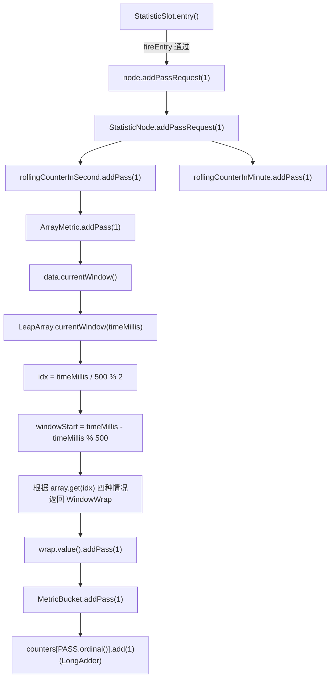

**最终效果：** 当前时间窗口对应的 `MetricBucket` 内的 `PASS` 计数器 +1。

---

## 五、窗口是怎么计算的

### 5.1 计算实例：默认配置下的窗口分布

默认配置：`SAMPLE_COUNT = 2`，`INTERVAL = 1000ms`，所以 `windowLengthInMs = 500ms`。

**时刻 T = 0ms（首次请求）：**

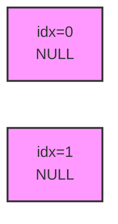

时间轴：0 ─── 500 ─── 1000，当前 T=0ms（^ 指向 idx=0）
- `idx = 0 / 500 % 2 = 0`
- `windowStart = 0 - 0 % 500 = 0`
- `array.get(0) = null` → 创建新桶 `[windowStart=0, value=MetricBucket(pass=0)]`，CAS 写入。

**时刻 T = 300ms：**

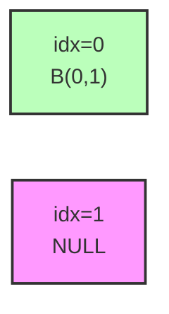

时间轴：0 ─^─ 500 ─── 1000，T=300ms 落在 idx=0，windowStart=0 匹配，直接返回
- `idx = 300 / 500 % 2 = 0`
- `windowStart = 300 - 300 % 500 = 0`
- `array.get(0).windowStart() = 0` 等于 `windowStart = 0` → 直接返回，pass 累加到 2。

**时刻 T = 600ms（进入下一个桶）：**

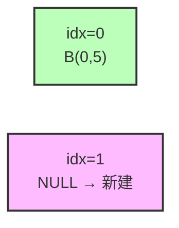

时间轴：0 ─── 500 ─^─ 1000，T=600ms 落在 idx=1，windowStart=500，array.get(1)=null → 创建新桶
- `idx = 600 / 500 % 2 = 1`
- `windowStart = 600 - 600 % 500 = 500`
- `array.get(1) = null` → 创建新桶 `[windowStart=500, value=MetricBucket]`。

**时刻 T = 1100ms（窗口复用）：**

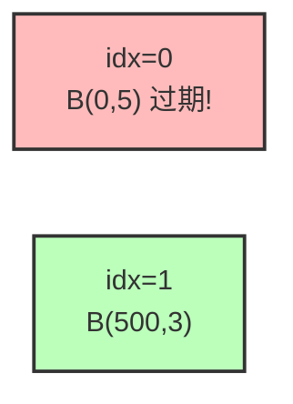

时间轴：0 ─── 500 ─── 1000 ─^ 1100，T=1100ms 落在 idx=0，windowStart=1000 > old.windowStart=0 → 桶过期，resetWindowTo
- `idx = 1100 / 500 % 2 = 0`
- `windowStart = 1100 - 1100 % 500 = 1000`
- `array.get(0).windowStart() = 0`，但 `windowStart = 1000 > 0` → **桶已过期，需要重置**
- 进入 `resetWindowTo`：将 `windowStart` 更新为 1000，并调用 `value().reset()` 清零所有计数。

**时刻 T = 1100ms 重置后：**

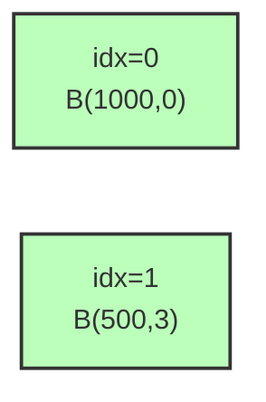

当前有效窗口：`[500-1000)` 和 `[1000-1500)`，覆盖了 `[100, 1100]` 这 1 秒区间。

### 5.2 聚合查询时的窗口遍历

当 `FlowSlot` 需要计算 QPS 时，调用 `pass()` 等聚合方法：

```java
// ArrayMetric.pass()
@Override
public long pass() {
    data.currentWindow();          // 先确保当前窗口已创建
    long pass = 0;
    List<MetricBucket> list = data.values();   // 获取所有有效窗口
    for (MetricBucket window : list) {
        pass += window.pass();     // 累加每个窗口的 pass 值
    }
    return pass;
}
```

`data.values()` 的实现（`LeapArray.java:329-344`）：

```java
public List<T> values(long timeMillis) {
    if (timeMillis < 0) {
        return new ArrayList<T>();
    }
    int size = array.length();
    List<T> result = new ArrayList<T>(size);

    for (int i = 0; i < size; i++) {
        WindowWrap<T> windowWrap = array.get(i);
        if (windowWrap == null || isWindowDeprecated(timeMillis, windowWrap)) {
            continue;     // 跳过空桶和过期桶
        }
        result.add(windowWrap.value());
    }
    return result;
}
```

**遍历所有桶，过滤掉过期桶，把剩余桶的值聚合返回。** 这就是滑动窗口的"读"路径。

### 5.3 QPS 计算公式

```java
// StatisticNode.passQps()
@Override
public double passQps() {
    return rollingCounterInSecond.pass() / rollingCounterInSecond.getWindowIntervalInSec();
}
```

**QPS = 滑动窗口内累计通过数 / 窗口总时长（秒）**

默认配置下：`pass() / 1.0` = 每秒通过数。

---

## 六、数据聚合查询

### 6.1 聚合 API 一览

`ArrayMetric` 提供了 6 种聚合方法（`ArrayMetric.java:60-153`）：

| 方法 | 含义 | 实现 |
| --- | --- | --- |
| `pass()` | 累计通过数 | 累加所有有效窗口的 PASS |
| `block()` | 累计阻塞数 | 累加所有有效窗口的 BLOCK |
| `success()` | 累计成功数 | 累加所有有效窗口的 SUCCESS |
| `exception()` | 累计异常数 | 累加所有有效窗口的 EXCEPTION |
| `rt()` | 累计响应时间 | 累加所有有效窗口的 RT |
| `minRt()` | 最小响应时间 | 取所有有效窗口中 minRt 的最小值 |

所有方法的实现模式一致：先 `data.currentWindow()` 触发窗口刷新，再 `data.values()` 获取有效窗口列表，最后聚合。

### 6.2 重要细节：每次查询都先刷新窗口

```java
@Override
public long pass() {
    data.currentWindow();    // ★ 关键：先刷新当前窗口
    long pass = 0;
    List<MetricBucket> list = data.values();
    for (MetricBucket window : list) {
        pass += window.pass();
    }
    return pass;
}
```

**为什么查询前要先 `currentWindow()`？**
- `currentWindow()` 内部会处理"桶过期重置"的逻辑。如果查询时不刷新，可能聚合到陈旧的过期数据，导致 QPS 计算错误。

### 6.3 前一个窗口查询

```java
// LeapArray.java:210-227
public WindowWrap<T> getPreviousWindow(long timeMillis) {
    if (timeMillis < 0) {
        return null;
    }
    int idx = calculateTimeIdx(timeMillis - windowLengthInMs);
    timeMillis = timeMillis - windowLengthInMs;
    WindowWrap<T> wrap = array.get(idx);

    if (wrap == null || isWindowDeprecated(wrap)) {
        return null;
    }

    if (wrap.windowStart() + windowLengthInMs < (timeMillis)) {
        return null;
    }

    return wrap;
}
```

**用途**：`previousBlockQps()` / `previousPassQps()` 用于查询"上一秒"的 QPS，常用于系统规则、自适应限流等场景。

### 6.4 details() —— 桶级明细

```java
@Override
public List<MetricNode> details() {
    List<MetricNode> details = new ArrayList<>();
    data.currentWindow();
    List<WindowWrap<MetricBucket>> list = data.list();
    for (WindowWrap<MetricBucket> window : list) {
        if (window == null) {
            continue;
        }
        details.add(fromBucket(window));
    }
    return details;
}

private MetricNode fromBucket(WindowWrap<MetricBucket> wrap) {
    MetricNode node = new MetricNode();
    node.setBlockQps(wrap.value().block());
    node.setExceptionQps(wrap.value().exception());
    node.setPassQps(wrap.value().pass());
    long successQps = wrap.value().success();
    node.setSuccessQps(successQps);
    if (successQps != 0) {
        node.setRt(wrap.value().rt() / successQps);   // 平均 RT
    } else {
        node.setRt(wrap.value().rt());
    }
    node.setTimestamp(wrap.windowStart());
    node.setOccupiedPassQps(wrap.value().occupiedPass());
    return node;
}
```

`details()` 把每个有效窗口转换为 `MetricNode` 暴露给上层（如 Dashboard），可用于展示每个窗口的明细数据。

---

## 七、占用未来 Token 机制（OccupiableBucketLeapArray）

### 7.1 设计动机

在某些场景下，请求带有"优先级"（`prioritized = true`），即使当前窗口的 QPS 已经达到阈值，也可以**借用未来窗口的配额**让请求通过，并让请求等待一段时间后再执行。这就是 `OCCUPIED_PASS` 事件的设计目的。

为实现这一机制，Sentinel 设计了 `OccupiableBucketLeapArray`：

```java
public class OccupiableBucketLeapArray extends LeapArray<MetricBucket> {

    // 借用数组：用于记录未来窗口的预占用
    private final FutureBucketLeapArray borrowArray;

    public OccupiableBucketLeapArray(int sampleCount, int intervalInMs) {
        super(sampleCount, intervalInMs);
        this.borrowArray = new FutureBucketLeapArray(sampleCount, intervalInMs);
    }

    @Override
    public MetricBucket newEmptyBucket(long time) {
        MetricBucket newBucket = new MetricBucket();

        // 创建新桶时，如果借用数组中有该时间点的预占用，则继承到新桶中
        MetricBucket borrowBucket = borrowArray.getWindowValue(time);
        if (borrowBucket != null) {
            newBucket.reset(borrowBucket);
        }

        return newBucket;
    }

    @Override
    protected WindowWrap<MetricBucket> resetWindowTo(WindowWrap<MetricBucket> w, long time) {
        w.resetTo(time);
        MetricBucket borrowBucket = borrowArray.getWindowValue(time);
        if (borrowBucket != null) {
            w.value().reset();
            w.value().addPass((int)borrowBucket.pass());    // ★ 把预占用的 pass 转移过来
        } else {
            w.value().reset();
        }
        return w;
    }

    @Override
    public void addWaiting(long time, int acquireCount) {
        // 在借用数组的指定未来时间点预占用
        WindowWrap<MetricBucket> window = borrowArray.currentWindow(time);
        window.value().add(MetricEvent.PASS, acquireCount);
    }
    // ...
}
```

### 7.2 FutureBucketLeapArray —— 未来窗口

```java
public class FutureBucketLeapArray extends LeapArray<MetricBucket> {

    @Override
    public boolean isWindowDeprecated(long time, WindowWrap<MetricBucket> windowWrap) {
        // Tricky: will only calculate for future.
        return time >= windowWrap.windowStart();
    }
}
```

**关键点：**
- `FutureBucketLeapArray` 重写了过期判断：**当前时间 `time` 一旦到达或超过 `windowStart`，该未来桶就"过期"了**（因为未来已经变成现在）。
- 这意味着 `borrowArray.values()` 永远只返回**未来未到期**的桶，不会与主数组的当前桶重叠。

### 7.3 借用流程

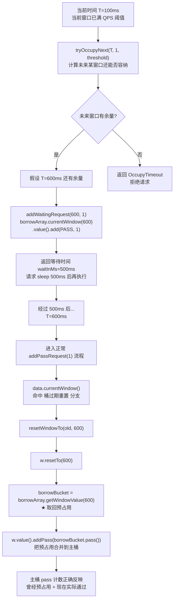

### 7.4 设计精髓

- **主数组（OccupiableBucketLeapArray）**：记录"已发生"的统计
- **借用数组（FutureBucketLeapArray）**：记录"预占用"的未来 token
- **当时间推进到未来窗口时**，借用数组中对应桶"过期"（成为现在），主数组在重置窗口时把借用数据合并进来，实现无缝过渡。

---

## 八、双窗口设计：秒级 + 分钟级

`StatisticNode` 内部持有两个滑动窗口：

```java
// 秒级：2 桶 × 500ms = 1 秒，用于实时 QPS 计算
private transient volatile Metric rollingCounterInSecond = new ArrayMetric(
    SampleCountProperty.SAMPLE_COUNT,    // 2
    IntervalProperty.INTERVAL            // 1000
);

// 分钟级：60 桶 × 1000ms = 60 秒，用于历史趋势和监控
private transient Metric rollingCounterInMinute = new ArrayMetric(60, 60 * 1000, false);
```

### 8.1 两个窗口的职责分工

| 维度 | 秒级窗口 | 分钟级窗口 |
| --- | --- | --- |
| 配置 | 2 桶 × 500ms = 1s | 60 桶 × 1s = 60s |
| enableOccupy | true（默认） | false |
| 用途 | 实时 QPS、限流判断 | 历史趋势、监控上报、`metrics()` |
| 调用方法 | `passQps()` `blockQps()` `avgRt()` 等 | `totalRequest()` `totalPass()` `metrics()` |

### 8.2 写入时双写

```java
@Override
public void addPassRequest(int count) {
    rollingCounterInSecond.addPass(count);   // 秒级
    rollingCounterInMinute.addPass(count);   // 分钟级
}
```

所有 `add*` 方法都**同时写入两个窗口**，保证两个时间尺度的数据一致性。

### 8.3 读取时按需选择

```java
// 实时 QPS（用秒级）
@Override
public double passQps() {
    return rollingCounterInSecond.pass() / rollingCounterInSecond.getWindowIntervalInSec();
}

// 累计请求数（用分钟级）
@Override
public long totalRequest() {
    return rollingCounterInMinute.pass() + rollingCounterInMinute.block();
}

// 上报 Dashboard（用分钟级）
@Override
public Map<Long, MetricNode> metrics() {
    long currentTime = TimeUtil.currentTimeMillis();
    currentTime = currentTime - currentTime % 1000;
    Map<Long, MetricNode> metrics = new ConcurrentHashMap<>();
    List<MetricNode> nodesOfEverySecond = rollingCounterInMinute.details();
    // ...
}
```

---

## 九、TimeUtil 高性能时间获取

`TimeUtil` 是 Sentinel 专门优化的时间获取工具（`sentinel-core/src/main/java/com/alibaba/csp/sentinel/util/TimeUtil.java`），避免每次 `currentTimeMillis()` 都调用昂贵的 `System.currentTimeMillis()`。

### 9.1 三态机制

```java
public static enum STATE {
    IDLE,       // 空闲：直接调用 System.currentTimeMillis()
    PREPARE,    // 准备：即将切换到 RUNNING
    RUNNING;    // 运行：后台线程每 1ms 更新缓存时间
}
```

### 9.2 工作原理

```java
private void check() {
    long now = currentTime(true);
    if (now - this.lastCheck < CHECK_INTERVAL) {    // 3000ms 检查一次
        return;
    }
    this.lastCheck = now;
    Tuple2<Long, Long> qps = currentQps(now);
    if (this.state == STATE.IDLE && qps.r1 > HITS_UPPER_BOUNDARY) {
        // 空闲 → 高负载（>1200/s）：切换到 PREPARE
        this.state = STATE.PREPARE;
    } else if (this.state == STATE.RUNNING && qps.r1 < HITS_LOWER_BOUNDARY) {
        // 运行 → 低负载（<800/s）：切换回 IDLE
        this.state = STATE.IDLE;
    }
}

private long currentTime(boolean innerCall) {
    long now = this.currentTimeMillis;
    Statistic val = this.statistics.currentWindow(now).value();
    if (!innerCall) {
        val.getReads().increment();
    }
    if (this.state == STATE.IDLE || this.state == STATE.PREPARE) {
        // 空闲/准备态：每次都同步 System.currentTimeMillis()
        now = System.currentTimeMillis();
        this.currentTimeMillis = now;
        if (!innerCall) {
            val.getWrites().increment();
        }
    }
    // RUNNING 态：直接返回缓存的 currentTimeMillis（由后台线程更新）
    return now;
}
```

### 9.3 设计精髓

- **自适应**：根据 QPS 自动在"低开销（IDLE）"和"高性能（RUNNING）"之间切换
- **后台守护线程**在 RUNNING 态每 1ms 更新一次缓存时间
- **滑动窗口自身用滑动窗口统计 QPS**：`statistics` 是一个 `LeapArray<Statistic>`，用以统计读写次数（自举设计）

---

## 十、并发安全分析

### 10.1 三层并发保护

| 层级 | 机制 | 应用场景 |
| --- | --- | --- |
| 数组层 | `AtomicReferenceArray` | 桶的原子读写 |
| 桶创建层 | CAS (`compareAndSet`) | 首次创建桶 |
| 桶重置层 | `ReentrantLock` | 桶过期重置 |
| 计数层 | `LongAdder` | 桶内事件计数 |

### 10.2 桶创建的 CAS

```java
if (old == null) {
    WindowWrap<T> window = new WindowWrap<T>(windowLengthInMs, windowStart, newEmptyBucket(timeMillis));
    if (array.compareAndSet(idx, null, window)) {
        return window;       // 成功
    } else {
        Thread.yield();      // 失败：让出 CPU，重试 while(true)
    }
}
```

- **多线程并发首次创建同一桶时**，只有一个线程 CAS 成功，其他线程 yield 后重试。
- 重试时 `array.get(idx)` 已经不为 null，进入情况 2 或 3。

### 10.3 桶重置的 ReentrantLock

```java
else if (windowStart > old.windowStart()) {
    if (updateLock.tryLock()) {
        try {
            return resetWindowTo(old, windowStart);
        } finally {
            updateLock.unlock();
        }
    } else {
        Thread.yield();
    }
}
```

**为什么用 tryLock 而不是 lock？**
- **性能优先**：tryLock 立即返回，不阻塞。失败时 yield 让出 CPU，避免线程堆积。
- **避免锁竞争影响吞吐**：在高并发场景下，多个线程同时进入过期重置分支时，只有一个能拿到锁，其他线程 yield 后重试时大概率直接命中情况 2（已被重置）。

**为什么 `resetWindowTo` 需要锁而 CAS 不行？**
- 重置操作包含两步：①更新 `windowStart` ②清零 `MetricBucket` 内的所有计数器。
- 这两步无法用单个 CAS 完成，因此需要锁保证原子性。
- 锁范围极小（只在过期分支生效），对正常吞吐影响极小。

### 10.4 LongAdder 的优势

`MetricBucket` 使用 `LongAdder` 而非 `AtomicLong`：

- **AtomicLong**：所有线程竞争同一个 value 字段，高并发下 CAS 失败率高。
- **LongAdder**：内部用 Cell[] 分段，线程分散到不同 Cell 上累加，最后 `sum()` 时合并。在写多读少场景下吞吐量提升数倍。

滑动窗口的"写多读少"特性（每个请求都写，但只有规则检查时才读）完美契合 LongAdder 的优势。

### 10.5 一个潜在的非原子性问题

```java
public void addRT(long rt) {
    add(MetricEvent.RT, rt);
    // Not thread-safe, but it's okay.
    if (rt < minRt) {
        minRt = rt;
    }
}
```

`minRt` 的更新非原子，可能丢失更新。但源码注释 `Not thread-safe, but it's okay.` 说明：
- `minRt` 用于辅助判断（如系统自适应限流），微小误差不影响决策。
- 加锁会拖累核心路径性能，得不偿失。

---

## 十一、完整时序图

### 11.1 写入时序：一个通过请求

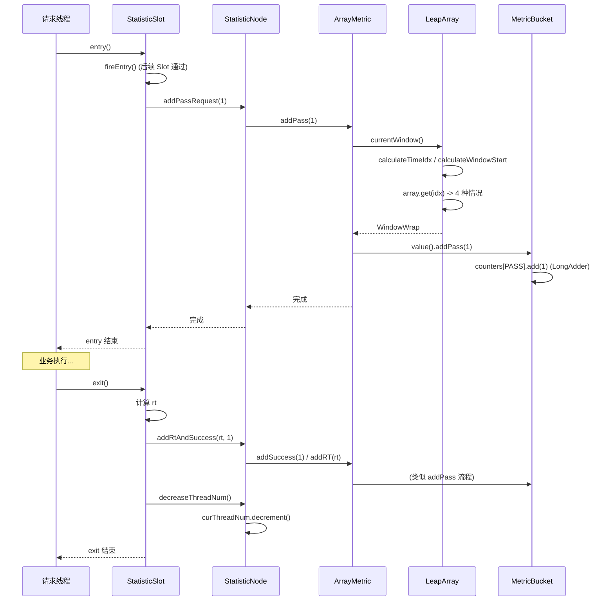

### 11.2 读取时序：QPS 计算

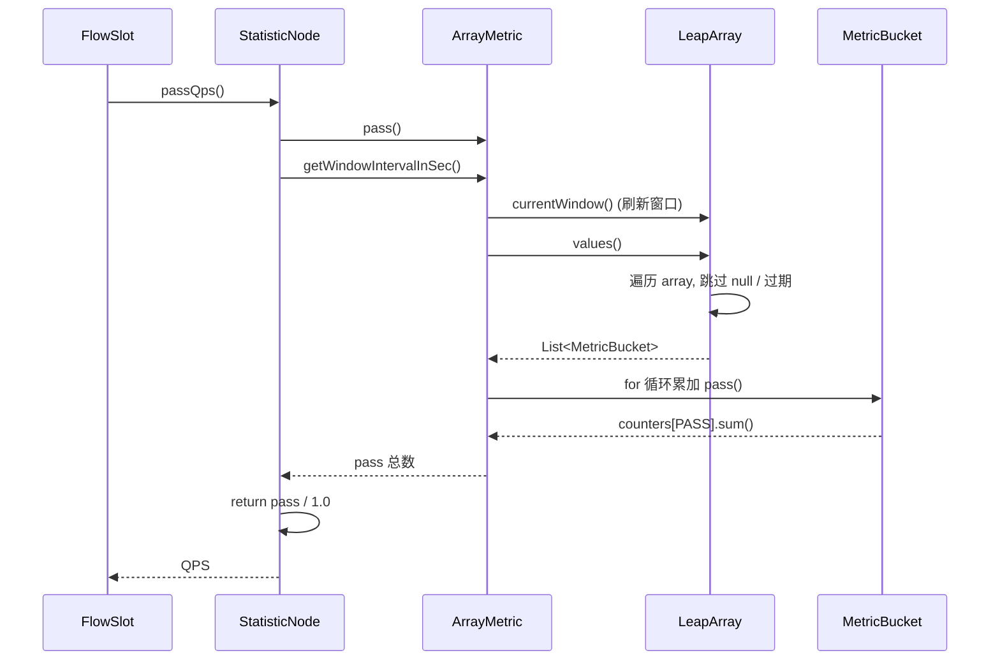

---

## 十二、源码细节与设计精髓

### 12.1 环形数组而非链表

**为什么用 `AtomicReferenceArray` 而不是链表或队列？**
1. **内存预分配**：避免动态分配带来的 GC 压力。
2. **O(1) 随机访问**：通过 `calculateTimeIdx` 直接定位桶。
3. **CPU 缓存友好**：数组在内存中连续，Cache 命中率高。
4. **天然支持复用**：环形结构无需删除老节点，写入时自然覆盖。

### 12.2 双重判断避免锁竞争

```java
while (true) {
    WindowWrap<T> old = array.get(idx);
    if (old == null) {
        // CAS 创建
    } else if (windowStart == old.windowStart()) {
        return old;     // ★ 命中率最高，无锁直接返回
    } else if (windowStart > old.windowStart()) {
        // tryLock 重置
    }
}
```

**性能特性：**
- 99% 的情况下命中 `windowStart == old.windowStart()` 分支，无锁直接返回。
- 仅在桶首次创建或过期重置时才有锁竞争，且锁范围极小。

### 12.3 自旋 + yield 而非阻塞等待

CAS 失败或 tryLock 失败时使用 `Thread.yield()`：
```java
} else {
    Thread.yield();    // 让出 CPU 时间片
}
```
- **不阻塞线程**：避免线程切换的开销。
- **配合 `while(true)` 自旋**：下次重试时大概率成功（因为持锁线程很快释放）。
- **避免死锁**：yield 不会持有任何资源。

### 12.4 校验约束在构造期

```java
public LeapArray(int sampleCount, int intervalInMs) {
    AssertUtil.isTrue(sampleCount > 0, "...");
    AssertUtil.isTrue(intervalInMs > 0, "...");
    AssertUtil.isTrue(intervalInMs % sampleCount == 0, "time span needs to be evenly divided");
    // ...
}
```

**早期失败（Fail-Fast）**：如果配置不合法（如 `intervalInMs=1000, sampleCount=3`），在构造时立即抛出异常，避免运行时出现窗口错乱。

### 12.5 过期判断用 `>` 而非 `>=`

```java
public boolean isWindowDeprecated(long time, WindowWrap<T> windowWrap) {
    return time - windowWrap.windowStart() > intervalInMs;
}
```

**为什么是 `>`？**
- 假设 `intervalInMs = 1000ms`，`windowStart = 0`，`time = 1000`：
  - 用 `>`：`1000 - 0 = 1000`，不大于 1000，**未过期**。
  - 用 `>=`：`1000 - 0 = 1000`，等于 1000，**已过期**。
- 用 `>` 保证整个 `intervalInMs` 时间区间内的窗口都有效，避免边界上"刚好 1 秒前的窗口被丢掉"。

### 12.6 reset() 而非 new

```java
// BucketLeapArray
@Override
protected WindowWrap<MetricBucket> resetWindowTo(WindowWrap<MetricBucket> w, long startTime) {
    w.resetTo(startTime);    // 复用 WindowWrap 对象
    w.value().reset();        // 复用 MetricBucket 对象（清零 LongAdder）
    return w;
}
```

**对象复用而非创建新对象**：
- 减少 GC 压力。
- `LongAdder.reset()` 比 `new LongAdder()` 更轻量。

### 12.7 minRt 的初始值

```java
private void initMinRt() {
    this.minRt = SentinelConfig.statisticMaxRt();   // 默认 5000ms
}
```

**为什么是 5000ms？**
- 表示"未观测到任何请求时的默认 RT"。
- 在 `ArrayMetric.minRt()` 中：`return Math.max(1, rt);` 保证至少返回 1，避免除零等异常。
- 配合系统 BBR 策略：当 `minRt` 接近默认值 5000 时，说明该窗口还没有真实 RT 数据，不应触发 BBR 限流。

### 12.8 当前窗口的"懒创建"

`currentWindow` 只在请求到来时才创建桶，避免空跑：
- 如果某段时间没有请求，对应 idx 的桶保持 null，不消耗内存。
- 这与"主动定期创建桶"的方案相比，节省了无负载时的开销。

### 12.9 list() 与 values() 的区别

```java
// 返回 WindowWrap 列表
public List<WindowWrap<T>> list(long validTime) {
    // ...
    result.add(windowWrap);
}

// 返回 T 列表（即 MetricBucket）
public List<T> values(long timeMillis) {
    // ...
    result.add(windowWrap.value());
}
```

- `list()` 用于需要访问 `windowStart` 的场景（如 `details()` 生成 MetricNode）。
- `values()` 用于只关心指标值的场景（如 `pass()` 计算 QPS）。

### 12.10 默认配置总结

| 配置项 | 默认值 | 来源 |
| --- | --- | --- |
| `SAMPLE_COUNT` | 2 | `SampleCountProperty.SAMPLE_COUNT` |
| `INTERVAL`（秒级） | 1000ms | `IntervalProperty.INTERVAL` ← `RuleConstant.DEFAULT_WINDOW_INTERVAL_MS` |
| `windowLengthInMs`（秒级） | 500ms | `intervalInMs / sampleCount` |
| 分钟级窗口 | 60 桶 × 1s = 60s | `new ArrayMetric(60, 60 * 1000, false)` |
| `DEFAULT_STATISTIC_MAX_RT` | 5000ms | `SentinelConfig.DEFAULT_STATISTIC_MAX_RT` |
| 秒级 enableOccupy | true | `new ArrayMetric(sampleCount, intervalInMs)` 默认构造 |

---

## 总结

Sentinel 的滑动窗口实现展现了多个优秀的设计：

1. **数据结构精巧**：环形 `AtomicReferenceArray` + `WindowWrap` 实现无锁读写与桶复用。
2. **窗口定位 O(1)**：通过 `timeMillis / windowLengthInMs % length` 直接索引。
3. **四种情况全覆盖**：null / 命中 / 过期 / 时钟回拨，每种都有明确处理。
4. **并发分层保护**：CAS 创建 + tryLock 重置 + LongAdder 计数，层层递进。
5. **双窗口设计**：秒级窗口用于实时限流，分钟级窗口用于历史趋势。
6. **占用未来 token**：通过 `OccupiableBucketLeapArray` + `FutureBucketLeapArray` 实现优先级请求的借还机制。
7. **时间获取优化**：`TimeUtil` 自适应三态机制，根据负载选择最优策略。
8. **懒创建 + 对象复用**：减少 GC 压力，提升性能。

理解了滑动窗口的实现，就理解了 Sentinel 流量统计、限流、熔断、系统保护的底层数据基础。所有上层算法（如 `DefaultController`、`WarmUpController`、`DegradeSlot`）都建立在这套精确高效的统计基础设施之上。
